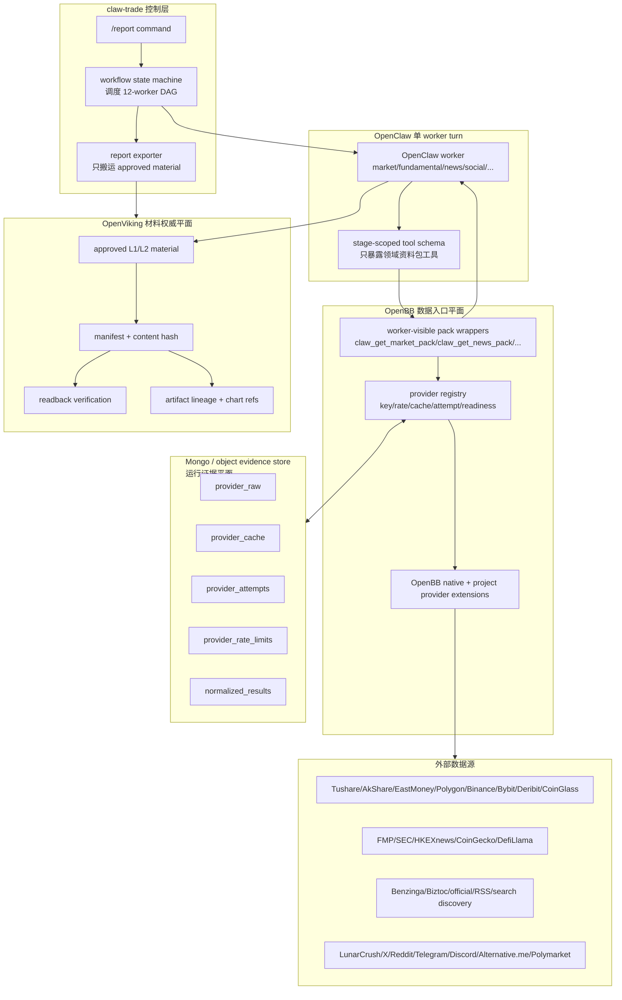
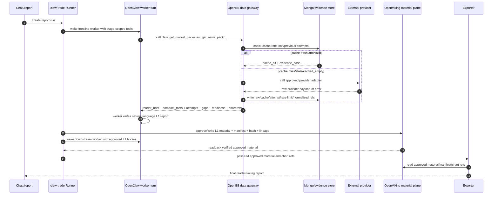
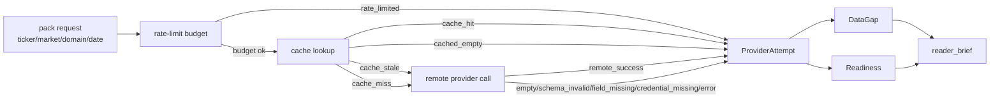
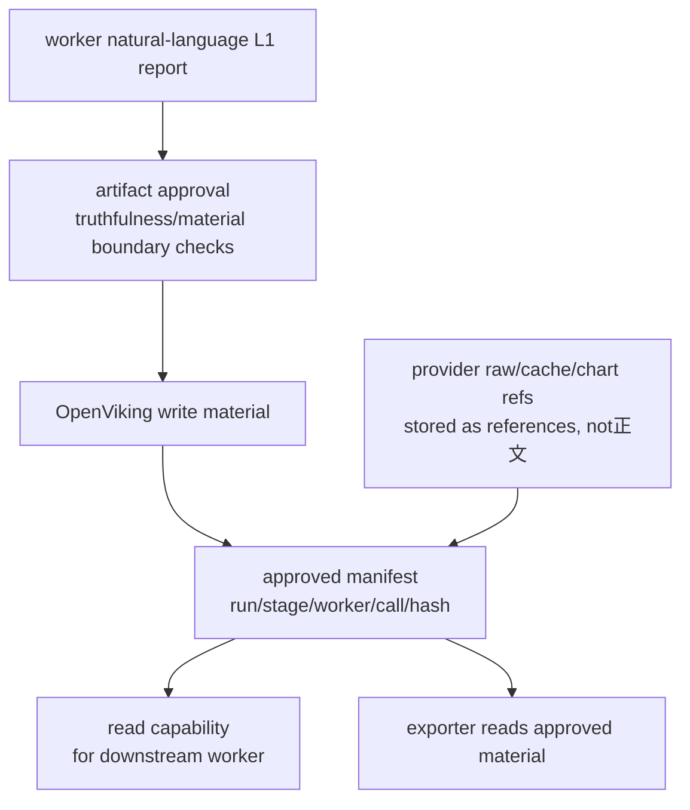

# 数据源 OpenBB 引入方案（历史口径，已 superseded）

> **SUPERSEDED / 历史背景**
>
> 本文是 2026-05 期间“引入 OpenBB 作为统一数据入口”的旧方案记录，当前不再作为实施合同、验收合同或目标运行时口径。
>
> 当前数据层主合同是 `docs/数据层详细设计.md` 和 `docs/数据层实施任务清单.md`：数据层核心为 `src/claw_trade/data_gateway` 的 `DataRequest -> DataResult`；Provider 能力来自 `ProviderPlugin.capabilities()`；Mongo 目标 collection 固定为 8 个；OpenBB 本体已删除/不再作为目标运行时依赖；旧 `openbb_*` 名称不得作为新目标表名、模块名或证据链名。
>
> 本文中“OpenBB 唯一入口 / submodule / runtime core / OpenBB wrapper / openbb evidence”等表述只保留为历史背景或 forbidden legacy path 参考。需要实施或验收时，以当前数据层文档和代码为准。

## 1. 文档定位

本文是 **历史存档**，不是当前详细设计，也不是当前“已完成实现”说明。

阅读方式：

- 全文只用于理解 2026-05 的旧决策背景和 forbidden legacy path。
- 文中任何“必须引入 OpenBB / OpenBB 唯一入口 / OpenBB runtime core / openbb_* collection / 第 13 章实施主合同”等表述均已作废。
- 当前实施和验收只看 `docs/数据层详细设计.md`、`docs/数据层实施任务清单.md`、相关 A股/CRYPTO active 设计和当前代码。

原历史目标如下，**不得按当前任务执行**：

- OpenBB 作为项目唯一数据源入口，替代此前分散的自研数据 MCP / provider 入口。
- OpenBB 以 `third_party/openbb` submodule 方式纳入项目，像 OpenClaw / OpenViking 一样成为受控基础组件。
- worker 继续消费自然语言资料包，不直接消费底层 provider 原始对象。
- 不新增 runtime 风格 gate、投资判断 gate，保持 TradingAgents 报告表达边界。

---

## 2. 核心结论（先定边界）

### 2.1 OpenBB 是否像 OpenClaw/OpenViking 一样 submodule 化

结论：**是，OpenBB 作为 submodule/vendor runtime core 纳入项目。**

目标路径：

1. 新增 `third_party/openbb` submodule。
2. 在该 submodule 或其项目扩展目录中接入当前项目已经配置和批准的 provider。
3. OpenBB 统一承担 provider registry、provider adapter、标准数据模型、数据 MCP 暴露、key/限流/cache/attempt/readiness 记录。
4. 项目旧数据 MCP 与分散 provider 入口进入退休路径：先对比取证，再删除，不保留长期双入口。

### 2.2 “唯一 provider 接口层”是谁

结论：**OpenBB 才是 claw-trade 唯一数据源入口/唯一 provider 接口层。**

- 不再新增或保留一个长期 `claw-data-mcp` 与 OpenBB 并列。
- 项目自有 provider 必须接入 OpenBB provider/extension 体系。
- worker 可见的资料包工具由 OpenBB 数据入口提供，但仍只暴露领域资料包，不暴露底层 provider 原子工具。

---

## 3. 组件职责与禁区

### 3.1 OpenBB

- 角色：唯一数据源入口、唯一 provider 接口层、唯一数据 MCP。
- 代码形态：`third_party/openbb` submodule，加项目内 OpenBB provider/extension。
- 负责：接入外部数据源、统一 provider adapter、统一 key/限流/cache/attempt/readiness、对外暴露领域资料包工具。
- 不负责：12-worker DAG；worker 投资判断；approved L1/L2 的最终权威存储。
- OpenBB MCP 可以存在，但 worker 当前 turn 只能看到市场、基本面、新闻、舆情等领域资料包工具。
- OpenBB MCP 的动态 discovery、admin、prompt、`activate_tools`、`execute_prompt` 等能力不得进入报告 worker 的 tool schema。
- OpenBB atomic provider tools 只可被 OpenBB 内部 pack/router 调用，不直接交给 worker 自由选择。

### 3.2 OpenViking

- 角色：证据与材料平面，不是行情/新闻 provider。
- 应充分使用：approved L1/L2 material store、内容哈希、manifest、readback verification、artifact lineage、图表/证据引用、下游 worker 可读取的 approved material 能力。
- 只保存：worker-approved 自然语言材料、图表资产引用、provider raw/cache 的证据引用、manifest 和完整追溯链。
- 不负责：外部行情/新闻/公告/舆情抓取；provider cache 命中判定；provider 限流预算。
- 不是“只存文本”的低配用途。OpenViking 应承担材料权威、证据索引、可读能力和跨 worker handoff，但不替代 OpenBB 数据入口。

### 3.3 Mongo

- 角色：provider raw/cache/attempt/rate-limit/normalized intermediate storage。
- 可存：raw evidence hash、cache docs、rate limit state、attempt 明细。
- 禁止：被 worker 当资料正文读取；把 cache 状态伪装成 fresh success。

### 3.4 OpenClaw

- 角色：单 worker turn 执行与 tool schema 暴露。
- 不负责：provider 编排；12-worker DAG。

### 3.5 Python 控制层

- 角色：调度 worker、搬运 approved L1、导出报告。
- 禁止：写成 controller 预取 provider 主流程。
- 资料包调用位置：在 OpenClaw worker turn 内，通过 OpenBB MCP / OpenBB pack tool 取资料包。

---

## 4. 总体架构、关系与数据流程图

### 4.1 三平面架构图

这套架构分成三个平面：

1. **数据入口平面**：OpenBB，是唯一外部数据入口。
2. **运行证据平面**：Mongo / 对象文件，是 provider raw、cache、attempt、限流状态和中间规范化结果的运行存储。
3. **材料权威平面**：OpenViking，是 approved L1/L2、manifest、hash、readback、lineage 和跨 worker handoff 的权威材料层。



关键解释：

- OpenBB 是**唯一外部数据入口**。所有行情、新闻、公告、舆情、宏观、链上、衍生品数据都从 OpenBB provider/extension 进入。
- Mongo 是**运行证据和缓存存储**。它服务 OpenBB provider 层，不直接服务 worker 阅读材料。
- OpenViking 是**材料权威和证据索引**。它接收 worker approved L1/L2 和证据引用，供下游 worker 和 exporter 使用。
- OpenClaw 只运行单个 worker turn，不拥有 provider 编排，也不拥有 12-worker DAG。
- Python 控制层只调度 worker、搬运 approved L1、导出报告，不写投资判断，也不自己预取 provider。

### 4.2 OpenBB / Mongo / OpenViking 关系表

| 维度 | OpenBB | Mongo / object evidence store | OpenViking |
|---|---|---|---|
| 角色 | 唯一数据源入口、provider gateway、数据 MCP | provider 运行状态与缓存存储 | approved material 和证据索引权威层 |
| 拥有的数据 | provider schema、adapter、pack interface、readiness 计算 | raw payload、cache document、attempt、rate limit、normalized intermediate | L1/L2 报告、manifest、hash、readback、artifact lineage、chart refs |
| 谁写入 | OpenBB pack/provider layer | OpenBB provider layer | worker approval/materialization layer |
| 谁读取 | OpenClaw worker 通过领域资料包工具读取自然语言资料包 | OpenBB 内部读取；调试/验收工具可读 | 下游 worker、exporter、审计工具读取 approved material |
| worker 是否直接可见 | 只能见领域资料包工具，不能见原子 provider 工具 | 不能直接见 raw/cache/attempt 对象正文 | 可以见 approved L1/L2 自然语言材料 |
| 不能承担 | 12-worker DAG、PM 结论、材料权威存储 | 投资判断、worker 正文、fresh 成功判断伪装 | 外部 provider 调用、provider cache、限流预算 |
| 失败表达 | 生成 provider attempt/readiness/data gaps | 保留失败证据和缓存状态 | 保存 approved 缺口说明和 manifest，不补事实 |

### 4.3 `/report` 端到端数据流程图



这张图里的硬边界：

- provider raw 先进入 Mongo / evidence store，不进入 worker 正文。
- worker 主要阅读 OpenBB pack 生成的完整自然语言 `reader_brief`。
- 下游 worker 消费的是 OpenViking approved L1 正文，不从 Mongo 拼读 raw/cache。
- exporter 只读 OpenViking approved material 和图表引用，不补写 provider 事实或 PM 结论。

### 4.4 缓存、失败和缺口数据流



强制语义：

- `cache_hit` 只能说明复用了缓存，不能写成 fresh provider success。
- `cache_stale` 必须触发远端重取或进入资料缺口，不能静默使用。
- `cached_empty` 必须进入 `data_gaps` 和 `readiness`，不能冒充“该来源无风险”。
- `rate_limited`、`credential_missing`、`field_missing`、`schema_invalid` 都必须进入 provider attempts、资料缺口和 reader-visible 缺口说明。

### 4.5 OpenViking 材料流与证据索引图



OpenViking 应发挥的能力：

- **材料权威**：只有 approved L1/L2 可以进入下游 worker 和最终报告。
- **完整追溯**：每份材料绑定 run、stage、worker、call、hash、readback 状态。
- **跨 worker handoff**：下游 worker 读取自然语言 approved L1，不读 raw JSON。
- **图表与证据索引**：保存图表资产引用、provider raw/cache 引用、content hash 和 lineage。
- **审计复核**：支持按 run 重放“哪个 worker 看了哪些 approved material”。

### 4.6 目标调用链

```text
worker
  -> pack tool
  -> OpenBB domain pack interface
  -> OpenBB provider adapter layer
  -> OpenBB native / project custom / official providers
  -> raw evidence + cache + attempts + readiness
  -> natural-language reader_brief + audit fields
  -> worker L1 report
  -> OpenViking approved material
  -> downstream worker / exporter
```

### 4.7 worker 可见内容约束

- worker 主要可见：完整自然语言资料包（`reader_brief`）。
- 审计字段可存在：`provider_attempts`、`data_gaps`、`cache_receipts` 等。
- 审计字段不得取代自然语言正文，不把 JSON/debug/cache envelope 当 worker 主材料。

### 4.8 OpenBB 对外稳定接口

worker 可见层只暴露 claw-trade 领域资料包工具，不暴露 provider 原子工具：

- `claw_get_market_pack`
- `claw_get_fundamental_pack`
- `claw_get_news_pack`
- `claw_get_social_pack`

统一入参最小集：

- `ticker`
- `market`
- `profile`
- `company_name`
- `start_date`
- `end_date`
- `current_date`
- `currency`
- `run_id`
- `call_id`
- `worker_id`
- `freshness_policy`

统一出参最小集：

- `reader_brief`：worker 主要阅读的完整自然语言资料包。
- `compact_facts`：审计和必要引用用的结构化摘要，不替代正文。
- `provider_attempts`
- `data_gaps`
- `conflicts`
- `readiness`
- `source_roles`
- `raw_artifact_refs`
- `normalized_refs`
- `normalized_bundle_ref`
- `cache_receipts`
- `chart_assets`
- `chart_readiness`

### 4.9 运维/调试接口

以下接口只能用于调试、验收和 UI 设置页，不默认暴露给 worker：

- `list_providers`
- `provider_health`
- `cache_status`
- `rate_limit_status`
- `explain_pack_plan`
- `replay_provider_attempt`

### 4.10 旧 MCP 删除原则

- 旧自研数据 MCP 不作为长期并行入口。
- 迁移期允许 compare mode 同时调用旧路径和 OpenBB 路径做差异取证，但旧路径结果不得静默兜底 OpenBB 结果。
- 单个 pack 的 OpenBB 路径通过 live/fresh 证据后，删除该 pack 的旧 MCP/旧 provider 直连入口。
- 所有外部数据访问最终只从 OpenBB 数据入口发起。

---

## 5. 统一数据模型（可落地字段与状态）

以下模型用于 OpenBB 数据入口的统一契约；字段可扩展，但核心语义不能丢。

### 5.1 `ProviderResult`

最小字段：

- `provider` / `adapter_id` / `adapter_kind`
- `endpoint`
- `request_id`
- `requested_at`
- `latency_ms`
- `status`
- `error_code`
- `error_message`
- `row_count`
- `raw_ref`
- `normalized_ref`
- `source_role`
- `freshness`
- `license_note`

`status` 枚举（最小集）：

- `remote_success`
- `remote_error`
- `evidence_write_failed`
- `schema_invalid`
- `empty`
- `field_missing`
- `credential_missing`
- `license_blocked`
- `rate_limited`
- `cache_hit`
- `cache_miss`
- `cache_stale`
- `cache_error`
- `cached_empty`
- `skipped_not_configured`
- `shared_result`

### 5.2 `ProviderAttempt`

最小字段：

- `attempt_id`
- `run_id`
- `call_id`
- `worker_id`
- `pack`
- `provider`
- `adapter_id`
- `adapter_kind`
- `provider_kind`
- `provider_config_version`
- `endpoint`
- `source_role`
- `started_at`
- `finished_at`
- `status`
- `required`
- `attempt_required`
- `coverage_group`
- `coverage_quorum`
- `priority_source`
- `user_preferred`
- `from_cache`
- `cache_status`
- `single_flight_role`
- `shared_from_attempt_id`
- `error_code`
- `error_message`
- `raw_ref`
- `normalized_ref`

`status` 枚举（最小集）：

- `remote_success`
- `remote_error`
- `evidence_write_failed`
- `credential_missing`
- `license_blocked`
- `rate_limited`
- `empty`
- `field_missing`
- `schema_invalid`
- `cache_hit`
- `cache_miss`
- `cache_stale`
- `cache_error`
- `cached_empty`
- `skipped_not_configured`
- `shared_result`

强制语义：

- `cache_hit` / `cache_miss` / `cache_stale` / `cache_error` / `cached_empty` **不等于** fresh success。
- `cached_empty` 必须继续参与 `data_gaps` 与 `readiness` 评估。
- `shared_result` 只表示同 run 同 call key 共享同一组 evidence refs，不是第二次远端成功。
- `license_blocked` 必须进入缺口或准入 receipt，不能改写成未配置、空返回或 provider error。

### 5.3 `Readiness`

最小字段：

- `status`
- `coverage`
- `required_domains`
- `missing_domains`
- `blocking_gaps`
- `non_blocking_gaps`
- `root_cause`

`status` 枚举：

- `ready`
- `partial`
- `insufficient`
- `blocked`

### 5.4 `DataGap`

最小字段：

- `gap_id`
- `domain`
- `severity`
- `reason`
- `provider_candidates`
- `attempt_refs`
- `root_cause`
- `next_action`

`reason` 枚举（最小集）：

- `credential_missing`
- `rate_limited`
- `empty`
- `field_missing`
- `schema_invalid`
- `provider_unavailable`
- `source_not_configured`
- `cache_error`
- `cached_empty`
- `stale_cache_unusable`
- `evidence_write_failed`
- `license_blocked`

### 5.5 `Conflict`

最小字段：

- `conflict_id`
- `field_path`
- `values`
- `provider_refs`
- `resolution`
- `confidence`

`resolution` 枚举：

- `prefer_official`
- `prefer_primary_provider`
- `mark_unresolved`

### 5.6 `CacheReceipt`

最小字段：

- `cache_key`
- `provider`
- `endpoint`
- `status`
- `created_at`
- `expires_at`
- `hit`
- `stale`
- `cached_empty`
- `ttl_seconds`
- `evidence_hash`
- `raw_ref`
- `normalized_ref`

### 5.7 `source_role`

`source_role` 是事实引用边界，不是备注。

| source_role | 含义 | 事实引用规则 |
|---|---|---|
| `official_original` | 官方原文、监管原文、交易所公告原文 | 可作为事实主证据 |
| `market_data` | 行情、成交、K线、盘口 | 可作为市场事实 |
| `derivative_market_data` | OI、资金费率、清算、期权 | 可作为衍生品市场事实 |
| `fundamental_data` | 财务、TVL、收入、供应量、估值 | 可作为基本面事实，但必须保留字段来源 |
| `social_original_sample` | 社交平台原帖或频道消息 | 可作为样本，不代表全网共识 |
| `social_aggregate_metric` | 聚合社交指标 | 可作情绪指标，不等同原帖事实 |
| `search_discovery` | 搜索发现线索 | 只能提示“哪里可能有材料”，不能直接当新闻事实 |
| `event_expectation` | 事件预期、预测市场盘口 | 只能表达市场预期/盘口，不当新闻事实或社交共识 |
| `macro_data` | 宏观经济与利率数据 | 可作为宏观事实，需保留来源和发布时间 |

---

## 6. A/HK/US/CRYPTO provider 优先级与缺图教训

### 6.1 市场优先级（摘要）

- CN_A：默认走系统源用途矩阵（全部经 OpenBB/data_gateway），按作用域拆分为公告、新闻、行情、财务、资金、筹码与政策等七域；Tushare 只作为用户配置源，需用户完成配置/验证/启用后，才在同一 `market/domain/source_role/coverage_group` 内参与优先级。
- HK：Tushare HK + AkShare 双主路径，EastMoney/yfinance 补充。
- US：FMP/Polygon 主路径，SEC/FRED/主流新闻源补充。
- CRYPTO：OpenBB/data_gateway 调 CoinGlass/Bybit/Deribit 等衍生品源 + Binance/OHLCV + CoinGecko/DefiLlama（基本面）+ 社交/新闻源；CryptoLens 只做 normalized bundle 之上的离线指标分析。

### 6.2 Provider 分层

| 层级 | provider | 市场 | 用途 | 备注 |
|---|---|---|---|---|
| OpenBB native | FMP / Polygon | US/HK | 行情、财务、估值、公司资料、新闻 | 进入 OpenBB 唯一数据入口，不直接暴露原子工具 |
| OpenBB native | SEC / FRED | US/宏观 | 监管文件、利率、宏观环境 | 官方/宏观证据优先保留原文指针 |
| OpenBB native | Benzinga / Biztoc / Tiingo | US | 新闻、行情、基本面补充 | 新闻聚合不能替代官方原文 |
| OpenBB native | Deribit | CRYPTO | BTC/ETH 期权、隐含波动率、期限结构 | 归入衍生品市场数据 |
| 项目自有 OpenBB extension | AkShare / EastMoney / Sina / Tencent +（可选）Tushare 用户源 | CN_A/HK | 按 coverage_group 分工提供行情、财务、公告、新闻、资金、筹码、政策线索 | A/HK 路径必须按作用域落地：公告=`official_original`，行情=`market_data`，财务=`fundamental_data`，新闻/资金/筹码/政策分别进入对应 pack 的专属 coverage_group；不得跨作用域替代。Tushare 非默认，需用户配置/验证/启用。 |
| 项目自有 OpenBB extension | HKEXnews | HK | 官方公告、业绩、停复牌、公司行动 | 港股官方原文主证据 |
| 项目自有 OpenBB extension | CoinGlass / Binance / Bybit / approved AHR999 source | CRYPTO | 市场结构、OHLCV、清算、OI、资金费率、AHR999 | CRYPTO market provider 主路径；CryptoLens 不作为 provider，只消费 normalized bundle 做分析 |
| 项目自有 OpenBB extension | CoinGecko / DefiLlama | CRYPTO | 币种资料、市值、供应量、TVL、收入、费用、安全/融资背景 | 基本面补充 |
| 项目自有 OpenBB extension | LunarCrush / X / Reddit / Telegram / Discord | CRYPTO | 聚合社交指标和原始社交样本 | 缺 key 或空返回必须显式缺口 |
| 限定用途 | Alternative.me | CRYPTO | 市场级恐惧贪婪 | 不能写成单币种社交舆情 |
| 限定用途 | Polymarket | CRYPTO | 事件预期和盘口概率 | 不能当新闻事实或社交共识 |
| 限定用途 | Bocha / Tavily / Jina / NewsNow / MiniMax | 多市场 | 搜索发现、网页读取、热点补充 | 只能做发现线索 |

### 6.3 HK 缺图问题的明确修复要求

纳入 AkShare `stock_hk_daily` 兼容路径（与现有 HK 行情路径并行校验，不是 silent fallback）。

图表规则：

- 图表缺失必须进入 `chart readiness/root_cause`。
- 不允许 exporter 假图。
- 不允许跳过图表缺失并冒充成功导出。

---

## 7. 授权、费用、许可与安全治理

### 7.1 授权和费用

- 每个 provider 维护 `license_note`、费用等级、调用配额、商业用途限制。
- 生产接入前必须完成“成本+许可”审批记录。

### 7.2 secret 管理

- secret 只进入本地环境或受控 secret store。
- 不写入 prompt、report、OpenViking 正文、公开日志。

### 7.3 schema drift 防护

- 对关键字段设最小合同校验（字段缺失、类型漂移、单位变化）。
- 命中漂移时写 `schema_invalid` / `field_missing`，并进入 `data_gaps`。

### 7.4 官方原文追溯

- 对新闻、公告、监管、项目发布等事实性条目，保留 `raw_ref` 与来源 URL/文档指针。
- 聚合摘要不能替代官方原文追溯链路。

### 7.5 OpenBB submodule 与版本治理

- OpenBB 源码以 `third_party/openbb` submodule 进入本项目。
- submodule 指针必须和顶层仓库提交一起锁定。
- 项目自有 provider 尽量以 OpenBB provider/extension 形式实现，避免在 Python 控制层重新散落 provider 逻辑。
- OpenBB submodule 升级必须跑 provider schema drift、tool schema、四市场至少一个 fresh 样本，以及 OpenViking material handoff 验证。

---

## 8. 迁移路线（防大爆炸）

### 8.1 Feature Flag

建议最小开关：

- `OPENBB_DATA_GATEWAY_ENABLED`
- `OPENBB_DATA_PACK_<MARKET>_<DOMAIN>_ENABLED`
- `OPENBB_DATA_COMPARE_MODE`

### 8.2 迁移策略

1. 先引入 `third_party/openbb` submodule，建立项目 OpenBB extension / provider 目录。
2. 按 pack 逐个迁移（market -> fundamental -> news -> social）。
3. 每迁移一个 pack，先跑 compare 模式收集差异。
4. 旧路径只用于迁移期对比取证；完成验收后从默认运行路径删除或隔离，不得并行 silent fallback。
5. 人类决策（2026-05-17）：不再保留可运行的旧 provider 回滚开关。需要回旧版时只能通过 Git/VCS 回到旧版本并单独记录运维证据；当前主线运行时不得因为环境变量或 OpenBB 失败切回旧 MCP/旧 provider。

### 8.3 删除条件

当某 pack 满足以下条件后，删除旧直连路径：

- 连续通过约定样本回归；
- provider attempts/readiness/data gaps 结构稳定；
- worker 报告质量不退化；
- live provider payload/tool call 证据齐备。

### 8.4 回滚条件

出现任一情况触发回滚：

- 实时或关键域覆盖显著下降；
- 图表 readiness 长时间不足；
- provider attempts 真实性断裂（缺 attempt、假成功）；
- 工具可见边界破坏（worker 直接见到底层 provider 工具）。

回滚执行边界：

- 回滚是短期人工运维动作，不是长期双入口架构。
- 当前主线不提供可运行的旧 provider 回滚模式；`data_gateway` 默认且只应为 `openbb`。
- 需要回旧版时，必须人工用 Git/VCS 切到旧提交或旧分支，并在外部运维记录中标明回退提交、原因、OpenBB 失败样本和恢复计划。
- 回滚不得吞掉 OpenBB 失败原因；失败样本必须留作修复输入。

### 8.5 用户声明式 provider 增加流程

未来 UI 允许用户新增声明式 provider，但它不是“保存后立刻参战”：

1. UI 保存 `draft` manifest。
2. OpenBB admission 执行真实验证，状态进入 `validating`。
3. healthcheck、schema sample、source_role、license、secret、rate-limit、raw export policy 全部通过后进入 `validated`。
4. 用户或管理员启用后进入 `enabled_candidate`。
5. 下一次 `/report` 生成 `RunProviderPlan` 时才可被选中；已经开始的 run 不热更新。

用户新增 provider 默认可作为 `user_preferred`，但只在相同 `market/domain/source_role/coverage_group` 内优先；它不能压过官方原文，不能把搜索发现升级成新闻事实，也不能改变 worker tool schema。

---

## 9. 测试矩阵（必须证明真实运行）

### 9.1 不是只靠静态合同

静态测试只证明结构，不证明真实 provider 运行与 tool call。

### 9.2 必测证据（live/fresh）

1. fixed runtime preflight（按项目固定脚本与端口检查）。
2. run-level provider plan 快照，且 `remote_prefetch_allowed=false`。
3. fresh provider payload（真实模型请求材料）。
4. tool schema（worker 可见工具集合）。
5. 真实 tool call（不是 mock/stub）。
6. provider attempts/raw/cache/readiness 全链路落盘。
7. collect-first 报告（批次失败要收集，不允许首错即停，除非命中例外条件）。
8. provider payload 不包含 OpenBB 原子工具、admin/discovery 工具、debug envelope 或 cache 对象正文。
9. 用户声明式 provider 若参与候选，必须有 admission validation receipt 和 provider_config_version 快照。

### 9.3 四市场最小样本

- CN_A：`600519`
- HK：`00700.HK` + 一个非腾讯样本
- US：`AAPL` 或 `MSFT`
- CRYPTO：`BTC`

---

## 10. 合同冻结说明（防边界漂移）

本方案是 provider/data boundary contract，不是报告表达风格 gate。

明确约束：

- 不新增未经批准 runtime guard。
- 不新增风格 gate。
- 不新增投资判断 gate。
- 不把“更保守措辞”当作数据层验收标准。

数据层只负责：事实材料获取、质量标注、缺口暴露、可追溯审计。

---

## 11. 分阶段交付清单（设计态）

### Phase 0：边界冻结

- 锁定本文档条款。
- 锁定组件职责与禁区。

### Phase 1：OpenBB submodule + 七域全量矩阵接入

- 新增 `third_party/openbb` submodule。
- 建立项目 OpenBB provider/extension 目录。
- 建立 CN_A 七域全量矩阵与 7-pack endpoint：`claw_get_market_pack`、`claw_get_fundamental_pack`、`claw_get_news_pack`、`claw_get_social_pack`、`claw_get_policy_pack`、`claw_get_hot_money_pack`、`claw_get_lockup_pack`。
- 文档中已列 A股源按 OpenBB/data_gateway adapter 先实施；样本/raw/license 是验收证据，不是“是否采用”的人类拍板。
- 停止把 `claw-data-mcp` 作为未来目标架构。

### Phase 2：稳定性与补强

- 字段漂移、限流策略、失败替换链、跨源冲突与交叉验证补强。
- HK `stock_hk_daily` 兼容路径与图表 readiness 稳定性强化。
- Phase 2 不承担 Phase 1 范围补做。

### Phase 3：旧路径收敛

- 达成删除条件后逐步下线旧直连路径。
- 删除旧数据 MCP，保留迁移证据和回滚文档，不保留长期运行入口。

---

## 12. 非目标

- 不保留 `claw-data-mcp` 或其他自研数据 MCP 作为与 OpenBB 并列的长期入口。
- 不让 OpenViking 承担 provider cache 或外部 provider 调用。
- 不让 Python 控制层变成 provider 预取器。
- 不改变 12-worker DAG 的所有权边界。

---

## 13. 代码级详细设计（实施主合同）

本章用于直接指导编码。所有名称是目标设计名称；落地时可根据现有包名微调，但职责、输入输出、状态语义和失败表达不能改变。

### 13.0 当前代码基线与开工冻结门

本节把“当前代码现状”和“目标设计”分开，避免实施时把文档目标误读成已经存在的能力。

当前仓库事实（最初开工冻结记录，后续 T14 已有删除进展）：

- `.gitmodules` 只有 `third_party/openclaw` 与 `third_party/openviking`，尚无 `third_party/openbb`。
- `pyproject.toml` 尚未声明 OpenBB 运行依赖。
- OpenClaw frontline 插件当前注册的是既有工具名，例如 `market_market_data_pack`、`fundamental_fundamentals_data_pack`、`news_news_data_pack`、`social_social_sentiment_pack`、`crypto_market_data_pack`、`crypto_fundamental_data_pack`、`crypto_news_data_pack`、`crypto_social_sentiment_pack`，尚未注册目标 worker-visible 工具名 `claw_get_market_pack/claw_get_fundamental_pack/claw_get_news_pack/claw_get_social_pack`。
- `src/claw_trade/config/tool_names.py` 仍把 stage intent 映射到既有工具名。
- 旧 provider 直连逻辑开工时存在于 `openclaw_plugins/claw-trade-frontline-tools/python/frontline_data_pack/**`、`agents/*/skills/*data*/scripts/**` 与 `src/claw_trade/providers/tushare_client.py`；T14 后这些运行入口已删除。2026-05-17 人类批准 `src/claw_trade/data_gateway/providers/**` 作为项目 OpenBB extension/shim 放置层，由 pack endpoint wrapper 加载，不要求每次调用再跳独立 OpenBB server。
- 当前 `src/claw_trade/artifacts/openviking_client.py` 主要封装 namespace/stat/read/receipt/capability/readback 能力；T6 的 `tree/grep/glob/relations/export/import/session/observer/metrics/locks/recovery` 尚未作为 claw-trade runtime API 完整封装。
- 当前 `src/claw_trade/runtime/openviking_report_server.py` 明确关闭 OpenViking semantic/vector queue；T6 语义索引只能写成目标能力或 `blocked/unavailable`，不能写成当前已实现。

开工冻结门：

1. 在 T1 之前不得开始 pack 迁移编码，除非已确认 OpenBB submodule 仓库 URL、固定 commit/tag、license/商业使用审批和项目 extension 放置方式。
2. `docs/evidence/openbb-submodule-version.md` 必须写明 URL、commit、tag、license 摘要、审批人、审批日期和升级回滚办法；缺任一项则停止实施。
3. 目标工具名和现有工具名必须有显式桥接计划。桥接只能把现有 provider-visible 工具名转接到 OpenBB gateway，不能在 OpenBB 失败后调用旧 provider 作为兜底。
4. T6 开工前必须确认 OpenViking upstream API 到 claw-trade client 的封装映射；没有封装的 upstream 能力只能标为 `blocked/unavailable`，不能在验收里当作已实现。
5. `src/claw_trade/data_gateway/**` 的 provider 代码必须以 OpenBB runtime/extension/shim 方式运行；2026-05-17 人类批准当前项目本地 shim 形态：只能由 OpenBB pack endpoint wrapper/`OpenBBRuntimeWrapper` 加载，workflow/controller 不得直接调用外部 provider。

### 13.1 目标目录结构

新增和迁移后的核心目录：

```text
third_party/
  openbb/                         # OpenBB submodule，与 OpenClaw/OpenViking 同级受控

src/claw_trade/data_gateway/
  __init__.py
  models.py                       # 所有数据层 contract / enum / dataclass
  errors.py                       # 显式错误类型，不承载 fallback
  gateway.py                      # OpenBBDataGateway，pack 入口编排
  planner.py                      # PackPlanBuilder，按市场/领域生成 provider plan
  readiness.py                    # readiness/data_gaps/conflicts 计算
  source_roles.py                 # source_role 与事实边界
  license_policy.py               # provider 授权/费用/许可元数据
  secrets.py                      # key 读取与缺 key 诊断
  mcp/
    server.py                     # OpenBB MCP server 创建，只暴露领域 pack 工具
    tool_schema.py                # worker 可见工具 schema 白名单
    serializers.py                # tool result 的 model-visible/audit 分离
  packs/
    base.py                       # DomainPackBuilder protocol
    market.py                     # MarketPackBuilder
    fundamental.py                # FundamentalPackBuilder
    news.py                       # NewsPackBuilder
    social.py                     # SocialPackBuilder
    charts.py                     # ChartBuilder + ChartReadiness
    reader_brief.py               # 自然语言资料包渲染
  providers/
    registry.py                   # ProviderRegistry
    base.py                       # ProviderAdapter protocol
    openbb_native.py              # OpenBB native endpoint adapter
    project_extension.py          # 项目自有 provider extension adapter 基类
    declarative.py                # UI 声明式 HTTP/RSS provider adapter
    catalog.py                    # ProviderCatalog，加载 system + user manifest
    admission.py                  # 用户新增 provider 验证准入，不做投资判断
    run_plan.py                   # RunProviderPlan，run 初始化只排计划不预取
    cn_a/
      tushare.py
      akshare.py
      eastmoney.py
      sina.py
      tencent.py
    hk/
      tushare_hk.py
      akshare_hk.py
      hkexnews.py
    us/
      fmp.py
      polygon.py
      sec.py
      fred.py
    crypto/
      binance.py
      bybit.py
      coinglass.py
      ahr999.py
      coingecko.py
      defillama.py
      lunarcrush.py
      polymarket.py
      alternative_me.py
  store/
    mongo.py                      # Mongo client/session
    raw_payloads.py               # raw payload 写入与 hash
    cache.py                      # cache receipt，TTL/stale/cached_empty
    attempts.py                   # provider attempts 持久化
    rate_limits.py                # 限流预算与显式 rate_limited
    normalized.py                 # normalized intermediate store
    run_plans.py                  # run-level provider plan 快照和 config version
  openviking/
    material_plane.py             # approved L1/L2 写入、receipt、readback
    relations.py                  # final report -> PM -> workers -> evidence 关系图
    pack_bundle.py                # run 级 ovpack export/import/verify
    context_index.py              # 控制层 only 的 tree/grep/glob/find 检索封装
    session_memory.py             # 工程运行记忆，不产生投资事实
    runtime_health.py             # metrics/observer/locks/recovery health adapter
```

现有路径迁移原则：

- `agents/*/skills/*data*/scripts/*provider*` 中的 provider 直连逻辑，逐步迁移到 `src/claw_trade/data_gateway/providers/**`。
- worker skill 保留为 OpenClaw 可挂载资料包工具入口，但内部调用 OpenBB data gateway，不再自行实现 provider 编排。
- `src/claw_trade/workflow/**` 不新增 provider 调用，只能调用 OpenClaw 和 OpenViking approved material 读写。

#### 13.1.1 OpenBB runtime ownership 与 extension 形态

OpenBB 在本方案里不是“一个可选 Python 包名”，而是受控数据运行时内核。所有外部行情、基本面、新闻、舆情 provider 调用必须经过 OpenBB runtime 或被 OpenBB runtime 加载的项目 extension；`claw-trade` 控制层不能把 `src/claw_trade/data_gateway` 当成新的自研直连数据服务。

允许的落地形态：

1. 项目 provider/pack 代码保留在 `src/claw_trade/data_gateway/**`，作为已批准的项目 OpenBB extension/shim 放置层。当前实现由 OpenBB pack endpoint wrapper/`OpenBBRuntimeWrapper` 加载，不要求每次调用再跳独立 OpenBB server，但必须保持 pack-only endpoint、runtime marker、evidence store 和 `ProviderAdapter` 统一协议。
2. 如果 OpenBB upstream 只支持树内 extension，则 `third_party/openbb` 中只能放通用 extension shim；claw-trade workflow、worker prompt、投资判断、report exporter 业务逻辑不得写进 `third_party/openbb`。
3. 迁移期历史 OpenClaw 工具名可以保留 wrapper，但 wrapper 只能调用 OpenBB pack endpoint，不能 import 旧 `provider_executor` 或项目 provider client 兜底。
4. `src/claw_trade/workflow/**`、CLI 控制层和 exporter 不得 import `src/claw_trade/data_gateway/providers/**` 发起 provider fetch；它们只能创建 `RunProviderPlan`、调度 OpenClaw、搬运 approved material 和导出报告。

目标调用链必须是：

```text
OpenClaw worker turn
  -> provider-visible pack tool wrapper
  -> OpenBB MCP / OpenBB pack endpoint wrapper
  -> approved project OpenBB extension/shim ProviderRegistry / ProviderAdapter
  -> Mongo provider evidence store
  -> DomainPackResult.reader_brief_md
  -> worker 自然语言 L1
  -> OpenViking approved material / lineage
```

禁止调用链：

```text
workflow/controller -> provider client
worker skill script -> Tushare/AkShare/Binance/... direct client
OpenBBDataGateway -> old MCP/provider_executor fallback
OpenBB native provider 与项目 provider 使用两套不兼容 adapter 协议
```

每次已迁移 pack 的 live/fresh 证据必须能看到：

- `openbb_runtime_marker`；
- `openbb_extension_version`；
- `adapter_id` / `provider_config_version`；
- `run_provider_plan_id`；
- Mongo attempt/raw/normalized/cache refs；
- provider-visible tool schema 只包含领域 pack 工具。

如果 OpenBB submodule 当前版本没有稳定 extension/MCP 接口承载上述调用链，T1/T2 停止；不得退回“先用本地 Python data_gateway 直连，后面再接 OpenBB”。

### 13.2 核心数据枚举

```python
from enum import StrEnum


class Market(StrEnum):
    CN_A = "CN_A"
    HK = "HK"
    US = "US"
    CRYPTO = "CRYPTO"


class PackDomain(StrEnum):
    MARKET = "market"
    FUNDAMENTAL = "fundamental"
    NEWS = "news"
    SOCIAL = "social"


class SourceRole(StrEnum):
    OFFICIAL_ORIGINAL = "official_original"
    MARKET_DATA = "market_data"
    DERIVATIVE_MARKET_DATA = "derivative_market_data"
    FUNDAMENTAL_DATA = "fundamental_data"
    SOCIAL_ORIGINAL_SAMPLE = "social_original_sample"
    SOCIAL_AGGREGATE_METRIC = "social_aggregate_metric"
    SEARCH_DISCOVERY = "search_discovery"
    EVENT_EXPECTATION = "event_expectation"
    MACRO_DATA = "macro_data"


class ProviderKind(StrEnum):
    OPENBB_NATIVE = "openbb_native"
    PROJECT_EXTENSION = "project_extension"
    USER_DECLARATIVE = "user_declarative"


class ProviderAdmissionStatus(StrEnum):
    DRAFT = "draft"
    VALIDATING = "validating"
    VALIDATED = "validated"
    ENABLED_CANDIDATE = "enabled_candidate"
    DISABLED = "disabled"
    REJECTED = "rejected"
    QUARANTINED = "quarantined"


class PrioritySource(StrEnum):
    SYSTEM_DEFAULT = "system_default"
    USER_PREFERRED = "user_preferred"


class ProviderStatus(StrEnum):
    REMOTE_SUCCESS = "remote_success"
    REMOTE_ERROR = "remote_error"
    EVIDENCE_WRITE_FAILED = "evidence_write_failed"
    CREDENTIAL_MISSING = "credential_missing"
    LICENSE_BLOCKED = "license_blocked"
    RATE_LIMITED = "rate_limited"
    EMPTY = "empty"
    FIELD_MISSING = "field_missing"
    SCHEMA_INVALID = "schema_invalid"
    CACHE_HIT = "cache_hit"
    CACHE_MISS = "cache_miss"
    CACHE_STALE = "cache_stale"
    CACHE_ERROR = "cache_error"
    CACHED_EMPTY = "cached_empty"
    SKIPPED_NOT_CONFIGURED = "skipped_not_configured"
    SHARED_RESULT = "shared_result"


class AdmissionCheckStatus(StrEnum):
    PASS = "pass"
    FAIL = "fail"
    MISSING = "missing"
    BLOCKED = "blocked"


class DataGatewayErrorCode(StrEnum):
    RUN_PLAN_MISSING = "run_plan_missing"
    CONFIG_VERSION_MISMATCH = "config_version_mismatch"
    CREDENTIAL_MISSING = "credential_missing"
    LICENSE_BLOCKED = "license_blocked"
    RATE_LIMITED = "rate_limited"
    REMOTE_ERROR = "remote_error"
    CACHE_ERROR = "cache_error"
    SCHEMA_INVALID = "schema_invalid"
    FIELD_MISSING = "field_missing"
    EVIDENCE_WRITE_FAILED = "evidence_write_failed"
    SINGLE_FLIGHT_TIMEOUT = "single_flight_timeout"
    SINGLE_FLIGHT_OWNER_FAILED = "single_flight_owner_failed"
    ADMISSION_REJECTED = "admission_rejected"


class DataGapReason(StrEnum):
    CREDENTIAL_MISSING = "credential_missing"
    RATE_LIMITED = "rate_limited"
    EMPTY = "empty"
    FIELD_MISSING = "field_missing"
    SCHEMA_INVALID = "schema_invalid"
    PROVIDER_UNAVAILABLE = "provider_unavailable"
    SOURCE_NOT_CONFIGURED = "source_not_configured"
    CACHE_ERROR = "cache_error"
    CACHED_EMPTY = "cached_empty"
    STALE_CACHE_UNUSABLE = "stale_cache_unusable"
    EVIDENCE_WRITE_FAILED = "evidence_write_failed"
    LICENSE_BLOCKED = "license_blocked"


class FreshnessStatus(StrEnum):
    FRESH_REMOTE = "fresh_remote"
    FRESH_CACHE = "fresh_cache"
    STALE_CACHE = "stale_cache"
    CACHE_UNUSABLE = "cache_unusable"
    NOT_FETCHED = "not_fetched"


class ReadinessStatus(StrEnum):
    READY = "ready"
    PARTIAL = "partial"
    INSUFFICIENT = "insufficient"
    BLOCKED = "blocked"


class GapSeverity(StrEnum):
    FAIL = "fail"
    WARN = "warn"
    INFO = "info"
```

强制规则：

- `CACHE_HIT`、`CACHE_MISS`、`CACHE_STALE`、`CACHE_ERROR`、`CACHED_EMPTY` 不能被转换成 `REMOTE_SUCCESS`。
- `SHARED_RESULT` 只能表示同 run 同 `call_key` 复用同一组真实 evidence refs，不能计为独立 remote success。
- `LICENSE_BLOCKED` 必须生成 `DataGapReason.LICENSE_BLOCKED` 或 admission blocked 证据，不能被写成未配置或空返回。
- `SEARCH_DISCOVERY` 只能生成线索和待核验引用，不能进入事实主证据。
- `EVENT_EXPECTATION` 只能表达盘口/预期，不能表达新闻事实或社交共识。

状态字段语义：

- `ProviderResult.status` / `ProviderAttempt.status` 表示这条 provider 分支的终态。
- `ProviderAttempt.cache_status` 表示远端调用前的 cache decision，可为 `CACHE_HIT`、`CACHE_MISS`、`CACHE_STALE`、`CACHE_ERROR`、`CACHED_EMPTY`。
- `DataGap.reason` 使用 `DataGapReason`，不是 `ProviderStatus`；缺口原因可以由多个 attempt/cache 状态归并而来。
- `ProviderResult.freshness` 使用 `FreshnessStatus`，只表达数据新鲜度来源，不替代 provider 终态。
- 典型路径是 `cache_status=CACHE_MISS` 且终态 `REMOTE_SUCCESS` 或 `REMOTE_ERROR`；不得把 `CACHE_MISS` 本身写成 `REMOTE_ERROR`。
- 如果 freshness policy 禁止远端调用且 cache 不可用，终态可为 `CACHE_MISS` / `CACHE_STALE` / `CACHE_ERROR`，并必须生成 `DataGap`。

### 13.3 核心数据结构

```python
from dataclasses import dataclass
from typing import Any, Callable, Literal, Mapping


@dataclass(frozen=True)
class PackRequest:
    run_id: str
    call_id: str
    worker_id: str
    market: Market
    domain: PackDomain
    ticker: str
    company_name: str
    start_date: str
    end_date: str
    current_date: str
    currency: str
    profile: str
    freshness_policy: "FreshnessPolicy"


@dataclass(frozen=True)
class FreshnessPolicy:
    max_age_seconds: int
    require_remote_for_domains: tuple[str, ...] = ()
    allow_stale_for_non_core: bool = False
    allow_cached_empty: bool = False


@dataclass(frozen=True)
class GatewaySettings:
    openbb_runtime_url: str
    openbb_home: str
    mongo_uri: str
    provider_config_version: str
    provider_catalog_path: str
    provider_catalog: "ProviderCatalog"
    provider_settings: Mapping[str, Mapping[str, Any]]
    secret_store_uri: str
    object_store_uri: str
    single_flight_lease_seconds: int
    raw_payload_inline_max_bytes: int
    allowed_declarative_provider_domains: tuple[str, ...]


@dataclass(frozen=True)
class ProviderCapability:
    provider: str
    adapter_id: str
    provider_kind: ProviderKind
    market: Market
    domain: PackDomain
    endpoint: str
    source_role: SourceRole
    expected_schema_id: str
    license_policy_id: str
    credential_requirements: tuple[str, ...]
    rate_limit_policy_id: str
    cache_ttl_seconds: int
    required: bool
    attempt_required: bool
    coverage_group: str | None
    coverage_quorum: int | None
    priority: int
    priority_source: PrioritySource = PrioritySource.SYSTEM_DEFAULT


@dataclass(frozen=True)
class CredentialStatus:
    status: AdmissionCheckStatus
    provider: str
    adapter_id: str
    missing_keys: tuple[str, ...] = ()
    invalid_keys: tuple[str, ...] = ()
    root_cause: str | None = None

    @property
    def ok(self) -> bool:
        return self.status == AdmissionCheckStatus.PASS

    @property
    def missing(self) -> bool:
        return self.status == AdmissionCheckStatus.MISSING

    def to_gap(self, request: "PackRequest", adapter: "ProviderAdapter") -> "DataGap":
        ...


@dataclass(frozen=True)
class LicenseCheckResult:
    status: AdmissionCheckStatus
    license_policy_id: str
    cost_tier: str
    raw_export_policy: str
    commercial_use_allowed: bool
    note: str


class DataGatewayError(Exception):
    code: DataGatewayErrorCode
    root_cause: str

    def __init__(self, code: DataGatewayErrorCode, root_cause: str) -> None:
        self.code = code
        self.root_cause = root_cause
        super().__init__(root_cause)


@dataclass(frozen=True)
class ProviderCallSpec:
    call_key: str
    provider: str          # provider family, e.g. "tushare"
    adapter_id: str        # registry lookup key, e.g. "project.tushare"
    provider_kind: ProviderKind
    provider_config_version: str
    endpoint: str
    source_role: SourceRole
    market: Market
    domain: PackDomain
    required: bool          # 无 coverage_group 时表示该 spec 自身是覆盖必需项
    attempt_required: bool  # 即使不计入 quorum，也必须产生 attempt 证据
    coverage_group: str | None
    coverage_quorum: int | None
    params: Mapping[str, Any]
    cache_ttl_seconds: int
    license_policy_id: str
    expected_schema_id: str
    priority: int
    priority_source: PrioritySource
    user_preferred: bool


@dataclass(frozen=True)
class DeclarativeProviderManifest:
    provider_id: str
    adapter_id: str
    display_name: str
    version: str
    config_version: str
    markets: tuple[Market, ...]
    domains: tuple[PackDomain, ...]
    endpoints: tuple[str, ...]
    source_role: SourceRole
    expected_schema_id: str
    base_url: str
    request_template: Mapping[str, Any]
    response_mapping: Mapping[str, str]
    credential_requirements: tuple[str, ...]
    rate_limit_policy_id: str
    cache_ttl_seconds: int
    license_policy_id: str
    raw_export_policy: str
    healthcheck: Mapping[str, Any]
    enabled: bool
    admission_status: ProviderAdmissionStatus
    priority: int
    priority_source: PrioritySource
    coverage_group: str | None
    coverage_quorum: int | None


@dataclass(frozen=True)
class ProviderValidationReceipt:
    provider_id: str
    adapter_id: str
    config_version: str
    status: ProviderAdmissionStatus
    credential_status: AdmissionCheckStatus
    healthcheck_status: AdmissionCheckStatus
    schema_status: AdmissionCheckStatus
    license_status: AdmissionCheckStatus
    secret_status: AdmissionCheckStatus
    credential_detail: CredentialStatus | None
    license_detail: LicenseCheckResult | None
    sample_raw_ref: str | None
    sample_normalized_ref: str | None
    transition_actor: str
    previous_status: ProviderAdmissionStatus | None
    transition_reason: str
    errors: tuple[str, ...]
    validated_at: str


@dataclass(frozen=True)
class RateLimitPlanItem:
    provider: str
    endpoint: str
    call_key: str
    window_seconds: int
    estimated_cost: int
    hard_reserved: bool = False


@dataclass(frozen=True)
class RunProviderPlan:
    run_id: str
    provider_config_version: str
    market: Market
    ticker: str
    domains: tuple[PackDomain, ...]
    call_specs: tuple[ProviderCallSpec, ...]
    shared_call_keys: tuple[str, ...]
    cache_keys: tuple[str, ...]
    rate_limit_plan: tuple[RateLimitPlanItem, ...]
    initial_gaps: tuple["DataGap", ...]
    generated_at: str
    remote_prefetch_allowed: bool = False


@dataclass(frozen=True)
class CacheReceipt:
    cache_key: str
    provider: str
    endpoint: str
    status: ProviderStatus
    hit: bool
    stale: bool
    cached_empty: bool
    created_at: str | None
    expires_at: str | None
    ttl_seconds: int
    evidence_hash: str | None
    raw_ref: str | None
    normalized_ref: str | None


@dataclass(frozen=True)
class CacheDecision:
    status: ProviderStatus
    receipt: CacheReceipt
    usable_raw_ref: str | None
    usable_normalized_ref: str | None
    reason: str | None = None


@dataclass(frozen=True)
class ProviderFetch:
    payload: bytes | str | Mapping[str, Any]
    content_type: str
    source_url: str | None
    is_empty: bool
    row_count: int | None
    provider_request_id: str | None


@dataclass(frozen=True)
class NormalizedResult:
    status: ProviderStatus
    schema_id: str
    rows: tuple[Mapping[str, Any], ...]
    compact_facts: Mapping[str, Any]
    row_count: int
    field_units: Mapping[str, str]
    currency: str | None
    timezone: str | None
    source_raw_ref: str | None
    missing_fields: tuple[str, ...] = ()
    error_code: str | None = None
    error_message: str | None = None


@dataclass(frozen=True)
class NormalizedBundle:
    request: PackRequest
    results: tuple[NormalizedResult, ...]
    rows_by_schema: Mapping[str, tuple[Mapping[str, Any], ...]]
    compact_facts: Mapping[str, Any]
    field_units: Mapping[str, str]
    currencies: tuple[str, ...]
    timezones: tuple[str, ...]
    normalized_refs: tuple[str, ...]
    bundle_ref: str | None


@dataclass(frozen=True)
class ProviderAttempt:
    attempt_id: str
    run_id: str
    call_id: str
    worker_id: str
    pack: str
    provider: str
    adapter_id: str
    adapter_kind: str
    provider_kind: ProviderKind
    provider_config_version: str
    endpoint: str
    source_role: SourceRole
    started_at: str
    finished_at: str
    status: ProviderStatus
    required: bool
    attempt_required: bool
    coverage_group: str | None
    coverage_quorum: int | None
    priority_source: PrioritySource
    user_preferred: bool
    from_cache: bool
    cache_status: ProviderStatus | None
    single_flight_role: Literal["none", "owner", "consumer"]
    shared_from_attempt_id: str | None
    latency_ms: int
    row_count: int | None
    raw_ref: str | None
    normalized_ref: str | None
    error_code: str | None
    error_message: str | None
    schema_id: str
    license_note: str


@dataclass(frozen=True)
class ProviderResult:
    spec: ProviderCallSpec
    status: ProviderStatus
    request_id: str | None
    requested_at: str
    latency_ms: int
    source_role: SourceRole
    freshness: FreshnessStatus
    license_note: str
    raw_ref: str | None
    normalized_ref: str | None
    rows: tuple[Mapping[str, Any], ...]
    row_count: int
    cache_receipt: CacheReceipt | None
    attempt: ProviderAttempt
    missing_fields: tuple[str, ...] = ()
    error_code: str | None = None
    error_message: str | None = None


@dataclass(frozen=True)
class DataGap:
    gap_id: str
    domain: PackDomain
    severity: GapSeverity
    reason: DataGapReason
    field_path: str
    provider_candidates: tuple[str, ...]
    attempt_ids: tuple[str, ...]
    root_cause: str
    next_action: str


@dataclass(frozen=True)
class Conflict:
    conflict_id: str
    field_path: str
    values: tuple[str, ...]
    provider_refs: tuple[str, ...]
    resolution: str
    confidence: str


@dataclass(frozen=True)
class Readiness:
    status: ReadinessStatus
    coverage: Mapping[str, str]
    required_domains: tuple[str, ...]
    missing_domains: tuple[str, ...]
    blocking_gap_ids: tuple[str, ...]
    non_blocking_gap_ids: tuple[str, ...]
    root_cause: str | None


@dataclass(frozen=True)
class ChartAsset:
    chart_id: str
    title: str
    kind: str
    image_ref: str | None
    data_ref: str | None
    status: ReadinessStatus
    root_cause: str | None


@dataclass(frozen=True)
class PackPlan:
    request: PackRequest
    call_specs: tuple[ProviderCallSpec, ...]
    initial_gaps: tuple[DataGap, ...]


@dataclass(frozen=True)
class PackAuditPayload:
    request: PackRequest
    openbb_runtime_marker: str
    openbb_extension_version: str
    run_provider_plan_id: str
    call_specs: tuple[ProviderCallSpec, ...]
    attempts: tuple[ProviderAttempt, ...]
    cache_receipts: tuple[CacheReceipt, ...]
    data_gaps: tuple[DataGap, ...]
    conflicts: tuple[Conflict, ...]
    readiness: Readiness
    chart_assets: tuple[ChartAsset, ...]
    raw_refs: tuple[str, ...]
    normalized_refs: tuple[str, ...]
    normalized_bundle_ref: str | None
    payload_hash: str
    generated_at: str


@dataclass(frozen=True)
class DomainPackResult:
    request: PackRequest
    reader_brief_md: str
    compact_facts: Mapping[str, Any]
    attempts: tuple[ProviderAttempt, ...]
    cache_receipts: tuple[CacheReceipt, ...]
    data_gaps: tuple[DataGap, ...]
    conflicts: tuple[Conflict, ...]
    readiness: Readiness
    chart_assets: tuple[ChartAsset, ...]
    raw_refs: tuple[str, ...]
    normalized_refs: tuple[str, ...]
    normalized_bundle_ref: str | None
    audit_ref: str
    audit_payload_hash: str
    audit_payload: PackAuditPayload
```

worker 可见规则：

- `reader_brief_md` 是唯一主要模型可见资料。
- `readiness` 和 `data_gaps` 必须被渲染成自然语言缺口段落，不以 JSON/debug envelope 形式塞给 worker。
- `attempts`、`cache_receipts`、`raw_refs`、`normalized_refs`、`normalized_bundle_ref`、`audit_ref`、`audit_payload` 保存到 evidence/Mongo/OpenViking lineage，用于审计和报告引用，不作为 worker 主材料。

### 13.4 Mongo 集合设计

Mongo 只服务 OpenBB 数据入口，不服务 worker 阅读正文。

#### `openbb_provider_manifests`

```json
{
  "_id": "user.custom_rss_001",
  "provider_id": "custom_rss_001",
  "adapter_id": "user.custom_rss_001",
  "provider_kind": "user_declarative",
  "config_version": "sha256:manifest-canonical-json",
  "admission_status": "enabled_candidate",
  "enabled": true,
  "markets": ["CRYPTO"],
  "domains": ["news"],
  "endpoints": ["rss_items"],
  "source_role": "search_discovery",
  "coverage_group": "crypto_news_discovery",
  "coverage_quorum": 1,
  "priority": 70,
  "priority_source": "user_preferred",
  "license_policy_id": "user.custom_rss_001",
  "raw_export_policy": "redacted",
  "rate_limit_policy_id": "user.custom_rss_001.default",
  "cache_ttl_seconds": 900,
  "created_by": "user:...",
  "updated_by": "user:...",
  "updated_at": "2026-05-17T..."
}
```

索引：

```text
unique: adapter_id, config_version
index: admission_status, enabled
index: markets, domains, source_role, coverage_group
```

#### `openbb_provider_validation_receipts`

```json
{
  "_id": "validation_id",
  "provider_id": "custom_rss_001",
  "adapter_id": "user.custom_rss_001",
  "config_version": "sha256:manifest-canonical-json",
  "previous_status": "validated",
  "status": "enabled_candidate",
  "transition_actor": "user:...",
  "transition_reason": "manual_enable_after_validation",
  "credential_status": "pass",
  "healthcheck_status": "pass",
  "schema_status": "pass",
  "license_status": "pass",
  "secret_status": "pass",
  "sample_raw_ref": "mongo://openbb_raw_payloads/...",
  "sample_normalized_ref": "mongo://openbb_normalized/...",
  "quarantine_reason": null,
  "revalidation_due_at": "2026-05-18T...",
  "errors": [],
  "validated_at": "2026-05-17T..."
}
```

状态持久化要求：

- 每次 `draft/validating/validated/enabled_candidate/disabled/rejected/quarantined` 转换都必须写 receipt，包含 actor、previous status、reason 和 config version。
- `config_version` 必须由 canonical manifest、schema mapping、license policy、rate limit policy 和 raw export policy 共同 hash；只改 UI 显示名不能改变版本。
- `enabled_candidate` 的必要条件是最近一次 receipt 的 credential、healthcheck、schema、license、secret 均为 `pass`，且 manifest `enabled=true`。
- `quarantined` 必须记录触发原因，例如连续 schema drift、连续 remote error、license 变更、secret 失效或 provider 返回内容越权。
- 从 `quarantined` 回到候选池只能走 `validating -> validated -> enabled_candidate`，不能直接人工改字段。
- `disabled/rejected/quarantined` 不进入 `ProviderRegistry.enabled_candidates()`；正式 `/report` 不为它们写 provider attempt，除非它们是 system provider 的必须诊断分支。

#### `openbb_provider_attempts`

```json
{
  "_id": "attempt_id",
  "run_id": "run-...",
  "call_id": "call-...",
  "worker_id": "market_analyst",
  "pack": "market",
  "provider": "tushare",
  "adapter_id": "project.tushare",
  "adapter_kind": "project_extension",
  "provider_kind": "project_extension",
  "provider_config_version": "system-20260517-001",
  "endpoint": "daily_basic",
  "source_role": "market_data",
  "status": "remote_success",
  "from_cache": false,
  "cache_status": null,
  "single_flight_role": "owner",
  "shared_from_attempt_id": null,
  "required": true,
  "attempt_required": true,
  "coverage_group": null,
  "coverage_quorum": null,
  "priority_source": "system_default",
  "user_preferred": false,
  "started_at": "2026-05-17T...",
  "finished_at": "2026-05-17T...",
  "latency_ms": 428,
  "row_count": 1,
  "raw_ref": "mongo://openbb_raw_payloads/...",
  "normalized_ref": "mongo://openbb_normalized/...",
  "error_code": null,
  "error_message": null,
  "schema_id": "cn_a.market.daily_basic.v1",
  "license_note": "tushare token required; commercial terms external"
}
```

索引：

```text
unique: attempt_id
index: run_id, call_id, pack
index: provider, endpoint, status, started_at
index: source_role, status
```

#### `openbb_raw_payloads`

```json
{
  "_id": "raw_id",
  "run_id": "run-...",
  "call_id": "call-...",
  "provider": "tushare",
  "endpoint": "daily_basic",
  "request_hash": "sha256:...",
  "payload_hash": "sha256:...",
  "content_type": "application/json",
  "payload_storage": "inline",
  "payload": {},
  "object_ref": null,
  "redacted_snapshot": null,
  "payload_size_bytes": 8421,
  "contains_secret": false,
  "redaction_reason": null,
  "encryption_key_id": "dev-services-default",
  "ttl_expires_at": "2026-08-17T...",
  "created_at": "2026-05-17T...",
  "source_url": null,
  "license_policy_id": "tushare.default",
  "raw_export_policy": "metadata_only"
}
```

索引：

```text
unique: payload_hash
index: run_id, call_id
index: provider, endpoint, created_at
index: ttl_expires_at
```

raw payload 存储规则：

- 只有 `payload_size_bytes <= GatewaySettings.raw_payload_inline_max_bytes` 且 license 允许项目保存原文时，`payload_storage=inline`。
- 大 payload、二进制 payload 或 license 不允许 Mongo 内联原文时，`payload_storage=object_ref` 或 `metadata_only`；Mongo 保存 hash、schema、source URL、license policy、redacted snapshot 和 object ref，不保存不可导出的全文。
- request headers、API key、cookie、authorization、签名参数和用户 secret 必须在 `request_hash` 前脱敏；`contains_secret=true` 的 raw payload 不能进入 cache、ovpack 或 OpenViking metadata card。
- TTL 删除只能删除可再取的 raw/object snapshot；attempt、hash、license note、normalized refs、data gap 证据不得因 TTL 丢失。
- `raw_export_policy` 决定 ovpack 是否可包含 raw snapshot；禁止在 license metadata 不明时默认导出全文。

#### `openbb_cache_entries`

```json
{
  "_id": "cache_key",
  "provider": "tushare",
  "endpoint": "daily_basic",
  "market": "CN_A",
  "domain": "fundamental",
  "params_hash": "sha256:...",
  "created_at": "2026-05-17T...",
  "expires_at": "2026-05-18T...",
  "status": "remote_success",
  "cached_empty": false,
  "raw_ref": "mongo://openbb_raw_payloads/...",
  "normalized_ref": "mongo://openbb_normalized/...",
  "evidence_hash": "sha256:..."
}
```

索引：

```text
unique: cache_key
index: provider, endpoint, params_hash
index: expires_at
index: market, domain
```

#### `openbb_normalized`

```json
{
  "_id": "normalized_id",
  "run_id": "run-...",
  "call_id": "call-...",
  "provider": "tushare",
  "adapter_id": "project.tushare",
  "adapter_kind": "project_extension",
  "endpoint": "daily_basic",
  "market": "CN_A",
  "domain": "fundamental",
  "ticker": "600519",
  "schema_id": "cn_a.fundamental.daily_basic.v1",
  "schema_version": 1,
  "schema_fingerprint": "sha256:...",
  "source_raw_ref": "mongo://openbb_raw_payloads/...",
  "normalized_hash": "sha256:...",
  "rows": [],
  "compact_facts": {},
  "row_count": 1,
  "field_units": {
    "pe_ttm": "ratio",
    "market_cap": "CNY"
  },
  "currency": "CNY",
  "timezone": "Asia/Shanghai",
  "period_start": "2025-05-17",
  "period_end": "2026-05-17",
  "created_at": "2026-05-17T..."
}
```

索引：

```text
unique: normalized_hash
index: run_id, call_id
index: provider, endpoint, schema_id, created_at
index: market, domain, ticker
index: source_raw_ref
```

规范化要求：

- `schema_id/schema_version/schema_fingerprint` 必须能解释字段含义和版本漂移。
- `field_units/currency/timezone/period_start/period_end` 必须随 normalized 结果保存，避免后续图表或估值解释丢单位。
- `normalized_hash` 由 schema、rows、compact facts、单位和时间窗口共同计算，不得只 hash 原始 payload。

#### `openbb_rate_limits`

```json
{
  "_id": "provider:endpoint:window",
  "provider": "polygon",
  "endpoint": "equity_price_historical",
  "window_start": "2026-05-17T07:00:00Z",
  "window_seconds": 60,
  "used": 12,
  "limit": 60,
  "last_error": null,
  "updated_at": "2026-05-17T07:10:00Z"
}
```

限流命中时必须生成 `ProviderAttempt(status=RATE_LIMITED)`，禁止静默跳过。

#### `openbb_run_provider_plans`

```json
{
  "_id": "run-...",
  "run_id": "run-...",
  "provider_config_version": "user-catalog-20260517-001",
  "market": "HK",
  "ticker": "00700.HK",
  "domains": ["market", "fundamental", "news", "social"],
  "call_specs": [],
  "shared_call_keys": ["hk_ohlcv:00700.HK:2025-05-17:2026-05-17"],
  "cache_keys": [],
  "rate_limit_plan": [],
  "initial_gaps": [],
  "remote_prefetch_allowed": false,
  "generated_at": "2026-05-17T..."
}
```

索引：

```text
unique: run_id
index: provider_config_version, market, ticker
```

要求：

- run plan 是计划快照，不是取数结果。
- `remote_prefetch_allowed=false` 是硬合同；如果实现需要 run start 远端取数，必须重新设计并审批。
- active run 不接受 UI provider config 热更新。

#### `openbb_single_flight_calls`

```json
{
  "_id": "run-...:hk_ohlcv:00700.HK:2025-05-17:2026-05-17",
  "run_id": "run-...",
  "call_key": "hk_ohlcv:00700.HK:2025-05-17:2026-05-17",
  "status": "succeeded",
  "owner_call_id": "run-...-frontline-t00-market_analyst-...",
  "owner_attempt_id": "attempt-...",
  "lease_owner": "pid-host-...",
  "lease_expires_at": "2026-05-17T...",
  "raw_ref": "mongo://openbb_raw_payloads/...",
  "normalized_ref": "mongo://openbb_normalized/...",
  "cache_receipt_ref": "mongo://openbb_cache_entries/...",
  "result_hash": "sha256:...",
  "error_code": null,
  "error_message": null,
  "created_at": "2026-05-17T...",
  "updated_at": "2026-05-17T..."
}
```

索引：

```text
unique: run_id, call_key
index: status, lease_expires_at
index: owner_attempt_id
```

single-flight 语义：

- 这是 run 内去重租约，不是长期 cache。
- 第一个成功获得 lease 的调用者是 owner；只有 owner 可以执行远端 provider 或 cache read/write 主流程。
- consumer 等待 owner 写入 terminal 状态后复用同一 `raw_ref/normalized_ref/cache_receipt_ref`，并写自己的 `ProviderAttempt`。
- consumer 复用成功结果时状态为 `SHARED_RESULT`，`single_flight_role="consumer"`，`shared_from_attempt_id=owner_attempt_id`；它不计为独立 `REMOTE_SUCCESS`。
- owner 失败时，consumer 不能写 `SHARED_RESULT` 掩盖失败；它必须写同类失败状态、owner attempt ref 和 error root cause。
- lease 超时只能产生 `SINGLE_FLIGHT_TIMEOUT` 缺口或接管新 lease；不得让两个 owner 同时写两组 refs。
- 多进程/多 worker 并发必须依赖 Mongo 原子 upsert/lease，不得只用进程内 dict 或 asyncio lock。

### 13.5 Store 接口

```python
class RawPayloadStore:
    def write_raw(
        self,
        *,
        request: PackRequest,
        spec: ProviderCallSpec,
        payload: bytes | str | Mapping[str, Any],
        content_type: str,
        source_url: str | None,
    ) -> str:
        """返回 raw_ref。失败必须抛出 DataGatewayError，不能返回空 ref。"""


class CacheStore:
    def get(self, spec: ProviderCallSpec, request: PackRequest) -> CacheDecision:
        """返回 cache decision。miss/stale/error 也必须有 receipt。"""

    def put_success(
        self,
        *,
        spec: ProviderCallSpec,
        request: PackRequest,
        raw_ref: str,
        normalized_ref: str,
        evidence_hash: str,
        ttl_seconds: int,
    ) -> CacheReceipt:
        """写入可用 cache entry，status=REMOTE_SUCCESS。"""

    def put_empty(
        self,
        *,
        spec: ProviderCallSpec,
        request: PackRequest,
        ttl_seconds: int,
        evidence_hash: str | None = None,
    ) -> CacheReceipt:
        """写入 cached empty receipt，status=CACHED_EMPTY。"""


class AttemptStore:
    def write(self, attempt: ProviderAttempt) -> str:
        """写入每次尝试。任何 provider 分支结束前都必须调用。"""


class RateLimitStore:
    def reserve(self, spec: ProviderCallSpec, request: PackRequest) -> bool:
        """返回是否允许远端调用。不允许时调用方仍必须写 RATE_LIMITED attempt。"""


class NormalizedStore:
    def read(self, normalized_ref: str) -> NormalizedResult:
        """读取规范化结果。读不到必须抛出 DataGatewayError，不能返回空成功。"""

    def write(self, *, request: PackRequest, spec: ProviderCallSpec, normalized: NormalizedResult) -> str:
        """返回 normalized_ref。必须保存 schema、单位、币种、时间窗口和 source_raw_ref。"""


class NormalizedBundleStore:
    def write(self, bundle: NormalizedBundle) -> str:
        """返回 normalized_bundle_ref。bundle 只给 pack/audit/chart 使用，不直接作为 worker 主材料。"""

    def read(self, normalized_bundle_ref: str) -> NormalizedBundle:
        """读取合并后的规范化材料；读不到必须显式失败。"""


class RunProviderPlanStore:
    def write(self, plan: RunProviderPlan) -> str:
        """写入 run-level plan 快照。不得在这里执行远端 provider 调用。"""

    def load(self, run_id: str) -> RunProviderPlan:
        """读取本 run 固定 provider_config_version 的计划。读不到必须阻断本 run。"""


class SingleFlightCoordinator:
    def run(
        self,
        *,
        request: PackRequest,
        spec: ProviderCallSpec,
        fn: Callable[[], ProviderResult],
    ) -> ProviderResult:
        """同一 run/call_key 通过持久化 lease 只执行一次 owner fn，并为 consumer 写共享 attempt。"""
```

实现要求：

- 所有 store 写入失败进入 `DataGatewayError`，不能在 pack 里当作成功资料。
- cache 读取失败不能改成远端成功；应记录 `CACHE_ERROR`，并继续按 freshness policy 决定是否远端调用。
- cache miss 是 `CACHE_MISS`，不是 `REMOTE_ERROR`；远端失败只能表示 provider remote call 已经真实发生且失败。
- raw payload 写入成功后再写 attempt；如果 remote 成功但 raw/normalized/cache 证据写失败，状态应是 `EVIDENCE_WRITE_FAILED`，不允许模型看到“成功取数”。
- single-flight 必须用 `openbb_single_flight_calls` 持久化 lease；只用内存锁不能通过多 worker/multi-process 验收。

#### 13.5.1 为什么 OpenBB cache 不能替代 Mongo

即使 OpenBB 或某些 provider client 有“保存一天”的 cache，Mongo 仍然需要保留，原因不是“再做一层缓存”，而是职责不同：

| 能力 | OpenBB/provider 本地 cache | Mongo provider store |
|---|---|---|
| 减少重复请求 | 可以 | 可以 |
| 保存本次 run 的 provider attempt | 不保证 | 必须 |
| 区分 `cache_hit/cache_stale/cached_empty` | 不保证满足项目语义 | 必须 |
| 保存缺 key/限流/空返回/schema drift | 通常不是 cache 职责 | 必须 |
| 为 readiness/data_gaps 提供证据 | 不足 | 必须 |
| 跨 worker/跨 run 审计 | 不保证稳定 | 必须 |
| 原始 payload hash 与 normalized ref | 不保证 | 必须 |
| 删除旧 MCP 后统一可追溯 | 不负责 | 必须 |

因此实现策略是：

```python
def read_cache_for_pack(spec: ProviderCallSpec, request: PackRequest) -> CacheDecision:
    # 1. 可以先问 OpenBB/provider 内部 cache，但结果必须被项目 cache receipt 包装。
    provider_cache = openbb_provider_cache_probe(spec, request)

    # 2. Mongo 是项目级事实账本：记录这个 cache 是 hit、stale、empty、miss 还是不可读。
    receipt = mongo_cache_store.upsert_receipt(provider_cache, spec, request)

    # 3. 业务层只信 CacheReceipt，不直接信 provider cache 的“有数据/没数据”布尔值。
    if receipt.cached_empty:
        return CacheDecision(status=ProviderStatus.CACHED_EMPTY, receipt=receipt, usable_raw_ref=None, usable_normalized_ref=None)
    if receipt.hit and not receipt.stale and receipt.normalized_ref:
        return CacheDecision(
            status=ProviderStatus.CACHE_HIT,
            receipt=receipt,
            usable_raw_ref=receipt.raw_ref,
            usable_normalized_ref=receipt.normalized_ref,
        )
    if receipt.stale:
        return CacheDecision(status=ProviderStatus.CACHE_STALE, receipt=receipt, usable_raw_ref=None, usable_normalized_ref=None)
    if receipt.status == ProviderStatus.CACHE_ERROR:
        return CacheDecision(status=ProviderStatus.CACHE_ERROR, receipt=receipt, usable_raw_ref=None, usable_normalized_ref=None)
    return CacheDecision(status=ProviderStatus.CACHE_MISS, receipt=receipt, usable_raw_ref=None, usable_normalized_ref=None)
```

项目语义：

- OpenBB cache 是“节省请求”的实现细节。
- Mongo 是“证明本次 run 为什么用了/没用/不能用某份数据”的证据账本。
- 如果只依赖 OpenBB cache，一旦它返回空、过期、被清理或字段漂移，项目无法向 worker、readiness 和最终报告解释资料缺口。

### 13.6 ProviderAdapter 接口

```python
class ProviderAdapter:
    adapter_id: str    # registry 唯一 key，例如 "project.tushare"
    provider_id: str   # provider family，例如 "tushare"
    adapter_kind: str  # openbb_native | project_extension
    provider_kind: ProviderKind

    def capabilities(self) -> tuple[ProviderCapability, ...]:
        """声明市场、领域、endpoint、source_role、schema_id、license_policy_id。"""

    def validate_credentials(self) -> CredentialStatus:
        """缺 key 返回 missing，不抛成 unknown，也不跳过。"""

    def build_call_specs(self, request: PackRequest) -> tuple[ProviderCallSpec, ...]:
        """只生成本 provider 能负责的调用。不得看 worker stage 决定投资结论。"""

    def fetch(self, spec: ProviderCallSpec, request: PackRequest) -> ProviderFetch:
        """执行远端调用或 OpenBB native 调用。只返回 raw payload 和元信息。"""

    def normalize(self, spec: ProviderCallSpec, fetch: ProviderFetch) -> NormalizedResult:
        """字段映射、单位归一、schema 校验。失败返回 SCHEMA_INVALID/FIELD_MISSING。"""
```

`fetch()` 禁止事项：

- 禁止读取旧 MCP 结果兜底。
- 禁止把异常转换成空成功。
- 禁止把搜索结果正文当官方新闻事实。
- 禁止把 Alternative.me 写成单币种舆情。
- 禁止把 Polymarket 写成新闻事实或社交共识。

### 13.6.1 声明式 provider 准入

未来 UI 只支持新增声明式 provider，不支持普通用户上传任意代码型 provider。声明式 provider 是固定 HTTP/RSS/JSON/CSV 类数据源，通过 `DeclarativeProviderManifest` 描述请求、字段映射、source_role、schema、license、secret、限流和 cache。

状态机：

```text
draft -> validating -> validated -> enabled_candidate
                   \-> rejected
enabled_candidate -> disabled
enabled_candidate -> quarantined
quarantined -> validating
```

准入规则：

- `draft` 可以保存，但不得进入 `ProviderRegistry.adapters_for()`，也不得参与 `/report`。
- `validating` 必须发起真实 healthcheck/sample 请求；不能用 mock/stub 证明可用。
- `validated` 只说明配置可用；只有 `enabled_candidate` 才能进入候选 provider 集合。
- `quarantined` 用于后续 schema drift、连续 provider error、license 变更或 secret 失效；隔离期间不得进入新 run plan。
- 已经开始的 run 固定使用启动时的 `provider_config_version`，UI 后续变更只能从下一次 `/report` 生效。

准入必须验证：

- endpoint/base URL/参数模板合法，且不能访问本地私网、metadata service 或未批准域名。
- secret 只写入 secret store，不能进入 prompt、report、OpenViking 正文或公开日志。
- healthcheck/sample response 能真实返回并写入 sample raw evidence。
- `response_mapping` 能转成 `expected_schema_id`，字段、单位、时间窗口校验通过。
- `source_role`、license policy、raw export policy、cost tier、rate limit、cache TTL 明确。
- 空返回、鉴权失败、限流、schema drift 都能生成 `ProviderAttempt` 和 `DataGap`，不能假成功。

用户首选规则：

- 用户新增并通过准入的 provider 默认可标记为 `priority_source=USER_PREFERRED`。
- 用户首选只在相同 `market/domain/source_role/coverage_group` 内提高排序，不能改变事实权威等级。
- `official_original` 不会被用户新增的 `search_discovery`、聚合摘要或网页线索覆盖。
- 用户首选 provider 当前 rate-limited、schema invalid、license blocked 或被 quarantine 时，不得硬用；必须记录缺口或选择同组其它合格 provider。

### 13.7 ProviderRegistry

```python
class ProviderRegistry:
    def register(self, adapter: ProviderAdapter) -> None: ...

    def adapter(self, adapter_id: str) -> ProviderAdapter:
        """按 ProviderCallSpec.adapter_id 精确查找，不按 provider family 模糊查找。"""

    def adapters_for(self, market: Market, domain: PackDomain) -> tuple[ProviderAdapter, ...]:
        """按 provider priority 返回 adapter。未配置也必须可解释。"""

    def explain_missing(self, market: Market, domain: PackDomain) -> tuple[DataGap, ...]:
        """没有任何 adapter 时生成 source_not_configured gap。"""
```

动态 provider catalog：

```python
class ProviderCatalog:
    def load_system_manifests(self) -> tuple[DeclarativeProviderManifest, ...]: ...

    def load_user_manifests(self) -> tuple[DeclarativeProviderManifest, ...]: ...

    def validate_manifest(self, manifest: DeclarativeProviderManifest) -> ProviderValidationReceipt:
        """真实 healthcheck + schema sample + license/secret 校验；不得 mock 成功。"""

    def enabled_candidates(self) -> tuple[DeclarativeProviderManifest, ...]:
        """只返回 admission_status=ENABLED_CANDIDATE 且 enabled=True 的 manifest。"""

    def snapshot_version(self) -> str:
        """生成本次 run 绑定的 provider_config_version。"""
```

registry reload 规则：

- OpenBB runtime 可以 reload catalog，但 active run 的 `provider_config_version` 不变。
- `ProviderRegistry` 只能注册 `ENABLED_CANDIDATE` 的用户声明式 provider。
- 用户声明式 provider 通过 `DeclarativeProviderAdapter` 进入同一 `ProviderAdapter` 协议，不新增 worker tool。
- registry 排序必须稳定可复现：相同输入和相同 config version 生成相同 `ProviderCallSpec` 顺序。

初始化伪码：

```python
def build_default_registry(settings: GatewaySettings) -> ProviderRegistry:
    registry = ProviderRegistry()
    registry.register(TushareAdapter(adapter_id="project.tushare", settings=settings.provider_settings["tushare"]))
    registry.register(AkShareAdapter(adapter_id="project.akshare", settings=settings.provider_settings["akshare"]))
    registry.register(EastMoneyAdapter(adapter_id="project.eastmoney", settings=settings.provider_settings["eastmoney"]))
    registry.register(HKEXNewsAdapter(adapter_id="project.hkexnews", settings=settings.provider_settings["hkexnews"]))
    registry.register(FMPAdapter(adapter_id="openbb.fmp", settings=settings.provider_settings["fmp"]))
    registry.register(PolygonAdapter(adapter_id="openbb.polygon", settings=settings.provider_settings["polygon"]))
    registry.register(SECEdgarAdapter(adapter_id="project.sec_edgar", settings=settings.provider_settings["sec"]))
    registry.register(FREDAdapter(adapter_id="openbb.fred", settings=settings.provider_settings["fred"]))
    registry.register(BinanceAdapter(adapter_id="project.binance", settings=settings.provider_settings["binance"]))
    registry.register(CoinGlassAdapter(adapter_id="project.coinglass", settings=settings.provider_settings["coinglass"]))
    registry.register(AHR999Adapter(adapter_id="project.ahr999", settings=settings.provider_settings["ahr999"]))
    registry.register(CoinGeckoAdapter(adapter_id="openbb.coingecko", settings=settings.provider_settings["coingecko"]))
    registry.register(DefiLlamaAdapter(adapter_id="project.defillama", settings=settings.provider_settings["defillama"]))
    registry.register(LunarCrushAdapter(adapter_id="project.lunarcrush", settings=settings.provider_settings["lunarcrush"]))
    registry.register(AlternativeMeAdapter(adapter_id="project.alternative_me", settings=settings.provider_settings["alternative_me"]))
    registry.register(PolymarketAdapter(adapter_id="project.polymarket", settings=settings.provider_settings["polymarket"]))
    for manifest in settings.provider_catalog.enabled_candidates():
        registry.register(DeclarativeProviderAdapter(manifest=manifest, secret_store_uri=settings.secret_store_uri))
    return registry
```

命名规则：

- `provider` 只表示来源家族，如 `tushare`、`polygon`、`binance`。
- `adapter_id` 是运行时唯一查找键，必须带来源域或实现域，如 `project.tushare`、`openbb.polygon`。
- `adapter_kind` 只表达实现类别：`openbb_native` 或 `project_extension`，不能用于 registry lookup。

### 13.8 PackPlanBuilder

`PackPlanBuilder` 只决定“需要哪些数据源尝试”，不决定投资判断。

OpenBB 在 `/report` run 初始化时可以先生成 run-level provider plan。这个 plan 用来统一 provider 选择、限流预算预估、cache key、single-flight 去重和跨 pack normalized ref 共享；该阶段不得远端抓取数据。

```python
class RunProviderPlanner:
    def build_run_plan(
        self,
        *,
        run_id: str,
        market: Market,
        ticker: str,
        domains: tuple[PackDomain, ...],
        date_window: tuple[str, str],
        registry: ProviderRegistry,
        provider_config_version: str,
    ) -> RunProviderPlan:
        """只生成计划快照，不执行 provider.fetch，不写 fresh remote success。"""
```

run plan 规则：

- `RunProviderPlan.remote_prefetch_allowed` 固定为 `False`。
- plan 可以读取 provider manifest、credential presence、license policy、历史健康状态、cache metadata 和 rate-limit metadata。
- plan 不得调用 `ProviderAdapter.fetch()`，不得写 `REMOTE_SUCCESS`，不得把 cache hit 当作已经给 worker 准备好正文。
- rate limit 在 plan 阶段只做预算预估；真正扣减或 reserve 必须发生在 `_execute_spec()` 远端调用前。
- 相同 `call_key` 在同一 run 内走 single-flight：第一个 worker/pack 触发真实调用，其它消费者等同一 normalized/raw refs，不重复打 provider。
- run plan 必须写入 `openbb_run_provider_plans` 或等价 evidence store，绑定 `provider_config_version`，供审计复现。

控制层接入点：

```python
def start_report_run(request: RunRequest) -> WorkflowState:
    state = workflow_store.create_run(request)
    provider_config_version = provider_catalog.snapshot_version()
    run_plan = run_provider_planner.build_run_plan(
        run_id=state.run_id,
        market=request.market,
        ticker=request.ticker,
        domains=(PackDomain.MARKET, PackDomain.FUNDAMENTAL, PackDomain.NEWS, PackDomain.SOCIAL),
        date_window=(request.start_date, request.end_date),
        registry=provider_registry,
        provider_config_version=provider_config_version,
    )
    run_provider_plan_store.write(run_plan)
    return state
```

接入规则：

- 这个步骤发生在现有 `WorkflowStore.create_run()` 之后、第一次 `Controller` 决策或 OpenClaw wake 之前。
- 写 plan 失败时，本 run 进入显式 blocked/failure；不得先唤醒 frontline worker 再让工具临时补计划。
- 普通 chat 不创建 provider plan；只有 `/report` 入口创建。
- Python 控制层在这里只冻结候选、配置版本、cache key 和限流预算；不得执行 `ProviderAdapter.fetch()`，不得把自己变成 provider prefetcher。
- pack 工具运行时必须加载本 run 的 plan；缺 plan、config version 不匹配、`remote_prefetch_allowed=True` 都是 `DataGatewayErrorCode.RUN_PLAN_MISSING` 或 `CONFIG_VERSION_MISMATCH`，不能临时重建并继续。

```python
class PackPlanBuilder:
    def build(self, request: PackRequest, registry: ProviderRegistry, run_plan: RunProviderPlan) -> PackPlan:
        adapters = registry.adapters_for(request.market, request.domain)
        specs: list[ProviderCallSpec] = []
        gaps: list[DataGap] = []
        for adapter in adapters:
            credential = adapter.validate_credentials()
            specs.extend(adapter.build_call_specs(request))
            if credential.missing:
                gaps.append(credential.to_gap(request, adapter))
                continue
        if not specs:
            gaps.extend(registry.explain_missing(request.market, request.domain))
        specs = apply_run_plan_order_and_shared_keys(specs, run_plan)
        return PackPlan(request=request, call_specs=tuple(sort_by_priority(specs)), initial_gaps=tuple(gaps))
```

计划生成规则：

- 缺 key 的 provider 也要进入 plan/attempt，状态为 `credential_missing`。
- disabled provider 进入 `skipped_not_configured`，不能从计划中消失。
- 核心 provider 缺失时 readiness 至少是 `partial` 或 `insufficient`，不能 `ready`。
- `attempt_required=True` 表示该 provider 分支必须留下 attempt；`required=True` 或 `coverage_group/coverage_quorum` 才参与 coverage 判定。
- 同一 `coverage_group` 内按 quorum 计算，例如 HK OHLCV 可要求 Tushare HK 与 AkShare HK 都尝试，但只要任一满足 schema/chart 输入即可覆盖行情字段。
- 用户首选 provider 只在同一 `market/domain/source_role/coverage_group` 内排序靠前；不得越过官方原文优先和 source_role 事实边界。
- 未通过准入、被 disabled/quarantined、license blocked、secret 缺失的用户 provider 不进入 enabled candidate 调用列表；其失败只保留在 admission receipt/UI 诊断中，不污染正式 report provider attempts。

### 13.9 OpenBBDataGateway 主流程

```python
class OpenBBDataGateway:
    def get_pack(self, request: PackRequest) -> DomainPackResult:
        run_plan = self.run_plan_store.load(request.run_id)
        if run_plan.remote_prefetch_allowed:
            raise DataGatewayError(DataGatewayErrorCode.CONFIG_VERSION_MISMATCH, "run plan violates no-prefetch contract")
        plan = self.planner.build(request, self.registry, run_plan)
        results: list[ProviderResult] = []
        attempts: list[ProviderAttempt] = []
        cache_receipts: list[CacheReceipt] = []
        gaps: list[DataGap] = list(plan.initial_gaps)

        for spec in plan.call_specs:
            result = self.single_flight.run(
                request=request,
                spec=spec,
                fn=lambda: self._execute_spec(request, spec),
            )
            results.append(result)
            attempts.append(result.attempt)
            if result.cache_receipt:
                cache_receipts.append(result.cache_receipt)

        normalized_bundle = self._merge_normalized(request, results)
        normalized_bundle_ref = self.normalized_bundle_store.write(normalized_bundle)
        conflicts = self.readiness.detect_conflicts(request, normalized_bundle, results)
        gaps.extend(self.readiness.detect_gaps(request, results, conflicts))
        readiness = self.readiness.compute(request, plan, results, gaps, conflicts)
        chart_assets = self.chart_builder.build(request, normalized_bundle, results, gaps)
        reader_brief = self.reader_brief.render(
            request=request,
            normalized=normalized_bundle,
            readiness=readiness,
            gaps=tuple(gaps),
            conflicts=conflicts,
            charts=chart_assets,
        )
        audit_payload = self.audit_writer.build_pack_audit(
            request=request,
            openbb_runtime_marker=self.runtime.marker(),
            openbb_extension_version=self.runtime.extension_version(),
            run_provider_plan_id=run_plan.run_id,
            plan=plan,
            results=tuple(results),
            gaps=tuple(gaps),
            conflicts=conflicts,
            readiness=readiness,
            chart_assets=chart_assets,
            normalized_bundle_ref=normalized_bundle_ref,
        )
        audit_ref = self.audit_writer.write_pack_audit(audit_payload)
        return DomainPackResult(
            request=request,
            reader_brief_md=reader_brief,
            compact_facts=normalized_bundle.compact_facts,
            attempts=tuple(attempts),
            cache_receipts=tuple(cache_receipts),
            data_gaps=tuple(gaps),
            conflicts=conflicts,
            readiness=readiness,
            chart_assets=tuple(chart_assets),
            raw_refs=tuple(ref for r in results if (ref := r.raw_ref)),
            normalized_refs=normalized_bundle.normalized_refs,
            normalized_bundle_ref=normalized_bundle_ref,
            audit_ref=audit_ref,
            audit_payload_hash=audit_payload.payload_hash,
            audit_payload=audit_payload,
        )
```

`_execute_spec()` 伪码：

```python
def _execute_spec(self, request: PackRequest, spec: ProviderCallSpec) -> ProviderResult:
    started = now()

    credential = self.secrets.check(spec.provider)
    if not credential.ok:
        return self._finish_without_remote(
            request, spec, started,
            status=ProviderStatus.CREDENTIAL_MISSING,
            error_code="credential_missing",
            error_message=credential.root_cause or "credential missing or invalid",
        )

    license_check = self.license_policy.check(spec.license_policy_id)
    if license_check.status == AdmissionCheckStatus.BLOCKED:
        return self._finish_without_remote(
            request, spec, started,
            status=ProviderStatus.LICENSE_BLOCKED,
            error_code="license_blocked",
            error_message=license_check.note,
        )

    cache_decision = self.cache_store.get(spec, request)
    cache_receipt = cache_decision.receipt
    if cache_decision.status == ProviderStatus.CACHE_HIT:
        if not cache_decision.usable_normalized_ref:
            return self._finish_without_remote(
                request, spec, started,
                status=ProviderStatus.CACHE_ERROR,
                error_code="cache_missing_normalized_ref",
                error_message="cache hit without normalized_ref",
                cache_receipt=cache_receipt,
            )
        normalized = self.normalized_store.read(cache_decision.usable_normalized_ref)
        return self._finish_from_cache(
            request, spec, started,
            cache_receipt=cache_receipt,
            normalized=normalized,
            status=ProviderStatus.CACHE_HIT,
        )

    if cache_decision.status == ProviderStatus.CACHED_EMPTY:
        return self._finish_from_cache_empty(
            request, spec, started,
            cache_receipt=cache_receipt,
            status=ProviderStatus.CACHED_EMPTY,
        )

    if cache_decision.status in {ProviderStatus.CACHE_MISS, ProviderStatus.CACHE_STALE, ProviderStatus.CACHE_ERROR}:
        # 继续尝试远端，不把 cache miss/stale/error 当成功。
        if not self.freshness_policy.allows_remote_after_cache(request, spec, cache_decision):
            return self._finish_without_remote(
                request, spec, started,
                status=cache_decision.status,
                error_code=cache_decision.status.value,
                error_message=cache_decision.reason or "cache unusable and remote call is not allowed by freshness policy",
                cache_receipt=cache_receipt,
            )

    if not self.rate_limits.reserve(spec, request):
        return self._finish_without_remote(
            request, spec, started,
            status=ProviderStatus.RATE_LIMITED,
            error_code="rate_limited",
            error_message="provider rate limit exhausted",
            cache_receipt=cache_receipt,
        )

    try:
        adapter = self.registry.adapter(spec.adapter_id)
        fetch = adapter.fetch(spec, request)
    except ProviderCredentialError as exc:
        return self._finish_without_remote(request, spec, started, ProviderStatus.CREDENTIAL_MISSING, exc.code, str(exc))
    except ProviderRateLimitError as exc:
        return self._finish_without_remote(request, spec, started, ProviderStatus.RATE_LIMITED, exc.code, str(exc))
    except Exception as exc:
        return self._finish_without_remote(request, spec, started, ProviderStatus.REMOTE_ERROR, type(exc).__name__, str(exc))

    if fetch.is_empty:
        cache_receipt = self.cache_store.put_empty(spec=spec, request=request, ttl_seconds=spec.cache_ttl_seconds)
        return self._finish_without_remote_rows(
            request, spec, started,
            status=ProviderStatus.EMPTY,
            raw_ref=None,
            cache_receipt=cache_receipt,
        )

    try:
        raw_ref = self.raw_store.write_raw(request=request, spec=spec, payload=fetch.payload, content_type=fetch.content_type, source_url=fetch.source_url)
        normalized = adapter.normalize(spec, fetch)
    except DataGatewayError as exc:
        return self._finish_without_remote(
            request, spec, started,
            status=ProviderStatus.EVIDENCE_WRITE_FAILED,
            error_code=exc.code,
            error_message=str(exc),
            cache_receipt=cache_receipt,
        )
    if normalized.status in {ProviderStatus.SCHEMA_INVALID, ProviderStatus.FIELD_MISSING}:
        return self._finish_schema_failure(request, spec, started, raw_ref, normalized)

    try:
        normalized_ref = self.normalized_store.write(request=request, spec=spec, normalized=normalized)
        cache_receipt = self.cache_store.put_success(
            spec=spec,
            request=request,
            raw_ref=raw_ref,
            normalized_ref=normalized_ref,
            evidence_hash=hash_refs(raw_ref, normalized_ref),
            ttl_seconds=spec.cache_ttl_seconds,
        )
    except DataGatewayError as exc:
        return self._finish_evidence_write_failed(request, spec, started, raw_ref, normalized, exc)
    return self._finish_remote_success(request, spec, started, raw_ref, normalized_ref, normalized, cache_receipt)
```

`_finish_*` 函数共同约束：

- 每条路径都必须写 `ProviderAttempt`。
- 每个失败都必须带 `error_code/error_message` 或 `root_cause`。
- `row_count=0` 不允许配 `REMOTE_SUCCESS`，除非 endpoint 合同明确允许空表且 readiness 不依赖该字段。
- single-flight 只能共享同一真实执行结果和同一 evidence refs；不能让未执行分支伪造独立 remote success。

终态写入表：

| 路径 | ProviderAttempt.status | ProviderResult.freshness | refs 规则 |
|---|---|---|---|
| 真实远端成功并写入 raw/normalized/cache | `REMOTE_SUCCESS` | `FRESH_REMOTE` | 必须有 `raw_ref`、`normalized_ref`、cache receipt |
| cache 命中且 normalized 可读 | `CACHE_HIT` | `FRESH_CACHE` | 必须有 `normalized_ref`，不能写 `REMOTE_SUCCESS` |
| cache empty | `CACHED_EMPTY` | `CACHE_UNUSABLE` | 不得有 rows；必须生成 gap |
| cache stale/error 且 policy 禁止远端 | `CACHE_STALE` / `CACHE_ERROR` | `STALE_CACHE` / `CACHE_UNUSABLE` | 不得写 fresh refs；必须生成 gap |
| 缺 key | `CREDENTIAL_MISSING` | `NOT_FETCHED` | 无 remote refs；必须生成 gap |
| license 阻止调用或导出 | `LICENSE_BLOCKED` | `NOT_FETCHED` | 无 remote refs；必须生成 license gap |
| 限流 | `RATE_LIMITED` | `NOT_FETCHED` | 无 remote refs；必须生成 gap |
| schema/字段失败 | `SCHEMA_INVALID` / `FIELD_MISSING` | `FRESH_REMOTE` 或 `NOT_FETCHED` 按 raw 是否成功 | raw 可留证；normalized 不可当成功 |
| evidence 写失败 | `EVIDENCE_WRITE_FAILED` | `NOT_FETCHED` | 不得让 worker 看到成功资料 |
| single-flight consumer 复用 owner 成功 refs | `SHARED_RESULT` | 与 owner 一致但不计独立 remote | 必须有 `shared_from_attempt_id` |

### 13.10 Readiness 计算

```python
class ReadinessEvaluator:
    def compute(
        self,
        request: PackRequest,
        plan: PackPlan,
        results: tuple[ProviderResult, ...],
        gaps: tuple[DataGap, ...],
        conflicts: tuple[Conflict, ...],
    ) -> Readiness:
        required_items = self._required_coverage_items(plan.call_specs)
        coverage_success = self._coverage_success_by_item(results, request)
        blocking_specs = self._credential_blocking_specs(plan.call_specs, coverage_success)
        blocking = [g for g in gaps if g.severity == GapSeverity.FAIL]
        if self._credential_or_rate_blocked(blocking_specs, results):
            status = ReadinessStatus.BLOCKED
        elif blocking:
            status = ReadinessStatus.INSUFFICIENT
        elif not self._meets_required_coverage(required_items, coverage_success):
            status = ReadinessStatus.PARTIAL
        else:
            status = ReadinessStatus.READY
        return Readiness(...)
```

覆盖率计算规则：

- 无 `coverage_group` 的 spec 按 `required=True` 独立计入必需覆盖。
- 有 `coverage_group` 的 spec 先按 group 聚合，再按 `coverage_quorum` 判断；group 内失败 attempt 仍必须进入 `DataGap`，但不自动阻断其他成功 provider 提供同一字段。
- `attempt_required=True` 只要求留下尝试证据，不等于该 provider 单独成功才可 ready。
- 缺 key/限流是否 blocking 必须按 coverage 计算；如果同一 group 已满足 quorum，失败 provider 只生成缺口说明，不把整包打成 `blocked`。
- HK `hk_ohlcv` group 的 quorum 是 1，用来吸收 Tushare rate-limit 与 AkShare `stock_hk_daily` 互补问题；如果两者都失败，chart readiness 必须为 non-ready。

ready 的最低条件：

- 核心字段来源完整。
- 图表所需行情字段存在，或者图表缺失有明确 non-ready 状态。
- required provider 或未满足 quorum 的 coverage group 不存在 blocking 的缺 key、限流、schema drift。
- cache 命中未过期，且 cache receipt 明确说明不是 fresh remote。

`CACHE_HIT` 只可计入覆盖率，不可计作 fresh remote success：

```python
def _counts_as_coverage_success(self, result: ProviderResult, request: PackRequest) -> bool:
    if result.status == ProviderStatus.REMOTE_SUCCESS:
        return True
    if result.status == ProviderStatus.SHARED_RESULT:
        owner = load_owner_attempt(result.attempt.shared_from_attempt_id)
        return owner.status in {ProviderStatus.REMOTE_SUCCESS, ProviderStatus.CACHE_HIT} and bool(result.normalized_ref)
    if result.status != ProviderStatus.CACHE_HIT:
        return False
    if request.domain.value in request.freshness_policy.require_remote_for_domains:
        return False
    receipt = result.cache_receipt
    return bool(receipt and receipt.hit and not receipt.stale and not receipt.cached_empty)
```

`load_owner_attempt()` 只能读取 `openbb_provider_attempts` / `openbb_single_flight_calls` 中同 run 同 `call_key` 的 owner 记录；读不到 owner 或 owner refs 不一致时，consumer 不计覆盖成功。

### 13.11 ReaderBrief 渲染

`reader_brief_md` 必须是完整自然语言资料包，而不是结构化 JSON。

推荐结构：

```text
## 数据资料包：{ticker} / {market} / {domain}

### 资料就绪度
用中文解释 ready/partial/insufficient/blocked。

### 核心事实材料
按领域列出行情、估值、新闻、公告、社交或链上事实。

### 图表和指标
列出图表是否生成、使用的数据窗口、缺失原因。

### 来源和缺口
用自然语言说明缺 key、限流、空返回、字段缺失、缓存命中、过期缓存等。

### 分析时必须注意
提示 worker 不要把搜索线索当新闻事实，不要把市场级情绪当单标的舆情。
```

渲染伪码：

```python
def render_reader_brief(request, normalized, readiness, gaps, conflicts, charts) -> str:
    lines = []
    lines.append(f"## 数据资料包：{request.ticker} / {request.market} / {request.domain}")
    lines.extend(render_readiness(readiness))
    lines.extend(render_core_facts(normalized))
    lines.extend(render_charts(charts))
    lines.extend(render_conflicts(conflicts))
    lines.extend(render_gaps_as_natural_language(gaps))
    return "\n".join(lines).strip() + "\n"
```

禁止在 `reader_brief_md` 中出现：

- `provider_attempts` 原始 JSON；
- cache document；
- Mongo `_id`；
- debug envelope；
- OpenBB admin/discovery tool 名称；
- OpenViking protocol block；
- “数据已成功”但 readiness 显示缺口的自相矛盾表述。

### 13.12 MCP 工具层设计

worker 当前 turn 只能看到四类 claw-trade 领域资料包工具：

```python
def claw_get_market_pack(input: PackToolInput) -> str: ...
def claw_get_fundamental_pack(input: PackToolInput) -> str: ...
def claw_get_news_pack(input: PackToolInput) -> str: ...
def claw_get_social_pack(input: PackToolInput) -> str: ...
```

`PackToolInput`：

```python
@dataclass(frozen=True)
class PackToolInput:
    ticker: str
    market: Market
    profile: str
    company_name: str
    start_date: str
    end_date: str
    current_date: str
    currency: str
    run_id: str
    call_id: str
    worker_id: str
```

MCP handler 伪码：

```python
def claw_get_market_pack(input: PackToolInput) -> str:
    request = pack_request_from_tool_input(input, PackDomain.MARKET)
    result = gateway.get_pack(request)
    save_tool_audit(result.audit_ref, result.attempts, result.data_gaps, result.readiness)
    return result.reader_brief_md
```

MCP 禁止暴露：

- provider atomic endpoints；
- OpenBB dynamic discovery；
- OpenBB admin/settings/key 写入；
- prompt/agent workflow tools；
- raw cache/debug replay；
- Mongo 查询工具。

若确需调试，使用 `openbb_admin_cli` 或 UI 设置页，不进入 worker tool schema。

#### 13.12.1 现有 OpenClaw 工具名到 canonical pack 的替换

默认目标稳定 worker-visible 接口是 `claw_get_market_pack/claw_get_fundamental_pack/claw_get_news_pack/claw_get_social_pack`。`CN_A` 的 A股扩展在 Phase 0 冻结门关闭后追加 `claw_get_policy_pack`、`claw_get_hot_money_pack`、`claw_get_lockup_pack`，具体 allowlist 以 13.17 为准。历史 provider-visible 工具名只能作为代码盘点对象和 import-block 对象，不得继续进入目标 stage policy 或 provider payload tool schema。

替换表：

| 历史 provider-visible 工具名 | canonical worker-visible 工具名 | 目标规则 |
|---|---|---|
| `market_market_data_pack` | `claw_get_market_pack` | 替换为 canonical 工具；不得作为 OpenBB 失败后的 alias/fallback。 |
| `fundamental_fundamentals_data_pack` | `claw_get_fundamental_pack` | 替换为 canonical 工具；不得调用旧 provider executor。 |
| `news_news_data_pack` | `claw_get_news_pack` | 替换为 canonical 工具；搜索 provider 的 `source_role` 必须保留。 |
| `social_social_sentiment_pack` | `claw_get_social_pack` | 替换为 canonical 工具；Alternative.me/Polymarket 边界必须保留。 |
| `crypto_market_data_pack` | `claw_get_market_pack` | 只作为 CRYPTO market 历史实现讨论；目标态 worker 只见 `claw_get_market_pack`，不能绕回旧 BB MCP、CryptoLens raw tool 或 CoinGlass 旧直连。 |
| `crypto_fundamental_data_pack` | `claw_get_fundamental_pack` | 只作为历史实现/待替换代码路径讨论；目标 provider payload 不得暴露该名称。 |
| `crypto_news_data_pack` | `claw_get_news_pack` | 同上。 |
| `crypto_social_sentiment_pack` | `claw_get_social_pack` | 同上。 |
| `get_stock_data/get_indicators/get_fundamentals/get_balance_sheet/get_cashflow/get_income_statement/get_news/get_global_news` | 对应 `claw_get_*_pack` | US legacy 原子/半原子工具；OpenBB flag 打开后不得继续暴露，必须替换成 canonical pack 工具。 |

替换验收：

- 每个已迁移 pack 的 canonical tool call 必须能在 audit 中证明进入 `OpenBBDataGateway.get_pack()`。
- `OPENBB_DATA_PACK_<MARKET>_<DOMAIN>_ENABLED=true` 时，旧 `frontline_data_pack.provider_executor` 和旧 provider modules 不得被该 pack 调用。
- provider payload 只允许出现 canonical `claw_get_*_pack` 工具名，不得出现迁移期 pack 工具名、OpenBB atomic provider/admin/discovery tool。
- 历史工具名只用于代码盘点、替换清单和 import-block 验收，不得作为目标 stage policy 或 provider payload 的可见工具名。

### 13.13 OpenViking 材料与上下文平面增强

OpenViking 不做 provider；它做 approved material、证据关系、上下文检索、工程运行记忆、runtime health 和可迁移证据包。

本节是 T6 的完整合同，不允许只做 `write/read/stat` 的轻量封装后宣称恢复 OpenViking 能力。

#### 13.13.1 控制层接口

目标接口：

```python
from dataclasses import dataclass
from typing import Literal, Mapping


RelationKind = Literal[
    "final_report_claim_to_pm_l1",
    "pm_l1_to_worker_l1",
    "worker_l1_to_l2_evidence",
    "l2_evidence_to_pack_audit",
    "pack_audit_to_provider_attempt",
    "provider_attempt_to_raw_payload",
    "provider_attempt_to_normalized_result",
    "provider_attempt_to_cache_receipt",
    "worker_l1_to_chart_asset",
    "worker_l1_to_data_gap",
]


HealthStatus = Literal["ok", "degraded", "blocked", "unavailable"]


@dataclass(frozen=True)
class FinalReportClaim:
    claim_id: str
    text: str
    section: str
    pm_material_id: str
    worker_material_ids: tuple[str, ...]
    chart_ids: tuple[str, ...] = ()
    gap_ids: tuple[str, ...] = ()


@dataclass(frozen=True)
class OpenVikingTree:
    root_uri: str
    node_count: int
    nodes: tuple[Mapping[str, str], ...]


@dataclass(frozen=True)
class OpenVikingGrepResult:
    root_uri: str
    pattern: str
    matches: tuple[Mapping[str, str], ...]


@dataclass(frozen=True)
class OpenVikingGlobResult:
    root_uri: str
    pattern: str
    matches: tuple[str, ...]


@dataclass(frozen=True)
class OpenVikingFindResult:
    run_id: str
    query: str
    matches: tuple[Mapping[str, str], ...]
    usable_as_investment_fact: bool = False


@dataclass(frozen=True)
class OpenVikingRelation:
    from_uri: str
    to_uri: str
    kind: RelationKind
    run_id: str
    stage: str
    worker_id: str | None
    call_id: str | None
    created_at: str
    evidence_hash: str | None
    note: str


@dataclass(frozen=True)
class EvidenceBundleReceipt:
    run_id: str
    bundle_uri: str
    bundle_path: str
    sha256: str
    size_bytes: int
    portability_status: Literal["complete_portable", "metadata_verified", "blocked"]
    raw_payload_policy: Literal["included", "redacted", "external_store_required", "blocked"]
    external_store_refs: tuple[str, ...]
    exported_at: str
    imported_run_id: str | None = None
    import_status: HealthStatus | None = None


@dataclass(frozen=True)
class ContextIndexReceipt:
    uri: str
    index_level: Literal["L0", "L1", "semantic"]
    status: HealthStatus
    vectorized: bool
    searchable_by_control_plane: bool
    visible_to_worker: bool
    reason: str | None = None


@dataclass(frozen=True)
class EngineeringMemoryRecord:
    run_id: str
    event_id: str
    category: Literal["runtime", "debug", "task_retro", "operator_note"]
    text: str
    created_at: str
    visible_to_worker: bool = False
    usable_as_investment_fact: bool = False


@dataclass(frozen=True)
class OpenVikingRuntimeHealth:
    status: HealthStatus
    metrics_status: HealthStatus
    observer_status: HealthStatus
    lock_status: HealthStatus
    recovery_status: HealthStatus
    queue_status: HealthStatus
    checked_at: str
    root_cause: str | None
    raw_refs: tuple[str, ...]


class OpenVikingMaterialPlane:
    def write_approved_l1(self, material: ApprovedMaterial, content: str) -> MaterialReceipt: ...

    def write_l2_evidence_index(self, material: ApprovedMaterial, index: L2Index) -> MaterialReceipt: ...

    def link_provider_evidence(
        self,
        *,
        material: ApprovedMaterial,
        pack_result: DomainPackResult,
    ) -> None:
        """建立 material -> pack audit -> raw/cache/chart refs 的关系。"""

    def link_final_report_chain(
        self,
        *,
        run_id: str,
        final_report_uri: str,
        final_claims: tuple[FinalReportClaim, ...],
        pm_material: ApprovedMaterial,
        upstream_materials: tuple[ApprovedMaterial, ...],
        pack_results: tuple[DomainPackResult, ...],
    ) -> tuple[OpenVikingRelation, ...]:
        """建立 final report conclusion -> PM L1 -> worker L1 -> L2/provider evidence 全链路关系。"""

    def export_run_pack(self, run_id: str, output_dir: str) -> EvidenceBundleReceipt:
        """调用 OpenViking pack/export，生成可迁移 .ovpack。"""

    def import_run_pack(
        self,
        *,
        bundle_path: str,
        target_run_id: str,
        verify_hashes: bool = True,
    ) -> EvidenceBundleReceipt:
        """导入 .ovpack 到新的 evidence namespace。不得覆盖原 run。"""

    def tree_run(self, run_id: str) -> OpenVikingTree:
        """控制层/审计 only：列出本 run 材料树。"""

    def grep_run(self, run_id: str, pattern: str) -> OpenVikingGrepResult:
        """控制层/审计 only：搜索 approved material，不给 worker 任意调用。"""

    def glob_run(self, run_id: str, pattern: str) -> OpenVikingGlobResult:
        """控制层/审计 only：按 URI pattern 找材料和 evidence refs。"""

    def find_approved_materials(self, run_id: str, query: str) -> OpenVikingFindResult:
        """可选语义检索，仅用于审计/调试/报告链路检查，不作为事实源。"""

    def index_run_context(self, run_id: str) -> tuple[ContextIndexReceipt, ...]:
        """为 approved material 和运行证据 metadata 建 L0/L1/semantic index。"""

    def write_engineering_memory(self, record: EngineeringMemoryRecord) -> MaterialReceipt:
        """只写工程运行记忆；不得被 worker prompt 或最终报告当投资事实读取。"""

    def read_engineering_memory(self, run_id: str, query: str) -> tuple[EngineeringMemoryRecord, ...]:
        """控制层调试/复盘 only。"""

    def runtime_health(self) -> OpenVikingRuntimeHealth:
        """读取 OpenViking metrics/observer/locks/recovery，纳入 runtime health。"""
```

接口约束：

- `tree_run/grep_run/glob_run/find_approved_materials/read_engineering_memory/runtime_health` 只允许控制层、审计脚本、调试 CLI 调用。
- OpenClaw worker 的 visible tool schema 不得出现这些方法。
- `find_approved_materials` 命中的旧材料只能用于定位证据链，不得作为本次 fresh provider 数据。
- `import_run_pack` 必须导入到新的 namespace，例如 `workflow/imported/{target_run_id}`，不能覆盖当前 live run。

OpenViking upstream 到 claw-trade wrapper 的封装映射：

| claw-trade 目标方法 | OpenViking upstream 能力 | HTTP/SDK 入口 | 权限/API key | 失败状态 |
|---|---|---|---|---|
| `tree_run` | filesystem tree | `GET /api/v1/fs/tree?uri=...` / `client.tree()` | 普通读权限 | endpoint 不通、权限不足、URI 不存在时 `blocked` |
| `grep_run` | search grep | `POST /api/v1/search/grep` / `client.grep()` | 普通读权限 | pattern 错误或 search backend 不可用时 `blocked` |
| `glob_run` | search glob | `POST /api/v1/search/glob` / `client.glob()` | 普通读权限 | glob backend 不可用时 `blocked` |
| `find_approved_materials` | semantic find | `POST /api/v1/search/find` / `client.find()` | 普通读权限；embedding/index 依赖配置 | index 未就绪、key 缺失或检索失败时 `blocked/partial` |
| `link_provider_evidence/link_final_report_chain` | relations link/read | `POST /api/v1/relations/link`、`GET /api/v1/relations?uri=...` / `client.link()/relations()` | 写 relation 需要写权限 | 任一 relation 写入失败时 evidence chain `blocked` |
| `export_run_pack` | ovpack export | `POST /api/v1/pack/export` / CLI `ov export` | ROOT/ADMIN | 权限不足、导出失败、hash 不一致时 `blocked` |
| `import_run_pack` | ovpack import | `temp_upload` + `POST /api/v1/pack/import` / CLI `ov import` | ROOT/ADMIN | 导入失败、覆盖目标、hash 不一致时 `blocked` |
| `index_run_context` | L0/L1/semantic index | OpenViking resource/semantic pipeline | 读写权限；embedding/VLM key 视配置 | material 可写但 index 失败时 `context_index_status=blocked/partial` |
| `write_engineering_memory/read_engineering_memory` | session/memory/resource 写读 | OpenViking memory/resource API，具体入口以当前 upstream SDK 为准 | 写权限 | API 不存在或权限不足时 `blocked`，不得写入 worker prompt |
| `runtime_health.metrics` | Prometheus metrics | `GET /metrics` | 服务本地或运维权限 | 404、解析失败或指标缺失时 `blocked` |
| `runtime_health.observer` | observer queue/vikingdb/models/lock/retrieval/system | `GET /api/v1/observer/*` | API key | 任一核心 observer unhealthy 时总状态不为 `ok` |
| `runtime_health.lock_status` | observer lock / lock manager | `GET /api/v1/observer/lock`，必要时 SDK lock manager | API key | stale/hanging lock 无法解释时 `blocked` |
| `runtime_health.recovery_status` | recovery/redo queue | upstream public API 待确认 | 待确认 | 没有公开 API 时必须为 `blocked` 或 `unavailable`，不能伪装 `ok` |

实现要求：

- claw-trade 当前只能把已封装能力算作“当前代码已实现”；OpenViking upstream 具备的能力如果没有 wrapper 和测试，只能写作“upstream 具备，claw-trade 未封装”。
- 所有 wrapper 都必须保留原始 response/ref 到 run evidence，错误需要有 endpoint、status code、error body 摘要和 root cause。
- `recovery_status` 若找不到稳定 public API，第一版只能报告 `blocked/unavailable` 并给出缺口，不允许用 `/health` 或 `/metrics` 代替 recovery。

#### 13.13.2 写入、索引与可见性分层

OpenViking 写入分层：

| 内容 | URI 例子 | L0/L1 index | semantic index | worker 可见 | 投资事实权限 |
|---|---|---:|---:|---:|---|
| approved L1 report | `viking://resources/workflow/{run}/frontline/market_analyst/{call}/report.md` | 是 | 可开启 | 是，自然语言 | 可作为已批准 worker 材料 |
| approved L1 summary/overview | `.../report.summary.md` | 是 | 可开启 | 否，控制层 only | 不新增事实，只定位 L1 |
| L2 evidence index | `.../evidence/index.json` | 是 | 可开启 metadata-only | 否 | 只定位证据，不直接写报告 |
| provider attempt cards | `.../evidence/provider_attempts/*.json` | 是 | 可开启 metadata-only | 否 | 只解释来源状态 |
| provider raw refs | `.../evidence/provider_raw_refs/*.json` 或 Mongo ref | 是 | 否，禁止 raw payload 正文向量化 | 否 | 只保留 hash/ref |
| normalized refs | `.../evidence/normalized_refs/*.json` 或 Mongo ref | 是 | 可开启 metadata-only | 否 | 只保留 schema/ref |
| chart assets | `.../evidence/charts/*.png|json` | 是 | 否 | 报告可引用 | 可作为图表证据 |
| final report claim map | `.../final_report/claims.json` | 是 | 否 | 否 | 只做链路审计 |
| lineage relations | `.relations.json` / relations API | 是 | 否 | 否 | 只做关系图 |
| engineering memory | `viking://memory/claw-trade/{run}/...` | 是 | 可开启 | 否 | 禁止投资事实 |

索引策略：

1. approved L1/L2 和运行证据必须产生 L0/L1 可浏览索引，保证 `tree/grep/glob` 能审计完整 run。
2. semantic index 只给控制层做材料定位；命中结果必须回到 approved L1、L2 index、provider attempt 或 raw hash/ref 核验。
3. provider raw payload 正文不进入 semantic index；如需检索，只建立 metadata card：provider、endpoint、status、hash、schema、time window、Mongo ref。
4. 如果 embedding/VLM key 缺失，`context_index_status=blocked`，但 `material_write_status` 不冒充语义索引成功。
5. 一条 run 的 live proof 必须证明：L1/L2 写入、relations、tree/grep/glob/find、export/import ovpack、runtime health 全部可用或显式 blocked。

#### 13.13.3 Evidence bundle export/import

`.ovpack` 是可迁移 evidence bundle，不是最终报告的副本目录。

导出内容必须包括：

- approved L1/L2 material；
- final report claim map；
- `.relations.json` 或 relations API dump；
- chart assets；
- pack audit；
- provider attempt cards；
- provider raw/normalized/cache Mongo refs 和 hash；
- runtime health snapshot；
- index receipts；
- bundle manifest。

raw payload 可迁移性规则：

1. 默认导出 raw/normalized/cache 的可验证快照，包括 hash、schema、时间窗口、source URL、license policy 和必要的脱敏字段。
2. 若 provider license 允许导出原始 payload，则 `.ovpack` 必须包含 raw payload snapshot；此时 `portability_status=complete_portable`。
3. 若 provider license 只允许脱敏或摘录，则 `.ovpack` 必须包含 redacted raw snapshot、hash、字段清单、redaction reason 和 license note；此时只有能从 redacted snapshot 复验报告事实时才可为 `complete_portable`。
4. 若 license 禁止导出 raw payload，则 `.ovpack` 只能包含 metadata card、hash、source URL、Mongo ref、license note 和 `external_store_required` 标记；此时 `portability_status=metadata_verified`，不得宣称完整可迁移复验。
5. 若 raw payload、normalized snapshot、cache receipt 或 attempt card 缺任一核心链路且没有 license 阻止说明，则 export 为 `blocked`。

导入规则：

```python
def verify_imported_bundle(receipt: EvidenceBundleReceipt, expected_run_id: str) -> None:
    assert receipt.import_status == "ok"
    imported_tree = openviking.tree(f"viking://resources/workflow/imported/{expected_run_id}/")
    imported_relations = openviking.relations(f"viking://resources/workflow/imported/{expected_run_id}/final_report/report.md")
    assert imported_tree.node_count > 0
    assert imported_relations
    verify_bundle_hashes(receipt.bundle_path, imported_tree)
    if receipt.portability_status != "complete_portable":
        assert receipt.raw_payload_policy in {"external_store_required", "redacted"}
        raise EvidenceBundleNotFullyPortable(receipt.portability_status)
```

验收要求：

- export/import 不能依赖 `docs/evidence` 目录存在。
- import 后 `tree/grep/glob/relations` 必须能复现报告链路。
- import 后只有 `complete_portable` bundle 可以离线复验 raw -> normalized -> pack audit -> final claim；`metadata_verified` bundle 必须连接原 Mongo/object evidence store 后才能做完整复验。
- import 只恢复证据和材料，不触发 worker 重跑，不生成新的投资判断。

#### 13.13.4 Engineering session/memory

OpenViking session/memory 只保存工程运行记忆：

- runtime preflight 摘要；
- provider outage 和限流复盘；
- chart 缺失根因；
- bundle export/import 结果；
- 运维人员 note；
- 测试批次 collect-first 汇总。

禁止保存或使用：

- 新的 BUY/HOLD/SELL 结论；
- 未经 worker approve 的投资判断；
- provider raw payload 正文作为可检索投资事实；
- 用历史 run 的记忆补本次 fresh 缺口。

#### 13.13.5 Runtime health

OpenViking runtime health 必须读 OpenViking 原生能力，不能只靠自写 HTTP probe：

| Health item | OpenViking capability | blocked 条件 |
|---|---|---|
| metrics | `/metrics` 或 metrics client | endpoint 不通、解析失败、关键指标缺失 |
| observer | observer queue/vikingdb/models/lock/retrieval/system | 任一核心 observer blocked |
| locks | lock observer / lock manager | hanging lock 超阈值、stale lock 无法恢复 |
| recovery | recovery state / redo queue | pending redo 长时间未清、recovery error |
| semantic queue | queue/semantic observer | backlog 超阈值且影响 L1/L2 index |
| pack service | export/import ovpack | export/import 任一失败 |

如果当前 OpenViking 版本没有公开 recovery/redo queue API，`recovery_status` 必须写 `unavailable` 或 `blocked`，并在 `root_cause` 中说明“upstream public API 未确认”；不得用 observer/system 或 `/metrics` 的整体健康替代 recovery 证明。

`runtime_health.status` 进入 run evidence，但不得进入 worker 主 prompt。若 health degraded/blocked，最终报告可以说明证据链运行状态，但不能据此生成投资结论。

OpenViking 不能做的事：

- 不能调用外部行情/新闻 provider。
- 不能替 OpenBB cache 做 fresh/stale 判断。
- 不能把 `find/search` 命中的旧报告当作本次 fresh 数据。
- 不能让 worker 任意 `tree/list/search/read` 历史材料。
- 不能把 session/memory 里的工程复盘当作投资事实。
- 不能用 health ok 替代 provider attempts/readiness。

### 13.14 OpenViking lineage 建图伪码

```python
def link_provider_evidence(material: ApprovedMaterial, pack_result: DomainPackResult) -> None:
    l1_uri = material.l1_uri
    l2_index_uri = require_l2_index_uri(material)
    audit_uri = write_json_as_l2("pack_audit.json", pack_result.audit_payload)
    openviking.link(
        OpenVikingRelation(
            from_uri=l1_uri,
            to_uri=l2_index_uri,
            kind="worker_l1_to_l2_evidence",
            run_id=material.run_id,
            stage=material.stage.value,
            worker_id=material.worker_id,
            call_id=material.call_id,
            created_at=now_text(),
            evidence_hash=hash_l2_index(material.l2_index),
            note="worker report declares this L2 evidence index",
        )
    )
    openviking.link_relation(
        from_uri=l2_index_uri,
        to_uri=audit_uri,
        kind="l2_evidence_to_pack_audit",
        note="L2 evidence index contains pack audit",
    )

    for attempt in pack_result.attempts:
        attempt_uri = write_attempt_card(material, attempt)
        openviking.link_relation(
            from_uri=audit_uri,
            to_uri=attempt_uri,
            kind="pack_audit_to_provider_attempt",
            note=f"pack audit references provider attempt {attempt.attempt_id}",
        )

    for raw_ref in pack_result.raw_refs:
        ref_uri = material_ref_to_viking_or_mongo_ref(raw_ref)
        openviking.link_relation(
            from_uri=audit_uri,
            to_uri=ref_uri,
            kind="provider_attempt_to_raw_payload",
            note="provider attempt references raw payload hash/ref",
        )

    for normalized_ref in pack_result.normalized_refs:
        ref_uri = material_ref_to_viking_or_mongo_ref(normalized_ref)
        openviking.link_relation(
            from_uri=audit_uri,
            to_uri=ref_uri,
            kind="provider_attempt_to_normalized_result",
            note="provider attempt references normalized result hash/ref",
        )

    for cache_receipt in pack_result.cache_receipts:
        cache_uri = write_cache_receipt_card(material, cache_receipt)
        openviking.link_relation(
            from_uri=audit_uri,
            to_uri=cache_uri,
            kind="provider_attempt_to_cache_receipt",
            note=f"cache status: {cache_receipt.status}",
        )

    for chart in pack_result.chart_assets:
        if chart.image_ref:
            openviking.link_relation(
                from_uri=l1_uri,
                to_uri=chart.image_ref,
                kind="worker_l1_to_chart_asset",
                note=f"report chart: {chart.title}",
            )

    for gap in pack_result.data_gaps:
        gap_uri = write_gap_record(material, gap)
        openviking.link_relation(
            from_uri=l1_uri,
            to_uri=gap_uri,
            kind="worker_l1_to_data_gap",
            note=f"data gap: {gap.field_path}",
        )
```

最终报告全链路建图：

```python
def link_final_report_chain(
    *,
    run_id: str,
    final_report_uri: str,
    final_claims: tuple[FinalReportClaim, ...],
    pm_material: ApprovedMaterial,
    upstream_materials: tuple[ApprovedMaterial, ...],
    pack_results_by_worker: Mapping[str, tuple[DomainPackResult, ...]],
) -> tuple[OpenVikingRelation, ...]:
    relations: list[OpenVikingRelation] = []

    for claim in final_claims:
        claim_uri = write_final_claim_card(run_id, claim)
        relations.append(link_relation(
            from_uri=claim_uri,
            to_uri=pm_material.l1_uri,
            kind="final_report_claim_to_pm_l1",
            note=f"final report claim supported by PM L1: {claim.claim_id}",
        ))

    for material in upstream_materials:
        relations.append(link_relation(
            from_uri=pm_material.l1_uri,
            to_uri=material.l1_uri,
            kind="pm_l1_to_worker_l1",
            note=f"PM material depends on approved worker L1: {material.worker_id}",
        ))

        for pack_result in pack_results_by_worker.get(material.worker_id, ()):
            relations.extend(link_provider_evidence(material, pack_result))

    relation_manifest = write_relation_manifest(run_id, relations)
    openviking.link_relation(
        from_uri=final_report_uri,
        to_uri=relation_manifest,
        kind="final_report_claim_to_pm_l1",
        note="final report relation manifest",
    )
    return tuple(relations)
```

关系图验收：

- 任一最终报告核心结论必须能追到 PM L1。
- PM L1 必须能追到使用过的 worker L1。
- frontline worker L1 必须能追到 pack audit、provider attempt、raw/normalized/cache refs。
- 图表结论必须能追到 chart asset 和 chart data ref。
- 缺口结论必须能追到 `DataGap` 和相关 failed attempt。
- 如果任一链路断裂，最终 evidence bundle 为 `blocked`，不能标记完整。
### 13.15 Pack builders by domain

domain builder 不负责调用 provider，也不负责写 attempt/cache/raw。provider 执行只发生在 `OpenBBDataGateway.get_pack()` / `_execute_spec()`；builder 只消费 `NormalizedBundle`、`ProviderResult`、`DataGap`，生成领域事实、图表输入和自然语言渲染片段。

#### MarketPackBuilder

核心字段：

- OHLCV；
- latest close；
- moving averages；
- volume indicators；
- MACD / RSI / Bollinger；
- chart data readiness；
- provider attempts and cache receipts。

伪码：

```python
class MarketPackBuilder:
    def build_sections(
        self,
        *,
        request: PackRequest,
        normalized_bundle: NormalizedBundle,
        results: tuple[ProviderResult, ...],
        gaps: tuple[DataGap, ...],
    ) -> tuple[str, ...]:
        ohlcv_rows = require_rows(normalized_bundle, schema_id=f"{request.market.value.lower()}.market.ohlcv.v1")
        indicators = compute_indicators(ohlcv_rows)
        chart_inputs = build_market_chart_inputs(ohlcv_rows, indicators)
        return render_market_sections(
            request=request,
            compact_facts=normalized_bundle.compact_facts,
            provider_results=results,
            indicators=indicators,
            chart_inputs=chart_inputs,
            gaps=gaps,
        )
```

HK 特殊要求：

- `stock_hk_daily` 作为明确 provider candidate；
- `stock_hk_daily` 输入 ticker 必须从 `00700.HK` 归一为 `00700`，保留前导零，禁止转成整数 `700`；
- `stock_hk_daily` 默认使用日线、`adjust="qfq"`；若 provider 不支持复权参数，必须在 attempt 与 reader brief 中说明；
- normalized schema 至少包含 `date/trade_date`、`open`、`high`、`low`、`close`、`volume`，可选 `amount/turnover`、`change`、`pct_change`；字段可从中文列名或英文列名映射，但 schema fingerprint 必须稳定；
- 输出币种为 `HKD`，timezone 为 `Asia/Hong_Kong`，交易日升序，最近窗口内至少满足图表所需 OHLCV 行数；
- HK 图表缺失时必须给出 provider/root cause；
- 不允许 exporter 假图补齐。

#### FundamentalPackBuilder

核心字段：

- valuation；
- income statement；
- balance sheet；
- cashflow；
- financial indicators；
- business segments；
- official filing refs；
- crypto TVL/revenue/fees/supply/security/funding。

规则：

- PE/PB/ROE 等字段缺失必须进入 gaps；
- 官方原文优先；
- 财报期和币种必须保留；
- 不同 provider 冲突进入 `Conflict`。

#### NewsPackBuilder

核心字段：

- 公司/项目新闻；
- 官方公告/监管原文；
- global/macro news；
- search discovery refs；
- source role。

规则：

- 搜索 API 只生成 discovery，不生成事实；
- 新闻事实必须来自新闻源、官方原文或可追溯网页正文；
- 过期新闻不能写成 fresh catalyst。

#### SocialPackBuilder

核心字段：

- 原始社交样本；
- 聚合社交指标；
- 市场级情绪；
- 事件预期；
- provider attempts。

规则：

- Alternative.me 只进入 `market_level_sentiment`；
- Polymarket 只进入 `event_expectation`；
- X/Reddit/Telegram/Discord 缺 key/空返回要明确缺口；
- 聚合指标不能写成社交共识。

### 13.16 市场 provider priority 配置

建议以 YAML/JSON 配置，而不是写死在 builder：

```yaml
CN_A:
  market:
    - provider: mootdx_quote
      endpoints: [stock_quote]
      required: true
      attempt_required: true
      coverage_group: cn_a_market_quote
      source_role: market_data
    - provider: eastmoney_quote
      endpoints: [quote]
      required: false
      attempt_required: true
      coverage_group: cn_a_market_quote
      source_role: market_data
    - provider: baidu_kline
      endpoints: [kline]
      required: true
      attempt_required: true
      coverage_group: cn_a_market_kline
      source_role: market_data
    - provider: eastmoney_kline
      endpoints: [kline]
      required: false
      attempt_required: true
      coverage_group: cn_a_market_kline
      source_role: market_data
    - provider: mootdx_orderbook
      endpoints: [orderbook]
      required: true
      attempt_required: true
      coverage_group: cn_a_market_orderbook
      source_role: market_data
    - provider: tencent_orderbook
      endpoints: [orderbook]
      required: false
      attempt_required: true
      coverage_group: cn_a_market_orderbook
      source_role: market_data
    - provider: tushare_user_market
      endpoints: [daily, daily_basic]
      required: false
      attempt_required: false
      enabled_by_default: false
      requires_user_enable: true
      coverage_group: cn_a_market_kline
      source_role: market_data
  fundamental:
    - provider: sina_financials
      endpoints: [financial_statements]
      required: true
      attempt_required: true
      coverage_group: cn_a_fundamental_financials
      source_role: fundamental_data
    - provider: eastmoney_financials
      endpoints: [company_profile, financial_snapshot]
      required: false
      attempt_required: true
      coverage_group: cn_a_fundamental_financials
      source_role: fundamental_data
    - provider: ths_estimates
      endpoints: [consensus_eps]
      required: true
      attempt_required: true
      coverage_group: cn_a_fundamental_estimates
      source_role: fundamental_data
    - provider: eastmoney_research
      endpoints: [analyst_report, report_pdf]
      required: true
      attempt_required: true
      coverage_group: cn_a_fundamental_research
      source_role: fundamental_data
    - provider: tushare_user_fundamental
      endpoints: [fina_indicator, income, balancesheet, cashflow, fina_mainbz]
      required: false
      attempt_required: false
      enabled_by_default: false
      requires_user_enable: true
      coverage_group: cn_a_fundamental_financials
      source_role: fundamental_data
  news:
    - provider: eastmoney_company_news
      endpoints: [stock_news]
      required: true
      attempt_required: true
      coverage_group: cn_a_news_company
      source_role: market_data
    - provider: cninfo
      endpoints: [announcements]
      required: true
      attempt_required: true
      coverage_group: cn_a_news_announcement
      source_role: official_original
    - provider: cls_flash
      endpoints: [telegraph]
      required: true
      attempt_required: true
      coverage_group: cn_a_news_flash
      source_role: market_data
    - provider: eastmoney_global
      endpoints: [global_news]
      required: true
      attempt_required: true
      coverage_group: cn_a_news_macro_global
      source_role: macro_data
    - provider: bocha_search
      endpoints: [search]
      required: false
      attempt_required: true
      coverage_group: cn_a_news_discovery
      source_role: search_discovery
  social:
    - provider: ths_concept_hot
      endpoints: [hot_topics]
      required: true
      attempt_required: true
      coverage_group: cn_a_social_concept
      source_role: social_aggregate_metric
    - provider: baidu_concept
      endpoints: [concept_board]
      required: false
      attempt_required: true
      coverage_group: cn_a_social_concept
      source_role: social_aggregate_metric
    - provider: tavily_search
      endpoints: [search]
      required: false
      attempt_required: true
      coverage_group: cn_a_social_search_discovery
      source_role: search_discovery
  policy:
    - provider: cninfo_policy
      endpoints: [policy_bulletin]
      required: true
      attempt_required: true
      coverage_group: cn_a_policy_official
      source_role: official_original
    - provider: exchange_policy
      endpoints: [regulatory_disclosure]
      required: false
      attempt_required: true
      coverage_group: cn_a_policy_official
      source_role: official_original
    - provider: cls_policy_news
      endpoints: [policy_news]
      required: true
      attempt_required: true
      coverage_group: cn_a_policy_news
      source_role: market_data
    - provider: eastmoney_macro_policy
      endpoints: [macro_policy_news]
      required: true
      attempt_required: true
      coverage_group: cn_a_policy_macro
      source_role: macro_data
    - provider: bocha_policy_search
      endpoints: [search]
      required: false
      attempt_required: true
      coverage_group: cn_a_policy_discovery
      source_role: search_discovery
  hot_money:
    - provider: eastmoney_dragon_tiger
      endpoints: [dragon_tiger]
      required: true
      attempt_required: true
      coverage_group: cn_a_hot_money_dragon_tiger
      source_role: market_data
    - provider: eastmoney_fund_flow
      endpoints: [fund_flow]
      required: true
      attempt_required: true
      coverage_group: cn_a_hot_money_fund_flow
      source_role: market_data
    - provider: ths_northbound
      endpoints: [hsgt_api]
      required: true
      attempt_required: true
      coverage_group: cn_a_hot_money_northbound
      source_role: market_data
    - provider: eastmoney_sector_flow
      endpoints: [sector_flow]
      required: true
      attempt_required: true
      coverage_group: cn_a_hot_money_sector_flow
      source_role: market_data
    - provider: ths_theme_heat
      endpoints: [theme_heat]
      required: true
      attempt_required: true
      coverage_group: cn_a_hot_money_theme_heat
      source_role: social_aggregate_metric
    - provider: tushare_user_hot_money
      endpoints: [moneyflow, hsgt_top10]
      required: false
      attempt_required: false
      enabled_by_default: false
      requires_user_enable: true
      coverage_group: cn_a_hot_money_fund_flow
      source_role: market_data
  lockup:
    - provider: eastmoney_unlock
      endpoints: [lockup_release]
      required: true
      attempt_required: true
      coverage_group: cn_a_lockup_unlock
      source_role: market_data
    - provider: cninfo_unlock_announcement
      endpoints: [unlock_announcement]
      required: false
      attempt_required: true
      coverage_group: cn_a_lockup_unlock
      source_role: official_original
    - provider: eastmoney_shareholder_count
      endpoints: [shareholder_count]
      required: true
      attempt_required: true
      coverage_group: cn_a_lockup_shareholder_count
      source_role: fundamental_data
    - provider: eastmoney_block_trade
      endpoints: [block_trade]
      required: true
      attempt_required: true
      coverage_group: cn_a_lockup_block_trade
      source_role: market_data
    - provider: eastmoney_margin
      endpoints: [margin_financing]
      required: true
      attempt_required: true
      coverage_group: cn_a_lockup_margin_financing
      source_role: market_data
    - provider: eastmoney_dividend
      endpoints: [dividend]
      required: true
      attempt_required: true
      coverage_group: cn_a_lockup_dividend
      source_role: fundamental_data
    - provider: cninfo_dividend_announcement
      endpoints: [dividend_announcement]
      required: false
      attempt_required: true
      coverage_group: cn_a_lockup_dividend
      source_role: official_original
    - provider: eastmoney_120d_flow
      endpoints: [flow_120d]
      required: true
      attempt_required: true
      coverage_group: cn_a_lockup_120d_flow
      source_role: market_data
    - provider: tushare_user_lockup
      endpoints: [share_float, stk_holdernumber, block_trade, margin_detail, dividend]
      required: false
      attempt_required: false
      enabled_by_default: false
      requires_user_enable: true
      coverage_group: cn_a_lockup_shareholder_count
      source_role: fundamental_data

HK:
  market:
    - provider: tushare_hk
      endpoints: [hk_daily]
      required: false
      attempt_required: true
      coverage_group: hk_ohlcv
      coverage_quorum: 1
      source_role: market_data
    - provider: akshare_hk
      endpoints: [stock_hk_daily]
      required: false
      attempt_required: true
      coverage_group: hk_ohlcv
      coverage_quorum: 1
      source_role: market_data
    - provider: eastmoney_hk
      endpoints: [quote]
      required: false
      attempt_required: false
      source_role: market_data
  news:
    - provider: hkexnews
      endpoints: [announcements]
      required: true
      source_role: official_original

US:
  market:
    - provider: polygon
      endpoints: [equity_price_historical]
      required: true
      source_role: market_data
    - provider: fmp
      endpoints: [historical_price_full]
      required: false
      source_role: market_data
  fundamental:
    - provider: fmp
      endpoints: [profile, ratios, income, balance, cashflow]
      required: true
      source_role: fundamental_data
    - provider: sec
      endpoints: [company_facts, filings]
      required: false
      source_role: official_original

CRYPTO:
  market:
    - provider: coinglass
      endpoints: [market_structure, open_interest, funding_rate, liquidation]
      required: true
      source_role: derivative_market_data
    - provider: binance
      endpoints: [ohlcv]
      required: true
      source_role: market_data
    - provider: bybit
      endpoints: [ohlcv, open_interest, funding_rate]
      required: false
      source_role: derivative_market_data
    - provider: ahr999
      endpoints: [ahr999]
      required: false
      source_role: cycle_indicator
  fundamental:
    - provider: coingecko
      endpoints: [coin_profile, market_cap, supply]
      required: true
      source_role: fundamental_data
    - provider: defillama
      endpoints: [tvl, fees, revenue]
      required: false
      source_role: fundamental_data
  social:
    - provider: lunarcrush
      endpoints: [asset_social_metrics]
      required: false
      source_role: social_aggregate_metric
    - provider: alternative_me
      endpoints: [fear_greed]
      required: false
      source_role: social_aggregate_metric
    - provider: polymarket
      endpoints: [event_markets]
      required: false
      source_role: event_expectation
```

配置解释：

- YAML 中省略 `attempt_required` 时默认等于 `required`。
- YAML 中省略 `coverage_group/coverage_quorum` 时按单 provider 独立覆盖计算。
- HK market 的 `tushare_hk.hk_daily` 与 `akshare_hk.stock_hk_daily` 都必须尝试并留下 attempt；readiness 覆盖按 `hk_ohlcv` quorum=1 计算，避免 Tushare rate-limit 或单一路径断开时误判整包无行情。
- `stock_hk_daily` 成功但 Tushare HK 限流时，reader brief 必须同时呈现 AkShare 行情事实和 Tushare `rate_limited` 缺口；不能把 AkShare 成功写成 Tushare 成功。

### 13.17 Tool schema 验收函数

stage 级可见工具合同（最终态）：

默认 12-worker profile 只包含原四个 frontline 数据工具；`CN_A` 在
`docs/A股扩展方案.md` / `docs/A股扩展详细设计.md` 的 Phase 0 人类冻结门关闭后，
允许扩展为 7 个 frontline worker 和 7 个 canonical pack 工具。该扩展只对 `CN_A`
生效，不自动改变 `US`、`HK`、`CRYPTO`。

| worker | 当前 turn 是否可见 OpenBB pack tool | 允许工具 | 主要输入材料 |
|---|---:|---|---|
| `market_analyst` | 是 | `claw_get_market_pack` | OpenBB 市场资料包 |
| `fundamental_analyst` | 是 | `claw_get_fundamental_pack` | OpenBB 基本面资料包 |
| `news_analyst` | 是 | `claw_get_news_pack` | OpenBB 新闻/公告资料包 |
| `social_analyst` | 是 | `claw_get_social_pack` | OpenBB 舆情/情绪资料包 |
| `policy_analyst`（仅 `CN_A`） | 是 | `claw_get_policy_pack` | OpenBB 政策资料包 |
| `hot_money_tracker`（仅 `CN_A`） | 是 | `claw_get_hot_money_pack` | OpenBB 游资/资金资料包 |
| `lockup_watcher`（仅 `CN_A`） | 是 | `claw_get_lockup_pack` | OpenBB 解禁/筹码资料包 |
| `bull_researcher` | 否 | 无 OpenBB 数据工具 | approved frontline L1 正文和辩论上下文 |
| `bear_researcher` | 否 | 无 OpenBB 数据工具 | approved frontline L1 正文和辩论上下文 |
| `research_manager` | 否 | 无 OpenBB 数据工具 | approved frontline/debate L1 正文 |
| `trader` | 否 | 无 OpenBB 数据工具 | approved research manager L1 正文 |
| `risk_challenger` | 否 | 无 OpenBB 数据工具 | approved trader/research L1 正文 |
| `risk_guardian` | 否 | 无 OpenBB 数据工具 | approved trader/research L1 正文 |
| `risk_moderator` | 否 | 无 OpenBB 数据工具 | approved risk debate L1 正文 |
| `portfolio_manager` | 否 | 无 OpenBB 数据工具 | approved upstream L1 正文和 PM prompt |

如果后续要让下游 worker 追加查数，必须先形成新的设计批准；不能在 stage policy 里临时放开 OpenBB 原子 provider 工具。

13.12.1 中列出的历史 pack 工具名只用于迁移盘点、替换清单和 import-block 验收；目标 worker-visible tool schema 不允许包含迁移期 alias。US 的历史原子工具同样不得作为 alias。

OpenViking write/read、Mongo/cache/raw/debug、OpenBB atomic/admin/discovery、迁移期
`cn_a_*` alias 都不得进入 model-visible provider payload 的 `tools`。frontline L1
写入 OpenViking 是 artifact approval 后的 materialization，不是报告 worker 可见数据工具。

```python
CANONICAL_WORKER_PACK_TOOLS = {
    "market_analyst": {"claw_get_market_pack"},
    "fundamental_analyst": {"claw_get_fundamental_pack"},
    "news_analyst": {"claw_get_news_pack"},
    "social_analyst": {"claw_get_social_pack"},
}

CN_A_EXTRA_CANONICAL_WORKER_PACK_TOOLS = {
    "policy_analyst": {"claw_get_policy_pack"},
    "hot_money_tracker": {"claw_get_hot_money_pack"},
    "lockup_watcher": {"claw_get_lockup_pack"},
}

FORBIDDEN_OPENBB_TOOL_PATTERNS = (
    "provider.",
    "admin.",
    "discovery.",
    "activate_tools",
    "execute_prompt",
    "list_providers",
    "cache_status",
    "rate_limit_status",
    "raw_query",
    "openviking",
    "cn_a_policy_data",
    "cn_a_hot_money_data",
    "cn_a_lockup_data",
)


def validate_worker_tool_schema(
    *,
    worker_id: str,
    profile: str,
    visible_tools: tuple[str, ...],
) -> None:
    expected_map = dict(CANONICAL_WORKER_PACK_TOOLS)
    if profile == "CN_A":
        expected_map.update(CN_A_EXTRA_CANONICAL_WORKER_PACK_TOOLS)
    expected = set(expected_map.get(worker_id, set()))
    if worker_id not in expected_map and visible_tools:
        raise ToolBoundaryError(f"downstream worker sees OpenBB tool: {worker_id}/{visible_tools}")
    for tool in visible_tools:
        if tool not in expected:
            raise ToolBoundaryError(f"worker sees non-pack tool: {worker_id}/{tool}")
        if any(pattern in tool for pattern in FORBIDDEN_OPENBB_TOOL_PATTERNS):
            raise ToolBoundaryError(f"worker sees forbidden OpenBB tool: {tool}")
```

该函数是测试/验收辅助，不是新增投资判断 gate。

### 13.18 迁移任务拆分

#### 旧路径盘点与删除边界

实施前必须把下面路径纳入迁移看板。表中路径不是目标架构，只是当前待迁移/待删除的代码基线。

| 当前路径 | 当前职责 | 迁移处理 |
|---|---|---|
| `openclaw_plugins/claw-trade-frontline-tools/openclaw.plugin.json` | 注册历史 provider-visible 工具名 | T2/T3 增加 OpenBB pack wrapper 后更新合同；最终只保留 pack 工具。 |
| `src/claw_trade/config/tool_names.py` | stage intent 到工具名映射 | 每个 pack live 通过后，从历史名切到 canonical pack 名。 |
| `openclaw_plugins/claw-trade-frontline-tools/python/frontline_data_pack/provider_specs.py` | 当前 provider 规格 | 迁移到 `data_gateway/providers/**` capability 与 license policy。 |
| `openclaw_plugins/claw-trade-frontline-tools/python/frontline_data_pack/provider_plan.py` | 当前 provider plan | 迁移到 `PackPlanBuilder`；保留 compare 只读证据后删除。 |
| `openclaw_plugins/claw-trade-frontline-tools/python/frontline_data_pack/provider_executor.py` | 当前 provider 执行器 | 迁移到 `OpenBBDataGateway._execute_spec()`；OpenBB flag 下不得被调用。 |
| `openclaw_plugins/claw-trade-frontline-tools/python/frontline_data_pack/market_data_pack.py` | CN_A/HK market pack | 先做 wrapper 转接 OpenBB，再删除旧 provider 编排。 |
| `openclaw_plugins/claw-trade-frontline-tools/python/frontline_data_pack/fundamentals_data_pack.py` | CN_A/HK fundamental pack | 同上。 |
| `openclaw_plugins/claw-trade-frontline-tools/python/frontline_data_pack/news_data_pack.py` | CN_A/HK news pack | 同上，保留 source role 证据。 |
| `openclaw_plugins/claw-trade-frontline-tools/python/frontline_data_pack/social_sentiment_pack.py` | CN_A/HK social pack | 同上。 |
| `openclaw_plugins/claw-trade-frontline-tools/python/frontline_data_pack/crypto_market_data_pack.py` | CRYPTO market pack | 迁移 CoinGlass/Binance/Bybit 等 provider adapter 到 OpenBB extension；旧 BB 纯分析逻辑单独迁入为 CryptoLens analysis module，不作为 provider。 |
| `openclaw_plugins/claw-trade-frontline-tools/python/frontline_data_pack/crypto_fundamental_data_pack.py` | CRYPTO fundamental pack | 迁移 CoinGecko/DefiLlama adapter。 |
| `openclaw_plugins/claw-trade-frontline-tools/python/frontline_data_pack/crypto_news_data_pack.py` | CRYPTO news pack | 迁移官方源/search discovery provider。 |
| `openclaw_plugins/claw-trade-frontline-tools/python/frontline_data_pack/crypto_social_sentiment_pack.py` | CRYPTO social pack | 迁移 Alternative.me/Polymarket/LunarCrush 等 adapter。 |
| `openclaw_plugins/claw-trade-frontline-tools/python/frontline_data_pack/crypto_provider_cache.py` | CRYPTO 独立 provider cache | 迁移为 Mongo `openbb_cache_entries/openbb_provider_attempts` 语义；不能与 OpenBB cache 并列保留。 |
| `agents/market_analyst/skills/cn-a-market-data/scripts/market_data_pack.py` | agent skill 内历史直连入口 | skill 保留入口，内部改调 OpenBB pack；旧直连删除。 |
| `agents/fundamental_analyst/skills/cn-a-fundamental-data/scripts/provider_specs.py` | CN_A fundamental provider 规格 | 迁移到 OpenBB extension capability。 |
| `agents/news_analyst/skills/cn-a-news-data/scripts/news_data_pack.py` | CN_A news skill 入口 | 改成 OpenBB pack wrapper。 |
| `src/claw_trade/providers/tushare_client.py` | Tushare client helper | 已删除；当前 helper 位于 `src/claw_trade/data_gateway/providers/tushare_client.py`，不得被 workflow/controller 直接调用。 |

删除规则：

- compare mode 只用于差异取证；比较结果不得写入 worker 正文，也不得补 OpenBB 失败。
- 每个 pack 切到 OpenBB 后，必须有测试证明 OpenBB flag 打开时不会 import/call 对应旧 executor/provider module。
- 旧路径删除按 pack 粒度进行，不做一次性大爆炸重构。

#### T1：引入 OpenBB submodule

交付：

- `third_party/openbb` 指向固定 commit；
- 本地开发安装脚本；
- OpenBB license/AGPL/商业使用风险说明；
- `OPENBB_HOME` 或等价配置写入 `.runtime/dev-services/openbb`。

最小操作草案：

```bash
git submodule add <approved-openbb-repo-url> third_party/openbb
git -C third_party/openbb checkout <approved-commit-sha>
git submodule status third_party/openbb
```

`<approved-openbb-repo-url>` 和 `<approved-commit-sha>` 是审批输入占位，不是可直接执行值。实施前必须替换为真实值并写入审批证据；如果只能拿到 floating branch、未审 license 或未知 fork，T1 停止。

必须同时新增：

- `docs/evidence/openbb-submodule-version.md`：记录仓库 URL、commit、tag、license 摘要、审批人和审批日期。
- `scripts/setup-openbb-dev.sh` 或等价脚本：只做安装和环境准备，不启动旧 MCP。
- `.runtime/dev-services/openbb/`：作为开发态 OpenBB home/cache/config 根目录，不能写入用户全局目录作为唯一证据。

验收：

- `git submodule status third_party/openbb` 有固定指针；
- OpenBB native coverage 可列出；
- 缺 key 时显示 `credential_missing`，不是启动失败或假成功。

#### T2：建立 data_gateway skeleton

交付：

- `models.py` 全部数据结构；
- `ProviderAdapter`、`ProviderRegistry`；
- `ProviderCapability`、`CredentialStatus`、`LicenseCheckResult`、`GatewaySettings`、`DataGatewayError`；
- `ProviderCatalog`、`DeclarativeProviderManifest`、`ProviderValidationReceipt`；
- `RunProviderPlan`、`RunProviderPlanStore`、基于 Mongo lease 的 `SingleFlightCoordinator`；
- Mongo store 接口；
- fake-free unit tests，只测状态转换、schema 和边界；允许构造失败/缺口/cache 状态机输入 fixture，但不得用“模拟成功 provider result”证明 live/fresh 数据能力。

验收：

- 每个 provider 计划分支都能生成 attempt；
- cache hit/stale/cached_empty 状态不会变成 remote success。
- run 初始化只生成 plan，不调用 `ProviderAdapter.fetch()`；
- 未验证用户声明式 provider 不进入 enabled candidate。

#### T3：实现 MarketPack

交付：

- CN_A/HK/US/CRYPTO market plan；
- OHLCV normalized schema；
- chart readiness；
- reader brief。

验收：

- HK `stock_hk_daily` 缺失时进入 chart/data gap；
- CRYPTO Binance/CoinGlass/Bybit 等 OpenBB provider attempts 全部可见；CryptoLens analysis evidence 单独可追溯；
- A股用户源 Tushare 缺 key 只记为该用户源失败，不构成系统 readiness 前提；但 `official_original`（公告原文）coverage_group 失败时必须标记失败与 root cause，且该官方 coverage_group 不得 `ready`。该失败不阻断 workflow，worker 继续产出带缺口说明的 L1。

#### T4：实现 FundamentalPack

交付：

- CN_A 七域系统默认源矩阵（公告/新闻/行情/财务/资金/筹码/政策）+ 可选 Tushare 用户源（仅同作用域优先，不跨域替代）；
- HK 官方公告/财务路径；
- US FMP/SEC；
- CRYPTO CoinGecko/DefiLlama；
- valuation/financial/official refs conflicts。

验收：

- PE/PB/ROE 缺失显式 gap；
- provider 字段冲突生成 Conflict；
- 不用 Python 生成投资判断。

#### T5：实现 NewsPack/SocialPack

交付：

- 新闻事实源与 search discovery 分离；
- Alternative.me/Polymarket 角色约束；
- 社交原始样本与聚合指标分离。

验收：

- 搜索 API 结果不能作为 `official_original`；
- Alternative.me 不能出现在单币种社交共识字段；
- Polymarket 只能出现在 event expectation。

#### T6：OpenViking material plane 增强

T6 拆成三段交付，不能混在一起宣称完成：

- T6a：先封装 OpenViking upstream 的 `tree/grep/glob/relations/export/import/session/observer/metrics` 到 claw-trade client，并补 wrapper 测试。
- T6b：再处理 L0/L1/semantic index。当前 claw-trade report runtime 明确关闭 semantic/vector queue；除非修改 runtime 并用 live proof 证明队列恢复，否则 `context_index_status` 只能是 `blocked/unavailable`。
- T6c：最后接 runtime health 的 locks/recovery。若 upstream 没有公开 recovery API，第一版必须报告 `recovery_status=unavailable`，不得用 `/health`、`observer/system` 或 `/metrics` 总体健康替代。

交付：

- `OpenVikingMaterialPlane` 完整接口；
- final report claim -> PM L1 -> worker L1 -> L2 evidence -> provider attempt/raw/normalized/cache refs 的 relations graph；
- run tree/grep/glob；
- run ovpack export/import/verify；
- approved L1/L2 和运行证据 metadata 的 L0/L1/semantic index；
- engineering session/memory policy，只存运行记忆和复盘；
- metrics/observer/locks/recovery runtime health adapter；
- material write status 与 context index status 分离。

验收：

- OpenViking 写入成功但 semantic index 失败时，报告为 `context_index_status=blocked/partial`，不影响 material hash 真实性；
- `tree_run/grep_run/glob_run/find_approved_materials` 只在控制层可用，worker payload 不出现这些工具；
- export/import 后不依赖 `docs/evidence` 也能复现 evidence bundle；
- 任一最终报告核心结论能通过 relations 追到 PM L1、worker L1、L2 evidence、provider attempt 和 raw/normalized/cache refs；
- session/memory 命中不得进入 worker prompt 或最终报告事实段；
- runtime health 同时读取 OpenViking metrics、observer、lock、recovery 状态，不能只靠自写 probe；
- exporter 仍只读 approved L1；
- worker 不直接见 OpenViking protocol。

#### T7：旧路径删除

交付：

- 删除已迁移 pack 的旧 MCP/旧 provider 直连入口；
- compare 证据归档；
- feature flag 默认切 OpenBB。

验收：

- 旧路径不能 silent fallback；
- 如果 OpenBB pack 失败，run 显式失败或 partial，不切旧数据源装成功。

#### T8：用户声明式 provider UI / admission

交付：

- UI 只创建/编辑声明式 provider manifest，不允许普通用户上传代码型 provider。
- admission validation：credential、healthcheck、schema sample、source_role、license、secret、rate-limit、raw export policy。
- provider config version 快照和 registry reload。
- user-preferred priority 规则。

验收：

- `draft/validating/rejected/quarantined/disabled` provider 不进入 run plan。
- `enabled_candidate` provider 只在同一 `market/domain/source_role/coverage_group` 内优先。
- 用户新增 `search_discovery` 不能压过 `official_original`。
- active run 不受 UI 修改影响；下一次 `/report` 才使用新 config version。

### 13.19 测试矩阵（函数级）

#### Unit

```text
tests/unit/data_gateway/test_models.py
tests/unit/data_gateway/test_cache_state_machine.py
tests/unit/data_gateway/test_readiness.py
tests/unit/data_gateway/test_source_roles.py
tests/unit/data_gateway/test_provider_registry.py
tests/unit/data_gateway/test_provider_admission.py
tests/unit/data_gateway/test_run_provider_plan.py
tests/unit/data_gateway/test_reader_brief.py
tests/unit/data_gateway/test_tool_schema.py
tests/unit/data_gateway/test_openviking_relations.py
tests/unit/data_gateway/test_openviking_context_index.py
tests/unit/data_gateway/test_openviking_runtime_health.py
```

重点断言：

- `cached_empty -> DataGap`；
- `DataGap.reason` 只能使用 `DataGapReason`，不能直接塞 `ProviderStatus`；
- `ProviderAttempt` 必须包含 `run_id/call_id/worker_id`，Mongo 样例和 dataclass 字段一致；
- `ProviderResult` 必须带 `request_id/requested_at/latency_ms/source_role/freshness/license_note` 或能从嵌套 attempt/spec 无歧义读取；
- `cache_miss` 不会被写成 `remote_error`；
- `cache_stale -> remote attempt or gap`；
- `cache_error -> explicit ProviderAttempt/DataGap`，不能被隐藏成 fresh；
- `credential_missing -> ProviderAttempt + DataGap`；
- `license_blocked -> ProviderAttempt/validation receipt + DataGapReason.LICENSE_BLOCKED`；
- `rate_limited -> ProviderAttempt + readiness partial/blocked`；
- `EVIDENCE_WRITE_FAILED` 会阻止 `remote_success`；
- `adapter_id` 精确查找，`adapter_kind` 不能作为 registry key；
- `ProviderCapability` 能无歧义生成 `ProviderCallSpec` 的 lookup key、schema、license、coverage 和 source_role；
- `openbb_normalized` 保存 schema、单位、币种、时间窗口和 source raw ref；
- relations graph 覆盖 final claim、PM L1、worker L1、L2、attempt、raw/normalized/cache refs；
- semantic index receipt 缺 key 时为 `blocked/partial`，不影响 material receipt；
- engineering memory record 默认 `visible_to_worker=False` 且 `usable_as_investment_fact=False`；
- runtime health 任一核心 observer blocked 时总状态不能是 `ok`；
- search discovery 不能进入事实主证据；
- `reader_brief_md` 不是 JSON。
- 迁移期历史 pack 工具名只用于替换盘点和 import-block 验收，目标 provider payload 只能暴露 canonical `claw_get_*_pack`。
- 用户声明式 provider 未通过 admission 时不能进入 registry enabled candidates；
- 用户首选 provider 只在同一 source_role/coverage_group 内排序靠前；
- run-level plan 不调用 provider.fetch，`remote_prefetch_allowed` 固定为 false；
- single-flight 同一 `call_key` 只产生一组 raw/normalized/cache refs，consumer 不写独立 `remote_success`。

#### Integration

```text
tests/integration/data_gateway/test_market_pack_cn_a.py
tests/integration/data_gateway/test_market_pack_hk.py
tests/integration/data_gateway/test_market_pack_us.py
tests/integration/data_gateway/test_market_pack_crypto.py
tests/integration/data_gateway/test_openviking_lineage.py
tests/integration/data_gateway/test_openviking_evidence_bundle.py
tests/integration/data_gateway/test_openviking_runtime_health.py
tests/integration/data_gateway/test_mongo_attempts.py
tests/integration/data_gateway/test_mcp_visible_tools.py
tests/integration/data_gateway/test_declarative_provider_admission.py
tests/integration/data_gateway/test_run_provider_plan_snapshot.py
```

重点断言：

- Mongo attempts/raw/cache 三类集合都有对应记录；
- Mongo normalized 集合和 cache receipt 的 `normalized_ref/raw_ref` 一致；
- OpenViking lineage 能从 L1 追到 pack audit 和 chart refs；
- OpenViking relations 能从 final report claim 追到 provider raw/normalized/cache refs；
- `tree/grep/glob/find` 能巡检同一 run，且不出现在 worker visible tools；
- `export_run_pack/import_run_pack/verify_imported_bundle` 不依赖 `docs/evidence` 复现证据链，并正确区分 `complete_portable` 与 `metadata_verified`；
- metrics/observer/locks/recovery 进入 runtime health snapshot；
- 如果 upstream 没有 public recovery API，`recovery_status` 必须是 `blocked/unavailable`，不能是 `ok`；
- worker provider payload 只看到领域 pack 工具；
- exporter 不读 Mongo raw/cache 正文。
- 用户新增声明式 provider 参与 live 前必须有 validation receipt；
- active run 使用固定 provider_config_version，UI 修改只影响下一次 run。
- `OPENBB_DATA_PACK_<MARKET>_<DOMAIN>_ENABLED=true` 时，测试把旧 `frontline_data_pack.provider_executor`、旧 provider modules 和 US atomic tools monkeypatch/import-block 成抛错，已迁移 pack 仍必须只经 OpenBB runtime marker 成功或显式失败。
- provider payload 扫描不得出现旧 US atomics `get_stock_data/get_indicators/get_fundamentals/get_balance_sheet/get_cashflow/get_income_statement` 作为 frontline 可见工具。
- single-flight 并发测试必须启动两个独立进程或独立 worker session，证明只有一个 owner attempt 写远端成功，consumer attempt 为 `SHARED_RESULT` 或同类失败，不产生第二组 raw refs。

#### Live/Fresh

```text
CN_A:   600519
HK:     00700.HK + 非腾讯样本
US:     AAPL 或 MSFT
CRYPTO: BTC
```

每个 live run 必须收集：

- fixed runtime preflight；
- provider request payload；
- visible tool schema；
- tool calls；
- Mongo attempts/cache/raw refs；
- run provider plan snapshot；
- OpenViking approved L1/L2/manifest/readback；
- OpenViking relations graph；
- OpenViking tree/grep/glob/find 控制层巡检结果；
- OpenViking ovpack export/import 验证结果；
- OpenViking metrics/observer/locks/recovery health snapshot；
- chart readiness；
- final report evidence chain。

### 13.20 停止实施条件

出现以下任一情况必须停止，不允许继续写代码“后面再补”：

- OpenBB 不能作为唯一数据入口，需要保留长期旧 MCP 并行入口。
- OpenBB submodule URL、commit/tag、license 审批仍是占位或未确认。
- OpenBB submodule/license/AGPL/商业使用风险无法接受。
- OpenBB submodule 当前版本无法承载项目 extension/MCP pack endpoint，且只能通过绕过 OpenBB/data_gateway 才能继续时，必须停止并重新设计。
- 已迁移 pack 在 OpenBB flag 打开时仍需要调用旧 provider executor 或旧 MCP 兜底。
- run 初始化阶段必须远端预取 provider 数据才能工作。
- single-flight 只能靠进程内锁实现，不能用持久化 lease 覆盖多 worker/multi-process。
- UI 新增 provider 未通过 admission validation 就进入 run plan。
- UI 允许普通用户上传任意代码型 provider 并直接进入 live report。
- 用户首选优先级要求覆盖 `source_role` 事实边界或官方原文优先规则。
- active run 需要热加载 UI provider 配置变更。
- provider attempt 无法覆盖缺 key、license blocked、限流、空返回、字段缺失、schema drift。
- cache hit/stale/cached empty 语义无法在 reader brief/readiness 中显式表达。
- worker 必须直接看到 OpenBB atomic provider tools 才能工作。
- worker 必须直接看到 OpenViking URI/JSON/debug envelope 才能工作。
- OpenViking semantic index 被当成 fresh provider 数据。
- OpenViking semantic/vector queue 仍被 runtime 禁用，却把 `context_index_status` 写成 `ok`。
- OpenViking tree/grep/glob/find/session/memory 必须暴露给 worker 才能工作。
- OpenViking relations 无法从最终报告结论追到 PM L1、worker L1、L2 evidence 和 provider refs。
- OpenViking ovpack export/import 不能复现完整 evidence bundle，只能依赖 `docs/evidence` 目录，或 license 禁止 raw export 却仍宣称 `complete_portable`。
- OpenViking metrics/observer/locks/recovery 无法进入 runtime health，只能靠自写 probe 证明可用。
- Python 控制层需要预取 provider 并写投资判断。
- HK/CRYPTO prompt 或资料包边界不清。
- 图表缺失只能靠 exporter 或假图绕过。

---

## 14. 参考

- 项目 CRYPTO 数据源方案：`docs/crypto_data_source_plan.md`
- CryptoLens 接入方案：`docs/CryptoLens接入方案.md`
- 项目总体架构：`docs/架构设计.md`
- 港股详细设计：`docs/港股详细设计.md`
- 当前 provider 规格：`openclaw_plugins/claw-trade-frontline-tools/python/frontline_data_pack/provider_specs.py`
- OpenBB provider 文档：https://docs.openbb.co/platform/usage/extensions/overview
- OpenBB API key 文档：https://docs.openbb.co/platform/settings/user_settings/api_keys
- OpenBB MCP 文档：https://docs.openbb.co/odp/python/extensions/interface/openbb-mcp
