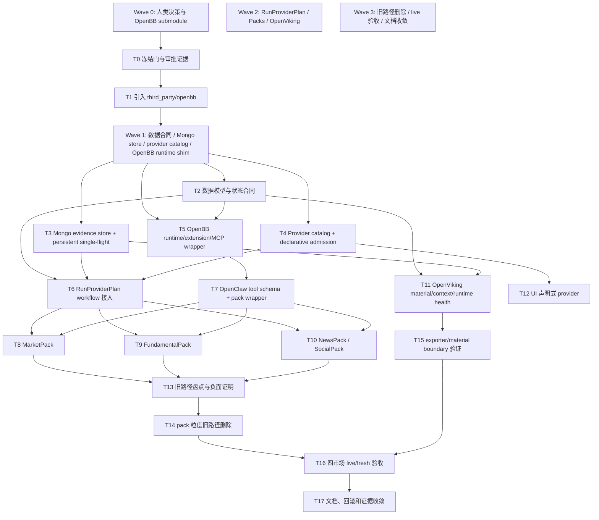

# 数据源修改实施方案

## 1. Verdict

可以实施，但不能立即进入编码。当前方案的结论是：**OpenBB 必须作为唯一数据源入口、唯一 provider 接口层、唯一数据 MCP，并以 `third_party/openbb` submodule/vendor runtime core 进入 claw-trade**。实施前必须先关闭 Wave 0 人类决策门；任一门未关闭，后续任务只能做只读盘点和文档校验，不能修改运行代码。

实施前的人类决策门：

- OpenBB submodule URL：必须给出真实仓库 URL，不能用占位、fork 猜测或浮动分支。
- fixed commit/tag：必须锁定可复现 commit/tag，并写入版本证据。
- license / commercial-use approval：必须明确 OpenBB 及每个 provider 的许可、费用、商业使用边界和 raw export policy。
- project extension placement：必须确认项目自有 provider 放在 OpenBB extension 的哪一层，且不把 claw-trade workflow、worker prompt、report exporter 业务逻辑写入 `third_party/openbb`。
- allowed declarative provider domain policy / SSRF policy：必须由人类确认声明式 provider 可访问域名白名单、协议限制、redirect 后继续校验规则，并明确禁止 `localhost`、private IP、link-local、loopback、metadata service 等 SSRF 风险目标。
- OpenBB 当前版本是否能承载 extension/MCP pack endpoint：若不能承载 `claw_get_market_pack/claw_get_fundamental_pack/claw_get_news_pack/claw_get_social_pack` 这组 worker-visible pack wrapper，必须停止重新设计，不能退回本地 Python data_gateway 直连 provider。

## 2. Scope

本实施方案覆盖：

- 引入 `third_party/openbb` submodule/vendor runtime core。
- 建立 OpenBB runtime / extension 所有权边界，确保外部行情、基本面、新闻、舆情 provider 都经 OpenBB runtime 或 OpenBB 加载的项目 extension。
- 统一 OpenBB native provider 与项目自有 provider 的 `ProviderAdapter` / `ProviderCapability` 合同。
- 建立声明式 provider UI、准入状态机、验证 receipt、用户首选优先级边界。
- 建立 `RunProviderPlan`、Mongo evidence store、persistent single-flight、cache/readiness/data gap/attempt 合同。
- 迁移 MarketPack、FundamentalPack、NewsPack、SocialPack。
- 强化 OpenViking material/context/runtime health 平面，但不让 OpenViking 成为行情、新闻、舆情 provider。
- 收敛旧 MCP / 旧 provider 路径，并保留显式回滚证据。
- 建立四市场真实 live/fresh 验收矩阵。

非目标：

- 不开始实现，不修改源码。
- 不新增未经批准的 runtime guard、风格 gate 或投资判断 gate。
- 不让 Python 控制层写成 provider prefetcher。
- 不让 OpenClaw 承担 12-worker DAG runtime。
- 不让 worker 直接看到 JSON/debug envelope/cache object/Mongo raw/OpenViking protocol。
- 不保留旧 MCP / 旧 provider 作为 OpenBB 失败后的 silent fallback。
- 不允许普通用户上传代码型 provider 直接进入 live report。

## 3. Source Of Truth

本方案依据以下文件：

- `AGENTS.md`：项目架构边界、OpenClaw 单 worker turn、Python 控制层职责、truthfulness redline、runtime guard freeze、live runtime preflight、sub-agent 规范、memory 规范。
- `memory/2026-05-16.md`：CRYPTO/HK live 验证、provider cache、natural-language pack、HK 缺图根因、OpenBB 设计演进背景。
- `memory/2026-05-17.md`：OpenBB 详细设计的多轮修订、OpenViking 增强边界、当前阻断门、HK `stock_hk_daily` 缺图教训。
- `docs/数据源openbb引入方案.md`：本实施方案的主合同。若本方案与该设计文档冲突，以该设计文档为准；若设计文档内部前后冲突，停止实施并先修正文档。

## 4. Human Decision Gates

以下事项必须由人类确认后才能开始 Wave 1 编码：

- OpenBB submodule URL：真实仓库 URL、远端可访问、不是临时镜像。
- fixed commit/tag：固定 commit SHA 或 release tag；禁止 floating branch。
- license / commercial-use approval：OpenBB 许可、OpenBB native provider 许可、项目自有 provider 许可、raw export policy、商业使用批准记录。
- project extension placement：2026-05-17 人类已批准 `src/claw_trade/data_gateway/providers/**` 作为项目 OpenBB extension/shim 放置层，由 OpenBB pack endpoint wrapper/`OpenBBRuntimeWrapper` 加载；不得把 claw-trade workflow、worker prompt、PM 结论、report exporter 写进 OpenBB。
- allowed declarative provider domain policy / SSRF policy：确认声明式 provider 只允许 `https`/明确批准的 `http` 出站域名；禁止 `localhost`、loopback、private IP、link-local、metadata service；DNS 解析后和每次 redirect 后都必须重新校验目标；准入测试必须覆盖 SSRF、协议降级、redirect 绕过和未批准域名。
- OpenBB 当前版本是否能承载 extension/MCP pack endpoint：必须证明可暴露领域 pack endpoint；当前批准形态允许项目本地 OpenBB shim 被 pack endpoint wrapper 加载，但不允许 workflow/controller 直接调用 provider。

每个门的交付证据：

- `docs/evidence/openbb-submodule-version.md`：URL、commit/tag、license 摘要、审批人、审批日期、升级和回滚办法。
- `docs/evidence/openbb-declarative-provider-security.md`：allowed declarative provider domain policy、协议限制、redirect 复验规则、禁止 localhost/private IP/metadata service 的 SSRF policy、审批人、审批日期、残余风险。
- `git submodule status third_party/openbb` 输出。
- OpenBB extension/MCP capability 证明，至少包含 runtime marker、extension version、pack endpoint 或等价接口截图/日志。

## 5. Implementation Principles

硬规则：

- no mock/stub/fake/fallback：测试可以构造状态机输入 fixture，但不能用假 provider 成功证明 live/fresh 能力。
- no silent fallback：OpenBB 失败后不得在同一 run 静默切回旧 MCP / 旧 provider。
- no Python provider prefetcher：Python 控制层只生成 `RunProviderPlan`，不远端预取 provider 数据。
- no worker JSON/debug/cache/Mongo raw：worker 只看自然语言资料包或 approved L1，不能把 JSON/debug envelope/cache object/Mongo raw 当主材料。
- no OpenViking as provider：OpenViking 只做 approved material、manifest、lineage、context index、ovpack、runtime health，不做行情/新闻/舆情抓取。
- no OpenClaw DAG ownership：OpenClaw 只承载单 worker turn、tool schema、provider payload capture，不拥有 12-worker DAG。
- no unapproved runtime/style/investment gate：数据层只处理事实材料、状态语义、缺口、证据链；不新增报告语气或投资判断 gate。
- user-preferred priority 只能在相同 `market/domain/source_role/coverage_group` 内生效，不能覆盖官方原文、source_role 或 coverage_group 边界。
- cache hit/cache stale/cached empty/cache error 不得伪装成 fresh remote success。
- single-flight consumer 只能写 `SHARED_RESULT` 或同类失败，不能写独立 `remote_success`。

证据命名硬规则：

- `openclaw_llm_provider_payload`：只指 OpenClaw 发给 LLM provider 的最终 messages、model-visible tool schema、worker_id、stage、run_id、dispatch_id、runtime marker、provider/request id。它用于证明 worker 看到什么 prompt 和工具。
- `openbb_provider_http_evidence`：只指 OpenBB/adapter 调外部数据 provider 时的 HTTP 请求、响应状态、headers 摘要、source URL、provider request id、latency、错误码等运行证据。
- `openbb_provider_raw_evidence`：只指外部数据 provider 返回的 raw payload/hash/ref 与 raw export policy 证据。
- `openbb_provider_http_evidence` / `openbb_provider_raw_evidence` 不能被当成 `openclaw_llm_provider_payload`；HTTP/raw 证据只能证明外部 provider 调用与数据真实性，不能证明 LLM 可见 prompt/tool schema。
- live/fresh 验收必须同时收集两类证据：OpenClaw LLM provider payload 证明模型可见边界，OpenBB HTTP/raw provider evidence 证明数据源调用与 raw/normalized/cache refs。

## 6. Dependency Graph



并行规则：

- Wave 0 串行：T0、T1 必须先完成。
- Wave 1 部分并行：T2、T3、T4 可由不同 subagent 并行；T5 只能先做 OpenBB runtime discovery / extension shim 准备，pack endpoint wrapper 接入必须等 T2 的 `ProviderAdapter` / `GatewaySettings` 合同可导入，不能自行定义第二套 adapter 协议。
- Wave 2 部分并行：T8/T9/T10 可并行；T11 可与 pack 迁移并行；T6/T7 是 pack 运行前置。
- Wave 3 串行为主：T13 先证明旧路径边界，T14 再删除；T16 必须等 T14/T15 完成后做 collect-first live/fresh。

## 7. Atomic Task List

### T0：人类决策门与实施冻结

- Goal：关闭 OpenBB URL、commit/tag、license、extension placement、allowed declarative provider domain policy / SSRF policy、MCP pack endpoint 六个开工门。
- Files to read：`AGENTS.md`、`docs/数据源openbb引入方案.md`、`.gitmodules`、`pyproject.toml`。
- Files allowed to edit：`docs/evidence/openbb-submodule-version.md`、`docs/evidence/openbb-declarative-provider-security.md`、`memory/YYYY-MM-DD.md`。
- Files forbidden to edit：`src/**`、`agents/**`、`openclaw_plugins/**`、`third_party/**`、runtime guard 文件。
- Preconditions：人类给出 OpenBB 仓库、固定版本、许可审批结论和声明式 provider 域名/SSRF 策略。
- Atomic steps：
  1. 写入 URL、commit/tag、license、审批人、审批日期、商业使用边界。
  2. 明确 project extension placement。
  3. 明确 allowed declarative provider domain policy：允许域名、协议限制、DNS/redirect 后复验、禁止 `localhost` / private IP / link-local / metadata service。
  4. 明确 OpenBB 当前版本是否能承载 extension/MCP pack endpoint。
  5. 若任一项缺失，标记为 Human Decision Gate 未关闭。
- Acceptance tests：`test -s docs/evidence/openbb-submodule-version.md && test -s docs/evidence/openbb-declarative-provider-security.md`；人工复核审批字段完整。
- Evidence to collect：审批文档、许可链接、OpenBB extension/MCP 能力说明、allowed declarative provider domain policy、SSRF policy。
- Stop conditions：任一审批项仍是占位；license 无法接受；OpenBB 版本不能承载 pack endpoint。
- Parallelization notes：必须串行；所有后续 subagent 依赖此任务。

### T1：引入 `third_party/openbb` submodule

- Goal：把 OpenBB 作为受控 submodule/vendor runtime core 纳入仓库。
- Files to read：`docs/evidence/openbb-submodule-version.md`、`.gitmodules`、`scripts/start-control-runtime.sh`。
- Files allowed to edit：`.gitmodules`、`third_party/openbb` submodule 指针、`scripts/setup-openbb-dev.sh`、`.runtime/dev-services/openbb/` 配置模板、`docs/evidence/openbb-submodule-version.md`。
- Files forbidden to edit：业务 pack、workflow、worker prompt、report exporter、OpenClaw DAG、OpenViking provider 逻辑。
- Preconditions：T0 完成。
- Atomic steps：
  1. `git submodule add <approved-url> third_party/openbb`。
  2. `git -C third_party/openbb checkout <approved-commit-or-tag>`。
  3. 增加开发安装脚本，只准备 OpenBB runtime，不启动旧 MCP。
  4. 记录 submodule status 与 OpenBB runtime marker。
- Acceptance tests：`git submodule status third_party/openbb`；OpenBB runtime 可启动并输出版本；缺 key 时返回 credential_missing 诊断而不是假成功。
- Evidence to collect：submodule status、OpenBB version、runtime marker、extension discovery 输出。
- Stop conditions：只能使用 floating branch；license 不可接受；OpenBB 无法承载 extension/MCP pack endpoint。
- Parallelization notes：必须串行；完成后解锁 Wave 1。

### T2：数据模型与状态合同

- Goal：落地数据模型与统一 adapter 协议，包含 `ProviderResult`、`ProviderAttempt`、`Readiness`、`DataGap`、`Conflict`、`CacheReceipt`、`CacheDecision`、`PackAuditPayload`、`DomainPackResult`、`DeclarativeProviderManifest`、`ProviderValidationReceipt`、`ProviderAdmissionStatus`、`GatewaySettings`、`CredentialStatus`、`LicenseCheckResult`、`ProviderAdapter`。
- Files to read：`docs/数据源openbb引入方案.md` 第 5、13.2、13.3 章；现有 `openclaw_plugins/.../frontline_data_pack/models.py`。
- Files allowed to edit：`src/claw_trade/data_gateway/models.py`、`src/claw_trade/data_gateway/errors.py`、`src/claw_trade/data_gateway/providers/base.py`、`src/claw_trade/data_gateway/settings.py`、`tests/unit/data_gateway/test_models.py`、`tests/unit/data_gateway/test_source_roles.py`、`tests/unit/data_gateway/test_provider_adapter_contract.py`。
- Files forbidden to edit：provider 执行器、pack builder、workflow、OpenClaw、OpenViking runtime、旧 provider 删除路径。
- Preconditions：T1 完成；目标目录结构确认。
- Atomic steps：
  1. 定义枚举：`ProviderStatus`、`ProviderAdmissionStatus`、`SourceRole`、`ReadinessStatus`、`DataGapReason` 等。
  2. 定义 dataclass / pydantic model，字段与设计文档一致。
  3. 在 `providers/base.py` 定义唯一 `ProviderAdapter` protocol；`GatewaySettings`、`CredentialStatus`、`LicenseCheckResult` 也归本任务所有，F/G/H 不得各写各的 adapter 协议。
  4. 写状态转换约束测试，禁止 cache 状态转 `remote_success`。
  5. 写 `LICENSE_BLOCKED`、`SHARED_RESULT`、`cached_empty` 字段闭合测试。
  6. 写 adapter 合同测试，证明 OpenBB native、project extension、declarative provider 都必须实现同一 `ProviderAdapter` surface。
- Acceptance tests：`uv run pytest tests/unit/data_gateway/test_models.py tests/unit/data_gateway/test_source_roles.py tests/unit/data_gateway/test_provider_adapter_contract.py`。
- Evidence to collect：测试输出、字段快照、与设计字段对照表。
- Stop conditions：必须删减核心字段才能通过；`DataGap.reason` 直接复用 `ProviderStatus`；无法表示 `LICENSE_BLOCKED` 或 `SHARED_RESULT`；F/G/H 或 D1/D2 需要新增第二套 adapter 协议。
- Parallelization notes：Wave 1 可与 T3/T4 并行；T5 只能并行做 runtime discovery / shim 准备，pack endpoint wrapper 接入必须等待本任务的 `ProviderAdapter` / `GatewaySettings` 合同。

### T3：Mongo evidence store 与 persistent single-flight

- Goal：建立 provider raw、cache、attempt、rate-limit、normalized、run-plan、single-flight、validation receipt 的 Mongo 存储和持久化租约。
- Files to read：设计文档 13.4、13.5；现有 `frontline_data_pack/mongo_store.py`、`crypto_provider_cache.py`、`normalized_store.py`。
- Files allowed to edit：`src/claw_trade/data_gateway/store/**`、`tests/unit/data_gateway/test_cache_state_machine.py`、`tests/integration/data_gateway/test_mongo_attempts.py`、`tests/integration/data_gateway/test_run_provider_plan_snapshot.py`。
- Files forbidden to edit：pack reader brief、provider adapter、worker prompt、exporter、OpenViking provider 逻辑。
- Preconditions：T2 模型合同可导入。
- Atomic steps：
  1. 建立 raw/cache/attempt/rate-limit/normalized/run-plan/single-flight/validation receipt collection schema 与 index。
  2. 实现 `CacheStore.get/put_success/put_empty`，保证 `cache_hit/cache_stale/cache_error/cached_empty` 语义不丢。
  3. 实现 `AttemptStore.write` 和 `RawPayloadStore.write_raw`，写失败为 `EVIDENCE_WRITE_FAILED`。
  4. 实现 Mongo 原子 upsert lease 的 `SingleFlightCoordinator`。
  5. 写两进程或独立 worker session 并发测试，验证 owner/consumer 与 `SHARED_RESULT`。
- Acceptance tests：`uv run pytest tests/unit/data_gateway/test_cache_state_machine.py tests/integration/data_gateway/test_mongo_attempts.py`。
- Evidence to collect：Mongo collection sample、index list、owner attempt、consumer `SHARED_RESULT` attempt、cache receipt。
- Stop conditions：single-flight 只能用内存锁；consumer 写独立 remote_success；cache error 被吞掉；raw 写失败仍让 worker 看到成功资料。
- Parallelization notes：可与 T2/T4 并行；T5 只能并行做 runtime discovery / shim 准备，pack endpoint wrapper 接入必须等待 T2；T6/T8/T9/T10 依赖此任务。

### T4：Provider catalog / declarative admission

- Goal：实现系统 provider 和用户声明式 provider 的 catalog、状态机、准入验证、用户首选优先级边界。
- Files to read：设计文档 8.5、13.6.1、13.7、13.16；现有 provider specs。
- Files allowed to edit：`src/claw_trade/data_gateway/providers/catalog.py`、`admission.py`、`declarative.py`、`registry.py`、`license_policy.py`、`secrets.py`、`tests/unit/data_gateway/test_provider_admission.py`、`tests/unit/data_gateway/test_provider_admission_security.py`、`tests/unit/data_gateway/test_provider_registry.py`。
- Files forbidden to edit：UI live report 入口、worker prompt、OpenClaw stage policy、旧 provider 删除路径。
- Preconditions：T2 可用；T0 中 allowed declarative provider domain policy 明确。
- Atomic steps：
  1. 实现 `DeclarativeProviderManifest` 加载、canonical config version hash。
  2. 实现 `draft/validating/validated/enabled_candidate/disabled/rejected/quarantined` 状态迁移 receipt。
  3. 验证 credential、healthcheck、schema sample、source_role、license、secret、rate-limit、raw export policy。
  4. 验证 allowed declarative provider domain policy：协议限制、域名白名单、DNS 解析后禁止 `localhost` / private IP / link-local / metadata service、redirect 后继续校验，命中 SSRF 风险必须 rejected/quarantined。
  5. 实现 `enabled_candidates()`，排除未验证、disabled、rejected、quarantined。
  6. 实现用户首选排序，只在同一 `market/domain/source_role/coverage_group` 内生效。
- Acceptance tests：`uv run pytest tests/unit/data_gateway/test_provider_admission.py tests/unit/data_gateway/test_provider_admission_security.py tests/unit/data_gateway/test_provider_registry.py`。
- Evidence to collect：validation receipt、quarantine receipt、enabled candidate list、user preferred ordering trace。
- Stop conditions：普通用户可上传代码型 provider；未验证 provider 进入 run plan；user-preferred 覆盖官方原文或 source_role；allowed declarative provider domain policy 未关闭；localhost/private IP/metadata service/redirect SSRF 绕过可进入 enabled candidate。
- Parallelization notes：可与 T3 并行；T5 只能并行做 runtime discovery / shim 准备，pack endpoint wrapper 接入必须等待 T2；T6/T12 依赖。

### T5：OpenBB runtime / MCP / wrapper

- Goal：证明并实现 OpenBB runtime/extension/shim ownership，不退回 workflow/controller 直连 provider。
- Files to read：设计文档 13.1.1、13.12、13.12.1；OpenBB extension 文档；现有 `openclaw_plugins/.../openclaw.plugin.json`。
- Files allowed to edit：OpenBB extension shim、`src/claw_trade/data_gateway/mcp/**`、pack tool wrapper、OpenBB setup/runtime 配置、相关 tests。
- Files forbidden to edit：12-worker DAG、workflow 调度顺序、PM/exporter 投资结论、OpenViking provider 行为。
- Preconditions：T1 完成；T2 的 `ProviderAdapter` / `GatewaySettings` 合同可导入；OpenBB pack endpoint 能力确认。
- Atomic steps：
  1. 建立已批准的项目 OpenBB extension/shim package。
  2. 暴露 `claw_get_market_pack/claw_get_fundamental_pack/claw_get_news_pack/claw_get_social_pack`。
  3. 工具返回只输出自然语言 `reader_brief_md`，audit payload 写 evidence。
  4. OpenBB MCP/pack endpoint 只注册领域 pack endpoint，不注册 atomic provider/admin/discovery/prompt/debug/cache endpoint；OpenClaw worker visible schema 由 T7/D2 验收。
  5. 历史工具名只用于替换盘点和 import-block 验收；worker-visible schema 只暴露 canonical `claw_get_*_pack`。
- Acceptance tests：`uv run pytest tests/unit/data_gateway/test_openbb_runtime_wrapper.py tests/integration/data_gateway/test_mcp_pack_endpoints.py`。
- Evidence to collect：OpenBB runtime marker、extension version、pack endpoint audit、wrapper call audit。
- Stop conditions：OpenBB 无 pack endpoint；wrapper 需要 import 旧 provider executor；workflow/controller 需要直接调用 provider；worker 必须看到 OpenBB atomic/admin/discovery tool 才能工作。
- Parallelization notes：T5 只能与 T2/T3/T4 并行做 runtime discovery / shim 准备；pack endpoint wrapper 接入必须等待 T2 的 `ProviderAdapter` / `GatewaySettings` 合同，T7/T8/T9/T10 依赖 T5 完成。

### T6：RunProviderPlan workflow 接入

- Goal：在 `/report` run 初始化阶段生成 `RunProviderPlan`，冻结 provider_config_version、call specs、cache keys、rate-limit plan、single-flight keys，但不远端预取。
- Files to read：设计文档 13.8；`src/claw_trade/workflow/**`；`scripts/run_claw_trade_fresh_report.py`。
- Files allowed to edit：`src/claw_trade/data_gateway/providers/run_plan.py`、`store/run_plans.py`、workflow run 初始化接入点、`tests/unit/data_gateway/test_run_provider_plan.py`、`tests/integration/data_gateway/test_run_provider_plan_snapshot.py`。
- Files forbidden to edit：provider fetch、pack builder 投资逻辑、OpenClaw DAG ownership、普通 chat 入口。
- Preconditions：T2、T3、T4 基础可用。
- Atomic steps：
  1. 在 `/report` run 初始化后、第一次 worker wake 前写入 run plan。
  2. 固定 `remote_prefetch_allowed=false`。
  3. 计划阶段只读 manifest、key presence、license、rate limit metadata、cache metadata、schema、coverage_group、source_role。
  4. pack tool 运行时必须加载本 run plan，缺 plan 或版本 mismatch 显式失败。
- Acceptance tests：`uv run pytest tests/unit/data_gateway/test_run_provider_plan.py tests/integration/data_gateway/test_run_provider_plan_snapshot.py`。
- Evidence to collect：run plan document、no-fetch spy 证据、config version snapshot。
- Stop conditions：必须远端预取才能生成计划；普通 chat 创建 plan；run 中途热加载 UI provider 配置。
- Parallelization notes：T8/T9/T10 前置；可由专门 subagent 串行负责 workflow 接入。

### T7：OpenClaw tool schema 与 pack wrapper 接入

- Goal：让 frontline worker 只看到 canonical `claw_get_*_pack` 领域 pack 工具，downstream worker 不看到 OpenBB 数据工具。
- Files to read：设计文档 13.12.1、13.17；`src/claw_trade/config/tool_names.py`；`openclaw_plugins/claw-trade-frontline-tools/openclaw.plugin.json`；`openclaw_llm_provider_payload` 证据样例。
- Files allowed to edit：工具名映射、OpenClaw plugin wrapper、tool schema tests、`openclaw_llm_provider_payload` scan tests。
- Files forbidden to edit：OpenClaw 12-worker DAG、OpenClaw business logic、worker prompts、report exporter。
- Preconditions：T5 pack endpoint 可调用。
- Atomic steps：
  1. 禁止历史 pack alias 在 OpenBB flag 开启后进入 frontline tool schema。
  2. 禁止 US atomics 在 OpenBB flag 开启后进入 frontline tool schema。
  3. downstream workers visible tools 为空。
  4. `openclaw_llm_provider_payload` scan 禁止 OpenBB admin/discovery/raw/debug/cache tools。
- Acceptance tests：`uv run pytest tests/unit/data_gateway/test_tool_schema.py tests/integration/data_gateway/test_mcp_visible_tools.py`。
- Evidence to collect：每个 worker visible tool schema、`openclaw_llm_provider_payload` scan 输出、OpenBB gateway audit marker。
- Stop conditions：worker 必须直接看 atomic provider tool；alias 调用旧 executor；downstream worker 看到 OpenBB data tool。
- Parallelization notes：T8/T9/T10 前置；与 T11 可并行。

### T8：MarketPack

- Goal：实现 CN_A/HK/US/CRYPTO 市场资料包，含 OHLCV、指标、图表 readiness、HK `stock_hk_daily` 字段合同。
- Files to read：设计文档 6、13.15 MarketPackBuilder、13.16；现有 market pack 与 HK 缺图 memory。
- Files allowed to edit：`src/claw_trade/data_gateway/packs/market.py`、`charts.py`、market provider adapters、market tests。
- Files forbidden to edit：workflow 调度、PM/exporter 结论、News/Social/Fundamental pack。
- Preconditions：T2/T3/T5/T6/T7 完成最小接口。
- Atomic steps：
  1. 实现 CN_A/HK/US/CRYPTO market provider capabilities。
  2. 实现 HK `stock_hk_daily` ticker 归一、qfq、字段映射、HKD、Asia/Hong_Kong、升序。
  3. 实现 OHLCV normalized schema、技术指标、chart input 和 chart readiness。
  4. reader brief 自然语言呈现 cache/attempt/gap/chart root cause。
  5. OpenBB flag 打开时 import-block 旧 market executor。
- Acceptance tests：`uv run pytest tests/integration/data_gateway/test_market_pack_cn_a.py tests/integration/data_gateway/test_market_pack_hk.py tests/integration/data_gateway/test_market_pack_us.py tests/integration/data_gateway/test_market_pack_crypto.py`。
- Evidence to collect：market pack reader brief、chart assets、HK attempts、chart readiness root cause、Mongo raw/normalized/cache refs。
- Stop conditions：HK 图表缺失只能靠 exporter 绕过；`stock_hk_daily` 前导零丢失；cache hit 写成 fresh remote。
- Parallelization notes：可与 T9/T10/T11 并行；不得改它们文件。

### T9：FundamentalPack

- Goal：实现 CN_A/HK/US/CRYPTO 基本面资料包，保留估值、财务、官方原文、币种、报告期、冲突。
- Files to read：设计文档 13.15 FundamentalPackBuilder、13.16；现有 fundamentals pack。
- Files allowed to edit：`src/claw_trade/data_gateway/packs/fundamental.py`、fundamental adapters、fundamental tests。
- Files forbidden to edit：Market/News/Social pack、workflow、PM/exporter 结论。
- Preconditions：T2/T3/T5/T6/T7 完成最小接口。
- Atomic steps：
  1. 建立 CN_A Tushare/AkShare、HK 官方/财务、US FMP/SEC、CRYPTO CoinGecko/DefiLlama capability。
  2. 字段缺失写 `FIELD_MISSING` / `DataGap`，PE/PB/ROE 不得伪造。
  3. 官方原文 `official_original` 优先并保留 raw_ref。
  4. provider 冲突生成 `Conflict`。
  5. reader brief 不写投资判断。
- Acceptance tests：`uv run pytest tests/unit/data_gateway/test_readiness.py tests/integration/data_gateway/test_fundamental_pack_cn_a.py tests/integration/data_gateway/test_fundamental_pack_hk.py tests/integration/data_gateway/test_fundamental_pack_us.py tests/integration/data_gateway/test_fundamental_pack_crypto.py`。
- Evidence to collect：valuation/fundamental gaps、official refs、Conflict records、Mongo normalized refs。
- Stop conditions：Python 生成 BUY/HOLD/SELL 或估值结论；缺 PE/PB/ROE 被写成正常无风险；搜索摘要替代官方原文。
- Parallelization notes：可与 T8/T10/T11 并行。

### T10：NewsPack / SocialPack

- Goal：实现新闻事实源与搜索发现分离、社交原始样本与聚合指标分离、Alternative.me/Polymarket source_role 边界。
- Files to read：设计文档 5.7、6.2、13.15 News/Social、13.16；CRYPTO news/social memory。
- Files allowed to edit：`src/claw_trade/data_gateway/packs/news.py`、`social.py`、news/social adapters、source role tests。
- Files forbidden to edit：Market/Fundamental pack、PM/exporter 结论、worker prompt 风格 gate。
- Preconditions：T2/T3/T4/T5/T6/T7 完成最小接口。
- Atomic steps：
  1. 新闻事实必须来自新闻源、官方原文或可追溯网页正文。
  2. 搜索 API 只产 `search_discovery`，不能升级为 `official_original`。
  3. Alternative.me 只产市场级情绪，不写单标的社交共识。
  4. Polymarket 只产 `event_expectation`，不当新闻事实或社交共识。
  5. 缺 key、空返回、限流、schema drift 都进入 attempts/gaps/readiness。
- Acceptance tests：`uv run pytest tests/unit/data_gateway/test_source_roles.py tests/integration/data_gateway/test_news_pack_cn_a.py tests/integration/data_gateway/test_news_pack_hk.py tests/integration/data_gateway/test_news_pack_us.py tests/integration/data_gateway/test_news_pack_crypto.py tests/integration/data_gateway/test_social_pack_cn_a.py tests/integration/data_gateway/test_social_pack_hk.py tests/integration/data_gateway/test_social_pack_us.py tests/integration/data_gateway/test_social_pack_crypto.py`。
- Evidence to collect：source_role table、attempts、data gaps、reader brief source role 说明。
- Stop conditions：搜索结果当新闻事实；Alternative.me 写成单币种舆情；Polymarket 写成新闻事实；社交聚合指标写成全网共识。
- Parallelization notes：可与 T8/T9/T11 并行。

### T11：OpenViking material/context/runtime health 增强

- Goal：封装 tree/grep/glob、relations graph、ovpack export/import、L0/L1/semantic index、session/memory、metrics/observer/locks/recovery，并保持 OpenViking 不越界为 provider。
- Files to read：设计文档 13.13、13.14；`src/claw_trade/artifacts/openviking_client.py`；`src/claw_trade/runtime/openviking_report_server.py`。
- Files allowed to edit：`src/claw_trade/data_gateway/openviking/**`、`src/claw_trade/artifacts/openviking_client.py` 的通用 wrapper、OpenViking lineage/bundle/health tests。
- Files forbidden to edit：provider adapter fetch、worker prompt、OpenViking 外部 provider 调用、report exporter 投资结论。
- Preconditions：T2/T3 基础模型可用；OpenViking upstream API mapping 已确认。
- Atomic steps：
  1. T6a：封装 tree/grep/glob/relations/export/import/session/observer/metrics。
  2. T6b：实现 L0/L1/context index receipt；当前 semantic/vector queue 禁用时 `context_index_status` 只能 `blocked/unavailable`。
  3. T6c：实现 runtime health；无 public recovery API 时 `recovery_status=unavailable`。
  4. 建 final report -> PM L1 -> worker L1 -> L2 -> pack audit -> attempt/raw/normalized/cache refs 关系图。
  5. 保证这些工具只在控制层/审计可见，worker payload 不出现。
- Acceptance tests：`uv run pytest tests/unit/data_gateway/test_openviking_relations.py tests/unit/data_gateway/test_openviking_context_index.py tests/unit/data_gateway/test_openviking_runtime_health.py tests/integration/data_gateway/test_openviking_lineage.py tests/integration/data_gateway/test_openviking_evidence_bundle.py`。
- Evidence to collect：tree/grep/glob output、relations dump、ovpack receipt、import verification、context index receipts、runtime health snapshot。
- Stop conditions：OpenViking search 命中旧材料被当 fresh provider 数据；semantic queue 禁用却写 ok；worker 看见 OpenViking protocol；ovpack 只依赖 `docs/evidence`。
- Parallelization notes：可与 packs 并行；T15/T16 依赖。

### T12：UI 动态新增声明式 provider

- Goal：让 UI 只创建/编辑声明式 provider manifest，通过 admission validation 后才进入 enabled candidate。
- Files to read：设计文档 8.5、13.6.1、13.18 T8；现有 UI/provider settings。
- Files allowed to edit：UI provider settings 组件、backend manifest API、admission tests。
- Files forbidden to edit：worker tool schema、OpenClaw prompt、provider direct code upload、OpenBB runtime bypass。
- Preconditions：T4 完成。
- Atomic steps：
  1. UI 保存 `draft` manifest。
  2. validation 发起真实 healthcheck/sample 请求，写 `ProviderValidationReceipt`。
  3. 只有 `enabled_candidate` 进入 registry snapshot。
  4. active run 使用固定 provider_config_version，UI 修改只影响下一次 `/report`。
  5. 禁止普通用户上传代码型 provider。
- Acceptance tests：`uv run pytest tests/integration/data_gateway/test_declarative_provider_admission.py`。
- Evidence to collect：draft/validating/validated/enabled_candidate/rejected/quarantined receipts、config version 快照。
- Stop conditions：UI 保存后立即进入 live run；普通用户代码执行；user-preferred 越过 source_role/coverage_group。
- Parallelization notes：可在 T4 后并行；不阻塞基础 pack 迁移，但阻塞用户 provider 验收。

### T13：旧路径盘点与负面证明测试

- Goal：找出旧 MCP / 旧 provider / 旧 cache / US atomics / direct provider imports，并建立 OpenBB flag 下的 import-block 负面证明。
- Files to read：设计文档 13.18；`openclaw_plugins/**`、`agents/*/skills/**/scripts/**`、历史 `src/claw_trade/providers/**` 删除证据、`src/claw_trade/config/tool_names.py`。
- Files allowed to edit：迁移看板文档、import-block tests、负面证明测试。
- Files forbidden to edit：删除旧路径本体、packs、workflow、provider adapter。
- Preconditions：T8/T9/T10 至少各有 wrapper 可用。
- Atomic steps：
  1. 用 `rg` 盘点旧 provider executor、旧 direct client、旧 US atomic tools。
  2. 建 OpenBB flag 下 import-block 测试，旧模块被 monkeypatch/import-block 成抛错时，已迁移 pack 必须仍经 OpenBB runtime 成功或显式失败。
  3. `openclaw_llm_provider_payload` scan 禁止旧 atomics 暴露。
  4. 输出 pack 粒度删除/隔离清单和 Git/VCS 回滚证据要求。
- Acceptance tests：`uv run pytest tests/integration/data_gateway/test_mcp_visible_tools.py tests/integration/data_gateway/test_old_provider_import_block.py`。
- Evidence to collect：rg hit list、import-block 测试输出、`openclaw_llm_provider_payload` scan。
- Stop conditions：旧路径仍参与 OpenBB flag 下成功；compare mode 结果进入 worker 正文；silent fallback 存在。
- Parallelization notes：T14 前置；不直接删除代码。

### T14：按 pack 删除旧路径与显式回滚边界

- Goal：在每个 pack live/fresh 通过后删除或隔离对应旧直连路径，保留 compare 证据；人类已选择不保留可运行旧 provider 回滚开关，回滚只走 Git/VCS 运维流程。
- Files to read：T13 删除清单；对应 pack live/fresh 证据。
- Files allowed to edit：已迁移 pack 的旧 wrapper/旧 provider 代码、tool_names 切换、迁移文档、回滚文档。
- Files forbidden to edit：未迁移 pack 的旧路径、OpenClaw DAG、OpenViking provider、runtime guards。
- Preconditions：T13 完成；目标 pack 已有 live/fresh 证据。
- Atomic steps：
  1. 按 pack 删除旧 executor/import 路径。
  2. 运行时默认且只能使用 OpenBB。
  3. 当前主线不保留旧 provider 可运行回滚模式，metadata 保持 `data_gateway=openbb`；需要回旧版只能人工 Git/VCS 回退。
  4. 同一 `/report` run 禁止 OpenBB 失败后切旧路径装成功。
- Acceptance tests：对应 pack import-block tests、tool schema tests、live/fresh smoke。
- Evidence to collect：删除/隔离 diff、旧路径运行边界 rg 结果、Git/VCS 回滚文档、`data_gateway=openbb` 元数据样例。
- Stop conditions：删除需要一次性大爆炸；旧路径仍作为同 run fallback；回滚吞掉 OpenBB 失败原因。
- Parallelization notes：按 pack 串行删除；不同 pack 可在证据完整时分支并行，但不要共享文件冲突。

### T15：Exporter 与 worker-visible material 边界

- Goal：证明 downstream worker 只看 approved L1，自然语言资料包不含 JSON/debug/cache/Mongo raw/OpenViking protocol，exporter 只读 approved material。
- Files to read：AGENTS 第 6.1、8、9、11 章；设计文档 4.7、13.11、13.17。
- Files allowed to edit：boundary tests、`openclaw_llm_provider_payload` scan tests、exporter read-source tests。
- Files forbidden to edit：PM 结论、report expression guard、worker prompt 风格。
- Preconditions：T7、T11 可用。
- Atomic steps：
  1. 扫描 frontline `openclaw_llm_provider_payload` 和 worker reports。
  2. 验证 downstream workers 无 OpenBB/OpenViking/Mongo raw tools。
  3. 验证 exporter 不读 Mongo raw/cache，不补写 PM 结论。
  4. 验证 `reader_brief_md` 是自然语言，缺口段落自然语言呈现。
- Acceptance tests：`uv run pytest tests/contracts/test_provider_prompt_boundary.py tests/integration/data_gateway/test_exporter_material_boundary.py`。
- Evidence to collect：`openclaw_llm_provider_payload`、tool schema、exporter read trace、final report evidence chain；如引用外部数据源证据，必须另列 `openbb_provider_http_evidence` / `openbb_provider_raw_evidence`。
- Stop conditions：worker 主材料是 JSON；exporter 读 Mongo raw/cache 补事实；Python 改写 PM rating/final decision。
- Parallelization notes：T16 前置；与 T14 可并行。

### T16：四市场真实 live/fresh 验收矩阵

- Goal：按 fixed runtime preflight 和 collect-first 验收 CN_A、HK、US、CRYPTO 四市场。
- Files to read：AGENTS 12.1、13；设计文档 9、13.19；`memory/2026-05-16.md`、`memory/2026-05-17.md`。
- Files allowed to edit：live evidence docs、collect-first report、memory log。
- Files forbidden to edit：生产源码、runtime guard、fallback 逻辑。
- Preconditions：T8/T9/T10/T11/T14/T15 完成。
- Atomic steps：
  1. 管理者先打印 fixed runtime preflight 表。
  2. 使用 `scripts/start-control-runtime.sh -- <command>` 做 fresh/live。
  3. 样本：CN_A `600519`；HK `00700.HK` + 非腾讯样本；US `AAPL` 或 `MSFT`；CRYPTO `BTC`。
  4. collect-first 执行，除数据真实性/架构边界/PM authority 等例外外不首错即停。
  5. 分开收集 `openclaw_llm_provider_payload`、tool schema、tool calls、`openbb_provider_http_evidence`、`openbb_provider_raw_evidence`、Mongo refs、run plan、OpenViking lineage、ovpack、runtime health、chart readiness、final report。
- Acceptance tests：真实 live/fresh 命令和四市场 evidence review。
- Evidence to collect：每个 run 的 preflight、run_id、`openclaw_llm_provider_payload`、`openbb_provider_http_evidence`、`openbb_provider_raw_evidence`、Mongo documents、OpenViking tree/grep/glob/relations、ovpack receipt、final_report。
- Stop conditions：无 fixed preflight；runtime 未重启或复用状态不可信；使用 mock/stub/fake/capture-only；继续会污染证据。
- Parallelization notes：可以按市场由多个 subagent collect-first 并行，但 manager 必须先完成 preflight 表；同一 runtime 资源冲突时串行。

### T17：文档、回滚和最终证据收敛

- Goal：形成实施完成证据链、删除清单、回滚边界、残余风险和后续升级规则。
- Files to read：所有 T0-T16 evidence；设计文档；README/ARCHITECTURE/相关 docs。
- Files allowed to edit：docs、CHANGELOG 或发布说明、memory。
- Files forbidden to edit：源码、runtime guard、provider behavior。
- Preconditions：T16 完成或明确失败并收敛。
- Atomic steps：
  1. 汇总 OpenBB 唯一数据入口证据。
  2. 汇总旧路径删除与 import-block 证据。
  3. 汇总四市场 fresh/live 证据。
  4. 记录显式 rollback procedure，禁止 silent fallback。
  5. 列出未关闭 residual risks。
- Acceptance tests：文档链接全部存在；`rg` 旧路径关键字无未解释命中；证据链可从 final report 追到 provider refs。
- Evidence to collect：最终 acceptance checklist、残余风险表、rollback 说明。
- Stop conditions：任何核心证据缺失但文档声称完成；旧 provider 仍可被同 run silent fallback 调用。
- Parallelization notes：串行收口任务。

## 8. Subagent Work Packages

以下 prompt 可直接复制给 subagent。所有 subagent 默认遵守：你不是唯一 agent，不得 revert 他人改动；只处理 assigned scope；不允许 mock/stub/fake/fallback；完成后必须报告 changed files、commands、exit code、key output、deviation、remaining risk；完成后追加 `memory/YYYY-MM-DD.md`。

### Subagent A：数据模型与状态合同

```text
你是 claw-trade OpenBB 数据源迁移的 Subagent A。你不是唯一 agent，不得 revert 他人改动。只处理 assigned scope：T2 数据模型与状态合同。

任务编号：A / T2
任务目标：实现 ProviderResult、ProviderAttempt、Readiness、DataGap、Conflict、CacheReceipt、CacheDecision、PackAuditPayload、DomainPackResult、DeclarativeProviderManifest、ProviderValidationReceipt、ProviderAdmissionStatus、GatewaySettings、CredentialStatus、LicenseCheckResult，并在 providers/base.py 定义唯一 ProviderAdapter 协议。
读取文件：AGENTS.md；docs/数据源openbb引入方案.md；docs/数据源修改实施方案.md；openclaw_plugins/claw-trade-frontline-tools/python/frontline_data_pack/models.py。
允许修改文件范围：src/claw_trade/data_gateway/models.py；src/claw_trade/data_gateway/errors.py；src/claw_trade/data_gateway/providers/base.py；src/claw_trade/data_gateway/settings.py；tests/unit/data_gateway/test_models.py；tests/unit/data_gateway/test_source_roles.py；tests/unit/data_gateway/test_provider_adapter_contract.py。
禁止修改文件范围：workflow、OpenClaw、OpenViking runtime、worker prompts、report exporter、provider executor、旧路径删除文件。
输入依赖：T1 完成；OpenBB submodule/runtime 事实已记录；本任务不需要真实 provider 调用。
输出交付物：数据模型、枚举、错误码、ProviderAdapter 协议、GatewaySettings/CredentialStatus/LicenseCheckResult、字段对照测试、adapter 合同测试。
原子步骤：
1. 定义 Market、PackDomain、SourceRole、ProviderKind、ProviderAdmissionStatus、PrioritySource、ProviderStatus、DataGapReason、FreshnessStatus、ReadinessStatus。
2. 定义 PackRequest、FreshnessPolicy、ProviderCapability、ProviderCallSpec、RunProviderPlan、CacheReceipt、CacheDecision、ProviderAttempt、ProviderResult、DataGap、Conflict、Readiness、PackAuditPayload、DomainPackResult、GatewaySettings、CredentialStatus、LicenseCheckResult。
3. 在 providers/base.py 定义唯一 ProviderAdapter protocol；OpenBB native、project extension、declarative provider 都只能实现这套协议。
4. 写测试证明 cache_hit/cache_stale/cache_error/cached_empty 不能转 remote_success，LICENSE_BLOCKED 与 SHARED_RESULT 字段闭合。
5. 确认 reader_brief_md 是 worker 主材料，audit payload 不进入 worker 主材料。
验收命令：uv run pytest tests/unit/data_gateway/test_models.py tests/unit/data_gateway/test_source_roles.py tests/unit/data_gateway/test_provider_adapter_contract.py
验收证据：命令 exit code、关键断言输出、字段对照表。
停止条件：需要删减核心状态才能通过；无法表达 LICENSE_BLOCKED/SHARED_RESULT；DataGap.reason 直接塞 ProviderStatus；任何 subagent 需要第二套 adapter 协议。
与其他 subagent 的冲突边界：A 拥有 data_gateway models/errors/providers/base/settings；B/C/D1/D2/E/F/G/H 只能依赖模型和 ProviderAdapter，不得改模型字段或重定义 adapter 协议，字段变更必须先回到 A 协调。

完成报告必须包含 changed files、commands、exit code、key output、expected outcome、deviation status、real implementation status、mock/stub/fake/fallback status、remaining risk，并追加 memory/YYYY-MM-DD.md。
```

### Subagent B：Mongo evidence store 与 persistent single-flight

```text
你是 claw-trade OpenBB 数据源迁移的 Subagent B。你不是唯一 agent，不得 revert 他人改动。只处理 assigned scope：T3 Mongo evidence store 与 persistent single-flight。

任务编号：B / T3
任务目标：实现 openbb_provider_manifests、openbb_provider_validation_receipts、openbb_provider_attempts、openbb_raw_payloads、openbb_cache_entries、openbb_normalized、openbb_rate_limits、openbb_run_provider_plans、openbb_single_flight_calls 的 store 合同。
读取文件：AGENTS.md；docs/数据源openbb引入方案.md；docs/数据源修改实施方案.md；openclaw_plugins/.../mongo_store.py；crypto_provider_cache.py；normalized_store.py。
允许修改文件范围：src/claw_trade/data_gateway/store/**；tests/unit/data_gateway/test_cache_state_machine.py；tests/integration/data_gateway/test_mongo_attempts.py；tests/integration/data_gateway/test_run_provider_plan_snapshot.py。
禁止修改文件范围：provider adapters、pack builders、worker prompts、OpenClaw、OpenViking provider behavior、旧路径删除。
输入依赖：Subagent A 的模型合同。
输出交付物：Mongo stores、index setup、CacheReceipt/CacheDecision、RawPayloadStore、AttemptStore、RateLimitStore、NormalizedStore、RunProviderPlanStore、SingleFlightCoordinator。
原子步骤：
1. 建 collection schema 与 index。
2. 实现 cache miss/stale/error/cached_empty receipt，不伪装 fresh remote success。
3. 实现 raw/normalized/attempt 写入，证据写失败为 EVIDENCE_WRITE_FAILED。
4. 用 Mongo 原子 upsert/lease 实现 persistent single-flight。
5. 写多进程或独立 worker session 测试，owner 写唯一 refs，consumer 写 SHARED_RESULT 或同类失败。
验收命令：uv run pytest tests/unit/data_gateway/test_cache_state_machine.py tests/integration/data_gateway/test_mongo_attempts.py tests/integration/data_gateway/test_run_provider_plan_snapshot.py
验收证据：Mongo sample documents、index list、owner attempt、consumer SHARED_RESULT attempt、cache receipts。
停止条件：只能用进程内锁；consumer 写独立 remote_success；cache error 被隐藏；raw 写失败仍输出成功资料。
与其他 subagent 的冲突边界：B 拥有 data_gateway/store；E 使用 RunProviderPlanStore 但不改 store internals；F/G/H 只调用 gateway/store。

完成报告必须包含 changed files、commands、exit code、key output、deviation、remaining risk，并追加 memory/YYYY-MM-DD.md。
```

### Subagent C：Provider catalog / declarative admission

```text
你是 claw-trade OpenBB 数据源迁移的 Subagent C。你不是唯一 agent，不得 revert 他人改动。只处理 assigned scope：T4 与 T12 的 provider catalog / declarative admission 后端。

任务编号：C / T4/T12-backend
任务目标：实现 ProviderCatalog、DeclarativeProviderManifest、ProviderValidationReceipt、ProviderAdmissionStatus 状态机、allowed declarative provider domain policy / SSRF policy，以及 user-preferred priority 边界。
读取文件：AGENTS.md；docs/数据源openbb引入方案.md；docs/数据源修改实施方案.md；现有 provider_specs.py；相关 UI/provider settings。
允许修改文件范围：src/claw_trade/data_gateway/providers/catalog.py；admission.py；declarative.py；registry.py；license_policy.py；secrets.py；tests/unit/data_gateway/test_provider_admission.py；tests/unit/data_gateway/test_provider_admission_security.py；tests/unit/data_gateway/test_provider_registry.py；tests/integration/data_gateway/test_declarative_provider_admission.py。
禁止修改文件范围：pack builders、OpenClaw stage policy、worker prompt、OpenBB runtime shim、旧路径删除。
输入依赖：Subagent A 模型；T0/T1 的 license/domain policy；T0 的 allowed declarative provider domain policy / SSRF policy 已关闭。
输出交付物：catalog、admission validator、receipt persistence hooks、enabled_candidates、stable snapshot_version。
原子步骤：
1. 实现 draft/validating/validated/enabled_candidate/disabled/rejected/quarantined 转换。
2. 对 credential、healthcheck、schema sample、source_role、license、secret、rate-limit、raw export policy 做真实验证，不使用 mock/stub/fake 成功。
3. 对 endpoint/base URL、请求模板、DNS 解析结果、redirect 后目标做准入校验；禁止 localhost、loopback、private IP、link-local、metadata service、未批准域名和未批准协议。
4. 禁止普通用户上传代码型 provider。
5. enabled_candidates 只返回 enabled_candidate 且 enabled=true。
6. user-preferred priority 只在同 market/domain/source_role/coverage_group 内排序。
验收命令：uv run pytest tests/unit/data_gateway/test_provider_admission.py tests/unit/data_gateway/test_provider_admission_security.py tests/unit/data_gateway/test_provider_registry.py tests/integration/data_gateway/test_declarative_provider_admission.py
验收证据：validation receipts、quarantine receipts、enabled candidate list、user-preferred ordering trace。
停止条件：未验证 provider 进入 run plan；user-preferred 越过 source_role/coverage_group；用户代码型 provider 可进入 live report；localhost/private IP/metadata service/redirect SSRF 绕过进入 enabled candidate。
与其他 subagent 的冲突边界：C 拥有 provider catalog/admission/security policy；E 只读取 snapshot_version；D1 只加载 enabled adapters。

完成报告必须包含 changed files、commands、exit code、key output、deviation、remaining risk，并追加 memory/YYYY-MM-DD.md。
```

### Subagent D0：OpenBB submodule 引入（Wave 0 串行）

```text
你是 claw-trade OpenBB 数据源迁移的 Subagent D0。你不是唯一 agent，不得 revert 他人改动。只处理 assigned scope：T1 OpenBB submodule 引入。

任务编号：D0 / T1
任务目标：把 OpenBB 作为 third_party/openbb submodule/vendor runtime core 接入，并记录可复现版本事实。
读取文件：AGENTS.md；docs/数据源openbb引入方案.md；docs/数据源修改实施方案.md；docs/evidence/openbb-submodule-version.md；.gitmodules；scripts/start-control-runtime.sh。
允许修改文件范围：.gitmodules；third_party/openbb submodule pointer；scripts/setup-openbb-dev.sh；.runtime/dev-services/openbb/ 配置模板；docs/evidence/openbb-submodule-version.md；memory/YYYY-MM-DD.md。
禁止修改文件范围：src/**；tests/**；agents/**；openclaw_plugins/**；workflow；worker prompts；provider adapter；OpenClaw DAG；OpenViking provider 行为。
输入依赖：T0 人类门关闭。D0 不依赖 Subagent A/B/C，也不得等待它们实现后才做 T1。
输出交付物：OpenBB submodule、submodule status、OpenBB runtime marker、版本/许可/extension 承载能力证据。
原子步骤：
1. 根据已批准 URL/commit/tag 添加 third_party/openbb submodule。
2. 锁定 submodule 指针并写入 status。
3. 增加开发安装脚本，只准备 OpenBB runtime，不启动旧 MCP。
4. 记录 OpenBB runtime marker 与 extension/MCP pack endpoint 承载能力。
验收命令：git submodule status third_party/openbb
验收证据：submodule status、OpenBB version/runtime marker、许可审批引用。
停止条件：T0 任一门未关闭；只能使用 floating branch；license 不可接受；OpenBB 无法承载 extension/MCP pack endpoint。
与其他 subagent 的冲突边界：D0 只拥有 T1；D1 才做 OpenBB runtime/MCP wrapper；D2 才做 OpenClaw tool schema。

完成报告必须包含 changed files、commands、exit code、key output、expected outcome、deviation status、real implementation status、mock/stub/fake/fallback status、remaining risk，并追加 memory/YYYY-MM-DD.md。
```

### Subagent D1：OpenBB runtime / MCP / pack endpoint

```text
你是 claw-trade OpenBB 数据源迁移的 Subagent D1。你不是唯一 agent，不得 revert 他人改动。只处理 assigned scope：T5 OpenBB runtime / MCP / wrapper。

任务编号：D1 / T5
任务目标：在已存在的 OpenBB submodule/runtime 上实现 extension/MCP pack endpoint，只暴露 `claw_get_market_pack/claw_get_fundamental_pack/claw_get_news_pack/claw_get_social_pack` 这组 worker-visible pack wrapper，不退回本地 Python data_gateway 直连 provider。
读取文件：AGENTS.md；docs/数据源openbb引入方案.md；docs/数据源修改实施方案.md；docs/evidence/openbb-submodule-version.md；src/claw_trade/data_gateway/providers/base.py。
允许修改文件范围：OpenBB extension shim；src/claw_trade/data_gateway/mcp/**；pack tool wrapper；OpenBB setup/runtime 配置；tests/unit/data_gateway/test_openbb_runtime_wrapper.py；tests/integration/data_gateway/test_mcp_pack_endpoints.py。
禁止修改文件范围：.gitmodules；third_party/openbb submodule pointer；12-worker DAG ownership；worker prompts；PM/exporter 投资结论；provider adapter business logic；OpenViking provider 行为。
输入依赖：D0/T1 完成；Subagent A 的 ProviderAdapter/GatewaySettings 合同可导入。
输出交付物：OpenBB runtime marker、extension version、pack endpoints、wrapper call audit。
原子步骤：
1. 建 OpenBB extension package 或 tree shim。
2. 暴露 `claw_get_market_pack/claw_get_fundamental_pack/claw_get_news_pack/claw_get_social_pack`。
3. 工具返回只输出自然语言 reader_brief_md，audit payload 写 evidence。
4. 屏蔽 OpenBB atomic provider/admin/discovery/prompt tools 进入 worker schema 的输入材料；D2 再负责 OpenClaw visible tool schema 验收。
5. 历史工具名只用于替换盘点和 import-block 验收；worker-visible provider payload 只暴露 canonical `claw_get_*_pack`，不 import 旧 provider executor。
验收命令：uv run pytest tests/unit/data_gateway/test_openbb_runtime_wrapper.py tests/integration/data_gateway/test_mcp_pack_endpoints.py
验收证据：OpenBB runtime marker、extension version、pack endpoint audit、无旧 provider executor import 证据。
停止条件：OpenBB 无法承载 extension/MCP pack endpoint；只能本地 Python 直连 provider；wrapper 需要旧 provider_executor fallback；需要新增第二套 ProviderAdapter 协议。
与其他 subagent 的冲突边界：D1 拥有 runtime/MCP/pack endpoint；D2 拥有 OpenClaw visible tool schema；F/G/H 不改 wrapper。

完成报告必须包含 changed files、commands、exit code、key output、expected outcome、deviation status、real implementation status、mock/stub/fake/fallback status、remaining risk，并追加 memory/YYYY-MM-DD.md。
```

### Subagent D2：OpenClaw tool schema 与 `openclaw_llm_provider_payload` 边界

```text
你是 claw-trade OpenBB 数据源迁移的 Subagent D2。你不是唯一 agent，不得 revert 他人改动。只处理 assigned scope：T7 OpenClaw tool schema 与 pack wrapper 接入。

任务编号：D2 / T7
任务目标：让 frontline worker 只看到 canonical `claw_get_*_pack` 领域 pack 工具，downstream worker 不看到 OpenBB 数据工具，并用 openclaw_llm_provider_payload 证明 LLM 可见 tool schema 边界。
读取文件：AGENTS.md；docs/数据源openbb引入方案.md；docs/数据源修改实施方案.md；openclaw_plugins/claw-trade-frontline-tools/openclaw.plugin.json；src/claw_trade/config/tool_names.py；`openclaw_llm_provider_payload` 证据样例。
允许修改文件范围：工具名映射；OpenClaw plugin wrapper；tests/unit/data_gateway/test_tool_schema.py；tests/integration/data_gateway/test_mcp_visible_tools.py；`openclaw_llm_provider_payload` scan tests。
禁止修改文件范围：.gitmodules；third_party/openbb submodule pointer；OpenBB provider adapter business logic；12-worker DAG；worker prompts；report exporter；runtime guards。
输入依赖：D1/T5 pack endpoint 可调用；Subagent A 模型合同可导入。
输出交付物：worker visible tool schema 白名单、`openclaw_llm_provider_payload` scan、OpenBB gateway audit marker。
原子步骤：
1. 禁止历史 pack alias 进入 OpenBB flag 下的 frontline tool schema。
2. 禁止 US atomics 和 OpenBB atomic/admin/discovery/raw/debug/cache tools 进入 OpenBB flag 下的 frontline tool schema。
3. downstream workers visible tools 为空。
4. `openclaw_llm_provider_payload` scan 只判断 LLM 请求 messages/tool schema，不把 `openbb_provider_http_evidence` / `openbb_provider_raw_evidence` 当 LLM payload。
验收命令：uv run pytest tests/unit/data_gateway/test_tool_schema.py tests/integration/data_gateway/test_mcp_visible_tools.py
验收证据：每个 worker visible tool schema、openclaw_llm_provider_payload scan 输出、OpenBB gateway audit marker。
停止条件：worker 必须直接看 atomic provider tool；alias 调用旧 executor；downstream worker 看到 OpenBB data tool；把 openbb_provider_http/raw evidence 误当成 OpenClaw LLM provider payload。
与其他 subagent 的冲突边界：D2 拥有 OpenClaw tool schema 和 `openclaw_llm_provider_payload` scan；D1 拥有 OpenBB runtime/MCP；J 只删除已迁移旧路径。

完成报告必须包含 changed files、commands、exit code、key output、expected outcome、deviation status、real implementation status、mock/stub/fake/fallback status、remaining risk，并追加 memory/YYYY-MM-DD.md。
```

### Subagent E：RunProviderPlan workflow 接入

```text
你是 claw-trade OpenBB 数据源迁移的 Subagent E。你不是唯一 agent，不得 revert 他人改动。只处理 assigned scope：T6 RunProviderPlan workflow 接入。

任务编号：E / T6
任务目标：在 /report run 初始化阶段生成 RunProviderPlan，冻结 provider_config_version、call_specs、cache_keys、rate_limit_plan、shared_call_keys，且 remote_prefetch_allowed=false。
读取文件：AGENTS.md；docs/数据源openbb引入方案.md；docs/数据源修改实施方案.md；src/claw_trade/workflow/**；scripts/run_claw_trade_fresh_report.py。
允许修改文件范围：src/claw_trade/data_gateway/providers/run_plan.py；src/claw_trade/data_gateway/store/run_plans.py；workflow run 初始化接入点；tests/unit/data_gateway/test_run_provider_plan.py；tests/integration/data_gateway/test_run_provider_plan_snapshot.py。
禁止修改文件范围：ProviderAdapter.fetch、pack builder、OpenClaw DAG、普通 chat 入口行为、worker prompt。
输入依赖：A/B/C 基础完成。
输出交付物：RunProviderPlanner、RunProviderPlanStore 接入、no-prefetch 合同测试。
原子步骤：
1. 在 workflow_store.create_run 后、第一次 worker wake 前写 plan。
2. 计划阶段只读 capability、manifest、key presence、license、rate limit metadata、cache metadata、schema、coverage_group、source_role。
3. 禁止调用 ProviderAdapter.fetch。
4. pack tool runtime 必须加载本 run plan；缺 plan 或 config mismatch 显式失败。
验收命令：uv run pytest tests/unit/data_gateway/test_run_provider_plan.py tests/integration/data_gateway/test_run_provider_plan_snapshot.py
验收证据：run plan document、remote_prefetch_allowed=false、fetch spy 未调用、config version snapshot。
停止条件：必须预取 provider 才能工作；普通 chat 创建 plan；active run 需要 UI config 热更新。
与其他 subagent 的冲突边界：E 只改 run 初始化与 plan；F/G/H 只能消费 plan，不改 workflow。

完成报告必须包含 changed files、commands、exit code、key output、deviation、remaining risk，并追加 memory/YYYY-MM-DD.md。
```

### Subagent F：MarketPack

```text
你是 claw-trade OpenBB 数据源迁移的 Subagent F。你不是唯一 agent，不得 revert 他人改动。只处理 assigned scope：T8 MarketPack。

任务编号：F / T8
任务目标：实现 CN_A/HK/US/CRYPTO market pack，包含 provider priority、OHLCV normalized schema、技术指标、图表 readiness、HK stock_hk_daily 字段合同。
读取文件：AGENTS.md；docs/数据源openbb引入方案.md；docs/数据源修改实施方案.md；memory/2026-05-17.md；现有 market_data_pack.py、crypto_market_data_pack.py、normalizer_market.py。
允许修改文件范围：src/claw_trade/data_gateway/packs/market.py；packs/charts.py；market provider adapters；tests/integration/data_gateway/test_market_pack_*.py。
禁止修改文件范围：Fundamental/News/Social pack、workflow、worker prompts、PM/exporter 结论、runtime guards。
输入依赖：A/B/D1/D2/E 最小接口完成。
输出交付物：MarketPackBuilder、HK stock_hk_daily adapter/schema、chart readiness、reader brief。
原子步骤：
1. 配置 CN_A/HK/US/CRYPTO market providers。
2. HK 00700.HK -> 00700 保留前导零，日线 qfq，HKD，Asia/Hong_Kong，升序。
3. 建 OHLCV schema、技术指标、chart input。
4. chart 缺失写 root_cause，不让 exporter 假图。
5. reader brief 呈现 cache/attempt/gap，不暴露 Mongo raw JSON。
验收命令：uv run pytest tests/integration/data_gateway/test_market_pack_cn_a.py tests/integration/data_gateway/test_market_pack_hk.py tests/integration/data_gateway/test_market_pack_us.py tests/integration/data_gateway/test_market_pack_crypto.py
验收证据：reader brief、chart assets、HK attempts、Mongo refs、chart readiness root cause。
停止条件：stock_hk_daily 前导零丢失；图表缺失靠 exporter 绕过；OpenBB flag 下调用旧 market executor。
与其他 subagent 的冲突边界：F 只拥有 market pack/adapters；G/H 不改 market files；J 删除旧 market 路径前需 F live 证据。

完成报告必须包含 changed files、commands、exit code、key output、deviation、remaining risk，并追加 memory/YYYY-MM-DD.md。
```

### Subagent G：FundamentalPack

```text
你是 claw-trade OpenBB 数据源迁移的 Subagent G。你不是唯一 agent，不得 revert 他人改动。只处理 assigned scope：T9 FundamentalPack。

任务编号：G / T9
任务目标：实现 CN_A/HK/US/CRYPTO fundamental pack，覆盖 valuation、financial statements、official refs、crypto TVL/revenue/fees/supply/security/funding，并保留字段缺口和冲突。
读取文件：AGENTS.md；docs/数据源openbb引入方案.md；docs/数据源修改实施方案.md；现有 fundamentals_data_pack.py、crypto_fundamental_data_pack.py。
允许修改文件范围：src/claw_trade/data_gateway/packs/fundamental.py；fundamental provider adapters；tests/integration/data_gateway/test_fundamental_pack_*.py；tests/unit/data_gateway/test_readiness.py。
禁止修改文件范围：Market/News/Social pack、workflow、worker prompt、report exporter、runtime guards。
输入依赖：A/B/D1/D2/E 最小接口完成。
输出交付物：FundamentalPackBuilder、fundamental normalized schemas、Conflict generation、natural-language reader brief。
原子步骤：
1. 配置 CN_A Tushare/AkShare、HK official/financial、US FMP/SEC、CRYPTO CoinGecko/DefiLlama。
2. PE/PB/ROE 等缺字段写 FIELD_MISSING/DataGap。
3. 官方原文 source_role=official_original，保留 raw_ref。
4. 不同 provider 冲突写 Conflict。
5. Python 不生成投资判断。
验收命令：uv run pytest tests/unit/data_gateway/test_readiness.py tests/integration/data_gateway/test_fundamental_pack_cn_a.py tests/integration/data_gateway/test_fundamental_pack_hk.py tests/integration/data_gateway/test_fundamental_pack_us.py tests/integration/data_gateway/test_fundamental_pack_crypto.py
验收证据：field gaps、official refs、Conflict records、reader brief。
停止条件：PE/PB/ROE 被伪造；Python 写投资结论；搜索摘要替代官方原文。
与其他 subagent 的冲突边界：G 只拥有 fundamental pack/adapters。

完成报告必须包含 changed files、commands、exit code、key output、deviation、remaining risk，并追加 memory/YYYY-MM-DD.md。
```

### Subagent H：NewsPack / SocialPack

```text
你是 claw-trade OpenBB 数据源迁移的 Subagent H。你不是唯一 agent，不得 revert 他人改动。只处理 assigned scope：T10 NewsPack / SocialPack。

任务编号：H / T10
任务目标：实现新闻事实源、官方原文、global/macro news、search discovery、社交原始样本、聚合情绪、Alternative.me、Polymarket 的 source_role 边界。
读取文件：AGENTS.md；docs/数据源openbb引入方案.md；docs/数据源修改实施方案.md；现有 news_data_pack.py、social_sentiment_pack.py、crypto_news_data_pack.py、crypto_social_sentiment_pack.py。
允许修改文件范围：src/claw_trade/data_gateway/packs/news.py；packs/social.py；news/social provider adapters；tests/unit/data_gateway/test_source_roles.py；tests/integration/data_gateway/test_news_pack_*.py；tests/integration/data_gateway/test_social_pack_*.py。
禁止修改文件范围：Market/Fundamental pack、workflow、worker prompts、report exporter、runtime guards。
输入依赖：A/B/C/D1/D2/E 最小接口完成。
输出交付物：NewsPackBuilder、SocialPackBuilder、source_role enforcement、natural-language gaps。
原子步骤：
1. 新闻事实只能来自新闻源、官方原文或可追溯网页正文。
2. 搜索 API 只能 source_role=search_discovery。
3. Alternative.me 只能 market_level_sentiment，不能单标的社交共识。
4. Polymarket 只能 event_expectation。
5. 缺 key、空返回、限流、schema drift 都写 attempts/gaps/readiness。
验收命令：uv run pytest tests/unit/data_gateway/test_source_roles.py tests/integration/data_gateway/test_news_pack_cn_a.py tests/integration/data_gateway/test_news_pack_hk.py tests/integration/data_gateway/test_news_pack_us.py tests/integration/data_gateway/test_news_pack_crypto.py tests/integration/data_gateway/test_social_pack_cn_a.py tests/integration/data_gateway/test_social_pack_hk.py tests/integration/data_gateway/test_social_pack_us.py tests/integration/data_gateway/test_social_pack_crypto.py
验收证据：source_role table、attempts、data gaps、reader brief。
停止条件：搜索结果变新闻事实；Alternative.me 变单币种舆情；Polymarket 变新闻事实或社交共识。
与其他 subagent 的冲突边界：H 只拥有 news/social pack/adapters。

完成报告必须包含 changed files、commands、exit code、key output、deviation、remaining risk，并追加 memory/YYYY-MM-DD.md。
```

### Subagent I：OpenViking material plane

```text
你是 claw-trade OpenBB 数据源迁移的 Subagent I。你不是唯一 agent，不得 revert 他人改动。只处理 assigned scope：T11 OpenViking material/context/runtime health。

任务编号：I / T11
任务目标：增强 OpenViking material plane，覆盖 tree/grep/glob、relations graph、ovpack export/import、L0/L1/semantic index、session/memory、metrics/observer/locks/recovery，但不让 OpenViking 成为 provider。
读取文件：AGENTS.md；docs/数据源openbb引入方案.md；docs/数据源修改实施方案.md；src/claw_trade/artifacts/openviking_client.py；src/claw_trade/runtime/openviking_report_server.py。
允许修改文件范围：src/claw_trade/data_gateway/openviking/**；src/claw_trade/artifacts/openviking_client.py 通用 wrapper；tests/unit/data_gateway/test_openviking_*.py；tests/integration/data_gateway/test_openviking_*.py。
禁止修改文件范围：provider fetch、data pack provider logic、worker prompts、OpenClaw tool schema、report exporter 投资结论。
输入依赖：A/B 模型与 refs；OpenViking upstream API mapping。
输出交付物：OpenVikingMaterialPlane、relations graph、ovpack export/import、context index receipts、engineering memory policy、runtime health snapshot。
原子步骤：
1. 封装 tree_run、grep_run、glob_run、find_approved_materials、relations、export_run_pack、import_run_pack。
2. 建 final report -> PM L1 -> worker L1 -> L2 evidence -> provider attempt/raw/normalized/cache refs 的 relation。
3. L0/L1 可用；semantic/vector queue 禁用时 context_index_status 只能 blocked/unavailable。
4. session/memory 只存工程运行记忆，visible_to_worker=false，usable_as_investment_fact=false。
5. runtime health 读取 metrics/observer/locks/recovery；无 recovery API 则 recovery_status=unavailable。
验收命令：uv run pytest tests/unit/data_gateway/test_openviking_relations.py tests/unit/data_gateway/test_openviking_context_index.py tests/unit/data_gateway/test_openviking_runtime_health.py tests/integration/data_gateway/test_openviking_lineage.py tests/integration/data_gateway/test_openviking_evidence_bundle.py
验收证据：tree/grep/glob output、relations dump、ovpack receipt、context index receipts、runtime health snapshot。
停止条件：OpenViking 搜索旧材料当 fresh provider 数据；semantic queue 禁用却写 ok；worker 看见 OpenViking protocol。
与其他 subagent 的冲突边界：I 拥有 OpenViking material/context wrappers；D 拥有 worker tool schema；F/G/H 只提供 pack refs。

完成报告必须包含 changed files、commands、exit code、key output、deviation、remaining risk，并追加 memory/YYYY-MM-DD.md。
```

### Subagent J：旧路径删除与负面证明测试

```text
你是 claw-trade OpenBB 数据源迁移的 Subagent J。你不是唯一 agent，不得 revert 他人改动。只处理 assigned scope：T13/T14 旧路径盘点、import-block 负面证明和按 pack 删除。

任务编号：J / T13/T14
任务目标：盘点旧 MCP / 旧 provider / 旧 cache / direct provider imports，建立 OpenBB flag 下 import-block 负面证明，并在 pack live/fresh 通过后按 pack 删除旧路径。
读取文件：AGENTS.md；docs/数据源openbb引入方案.md；docs/数据源修改实施方案.md；openclaw_plugins/**；agents/*/skills/**/scripts/**；历史 `src/claw_trade/providers/**` 删除证据；src/claw_trade/config/tool_names.py。
允许修改文件范围：tests/integration/data_gateway/test_old_provider_import_block.py；tests/integration/data_gateway/test_mcp_visible_tools.py；迁移看板文档；已验收 pack 的旧路径删除 diff。
禁止修改文件范围：未验收 pack 旧路径、new pack implementation、workflow、worker prompts、runtime guards。
输入依赖：F/G/H 对应 pack 已完成并有证据；D2 tool schema 已接入。
输出交付物：rg hit list、import-block tests、删除/隔离清单、Git/VCS 回滚文档。
原子步骤：
1. rg 盘点旧 provider executor、direct client、US atomics、crypto_provider_cache。
2. OpenBB flag 下 monkeypatch/import-block 旧模块，已迁移 pack 仍必须 OpenBB 成功或显式失败。
3. `openclaw_llm_provider_payload` scan 禁止旧 atomics。
4. pack 粒度删除或隔离旧路径；当前主线不保留旧 provider feature flag 回滚，回滚只允许 Git/VCS 运维流程。
验收命令：uv run pytest tests/integration/data_gateway/test_old_provider_import_block.py tests/integration/data_gateway/test_mcp_visible_tools.py
验收证据：rg hit list、import-block 输出、删除/隔离 diff、Git/VCS 回滚文档和 `data_gateway=openbb` metadata。
停止条件：旧路径仍 silent fallback；compare mode 结果进入 worker 正文；删除需要一次性大爆炸。
与其他 subagent 的冲突边界：J 不改新 gateway internals；按 pack 删除前必须得到对应 pack owner 确认证据。

完成报告必须包含 changed files、commands、exit code、key output、deviation、remaining risk，并追加 memory/YYYY-MM-DD.md。
```

### Subagent K：四市场 live/fresh 验收

```text
你是 claw-trade OpenBB 数据源迁移的 Subagent K。你不是唯一 agent，不得 revert 他人改动。只处理 assigned scope：T16 四市场 live/fresh 验收。注意：live-run 子代理不得自证 runtime ready；manager 必须先打印 fixed runtime preflight 表。

任务编号：K / T16
任务目标：按 CN_A 600519、HK 00700.HK + 非腾讯样本、US AAPL/MSFT、CRYPTO BTC 做真实 live/fresh collect-first 验收。
读取文件：AGENTS.md；docs/数据源openbb引入方案.md；docs/数据源修改实施方案.md；memory/2026-05-16.md；memory/2026-05-17.md；scripts/start-control-runtime.sh。
允许修改文件范围：docs/evidence/** live evidence；collect-first 报告；memory/YYYY-MM-DD.md。
禁止修改文件范围：源码、runtime guard、fallback 逻辑、worker prompt、report exporter。
输入依赖：T8/T9/T10/T11/T14/T15 完成；manager preflight 表完成。
输出交付物：四市场 run evidence、preflight、`openclaw_llm_provider_payload`、`openbb_provider_http_evidence`、`openbb_provider_raw_evidence`、tool schema、tool calls、Mongo docs、RunProviderPlan、OpenViking lineage、ovpack、runtime health、chart readiness、final report。
原子步骤：
1. 复核 manager preflight：OpenViking 1933、OpenClaw 18789、runtime.env、固定脚本 command mode。
2. 使用 scripts/start-control-runtime.sh -- <command> 运行 fresh/live。
3. collect-first 收集成功和失败，不首错即停，除非命中数据真实性/架构边界/PM authority 例外。
4. 对每个 run 扫描 worker visible material 和 final report evidence chain。
5. 汇总 batch scope、completed items、failures collected、early-stop exception、batch fix grouping。
验收命令：按市场运行 scripts/start-control-runtime.sh -- uv run python scripts/run_claw_trade_fresh_report.py ...；再运行对应 evidence scan。
验收证据：run_id、preflight 表、`openclaw_llm_provider_payload`、`openbb_provider_http_evidence`、`openbb_provider_raw_evidence`、tool schema、Mongo refs、OpenViking tree/grep/glob/relations、ovpack receipt、final_report.md。
停止条件：没有 fixed runtime preflight；runtime alignment 不可信；使用 mock/stub/fake/capture-only；同类 gate 两次失败后仍想继续。
与其他 subagent 的冲突边界：K 不修改源码，只收集验收证据；发现 bug 后交回对应 owner。

完成报告必须包含 changed files、commands、exit code、key output、deviation、remaining risk，并追加 memory/YYYY-MM-DD.md。
```

## 9. Integration Strategy

集成顺序：

1. 先合同测试：A 的模型、状态、source_role、tool schema 边界先绿，避免后续 pack 各写各的状态语义。
2. 再 store/admission：B 的 Mongo evidence store 与 single-flight、C 的 admission/registry 先合入；否则 `RunProviderPlan` 无法冻结真实配置版本。
3. 再 pack integration：D1/D2/E 建 OpenBB runtime wrapper、OpenClaw tool schema 与 no-prefetch run plan 后，F/G/H 才迁移 Market/Fundamental/News/Social。
4. 再 OpenClaw payload：T7/T15 验证 `openclaw_llm_provider_payload` 和 visible tool schema，确认 worker 只见领域 pack，自然语言资料包不含 JSON/debug/cache/Mongo raw/OpenViking protocol；OpenBB HTTP/raw evidence 另行用于数据源真实性验证。
5. 再 OpenViking lineage：I 建 relations、ovpack、context index、runtime health，并证明 worker 不直接见 OpenViking 控制层工具。
6. 最后 live/fresh：K 按 fixed runtime preflight 和 collect-first 运行四市场真实验收。

冲突解决：

- 模型字段冲突回到 Subagent A。
- Mongo store 语义冲突回到 Subagent B。
- provider priority、admission、user-preferred 冲突回到 Subagent C。
- OpenBB runtime/MCP 冲突回到 Subagent D1；OpenClaw tool schema / openclaw_llm_provider_payload scan 冲突回到 Subagent D2。
- pack 输出内容冲突按 domain owner F/G/H 处理。
- OpenViking lineage/health 冲突回到 Subagent I。

## 10. Test Matrix

### Unit

- `tests/unit/data_gateway/test_models.py`
- `tests/unit/data_gateway/test_cache_state_machine.py`
- `tests/unit/data_gateway/test_readiness.py`
- `tests/unit/data_gateway/test_source_roles.py`
- `tests/unit/data_gateway/test_provider_registry.py`
- `tests/unit/data_gateway/test_provider_admission.py`
- `tests/unit/data_gateway/test_provider_adapter_contract.py`
- `tests/unit/data_gateway/test_provider_admission_security.py`
- `tests/unit/data_gateway/test_run_provider_plan.py`
- `tests/unit/data_gateway/test_reader_brief.py`
- `tests/unit/data_gateway/test_tool_schema.py`
- `tests/unit/data_gateway/test_openviking_relations.py`
- `tests/unit/data_gateway/test_openviking_context_index.py`
- `tests/unit/data_gateway/test_openviking_runtime_health.py`

必须覆盖：

- `cache_hit/cache_stale/cache_error/cached_empty` 不伪装 fresh remote success。
- `LICENSE_BLOCKED` 生成 ProviderAttempt/validation receipt + DataGap。
- `SHARED_RESULT` 只表示共享同一真实 evidence refs，不计独立 remote success。
- `ProviderAdmissionStatus` 状态机和 receipt。
- user-preferred priority 只在同 `market/domain/source_role/coverage_group` 内生效。
- `RunProviderPlan` no prefetch，`remote_prefetch_allowed=false`。
- `DataGap.reason` 使用 `DataGapReason`。
- `reader_brief_md` 不是 JSON/debug envelope。
- `search_discovery` 不能进入事实主证据。
- Alternative.me 不能写成单标的社交共识。
- Polymarket 只能是 `event_expectation`。

### Integration

- `tests/integration/data_gateway/test_market_pack_cn_a.py`
- `tests/integration/data_gateway/test_market_pack_hk.py`
- `tests/integration/data_gateway/test_market_pack_us.py`
- `tests/integration/data_gateway/test_market_pack_crypto.py`
- `tests/integration/data_gateway/test_fundamental_pack_cn_a.py`
- `tests/integration/data_gateway/test_fundamental_pack_hk.py`
- `tests/integration/data_gateway/test_fundamental_pack_us.py`
- `tests/integration/data_gateway/test_fundamental_pack_crypto.py`
- `tests/integration/data_gateway/test_news_pack_cn_a.py`
- `tests/integration/data_gateway/test_news_pack_hk.py`
- `tests/integration/data_gateway/test_news_pack_us.py`
- `tests/integration/data_gateway/test_news_pack_crypto.py`
- `tests/integration/data_gateway/test_social_pack_cn_a.py`
- `tests/integration/data_gateway/test_social_pack_hk.py`
- `tests/integration/data_gateway/test_social_pack_us.py`
- `tests/integration/data_gateway/test_social_pack_crypto.py`
- `tests/integration/data_gateway/test_openviking_lineage.py`
- `tests/integration/data_gateway/test_openviking_evidence_bundle.py`
- `tests/integration/data_gateway/test_openviking_runtime_health.py`
- `tests/integration/data_gateway/test_mongo_attempts.py`
- `tests/integration/data_gateway/test_mcp_pack_endpoints.py`
- `tests/integration/data_gateway/test_mcp_visible_tools.py`
- `tests/integration/data_gateway/test_declarative_provider_admission.py`
- `tests/integration/data_gateway/test_run_provider_plan_snapshot.py`
- `tests/integration/data_gateway/test_old_provider_import_block.py`
- `tests/integration/data_gateway/test_exporter_material_boundary.py`

必须覆盖：

- old provider executor import-block。
- worker visible tool schema 只含 canonical `claw_get_*_pack` 领域 pack 工具。
- Mongo attempts/raw/cache/normalized/run-plan/single-flight/validation receipt。
- OpenViking tree/grep/glob/relations/ovpack/runtime health。
- context_index_status 在 semantic/vector queue 禁用时只能 `blocked/unavailable`。
- exporter 不读 Mongo raw/cache，不补写 PM 结论。
- OpenBB flag 开启后旧 MCP / 旧 provider 不能 silent fallback。
- persistent single-flight 两进程/独立 worker session 只产生一个 owner。
- allowed declarative provider domain policy 阻断 localhost/private IP/metadata service、未批准协议和 redirect SSRF 绕过。

### Live/Fresh

样本矩阵：

| 市场 | 样本 | 目标 |
|---|---|---|
| CN_A | `600519` | A 股 market/fundamental/news/social 全链路 |
| HK | `00700.HK` + 非腾讯样本 | 验证 HK `stock_hk_daily`、图表 readiness、公告/新闻 |
| US | `AAPL` 或 `MSFT` | 验证 OpenBB native FMP/Polygon/SEC/FRED 边界 |
| CRYPTO | `BTC` | 验证 OpenBB CRYPTO provider attempts（CoinGlass/Binance/CoinGecko/DefiLlama/news/social source_role）与 CryptoLens analysis evidence 边界 |

每个 live/fresh run 必须收集：

- fixed runtime preflight。
- `openclaw_llm_provider_payload`：OpenClaw 发给 LLM provider 的 messages/tool schema。
- `openbb_provider_http_evidence`：OpenBB/adapter 调外部数据 provider 的 HTTP 请求/响应证据。
- `openbb_provider_raw_evidence`：外部 provider raw payload/hash/ref 证据。
- worker visible tool schema。
- 真实 tool calls。
- Mongo attempts/raw/cache/normalized/run-plan/single-flight refs。
- `RunProviderPlan` 快照，`remote_prefetch_allowed=false`。
- OpenViking approved L1/L2/manifest/readback。
- OpenViking relations graph。
- OpenViking tree/grep/glob/find 控制层巡检结果。
- ovpack export/import verification。
- metrics/observer/locks/recovery health snapshot。
- chart readiness。
- final report evidence chain。

## 11. Stop Conditions

必须停止实施的情况：

- OpenBB 不能作为唯一数据入口，需要保留长期旧 MCP 并行入口。
- OpenBB submodule URL、commit/tag、license 审批未确认或仍是占位。
- OpenBB license/AGPL/商业使用风险无法接受。
- OpenBB 当前版本无法承载 extension/MCP pack endpoint，实施只能退回本地 Python data_gateway 直连 provider。
- 已迁移 pack 在 OpenBB flag 打开时仍需要调用旧 provider executor 或旧 MCP 兜底。
- run 初始化阶段必须远端预取 provider 数据才能工作。
- single-flight 只能靠进程内锁，不能用持久化 lease 覆盖多 worker/multi-process。
- UI 新增 provider 未通过 admission validation 就进入 run plan。
- UI 允许普通用户上传任意代码型 provider 并直接进入 live report。
- 用户首选优先级要求覆盖 `source_role` 或 `coverage_group`。
- active run 需要热加载 UI provider 配置变更。
- provider attempt 无法覆盖缺 key、`LICENSE_BLOCKED`、限流、空返回、字段缺失、schema drift。
- cache hit/stale/cached empty/cache error 语义无法在 reader brief/readiness 中显式表达。
- worker 必须直接看到 OpenBB atomic provider tools、Mongo raw、OpenViking URI、JSON/debug envelope 才能工作。
- OpenViking semantic index 被当成 fresh provider 数据。
- OpenViking semantic/vector queue 仍禁用，却把 `context_index_status` 写成 `ok`。
- OpenViking tree/grep/glob/find/session/memory 必须暴露给 worker 才能工作。
- OpenViking relations 无法从最终报告追到 PM L1、worker L1、L2 evidence 和 provider refs。
- ovpack export/import 只能依赖 `docs/evidence`，或 license 禁止 raw export 却宣称 `complete_portable`。
- OpenViking metrics/observer/locks/recovery 只能靠自写 probe 证明可用。
- Python 控制层需要预取 provider 或写投资判断。
- HK/CRYPTO prompt 或资料包边界不清。
- 图表缺失只能靠 exporter 或假图绕过。
- 同一 gate category 两次 focused fix 后仍失败。

## 12. Rollback And Deletion Plan

Feature flag：

- `OPENBB_DATA_GATEWAY_ENABLED`
- `OPENBB_DATA_PACK_<MARKET>_<DOMAIN>_ENABLED`
- `OPENBB_DATA_COMPARE_MODE`

删除策略：

- 按 pack 删除旧路径，不做一次性大爆炸。
- 每个 pack 先完成 OpenBB wrapper、compare evidence、`openclaw_llm_provider_payload`、`openbb_provider_http_evidence` / `openbb_provider_raw_evidence`、Mongo evidence、OpenViking lineage、live/fresh 证明。
- 删除前必须有 import-block 测试：旧 executor/direct provider 被 block 后，OpenBB pack 仍成功或显式失败。
- 删除后 `rg` 旧路径关键字必须只剩迁移文档或未迁移 pack。

回滚策略：

- 回滚是短期人工运维动作，不是长期双入口。
- 当前主线不提供旧 provider 回滚 run；metadata 保持 `data_gateway=openbb`。如需回旧版，只能通过 Git/VCS 运维流程并另行记录回退提交和原因。
- 回滚不得吞掉 OpenBB 失败原因；失败样本必须留作修复输入。
- 同一 `/report` run 内不允许 OpenBB 失败后 silent fallback 到旧 MCP/旧 provider。

## 13. Final Acceptance Criteria

完成定义：

- OpenBB 是唯一数据入口、唯一 provider 接口层、唯一数据 MCP。
- `third_party/openbb` 固定 commit/tag、license、extension placement、runtime marker 证据完整。
- 旧 provider 直连和旧 MCP 按 pack 删除；OpenBB flag 下 import-block 证明旧路径不可用。
- 四市场 fresh/live 证据完整：CN_A、HK、US、CRYPTO 都有 `openclaw_llm_provider_payload`、tool schema、tool calls、`openbb_provider_http_evidence`、`openbb_provider_raw_evidence`、Mongo evidence、OpenViking lineage、ovpack、runtime health、chart readiness、final report。
- worker 只看自然语言资料包或 approved L1；不看 JSON/debug envelope/cache object/Mongo raw/OpenViking protocol。
- downstream worker 不看 OpenBB 数据工具；OpenClaw 只承载单 worker turn。
- Python 控制层只调度 worker、搬运 approved L1、导出报告；不预取 provider，不写投资判断。
- report exporter 只读 approved material，不读 Mongo raw/cache，不补写 PM 结论。
- cache hit/stale/error/cached_empty、`SHARED_RESULT`、`LICENSE_BLOCKED`、source_role、DataGap、Readiness 语义在 Mongo、reader brief、OpenViking lineage、final evidence 中一致。
- Mongo / OpenViking / `openclaw_llm_provider_payload` / OpenBB HTTP/raw evidence / final report evidence chain 闭合：final report -> PM L1 -> worker L1 -> L2 evidence -> pack audit -> attempt -> raw/normalized/cache refs。

## 14. Residual Risks

- OpenBB upstream extension/MCP 能力可能与本设计需要的 pack endpoint 不完全匹配；若不匹配，不能用本地 Python 直连绕过，只能停下重设 extension 形态。
- OpenBB license 或 provider license 可能限制 raw payload 保存/导出，导致 ovpack 只能 `metadata_verified` 而不能 `complete_portable`。
- HK `stock_hk_daily` 虽能解决 00700.HK 缺图样本，但其它港股可能仍有字段漂移、复权差异、限流或交易日窗口问题。
- US OpenBB native provider 的字段命名、单位、权限和 rate limit 可能与现有 pack 期望不同，需要 schema drift 测试和 live proof。
- CRYPTO 新闻/社交 provider 依赖外部 key、公开源稳定性和平台权限；资料缺口可能长期存在，但必须显式呈现，不能伪装覆盖完整。
- OpenViking recovery/redo queue 若没有稳定 public API，runtime health 第一版只能报告 `unavailable/blocked`，不能宣称恢复能力完整。
- 四市场 live/fresh 成本和 provider 限流会影响 collect-first 批次，需要 run plan 和 rate-limit evidence 解释失败，而不是降低验收标准。
- 主设计已经要求声明式 provider 不能访问本地私网、metadata service 或未批准域名，但 redirect 复验、协议白名单和 SSRF 测试样例仍需要 Human Decision Gate 明确；未关闭前不得启用用户声明式 provider 进入 live report。
