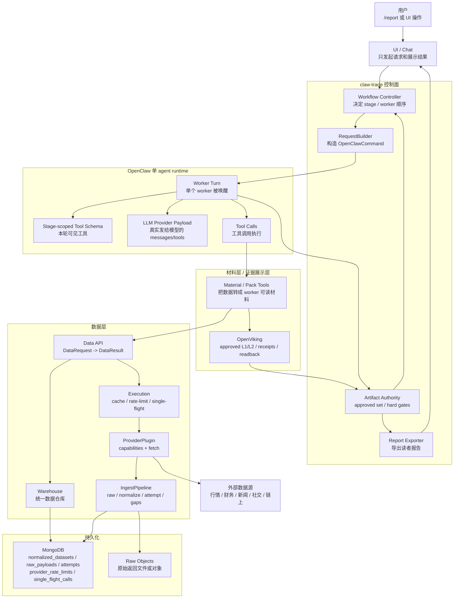
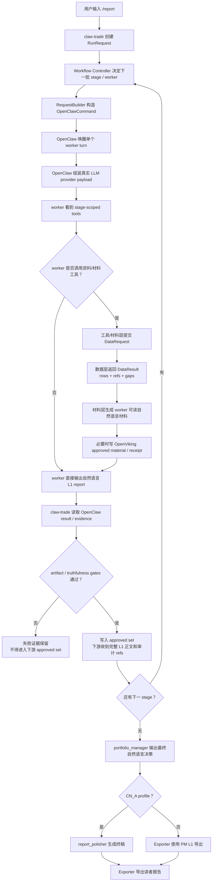
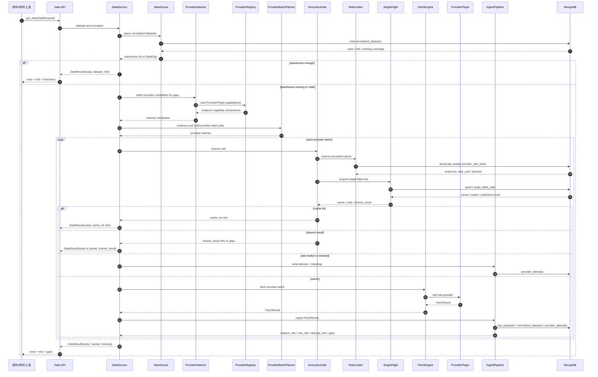

# claw-trade 架构设计

本文是当前架构入口：它归并旧文档中的控制面边界、运行时分工、资料层布局和部署口径，但不是旧文档全文替代。删除前旧文档全文已恢复到 `docs/reference/legacy/`，索引见 [旧文档恢复索引](reference/legacy/README.md)。

## 1. 总体结论

claw-trade 是 TradingAgents 风格投资研究工作流的控制面。

核心分工：

- claw-trade 负责流程状态机、worker 调度、artifact 权威、hard gate、报告导出。
- OpenClaw 负责单个 agent turn 的真实运行、LLM provider request、tool schema、tool call、LLM response。
- 数据层负责接收 `DataRequest`、查询仓库、必要时调用 provider、入库证据，并返回 `DataResult`。
- OpenViking 负责 approved material 的 L1/L2 证据存储和材料层证据展示。
- MongoDB 负责数据层统一数据仓库、raw 索引、attempt、限流、single-flight 和 provider-result cache 的持久化，不是 approved artifact 权威。

数据层新方向：OpenBB 本体不是必须依赖；保留的是 provider 插件、fetcher 流程、统一字段和能力声明思想。目标表名、运行时模块和证据链不再按 `openbb_*` 命名。

### 1.1 总体架构图



### 1.2 模块划分图

```mermaid
flowchart LR
  subgraph WorkflowModule["工作流模块"]
    RunRequest["RunRequest"]
    StageBatch["StageBatch"]
    Dispatch["Worker Dispatch"]
    State["Shared Workflow State"]
  end

  subgraph AgentConfigModule["Agent 配置模块"]
    AgentDir["agents/<worker>/"]
    PromptProfile["Prompt Profile"]
    StagePolicy["Stage Policy"]
    SkillManifest["Skill Manifest"]
  end

  subgraph RuntimeModule["OpenClaw 运行适配模块"]
    CommandAdapter["Command Adapter"]
    PayloadCapture["Provider Payload Capture"]
    ToolCapture["Visible Tools / Tool Calls Capture"]
    ResultReader["Result Reader"]
  end

  subgraph DataModule["数据层模块"]
    Interface["接口层\nDataRequest / DataResult"]
    Coordination["协调层\nDataService / QueryPlanner / Coalescer / BatchPlanner"]
    Repository["仓库层\nWarehouse / DatasetRepository / FreshnessChecker"]
    Execute["执行层\nExecutionGate / RateLimiter / FetchEngine / ManagedHttp"]
    ProviderLayer["插件层\nProviderRegistry / ProviderPlugin / capabilities"]
    Evidence["入库与证据层\nIngestPipeline / RawStore / Normalizer / AttemptLog / DataGap"]
  end

  subgraph MaterialModule["材料与 artifact 模块"]
    PackTools["资料包/材料工具"]
    Approval["Approval / Manifest"]
    OVClient["OpenViking Client"]
    Guards["Truthfulness / Artifact Guards"]
  end

  subgraph ExportModule["报告导出模块"]
    FinalReport["report_polisher / final_report"]
    Assets["Chart / Asset Handling"]
    ReaderExport["Markdown / PDF / UI Output"]
  end

  WorkflowModule --> AgentConfigModule
  WorkflowModule --> RuntimeModule
  RuntimeModule --> MaterialModule
  MaterialModule --> DataModule
  DataModule --> MaterialModule
  MaterialModule --> WorkflowModule
  WorkflowModule --> ExportModule
  ExportModule --> MaterialModule
```



### 1.3 `/report` 端到端流程图



### 1.4 数据层补数时序图



## 2. 架构边界

### 2.1 claw-trade

claw-trade 拥有：

- `/report` 工作流入口。
- 基础 profile 的 12-worker DAG，以及 `CN_A` 扩展 profile 的 7-frontline + downstream + final_report DAG。
- worker wake 顺序。
- Stage policy。
- OpenClaw command 构造。
- OpenClaw result 读取。
- OpenViking approved manifest。
- hard gate。
- CN_A 的 PM 后 `report_polisher/final_report` 终稿 worker 调度。
- report export。

claw-trade 不拥有：

- 单 agent provider prompt 最终组装。
- LLM 工具调用过程。
- worker 的自然语言投资判断。

### 2.2 OpenClaw

OpenClaw 拥有：

- agent workspace。
- skill/tool 挂载。
- 单 worker final LLM provider payload。
- tool schema 暴露。
- tool call 执行。
- first response 和 raw output。
- LLM provider stream 适配。

OpenClaw 只允许承载通用 runtime seam，不允许写入 claw-trade 业务 DAG、投资逻辑或 PM 决策逻辑。

### 2.3 OpenViking

OpenViking 拥有：

- material storage。
- L1/L2 index。
- receipts。
- approved artifact 查询。

写入失败不能被伪装成成功 ref。

OpenViking 不属于数据层核心，也不做：

- provider cache。
- provider 限流。
- raw / normalized 主仓库。
- 外部 provider 调用。

### 2.4 MongoDB

MongoDB 负责：

- `normalized_datasets` 等统一数据仓库。
- `raw_payloads` 等 raw 索引。
- `provider_attempts` 等 provider 调用事实。
- provider-result cache、freshness / TTL。
- `provider_rate_limits` 等限流状态。
- `single_flight_calls` 等并发去重状态。

MongoDB 不负责：

- approved artifact 权威。
- final report 权威。
- PM 决策权威。
- worker 资料包生成。

## 3. 工作流

基础 profile（US/HK/CRYPTO）阶段如下：

```text
frontline:
  market_analyst
  fundamental_analyst
  news_analyst
  social_analyst

investment_debate:
  bull_researcher
  bear_researcher

investment_decision:
  research_manager

trade_decision:
  trader

risk_debate:
  risk_challenger
  risk_guardian
  risk_moderator

portfolio_decision:
  portfolio_manager
```

`CN_A` 扩展 profile 在 frontline 增加 3 个 worker，形成 7-frontline + downstream + final_report：

```text
frontline:
  market_analyst
  fundamental_analyst
  news_analyst
  social_analyst
  policy_analyst
  hot_money_tracker
  lockup_watcher

investment_debate:
  bull_researcher
  bear_researcher

investment_decision:
  research_manager

trade_decision:
  trader

risk_debate:
  risk_challenger
  risk_guardian
  risk_moderator

portfolio_decision:
  portfolio_manager

final_report:
  report_polisher
```

LLM 不能决定下一步谁运行；claw-trade controller 决定。

## 4. 高层数据流

```text
User /report
  -> claw-trade RunRequest
  -> Workflow controller decides next StageBatch
  -> RequestBuilder builds OpenClawCommand
  -> OpenClaw wakes one worker
  -> worker sees stage-scoped tools
  -> worker calls stage-scoped tools as needed
  -> tool/material layer submits DataRequest to data layer when it needs external or warehouse data
  -> data layer returns DataResult(rows + dataset_refs/raw_refs/attempt_refs/gaps)
  -> tool/material layer may write approved material to OpenViking
  -> OpenClaw returns evidence bundle
  -> worker report/material enters approved set
  -> next stage receives approved L1 report text, with refs/capabilities for audit and L2 deep-read
  -> CN_A after portfolio_manager enters report_polisher / final_report
  -> final exporter writes reader-facing report
```

frontline（基础 profile 的 4 个或 `CN_A` 的 7 个）完成后，流程进入 CN/原版投资辩论顺序：`bull_researcher` 先发言，`bear_researcher` 在 prompt 中直接看到 bull 的已批准完整报告正文后反驳；不新增总 gate。

后半段同样按 TradingAgents-CN 串行轮转：`research_manager -> trader -> risk_challenger -> risk_guardian -> risk_moderator -> portfolio_manager`。其中风险辩论不是 collect-first 并列批次，也不是新增 gate；而是接力式调度：保守看激进，中性看激进+保守，再交给最终组合决策。

CN_A 在 `portfolio_manager` 输出最终自然语言决策 L1 后，必须进入 `report_polisher` 所属 `final_report` stage，再由 exporter 输出读者报告。`report_polisher` 是终稿 worker，不是 frontline worker；CN_A frontline 仍固定为 7 个。

## 5. Worker 与 prompt 架构

worker 配置在 `agents/<worker>/` 下。

每个 worker 目录包含：

- identity / role 文件。
- stage policy。
- prompt profile。
- skill manifest。
- stage skill。
- market profile prompt。

Prompt 原则：

- CN_A prompt 对齐 TradingAgents-CN。
- US prompt 对齐原版 TradingAgents。
- HK / CRYPTO 无明确策略时 fail，不自动 fallback。
- Python 只注入 ticker、company、market、currency、date range 等运行变量。
- Python 不把工程协议、debug JSON、控制流日志塞进 worker user prompt。
- 原版对齐包含角色权限、报告结构、辩论强度、交易建议表达和 analyst voice；不能只对齐工具名或字段。
- Portfolio manager 最终裁决权只限制 Python/exporter 不改写 PM 结论，不限制非 PM worker 发表 baseline 允许且证据支持的 BUY/HOLD/SELL、final proposition、风险判断或强观点。
- Truthfulness guard 只能防编造；不能把 worker prompt 改成审慎、合规、limitation-first 或 memo 化风格。

## 6. Tool / skill 架构

工具由 worker skill 暴露，stage policy 决定本轮可见工具。

CN_A frontline 当前工具族：

- market：`cn-a-market-data`、`alphaear-stock`、`alphaear-techlab`。
- fundamental：`cn-a-fundamental-data`。
- news：`cn-a-news-data`。
- social：`cn-a-social-data`。
- OpenViking：read/write approved material 工具。

工具层边界：

- worker 工具可以触发资料收集或材料读写，但数据层本身不生成 worker 资料包。
- 数据层只接收 `DataRequest`，只返回 `DataResult`。
- report 决定缺数据是否继续写；select 决定缺字段是否失败；UI 决定怎么展示。
- 数据层不得因为调用方是 report、select、UI 或 alert 而绕开统一入口。

CRYPTO / CryptoLens 接入口径：

- 加密币稳定数据源总体方案见 [CRYPTO 数据源总体方案](crypto_data_source_plan.md)。
- CryptoLens 迁入和数据层边界见 [CryptoLens 接入方案](CryptoLens接入方案.md)。
- CryptoLens 是从旧 BB 项目迁入本仓库的 CRYPTO 指标分析引擎，不是数据源、provider、外部 MCP、第 13 个 worker 或 PM/trader 决策器。
- `crypto-trading-analysis` skill 负责加密币指标分析纪律：覆盖指标、解释信号、暴露 `readiness/data_gaps/conflicts/sources`，并提示 worker 不把缺失指标写成已覆盖。
- `claw_get_market_pack` 是 CRYPTO `market_analyst` 的唯一市场资料包入口；资料包层向数据层提交 `DataRequest`，数据层负责外部 provider 取数、raw/normalized evidence、cache、attempt 和 data gaps。
- CRYPTO market pack 的目标链路是：`claw_get_market_pack -> 数据层 DataRequest/DataResult -> normalized crypto data -> CryptoLens analysis engine -> reader_brief`。
- CRYPTO `market_analyst` stage 不直接暴露 `bb_crypto_data__build_trade_context`、CryptoLens raw tool、旧 BB MCP 原子工具或 OpenBB atomic/admin/discovery tools。
- 投资辩论、交易、风险和 PM worker 不得直接调用 CryptoLens、旧 BB MCP、旧 OpenBB 原子工具或数据层 provider 插件；它们消费前线 worker 已批准的 L1 自然语言报告。
- CryptoLens 的 `readiness/data_gaps` 是 worker 可解释的数据质量材料，不是 claw-trade 新 runtime gate。

工具命名使用下划线风格，避免 provider 对点号工具名兼容性问题。

## 7. 数据层与 Provider 架构

数据层总体设计见 [数据层总体设计](数据层总体设计.md)。本文件只记录架构入口级边界。

数据层运行时分 6 层：

```text
接口层 -> 协调层 -> 仓库层 -> 执行层 -> 插件层 -> 入库与证据层
```

运行顺序：

```text
接口校验/规范化
-> 仓库检查
-> 缺口选择 provider
-> 读取 ProviderPlugin.capabilities()
-> 同源去重/分组
-> 按 capability 生成 provider 级 batch plan
-> ExecutionGate 检查 provider-result cache / 限流 / single-flight
-> FetchEngine 调 ProviderPlugin
-> IngestPipeline 写 raw、normalized、attempt 和 gaps
-> 返回 DataResult
```

数据层只做：

- 查统一数据仓库。
- 调真实 provider。
- 保存 raw 索引。
- 清洗成统一数据集。
- 写 provider attempt、rate-limit、single-flight、cache 等运行事实。
- 返回 `rows`、`dataset_refs`、`raw_refs`、`attempt_refs`、`gaps`。

数据层不做：

- 写报告。
- 生成 worker 资料包。
- 决定 report 是否继续。
- 决定 select 是否失败。
- 调用或写入 OpenViking approved material。
- 把 cache/shared/rate-limit 写成 remote success。

Provider 能力是 `ProviderPlugin` 的属性，不是独立顶层业务模块。能力声明必须覆盖 endpoint、市场、字段、粒度、source role、凭证、许可、限流和批量策略。

批量调用要求：

- 是否支持批量必须由 `ProviderPlugin.capabilities()` 明确声明。
- 批量策略至少声明 `supports_batch`、`batch_by`、`max_symbols_per_call`、`max_days_per_call`、`mergeable_fields`、`pagination_policy`、`split_policy`。
- 数据层不能猜某 provider 或 endpoint 能不能批量。
- 同一 provider 支持批量时，应合并请求，减少 HTTP 次数。

限流和并发要求：

- 限流按 provider、endpoint、credential scope 和 window 持久化。
- 支持 `safety_margin`，例如 1 分钟 10 次可主动最多发 9 次，或发满 10 次后等待下一窗口。
- single-flight 必须持久化，同一请求并发时只有一个 owner 出网，其它调用等待 `shared_result`。

统一数据集按业务语义命名，不按 provider 命名。`daily_bar` 可服务 A 股、美股、港股和加密币，差异放在 `market`、`symbol_id`、`exchange`、`currency`、`timezone`、`calendar`、`base_asset`、`quote_asset`、`provider_lineage`、`as_of` 等字段里。加密币专属数据集只用于链上或衍生品指标。

首批目标市场：

| 市场 | 运行形态 |
| --- | --- |
| A 股 | report + select，select 需要全市场仓库 |
| 美股 | report，后续可扩展 select |
| 港股 | report，后续可扩展 select |
| 加密币 | report，select 是目标能力 |

CN_A 默认按 `a-stock-data` 已整理的系统源用途矩阵走数据层 provider 插件：公告、新闻、行情、财务、资金、筹码各有对应作用域与 coverage_group，不得跨作用域冒充或替代；Tushare 仅作为用户配置源，在用户完成配置、验证并启用后，才在同一 `market/domain/source_role/coverage_group` 内参与优先级排序。

后台数据维护能力单独存在，用于 seed 导入、每日增量、数据修复。它复用同一套 provider 插件、`IngestPipeline` 入库和 `AttemptLog` 证据链，但不是 report/select 运行时路径。

## 8. Artifact 架构

每个 worker 输出 canonical report。

进入下游前必须通过：

- workspace evidence guard。
- provider request guard。
- visible tools guard。
- tool calls guard。
- OpenViking receipt guard。
- L1/L2 guard。
- artifact flow guard：目标模块是 `src/claw_trade/guards/artifact_flow.py`，目标函数是 `validate_artifact_flow(call, manifest)`；它应检查下游必需上游材料、stage 合法上游、frontline 不带上游材料、`l2_index_uri` 与 `l2_allowed_prefix` 是否和 approved manifest 一致。该 guard 属于 runtime guard，未获明确批准前不能为了测试通过而新增或恢复。
- claim / export claim guard。

PM 最终裁决边界：

- 所有已批准 profile 的最终裁决权威来源都是 `portfolio_manager` 的已批准自然语言 L1 report。
- 系统只认 PM 已批准自然语言 L1 report，不要求额外机器裁决文件。
- 无论哪种 profile，Python/exporter 都不能改写 PM 的结论。

Hard-gate-failed artifact 不能进入：

- shared state。
- PM material。
- final report。
- 后续 worker prompt。

## 9. 图表与图片架构

图片不进入 worker 主传递链。

Market 工具可以生成图表资产，图表作为 tool evidence 存在。最终报告导出阶段负责：

- 从 OpenClaw call evidence 中发现图表。
- 复制到 final report 的 assets 目录。
- 在 Markdown 中引用相对路径。
- `CN_A` 下若图表资产缺失或复制失败，必须保留 export/product 失败证据，但不回写为 12-worker workflow 或 PM 决策失败。

报告生成后如清理临时图片，必须同步清理 OpenViking 中已失效图片引用。

## 10. OpenClaw runtime seam

OpenClaw 的 claw-trade 通用接缝包括：

- per-turn tool narrowing。
- final provider request capture。
- visible tools capture。
- first response capture。
- raw output capture。
- tool call recorder。
- OpenViking runtime tool adapter。
- single-worker minimal system context。

这些能力必须保持通用，不绑定 claw-trade 业务 DAG。

## 11. 本地 runtime 架构

本地 runtime 由 `scripts/start-control-runtime.sh` 启动，包含：

- OpenClaw gateway。
- OpenViking server。
- 必要环境变量。
- runtime state / pid / log。

OpenClaw 源码变更后，必须：

```text
cd third_party/openclaw
pnpm build
cd /home/frank/src/claw-trade
scripts/start-control-runtime.sh
```

只改源码不重构 `dist`，不能证明 live runtime 行为已改变。

## 12. 目录结构

关键目录：

```text
agents/                         worker 配置、prompt、skills
openclaw_plugins/               claw-trade OpenClaw 插件
src/claw_trade/workflow/        controller、runner、state
src/claw_trade/runtime/         OpenClaw request/result 适配
src/claw_trade/artifacts/       material refs、approval、OpenViking client
src/claw_trade/guards/          hard gates
src/claw_trade/reports/         final report exporter
src/claw_trade/data_gateway/    DataRequest/DataResult、仓库、执行、插件、入库证据
tests/                          unit/contract/integration
third_party/openclaw/           OpenClaw 子仓库
third_party/openviking/         OpenViking 子仓库
docs/evidence/                  CN baseline 与运行证据
memory/                         项目日志
```

## 13. 配置与 secrets

本地 secrets 放 `.env.local`，不提交。

模板放 `.env.example`，只保留空 key 或示例占位。

关键变量：

- `TUSHARE_TOKEN`
- `TUSHARE_HTTP_URL`
- `CN_A_TUSHARE_HTTP_URL`
- `CN_A_MONGODB_URI`
- `CN_A_MONGODB_DATABASE`
- `CN_A_NEWS_BOCHA_API_KEY`
- `CN_A_NEWS_TAVILY_API_KEY`
- `JINA_API_KEY`
- `CN_A_NEWS_NEWSNOW_API_KEY`
- `CN_A_NEWS_MINIMAX_API_KEY`
- `CN_A_NEWS_MINIMAX_BASE_URL=https://api.minimaxi.com/v1`
- `CN_A_NEWS_MINIMAX_MODEL=MiniMax-M2.7`
- `DEEPSEEK_API_KEY`

CRYPTO provider 配置沿用旧 BB 项目中已经跑通的 key 名称，先放在 `.env.local`，未来 UI 设置页应复用同一组字段。读取方必须是数据层 provider 插件，CryptoLens 不读取 key：

- `COINGECKO_PRO_API_KEY`
- `COINGECKO_DEMO_API_KEY`
- `COINGLASS_API_KEY`
- `COINGLASS_API_BASE`
- `COINGLASS_API_HEADER_NAME`
- `GLASSNODE_API_KEY`
- `FRED_API_KEY`
- `TAVILY_API_KEY`
- `EXA_API_KEY`
- `BRAVE_SEARCH_API_KEY`
- `BOCHA_API_KEY`
- `NEWSAPI_API_KEY`
- `SERPAPI_API_KEY`
- `DEFILLAMA_API_KEY`
- `GITHUB_TOKEN`
- `CRYPTO_NEWS_OFFICIAL_SOURCES_JSON`
- `CRYPTO_NEWS_GITHUB_REPOS_JSON`
- `CRYPTO_NEWS_EXCHANGE_SOURCES_JSON`
- `CRYPTO_NEWS_REGULATORY_SOURCES_JSON`
- `LUNARCRUSH_API_KEY`
- `X_BEARER_TOKEN`
- `TWITTER_BEARER_TOKEN`
- `REDDIT_BEARER_TOKEN`
- `TELEGRAM_BOT_TOKEN`
- `DISCORD_BOT_TOKEN`
- `CRYPTO_SOCIAL_DISCORD_CHANNEL_IDS_JSON`
- `CRYPTO_MARKET_BINANCE_BASE_URL`
- `CRYPTO_MARKET_BINANCE_SYMBOL_OVERRIDES_JSON`
- `CRYPTO_MARKET_QUOTE_ASSET`
- `CRYPTO_MARKET_INTERVAL`
- `CMC_API_KEY`
- `CRYPTOQUANT_API_KEY`
- `ETHERSCAN_API_KEY`
- `THEGRAPH_ACCESS_TOKEN`

历史旧 BB MCP 曾直接读取这些环境变量；目标 report runtime 不再依赖外部 BB MCP，也不得让 CryptoLens 读取这些 key。缺 key 时只能由数据层记为 provider credential missing 或数据缺口，不能伪装成完整数据。

目标态是 `claw_get_market_pack` 内部经数据层 provider 插件获取 CRYPTO 市场资料，写 raw/normalized/attempt 证据，再把 normalized data 交给 CryptoLens 离线分析。它不能把 CoinGlass、Binance、Bybit、FRED、AHR999 等缺失域补写成已覆盖；缺失必须进入 `data_gaps`。

当前 `claw_get_news_pack` / `claw_get_social_pack`（旧实现名 `crypto_news_data_pack` / `crypto_social_sentiment_pack` 仅作迁移盘点）的 provider 采用可选 key / 可选配置策略：有 credential/config 才调用对应 provider；缺 key、缺 URL 清单、缺频道清单或 provider 失败时不发起假调用，必须在资料包内记录为 `config_blocked` / `credential_missing` / `error` 或同等 provider attempt，并进入 `data_gaps`。这不是静默 fallback，也不能让新闻或舆情覆盖看起来完整。

Scrapling 当前不接入；没有 Scrapling 工具、MCP、provider 或 stage 依赖。未来如需接入，只能作为指定公开页面提取工具另行评审，不能当新闻源或舆情源。

CoinGlass 当前使用 Keystore 代理入口：

- `COINGLASS_API_BASE=https://proxy.keystore.com.cn/api/v1/proxy/coinglass`
- `COINGLASS_API_HEADER_NAME=X-Api-Key`

`COINGLASS_API_KEY` 只放 `.env.local` 或未来 UI secret store，不写入文档。数据层 CoinGlass provider 插件会在代理根地址后自动拼接 `/v3/api` 或 `/v4/api`；V4 是默认优先版本，V3 只用于老接口。

旧 BB / CryptoLens 迁移期变量边界：

- `BB_PROVIDER_TIMEOUT_MS`
- `BB_PROVIDER_RETRY_ATTEMPTS`
- `BB_PROVIDER_RETRY_DELAY_MS`
- `BB_COINGLASS_CONTEXT_BUDGET=10`
- `BB_COINGLASS_RATE_LIMIT_PER_MINUTE=10`
- `BB_COINGLASS_RATE_LIMIT_WINDOW_MS=60000`
- `BB_MCP_HTTP_HOST`
- `BB_MCP_HTTP_PORT`
- `BB_MCP_HTTP_PATH`
- `BB_MCP_SERVER_PATH=/mnt/d/src/BB/mcp/crypto-data-mcp/dist/server.js`
- `BB_MCP_CWD=/mnt/d/src/BB/mcp/crypto-data-mcp`

其中 `BB_PROVIDER_*`、`BB_COINGLASS_*`、`BB_MCP_*` 和 `/mnt/d/src/BB` 只允许用于迁移期只读盘点、历史对照和本地排障；目标 report runtime 不得依赖外部 BB MCP、Win11 旧 BB 目录或旧 BB 自身取数配置。

## 14. 证据与审计架构

开发阶段保留 provider request、tool call、raw output 等证据，用于 debug 和对齐。

真实 worker 间主链不依赖 JSON 审计文件；worker 之间传递的是 approved natural-language report / approved material reference。

## 15. Git 与子仓库架构

`third_party/openclaw` 是独立 Git 子仓库。提交顺序：

1. 在 OpenClaw 子仓库提交 runtime seam。
2. 推送 OpenClaw 分支。
3. 在 claw-trade 提交更新后的子模块指针。
4. 推送 claw-trade。

如果第 2 步没推送，主仓库引用的子模块提交在远端不可取。

## 16. 历史来源与整合边界

本文件整合的是架构层结论，不展开旧文档全文。完整旧源文见 [旧文档恢复索引](reference/legacy/README.md)。

架构层直接来源：

- [control迁移方案.md](reference/legacy/control迁移方案.md)
- [control详细设计方案.md](reference/legacy/control详细设计方案.md)
- [current_workflow_inventory.md](reference/legacy/current_workflow_inventory.md)
- [frontline工具资料包改造说明.md](reference/legacy/frontline工具资料包改造说明.md)
- [CN_A_frontline_provider矩阵资料层落地方案.md](reference/legacy/CN_A_frontline_provider矩阵资料层落地方案.md)
- [CN_A_fundamental数据服务层总体设计.md](reference/legacy/CN_A_fundamental数据服务层总体设计.md)
- [CN_A_news数据服务层设计方案.md](reference/legacy/CN_A_news数据服务层设计方案.md)
- [CN_A_social数据服务层设计方案.md](reference/legacy/CN_A_social数据服务层设计方案.md)
- [dev_mongodb_tushare_setup.md](reference/legacy/dev_mongodb_tushare_setup.md)
