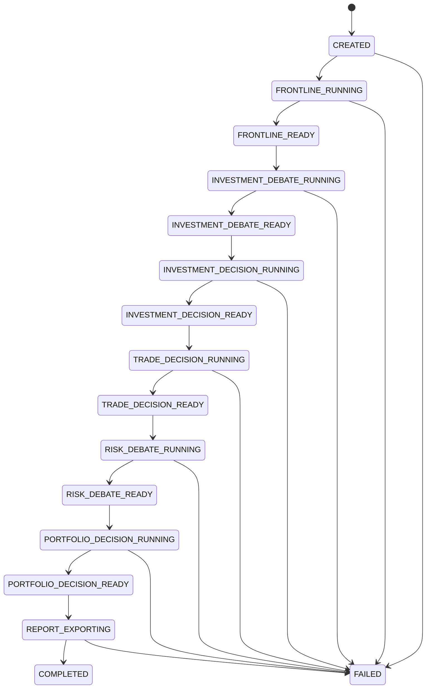
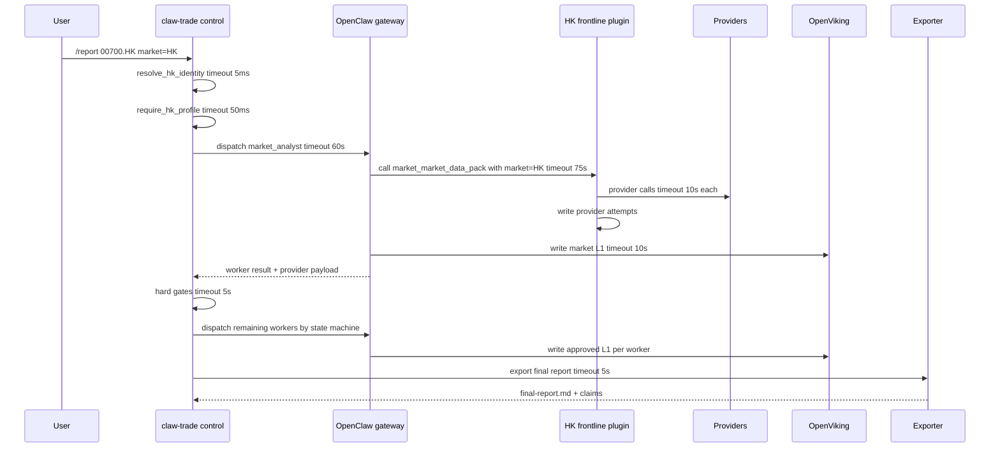

# 港股详细设计文档

## 1. 文档元信息

- 对应总体设计文档：`docs/港股总体设计.md`
- 对应总体设计版本：状态为“总体设计，待实施”的当前版本
- 详细设计版本号：DLD-HK-2026-05-14-v1
- 详细设计状态：实施中；HK runtime profile 已按 2026-05-15 人工指令打开，live provider payload 验证仍需完成
- 变更历史：
  - 2026-05-14：Initial
  - 2026-05-15：根据人工指令批准 HK runtime profile 进入实跑验证

本文把 `docs/港股总体设计.md` 中的结论、约束、模块和验收要求落到可编码设计。凡是 HLD 未给出可执行信息，本文显式标注 `[HLD-GAP]`；凡是实现依赖外部账号、接口权限或真实运行证据，本文显式标注 `[BLOCKED: 原因]`。这些标记不是绕过项，相关能力在解除阻塞前不得声明完成。

## 2. 术语表与约定

对应 HLD §1、§3.1、§4、§5、§6、§7。

| 术语 | 含义 |
|---|---|
| HK profile | 港股独立市场 profile，不能套用 CN_A 或 US 的 prompt、工具、数据源验收口径 |
| market=HK | 控制面和工具调用中的港股市场值 |
| raw_ticker | 用户输入的原始标的字符串 |
| display_ticker | 报告展示给读者的标的，例如 `00700.HK` |
| canonical_ticker | workflow、artifact、manifest 使用的统一标的 |
| provider_symbol | provider 所需标的格式，例如 Tushare Pro `00700.HK`、Yahoo Finance `0700.HK` |
| default currency | 普通港股默认币种，值为 `HKD` |
| counter currency | 交易柜台真实币种，必须由标的、交易柜台或 provider evidence 支持 |
| approved L1 report | 已通过 claw-trade 校验的 worker 自然语言报告，是下游主要材料 |
| provider attempt | 每次 provider 调用尝试及其成功、失败、字段、时间、来源证据记录 |
| reader brief | 给 worker 阅读的资料包摘要，不替代 provider evidence |
| quality status | 资料包质量状态：`complete`、`partial`、`failed` |
| HKEXnews | 港交所披露易或同等官方公告来源，用于监管披露、业绩公告、停复牌和公司行动证据 |
| frontline workers | `market_analyst`、`fundamental_analyst`、`news_analyst`、`social_analyst` |
| downstream workers | bull/bear/research/trader/risk/PM 等后八个推理 worker |

约定：

- 目标语言：Python 3.12，使用 `dataclasses.dataclass(frozen=True)` 和标准类型标注；OpenClaw 插件入口仍为现有 Node.js 插件调用 Python 脚本的形态。
- 时间：所有 evidence、cache、manifest 时间字段使用 UTC ISO-8601。
- 金额：金额字段必须附带 `currency`；不允许只保存裸数值。
- 资料包状态：`complete` 表示核心字段达到 worker 可用标准；`partial` 表示有真实材料但缺关键字段；`failed` 表示无可用真实材料或关键依赖失败。
- HK 当前已批准进入运行路径；§9 验收完成前不得声明港股报告链路完成。

## 3. 系统上下文与部署视图

对应 HLD §1、§2、§3.2、§3.4、§3.5、§3.6、§9。

### 3.1 部署拓扑

```text
用户 / CLI / UI
  |
  | /report ticker market=HK
  v
claw-trade control process
  - 进程：uv run python -m claw_trade.cli.run_control
  - 责任：输入解析、profile gate、workflow state、OpenClaw dispatch、guard、manifest、export
  - 本地端口：无常驻 HTTP 端口
  |
  | HTTP 18789
  v
OpenClaw gateway
  - 进程：scripts/start-control-runtime.sh 启动
  - 责任：单 worker turn、最终 provider prompt、visible tool schema、tool calls、provider payload evidence
  |
  | OpenClaw plugin tool call
  v
claw-trade-frontline-tools plugin
  - 进程：OpenClaw 插件子进程调用 Python pack builder
  - 责任：HK 前线工具、provider 调用、资料包、provider attempt evidence
  |
  +--> Tushare Pro HTTPS / SDK
  +--> AkShare provider
  +--> Yahoo Finance provider
  +--> HKEXnews / 公司公告来源 [BLOCKED: HLD 未指定可编码 endpoint、认证、频率和字段合同]
  +--> Google News / 中文财经源 [HLD-GAP: HLD 未指定 provider 选择规则和调用合同]
  |
  | HTTP 1933
  v
OpenViking service
  - 责任：L1/L2 material 写入、receipt、access audit
  |
  v
MongoDB 27017
  - 责任：provider raw payload、normalized pack cache、quality cache
```

### 3.2 资源预估

| 节点 | CPU | 内存 | 磁盘 | 连接池 | 说明 |
|---|---:|---:|---:|---:|---|
| claw-trade control process | 1 vCPU | 512 MB | 每 run 50-300 MB evidence | OpenClaw 4 | 调度和校验为主 |
| OpenClaw gateway | 2 vCPU | 2 GB | 每 run 100-500 MB provider payload/tool evidence | provider 4 | 模型请求、工具调用、evidence 写入 |
| frontline plugin Python 子进程 | 1 vCPU/worker | 1 GB/worker | 图表和 raw payload 50-300 MB | provider 2/worker | market 图表可能占用较高 |
| OpenViking | 1 vCPU | 1 GB | L1/L2 material 长期保存 | HTTP 8 | receipt 缺失即失败 |
| MongoDB | 1-2 vCPU | 2 GB | dev 20 GB，prod 按 90 天缓存估算 | 20 | TTL 只清理缓存，不清理 approved artifact |

### 3.3 网络分区与端口

| 端口/通道 | 调用方 | 被调用方 | 超时 | 失败处理 |
|---|---|---|---:|---|
| 18789 HTTP | claw-trade | OpenClaw gateway | 60s worker dispatch；单 worker 总超时由 stage 配置决定 | 记录 `HK_OPENCLAW_CALL_FAILED` |
| 1933 HTTP | claw-trade / OpenClaw | OpenViking | 10s write/read；2 次指数退避 | receipt 缺失或写入失败为 hard fail |
| 27017 TCP | plugin Python | MongoDB | 2s connect，5s op | cache 失败不影响真实 provider 调用，但写 cache 失败要记 evidence |
| HTTPS | plugin Python | Tushare/AkShare/Yahoo/HKEXnews/新闻源 | 单 provider 10s，stage 总 45s | 每次失败写 provider attempt |

## 4. 模块详细设计

### 4.1 HK Profile 与 Stage Policy 模块

对应 HLD §1、§2、§3.1、§3.3、§3.4、§9、§10、§12。

#### 4.1.1 职责与边界

MUST：

- 保持 HK 为独立 profile。
- 在 HK prompt、tool policy、provider contract、live proof 通过前阻断 HK report run。
- 为 12 个 worker 加载 `agents/<worker>/prompts/HK.md` 和 `STAGES.yaml` 中 HK 配置。
- 前线四个 worker 只暴露 HK stage tools。
- 后八个 worker 在 baseline 为纯 LLM 推理时不向模型暴露 OpenViking 读写工具。

MUST NOT：

- 不得把 HK 改成 CN_A 或 US。
- 不得在 HK 未批准时继续生成完整成功报告。
- 不得让 Python 写 worker 业务 prompt。

依赖关系：

- `src/claw_trade/config/profiles.py` 在 run 启动前执行 profile gate。
- `src/claw_trade/config/stage_policy.py` 在 dispatch 前读取 worker 的 `STAGES.yaml`。
- `src/claw_trade/runtime/request_builder.py` 只把已批准 stage policy 转为 OpenClaw command。

#### 4.1.2 核心数据结构

```python
# Language: Python 3.12 dataclass
from dataclasses import dataclass
from typing import Literal

HkProfileStatus = Literal["unapproved", "approved"]
HkToolAccess = Literal["none", "stage_tools"]

@dataclass(frozen=True)
class HkProfilePolicy:
    profile: Literal["HK"]                 # 固定值 HK
    status: HkProfileStatus                # 当前为 unapproved；验收完成后才可为 approved
    default_currency: Literal["HKD"]       # 普通港股默认币种
    default_currency_symbol: Literal["HK$"]# 普通港股默认展示符号
    approval_source: str | None            # 批准证据文档路径；unapproved 时为 None
    live_proof_run_id: str | None          # 完整 fresh live run id；unapproved 时为 None

@dataclass(frozen=True)
class HkStagePolicy:
    worker_id: str                         # 12 个合法 worker id 之一
    stage: str                             # workflow stage
    profile: Literal["HK"]                 # 固定值 HK
    approved: bool                         # dispatch 允许条件
    prompt_path: str                       # agents/<worker>/prompts/HK.md
    allowed_tools: tuple[str, ...]         # 当前 worker 可见工具
    openviking_access: HkToolAccess        # 后八个推理 worker 为 none
    failure_reason: str | None             # approved=false 时必须非空
```

字段约束：

- `worker_id` 必须属于 §4.14 的 12-worker 顺序。
- `allowed_tools` 对 HK 前线 worker 复用现有 domain pack intent；模型可见工具名分别解析为 `market_market_data_pack`、`fundamental_fundamentals_data_pack`、`news_news_data_pack`、`social_social_sentiment_pack`；后八个 worker 必须为空 tuple。
- `approved=false` 时 `failure_reason` 必须说明缺少哪个批准条件。

#### 4.1.3 接口定义

内部接口：

```python
def require_hk_profile(policy: HkProfilePolicy) -> None
```

- 参数：`policy.profile == "HK"`。
- 返回：无。
- 错误码：
  - `HK_PROFILE_NOT_APPROVED`：`status != "approved"`。
  - `HK_PROFILE_APPROVAL_EVIDENCE_MISSING`：`status == "approved"` 但缺 `approval_source` 或 `live_proof_run_id`。
- 频次：每次 HK run 启动 1 次。

```python
def load_hk_stage_policy(worker_id: str, stage: str) -> HkStagePolicy
```

- 参数：`worker_id` 必须合法；`stage` 必须匹配 worker stage。
- 返回：HK stage policy。
- 错误码：
  - `HK_STAGE_POLICY_MISSING`
  - `HK_PROMPT_NOT_APPROVED`
  - `HK_TOOL_POLICY_INVALID`
- 频次：每个 worker dispatch 1 次。

#### 4.1.4 核心算法与业务流程

```text
FUNCTION StartHkReportRun(request):
    identity = ResolveHkIdentity(request.ticker, request.market_hint)
    IF identity.profile != "HK":
        RAISE HK_TICKER_PROFILE_MISMATCH

    profile_policy = LoadProfilePolicy("HK")
    IF profile_policy.status != "approved":
        RAISE HK_PROFILE_NOT_APPROVED
    IF profile_policy.approval_source IS NULL OR profile_policy.live_proof_run_id IS NULL:
        RAISE HK_PROFILE_APPROVAL_EVIDENCE_MISSING

    FOR EACH worker IN HK_12_WORKER_SEQUENCE:
        stage_policy = LoadStagePolicy(worker, "HK")
        IF stage_policy.approved IS FALSE:
            RAISE HK_PROMPT_NOT_APPROVED(stage_policy.failure_reason)
        ValidateAllowedTools(worker, stage_policy.allowed_tools)

    CREATE WorkflowState(status=CREATED)
    RETURN WorkflowState
```

复杂度：O(12)。

#### 4.1.5 状态机

| 状态 | 合法转换 | 触发条件 |
|---|---|---|
| `unapproved` | `approved` | §9 验收全部通过，有人工批准证据 |
| `approved` | `unapproved` | prompt、tool、provider payload、live proof 失效或人工撤销 |

#### 4.1.6 错误处理策略

- profile 未批准：不可恢复，停止 run。
- stage policy 缺失：不可恢复，停止 run。
- prompt 文件缺失：不可恢复，停止 run。
- 单个 worker tool policy 错误：不可恢复，停止 run。
- 不做市场替代，不继续执行。

#### 4.1.7 数据存储设计

Profile approval 仍使用 repo 配置文件，不新增数据库表。批准证据写入：

```text
docs/evidence/hk_profile_approval/<run_id>/
```

必须包含：

- provider payload prompt evidence。
- visible tool schema evidence。
- 12 worker approved L1 manifest。
- final report。
- coverage check。

#### 4.1.8 非功能性设计

- P95 profile gate 延迟：< 50ms。
- 日志：`run_id`、`profile=HK`、`worker_id`、`stage`、`decision=blocked|approved`。
- 安全：不得记录 provider token；approval evidence 只记录 provider id、接口名和 request id。

### 4.2 输入与标的解析模块

对应 HLD §2、§3.1、§4、§7、§12。

#### 4.2.1 职责与边界

MUST：

- 识别 `0700`、`00700`、`0700.HK`、`00700.HK`、`market=HK + ticker=700/0700/00700`。
- 生成 `raw_ticker`、`display_ticker`、`canonical_ticker`、`provider_symbol`、`profile=HK`、`market=HK`。
- 普通港股设置 `default_currency=HKD`、`default_currency_symbol=HK$`。
- 保留 `counter_currency` 为待 provider evidence 确认的字段。

MUST NOT：

- 不做业务分析。
- 不把 4/5 位港股误判为 A 股。
- 不把 HK 输入改成 US。
- 不把人民币双柜台硬写成 HKD。

依赖关系：

- 被 CLI/UI input adapter 调用。
- 输出进入 `RunRequest` 和所有 HK provider calls。

#### 4.2.2 核心数据结构

```python
# Language: Python 3.12 dataclass
from dataclasses import dataclass
from typing import Literal

@dataclass(frozen=True)
class HkProviderSymbols:
    tushare_ts_code: str       # 5 位代码 + .HK，例如 00700.HK
    akshare_code: str          # 5 位数字，例如 00700
    yahoo_symbol: str          # 去左侧多余零后 + .HK，例如 0700.HK

@dataclass(frozen=True)
class HkInstrumentIdentity:
    raw_ticker: str            # 用户输入原文，非空
    display_ticker: str        # 报告展示，5 位 + .HK
    canonical_ticker: str      # workflow/artifact 主键，5 位 + .HK
    market: Literal["HK"]      # 固定 HK
    profile: Literal["HK"]     # 固定 HK
    default_currency: Literal["HKD"]
    default_currency_symbol: Literal["HK$"]
    counter_currency: str | None # provider evidence 确认后写入；未知为 None
    provider_symbols: HkProviderSymbols
```

字段约束：

- 数字代码长度输入可为 3、4、5；规范化后必须为 5 位。
- 显式 suffix 必须为 `.HK`；其他 suffix 不由本模块接收为 HK。
- `canonical_ticker` 与 `display_ticker` 一致。

#### 4.2.3 接口定义

```python
def resolve_hk_identity(raw_ticker: str, market_hint: str | None = None) -> HkInstrumentIdentity
```

- 参数约束：
  - `raw_ticker` 非空，长度 1-16，只允许字母、数字、点、短横线、下划线。
  - `market_hint` 为 `None` 或 `HK`。
- 返回：`HkInstrumentIdentity`。
- 错误码：
  - `HK_TICKER_REQUIRED`
  - `HK_TICKER_INVALID_CHARS`
  - `HK_TICKER_SUFFIX_INVALID`
  - `HK_TICKER_LENGTH_INVALID`
  - `HK_MARKET_HINT_CONFLICT`
- 频次：每次 `/report` 或 CLI run 1 次。

#### 4.2.4 核心算法与业务流程

```text
FUNCTION ResolveHkIdentity(raw_ticker, market_hint):
    ticker = Trim(raw_ticker)
    IF ticker IS EMPTY:
        RAISE HK_TICKER_REQUIRED
    IF ticker CONTAINS whitespace OR invalid chars:
        RAISE HK_TICKER_INVALID_CHARS

    normalized = Uppercase(ticker)
    IF normalized CONTAINS ".":
        code, suffix = SplitLastDot(normalized)
        IF suffix != "HK":
            RAISE HK_TICKER_SUFFIX_INVALID
    ELSE:
        code = normalized

    IF market_hint IS NOT NULL AND Uppercase(market_hint) != "HK":
        RAISE HK_MARKET_HINT_CONFLICT
    IF code IS NOT digits:
        RAISE HK_TICKER_INVALID_CHARS
    IF Len(code) NOT IN [3, 4, 5]:
        RAISE HK_TICKER_LENGTH_INVALID

    five = LeftPad(code, 5, "0")
    yahoo = StripLeadingZerosButKeepAtLeast4Digits(five) + ".HK"
    RETURN HkInstrumentIdentity(
        raw_ticker=raw_ticker,
        display_ticker=five + ".HK",
        canonical_ticker=five + ".HK",
        market="HK",
        profile="HK",
        default_currency="HKD",
        default_currency_symbol="HK$",
        counter_currency=NULL,
        provider_symbols=(five + ".HK", five, yahoo),
    )
```

复杂度：O(n)，n 为输入长度。

#### 4.2.5 状态机

不适用。解析函数为纯函数。

#### 4.2.6 错误处理策略

- 输入错误直接返回 4xx 类业务错误给 CLI/UI。
- profile 冲突直接阻断，不进入 workflow。
- 不重试。

#### 4.2.7 数据存储设计

解析结果进入 `RunRequest`、workflow state、provider evidence 和 manifest；不单独建表。

#### 4.2.8 非功能性设计

- P99 < 5ms。
- 日志只记录规范化后的 `canonical_ticker` 和错误码，不记录完整用户 prompt。

### 4.3 HK Prompt 配置模块

对应 HLD §3.3、§6、§8、§9、§12。

#### 4.3.1 职责与边界

MUST：

- 为 12 个 worker 提供 `agents/<worker>/prompts/HK.md`。
- 保留 TradingAgents / TradingAgents-CN 的角色、语气、报告结构和辩论感。
- 加入港股必要语境：港币、真实柜台货币、港交所交易语境、停复牌、交易单位、流动性、成交额、VCM、报价规则、港股通、H 股、红筹、双重上市、中概回港。
- 明确证据红线：不编造估值、目标价、新闻、情绪、图表、工具成功。

MUST NOT：

- 不把 prompt 改成工程 checklist。
- 不加入 runtime protocol、artifact URI、hash、provider payload、OpenClaw/OpenViking 协议字段。
- 不加入“避免建议”“默认保守”等非 baseline 风格规则。

依赖关系：

- stage policy 指向 prompt 文件。
- OpenClaw 渲染最终 provider prompt。
- provider payload capture 证明真实发送文本。

#### 4.3.2 核心数据结构

```python
# Language: Python 3.12 dataclass
from dataclasses import dataclass

@dataclass(frozen=True)
class HkPromptSpec:
    worker_id: str                 # 12 个合法 worker id 之一
    prompt_path: str               # agents/<worker>/prompts/HK.md
    baseline_source: str           # TradingAgents 或 TradingAgents-CN 对应来源证据路径
    profile: str                   # 固定 HK
    approved: bool                 # 人工批准后为 True
    required_runtime_vars: tuple[str, ...] # ticker/company/market/currency/date 等
    banned_runtime_terms: tuple[str, ...]  # protocol/debug/cache/provider attempt 等内部词

@dataclass(frozen=True)
class HkPromptRuntimeVars:
    ticker: str                    # canonical_ticker
    company_name: str              # provider 或用户确认名称，非空
    market: str                    # HK
    currency: str                  # HKD 或 provider 证据币种
    currency_symbol: str           # HK$ 或 provider 证据符号
    current_date: str              # YYYY-MM-DD
    start_date: str                # YYYY-MM-DD
    end_date: str                  # YYYY-MM-DD
```

#### 4.3.3 接口定义

```python
def load_hk_prompt_spec(worker_id: str) -> HkPromptSpec
```

- 错误码：`HK_PROMPT_FILE_MISSING`、`HK_PROMPT_BASELINE_MISSING`、`HK_PROMPT_NOT_APPROVED`。
- 频次：每 worker dispatch 1 次。

```python
def validate_hk_provider_prompt(worker_id: str, provider_messages_path: str) -> None
```

- 输入：OpenClaw 捕获的最终 provider request messages 文件路径。
- 返回：无。
- 错误码：
  - `HK_PROVIDER_PROMPT_MISSING`
  - `HK_PROVIDER_PROMPT_PROFILE_MISMATCH`
  - `HK_PROVIDER_PROMPT_PROTOCOL_LEAK`
  - `HK_PROVIDER_PROMPT_BASELINE_DRIFT`
- 频次：每 worker live proof 1 次。

#### 4.3.4 核心算法与业务流程

```text
FUNCTION ValidateHkPromptBeforeApproval(worker_id, prompt_spec, provider_messages):
    IF prompt_spec.approved IS FALSE:
        RAISE HK_PROMPT_NOT_APPROVED
    IF prompt_spec.baseline_source DOES NOT EXIST:
        RAISE HK_PROMPT_BASELINE_MISSING

    final_text = LoadProviderMessages(provider_messages)
    IF "profile: HK" not represented in final_text:
        RAISE HK_PROVIDER_PROMPT_PROFILE_MISMATCH
    IF final_text CONTAINS runtime protocol/debug/cache/provider attempt prose:
        RAISE HK_PROVIDER_PROMPT_PROTOCOL_LEAK
    IF worker_id IS downstream worker AND final_text lacks required upstream L1 natural-language sections:
        RAISE HK_PROVIDER_PROMPT_BASELINE_DRIFT

    RETURN OK
```

复杂度：O(m)，m 为 provider prompt 文本长度。

#### 4.3.5 状态机

| 状态 | 触发 | 下个状态 |
|---|---|---|
| `missing` | 创建 HK prompt 文件 | `draft` |
| `draft` | baseline 对齐和人工确认 | `approved` |
| `approved` | provider payload 证明失败 | `draft` |

#### 4.3.6 错误处理策略

- prompt 缺失、未批准、profile 不匹配：不可恢复。
- provider payload 缺失：不可恢复；必须重新跑真实 OpenClaw turn。
- 不通过静态渲染替代 provider payload evidence。

#### 4.3.7 数据存储设计

Prompt 配置在 repo 文件系统：

```text
agents/<worker>/prompts/HK.md
agents/<worker>/STAGES.yaml
docs/evidence/hk_prompt_alignment/<run_id>/<worker_id>/
```

#### 4.3.8 非功能性设计

- prompt 校验 P95 < 100ms。
- provider prompt evidence 必须保持原始文本，不压缩。
- 禁止日志记录 provider token。

### 4.4 HK Tool Schema 与 Frontline OpenClaw Plugin 模块

对应 HLD §3.4、§5.1、§5.2、§5.3、§5.4、§9。

#### 4.4.1 职责与边界

MUST：

- 在 `openclaw_plugins/claw-trade-frontline-tools/` 注册 HK 前线工具。
- 前线四个 worker 的能力边界固定，HK 复用现有 provider-visible domain pack 工具名：
  - `market_analyst -> market_market_data_pack`
  - `fundamental_analyst -> fundamental_fundamentals_data_pack`
  - `news_analyst -> news_news_data_pack`
  - `social_analyst -> social_social_sentiment_pack`
- 校验 `worker_id`、`market`、`profile`、`ticker`。
- 输出 worker 可读材料和 provider evidence。

MUST NOT：

- 不做万能多市场工具。
- 不在工具内部把 HK 改成其他市场。
- 不由 Python 替 worker 写报告。

依赖关系：

- OpenClaw gateway 调用插件。
- 插件调用 Python HK pack builders。
- pack builders 调用 provider executor。

#### 4.4.2 核心数据结构

```python
# Language: Python 3.12 dataclass
from dataclasses import dataclass

@dataclass(frozen=True)
class HkToolInput:
    ticker: str                 # canonical_ticker，5 位 + .HK
    market: str                 # 固定 HK
    profile: str                # 固定 HK
    start_date: str             # YYYY-MM-DD
    end_date: str               # YYYY-MM-DD
    company_name: str | None    # 已知公司名；未知可为 None

@dataclass(frozen=True)
class HkRuntimeContext:
    run_id: str                 # 非空
    call_id: str                # 非空
    worker_id: str              # 当前 worker
    stage: str                  # frontline
    evidence_dir: str           # 可写目录
    openviking_namespace: str   # run namespace

@dataclass(frozen=True)
class HkToolSchema:
    name: str                   # 已确认且真实注册的 provider-visible 工具名
    worker_id: str              # 绑定 worker
    required_fields: tuple[str, ...] # ticker, market, profile, start_date, end_date
    max_total_timeout_seconds: int   # 范围 [10, 180]
```

#### 4.4.3 接口定义

外部 OpenClaw tool 接口：

```text
tool: market_market_data_pack
request:
  ticker: string, required, pattern ^[0-9]{5}\.HK$
  market: string, required, enum ["HK"]
  profile: string, required, enum ["HK"]
  start_date: string, required, format YYYY-MM-DD
  end_date: string, required, format YYYY-MM-DD
  company_name: string, optional, length <= 128
response:
  status: "complete" | "partial" | "failed"
  reader_brief: string
  evidence_refs: list[EvidenceRef]
  provider_attempts: list[ProviderAttempt]
  domain_data: object
```

同形接口：`market_market_data_pack`、`fundamental_fundamentals_data_pack`、`news_news_data_pack`、`social_social_sentiment_pack`；工具根据 `market` 参数区分 CN_A/HK。

错误码：

- `HK_TOOL_MARKET_REQUIRED`
- `HK_TOOL_MARKET_INVALID`
- `HK_TOOL_WORKER_MISMATCH`
- `HK_TOOL_INPUT_INVALID`
- `HK_TOOL_TIMEOUT`
- `HK_TOOL_EVIDENCE_WRITE_FAILED`

频次：每 HK frontline worker 1-3 次，验收目标为每 worker 至少 1 次真实调用。

#### 4.4.4 核心算法与业务流程

```text
FUNCTION RunHkTool(tool_name, tool_input, runtime_context):
    schema = LoadToolSchema(tool_name)
    IF runtime_context.worker_id != schema.worker_id:
        RAISE HK_TOOL_WORKER_MISMATCH
    ValidateHkToolInput(tool_input)
    ValidateRuntimeContext(runtime_context)

    START timer(schema.max_total_timeout_seconds)
    pack = DispatchToPackBuilder(tool_name, tool_input, runtime_context)
    WriteProviderEvidence(pack.provider_attempts, runtime_context.evidence_dir)
    WritePackEvidence(pack, runtime_context.evidence_dir)

    IF pack.status == "failed":
        RETURN ToolResponse(status="failed", reader_brief=pack.reader_brief, evidence_refs=pack.refs)
    RETURN ToolResponse(status=pack.status, reader_brief=pack.reader_brief, evidence_refs=pack.refs, domain_data=pack.domain_data)
```

复杂度：由 provider 数量 p 和返回条数 r 决定，O(p + r)。

#### 4.4.5 状态机

| 状态 | 转换 | 条件 |
|---|---|---|
| `registered` | `called` | OpenClaw dispatch tool call |
| `called` | `provider_running` | input/runtime 校验通过 |
| `provider_running` | `evidence_written` | pack builder 返回 |
| `evidence_written` | `complete/partial/failed` | quality evaluator 判定 |

#### 4.4.6 错误处理策略

- input/runtime 校验失败：不可恢复，返回 failed tool result 并 hard fail worker。
- 单 provider 失败：记录 attempt，继续尝试同模块批准的后续 provider；最终 status 由 quality evaluator 判定。
- evidence 写入失败：不可恢复。
- 超时：停止未完成 provider，写 `HK_TOOL_TIMEOUT` attempt。

#### 4.4.7 数据存储设计

```text
runs/<run_id>/openclaw/<call_id>/pack-tool-evidence/hk/<tool_name>/
  provider-attempts.json
  pack.json
  reader-brief.md
  raw/
```

MongoDB 只存 cache；approved artifact 由 OpenViking 和 manifest 管理。

#### 4.4.8 非功能性设计

- 每个 tool 总 P95 < 45s；market 含图表 P95 < 75s。
- metrics：`hk_tool_calls_total`、`hk_tool_latency_ms`、`hk_provider_attempts_total`、`hk_tool_quality_status_total`。
- trace：span 名称 `hk.tool.<tool_name>`，属性包含 `run_id`、`call_id`、`worker_id`、`provider_count`。

### 4.5 Provider Attempt 与 Evidence 模块

对应 HLD §3.5、§3.6、§5、§9、§12。

#### 4.5.1 职责与边界

MUST：

- 记录每次 provider 调用尝试。
- 保存成功、失败、权限、频率、空数据、字段缺失、freshness、source refs。
- 让 reader report 不必展示全部细节，但审计证据必须完整。

MUST NOT：

- 不把一次 provider 成功包装成所有 provider 成功。
- 不覆盖早期失败 attempt。
- 不把 raw JSON 放入 downstream worker 主 prompt。

依赖关系：

- 被所有 HK provider 和 pack builder 调用。
- 被 guard、manifest、coverage check 读取。

#### 4.5.2 核心数据结构

```python
# Language: Python 3.12 dataclass
from dataclasses import dataclass
from typing import Literal, Any

ProviderStatus = Literal["success", "failed", "empty", "rate_limited", "permission_denied", "field_missing", "timeout"]

@dataclass(frozen=True)
class SourceRef:
    title: str | None              # 来源标题；无标题时为 None
    url: str | None                # 可追踪 URL；无 URL 时为 None
    published_at: str | None       # UTC ISO-8601；未知为 None
    provider_record_id: str | None # provider 原始 id

@dataclass(frozen=True)
class ProviderAttempt:
    provider: str                  # tushare_pro_hk, akshare_hk, yahoo_finance_hk, hkexnews 等
    api: str                       # hk_daily, hk_basic, search_announcements 等
    input_symbol: str              # provider_symbol
    status: ProviderStatus
    failure_reason: str | None     # failed/empty/rate_limited 等必须非空
    observed_rows: int | None      # 表格行数；不适用为 None
    observed_items: int | None     # 新闻/公告条数；不适用为 None
    freshness: str | None          # 数据最新日期或更新时间
    source_refs: tuple[SourceRef, ...]
    quality: str                   # complete/partial/failed 或字段级质量说明
    started_at: str                # UTC ISO-8601
    finished_at: str               # UTC ISO-8601
    raw_payload_ref: str | None    # raw payload evidence 路径
    request_id: str | None         # provider request id；provider 未给出时为 None
```

#### 4.5.3 接口定义

```python
def record_provider_attempt(attempt: ProviderAttempt, evidence_dir: str) -> str
```

- 返回：写入的 evidence 文件路径。
- 错误码：
  - `HK_PROVIDER_ATTEMPT_INVALID`
  - `HK_PROVIDER_EVIDENCE_WRITE_FAILED`
- 频次：每次 provider 调用 1 次。

```python
def load_provider_attempts(evidence_dir: str) -> tuple[ProviderAttempt, ...]
```

- 返回：按 `started_at` 排序的 attempts。
- 错误码：`HK_PROVIDER_EVIDENCE_MISSING`、`HK_PROVIDER_EVIDENCE_CORRUPT`。

#### 4.5.4 核心算法与业务流程

```text
FUNCTION ExecuteProviderWithEvidence(provider_call):
    attempt = StartAttempt(provider, api, input_symbol, started_at=NowUTC())
    TRY:
        result = provider_call(timeout=provider.timeout)
        IF result.rows == 0 AND result.items == 0:
            attempt.status = "empty"
            attempt.failure_reason = "provider returned no usable rows"
        ELSE IF RequiredFieldsMissing(result):
            attempt.status = "field_missing"
            attempt.failure_reason = ListMissingFields(result)
        ELSE:
            attempt.status = "success"
            attempt.failure_reason = NULL
        attempt.observed_rows = result.row_count
        attempt.observed_items = result.item_count
        attempt.freshness = ComputeFreshness(result)
        attempt.source_refs = ExtractSourceRefs(result)
        attempt.raw_payload_ref = WriteRawPayload(result)
    CATCH PermissionError:
        attempt.status = "permission_denied"
        attempt.failure_reason = ErrorMessage()
    CATCH RateLimitError:
        attempt.status = "rate_limited"
        attempt.failure_reason = ErrorMessage()
    CATCH TimeoutError:
        attempt.status = "timeout"
        attempt.failure_reason = ErrorMessage()
    CATCH ProviderError:
        attempt.status = "failed"
        attempt.failure_reason = ErrorMessage()
    FINALLY:
        attempt.finished_at = NowUTC()
        RecordProviderAttempt(attempt)
    RETURN attempt
```

复杂度：O(r)，r 为 provider 返回记录数。

#### 4.5.5 状态机

| 状态 | 终态 | 条件 |
|---|---|---|
| `started` | `success` | 核心字段存在且有可用数据 |
| `started` | `empty` | 返回无可用记录 |
| `started` | `field_missing` | 缺少必需字段 |
| `started` | `permission_denied` | token/权限/积分不足 |
| `started` | `rate_limited` | provider 明示频率限制 |
| `started` | `timeout` | 超过 provider timeout |
| `started` | `failed` | 其他 provider 异常 |

#### 4.5.6 错误处理策略

- provider 权限和频率错误：不可在同一 provider 立即重试；记录后尝试同模块批准的下一个 provider。
- 网络短错误：最多重试 2 次，间隔 1s、2s；每次重试写 attempt。
- evidence 写入失败：不可恢复，worker 失败。

#### 4.5.7 数据存储设计

MongoDB collection：`hk_provider_raw_payload`

```javascript
{
  run_id: string,
  call_id: string,
  provider: string,
  api: string,
  input_symbol: string,
  status: string,
  raw_payload: object,
  payload_hash: string,
  created_at: ISODate,
  expires_at: ISODate
}
```

索引：

- `{ provider: 1, api: 1, input_symbol: 1, created_at: -1 }`：provider 调试。
- `{ run_id: 1, call_id: 1 }`：run evidence 查找。
- `{ expires_at: 1 }` TTL：仅清理 raw cache。

#### 4.5.8 非功能性设计

- attempt 写入 P95 < 20ms。
- raw payload hash 使用 SHA-256。
- 日志脱敏：token、cookie、Authorization header 必须替换为 `***`。

### 4.6 Tushare Pro HK Provider 模块

对应 HLD §2、§3.6、§5.1、§5.2、§5.3、§5.4、§9、§10、§12。

#### 4.6.1 职责与边界

MUST：

- 以独立 provider id `tushare_pro_hk` 接入。
- 使用 Tushare 的港股 symbol 格式 `00700.HK`。
- 接口权限、字段、更新时间、币种、失败原因进入 evidence。
- 为 market/fundamental/stock-connect 类数据提供第一梯队结构化数据。

MUST NOT：

- 不混入通用 A 股 Tushare 工具。
- 不把港股代码转换成 A 股或美股格式。
- 不替代 HKEXnews 对公告原文的校验。

[BLOCKED: Tushare Pro 实际账号对 `hk_basic`、`hk_daily`、`hk_fina_indicator` 等接口的权限、字段和频率必须用真实账号验证后才能解除。]

#### 4.6.2 核心数据结构

```python
# Language: Python 3.12 dataclass
from dataclasses import dataclass

@dataclass(frozen=True)
class TushareHkBasicRow:
    ts_code: str             # 5 位 + .HK，非空
    name: str                # 公司简称，非空
    fullname: str | None     # 公司全称
    enname: str | None       # 英文名
    market: str | None       # 交易市场/板块
    list_status: str | None  # 上市状态
    list_date: str | None    # YYYYMMDD
    delist_date: str | None  # YYYYMMDD 或 None
    trade_unit: int | None   # 每手股数，必须来自 provider
    isin: str | None         # ISIN
    curr_type: str | None    # HKD/CNY/USD 等 provider 币种

@dataclass(frozen=True)
class TushareHkDailyRow:
    ts_code: str             # 5 位 + .HK
    trade_date: str          # YYYYMMDD
    open: float | None       # 开盘价
    high: float | None       # 最高价
    low: float | None        # 最低价
    close: float | None      # 收盘价
    pre_close: float | None  # 前收盘
    change: float | None     # 涨跌额
    pct_chg: float | None    # 涨跌幅
    vol: float | None        # 成交量
    amount: float | None     # 成交额
    currency: str | None     # 币种；缺失时不得推断为已证实柜台币种

@dataclass(frozen=True)
class TushareHkFinaIndicatorRow:
    ts_code: str
    ann_date: str | None     # 公告日期
    end_date: str            # 报告期
    eps: float | None
    roe: float | None
    gross_margin: float | None
    netprofit_margin: float | None
    debt_to_assets: float | None
    currency: str | None
```

#### 4.6.3 接口定义

```python
class TushareProHkProvider:
    def get_hk_basic(self, ts_code: str) -> tuple[TushareHkBasicRow, ProviderAttempt]: ...
    def get_hk_daily(self, ts_code: str, start_date: str, end_date: str) -> tuple[tuple[TushareHkDailyRow, ...], ProviderAttempt]: ...
    def get_hk_daily_adj(self, ts_code: str, start_date: str, end_date: str) -> tuple[tuple[TushareHkDailyRow, ...], ProviderAttempt]: ...
    def get_hk_fina_indicator(self, ts_code: str, start_date: str, end_date: str) -> tuple[tuple[TushareHkFinaIndicatorRow, ...], ProviderAttempt]: ...
```

参数约束：

- `ts_code` pattern：`^[0-9]{5}\.HK$`。
- `start_date/end_date`：`YYYYMMDD` 或由 provider adapter 转换自 `YYYY-MM-DD`。
- 日期范围：最多 5 年；超过则返回 `HK_TUSHARE_DATE_RANGE_TOO_LARGE`。

错误码：

- `HK_TUSHARE_TOKEN_MISSING`
- `HK_TUSHARE_PERMISSION_DENIED`
- `HK_TUSHARE_RATE_LIMITED`
- `HK_TUSHARE_EMPTY`
- `HK_TUSHARE_FIELD_MISSING`
- `HK_TUSHARE_SCHEMA_UNVERIFIED`

频次估计：

- 每 HK run：`hk_basic` 1 次，`hk_daily_adj` 1-2 次，`hk_fina_indicator` 1 次。
- 日调用量：单用户 dev < 100；prod 按 provider 权限单独配置。

#### 4.6.4 核心算法与业务流程

```text
FUNCTION GetTushareHkDaily(ts_code, start_date, end_date):
    IF TUSHARE_TOKEN missing:
        RAISE HK_TUSHARE_TOKEN_MISSING
    IF ts_code not match five_digit_dot_HK:
        RAISE HK_PROVIDER_SYMBOL_INVALID
    IF DateRangeTooLarge(start_date, end_date):
        RAISE HK_TUSHARE_DATE_RANGE_TOO_LARGE

    attempt = ExecuteProviderWithEvidence(
        provider="tushare_pro_hk",
        api="hk_daily",
        input_symbol=ts_code,
        call=pro.hk_daily(ts_code, start_date, end_date),
    )
    IF attempt.status != "success":
        RETURN rows=(), attempt

    rows = NormalizeDailyRows(attempt.raw_payload)
    missing = RequiredMissing(rows, ["ts_code", "trade_date", "close"])
    IF missing:
        MarkAttemptFieldMissing(attempt, missing)
        RETURN rows=(), attempt
    RETURN rows, attempt
```

复杂度：O(r)，r 为行情行数。

#### 4.6.5 状态机

同 §4.5 provider attempt 状态机。

#### 4.6.6 错误处理策略

- token 缺失：不可恢复，provider attempt 为 `permission_denied`。
- 权限或积分不足：不可恢复，进入 evidence，尝试同模块批准的其他 provider。
- 频率限制：不在同 run 内立即重复同接口。
- 字段缺失：该接口结果不可用于对应字段结论。

#### 4.6.7 数据存储设计

MongoDB collection：`hk_tushare_contract_cache`

```javascript
{
  provider: "tushare_pro_hk",
  api: string,
  ts_code: string,
  schema_hash: string,
  observed_fields: array,
  observed_rows: number,
  permission_status: string,
  last_verified_at: ISODate,
  expires_at: ISODate
}
```

索引：

- `{ api: 1, ts_code: 1, last_verified_at: -1 }`：接口验收。
- `{ expires_at: 1 }` TTL：30 天。

#### 4.6.8 非功能性设计

- 单接口 P95 < 10s。
- provider total timeout 45s。
- trace span：`hk.provider.tushare.<api>`。
- 安全：token 只从环境变量或部署环境的 secret 注入机制读取，不写入 evidence。

### 4.7 HKEXnews 与公司公告 Provider 模块

对应 HLD §3.6、§5.2、§5.3、§8、§9、§12。

#### 4.7.1 职责与边界

MUST：

- 为业绩公告、盈利警告、停复牌、配售、回购、关联交易、董事或审计事项提供监管披露证据。
- 在重大结论依赖公告事实时优先引用公告原文。
- 发现公告与新闻 provider 冲突时，以公告事实为准，并记录冲突。

MUST NOT：

- 不用新闻缺失推出“无重大事件”。
- 不让 Tushare 财务指标替代公告原文校验。

[HLD-GAP] HLD 未指定 HKEXnews 可编码接口、请求参数、认证方式、频率限制、返回字段和公告分类字典。建议批准一个明确实现合同后再编码：首选官方可稳定访问的 HTTPS 查询接口；若官方只提供页面查询，则需单独批准页面解析范围、频率和字段校验规则。

#### 4.7.2 核心数据结构

```python
# Language: Python 3.12 dataclass
from dataclasses import dataclass

@dataclass(frozen=True)
class HkAnnouncementQuery:
    ticker: str              # canonical_ticker
    company_name: str | None
    start_date: str          # YYYY-MM-DD
    end_date: str            # YYYY-MM-DD
    categories: tuple[str, ...] # results, profit_warning, halt, resumption, placing, buyback, connected_transaction

@dataclass(frozen=True)
class HkAnnouncementItem:
    title: str               # 公告标题，非空
    url: str                 # 公告详情或 PDF URL，非空
    published_at: str        # UTC ISO-8601 或交易所日期转换结果
    category: str            # 标准化分类
    issuer_name: str | None
    stock_code: str | None
    document_id: str | None
    source: str              # hkexnews 或 company_announcement
    relevance: str           # direct/company/weak
    raw_payload_ref: str | None
```

#### 4.7.3 接口定义

```python
class HkAnnouncementProvider:
    def search_announcements(self, query: HkAnnouncementQuery) -> tuple[tuple[HkAnnouncementItem, ...], ProviderAttempt]: ...
    def fetch_announcement_text(self, item: HkAnnouncementItem) -> tuple[str, ProviderAttempt]: ...
```

参数约束：

- 日期范围最多 18 个月；更长范围必须分片。
- `categories` 为空时默认覆盖 HLD 列出的重大披露类别。

错误码：

- `HK_ANNOUNCEMENT_PROVIDER_UNAPPROVED`
- `HK_ANNOUNCEMENT_QUERY_INVALID`
- `HK_ANNOUNCEMENT_EMPTY`
- `HK_ANNOUNCEMENT_FETCH_FAILED`
- `HK_ANNOUNCEMENT_RELEVANCE_WEAK`

频次：每 HK news/fundamental run 1-3 次查询；重大公告文本拉取按 item 数，默认最多 20 条。

#### 4.7.4 核心算法与业务流程

```text
FUNCTION SearchHkMaterialAnnouncements(query):
    IF ProviderContractApproved("hkexnews") IS FALSE:
        RAISE HK_ANNOUNCEMENT_PROVIDER_UNAPPROVED
    ValidateQuery(query)
    attempts = []
    items = []

    FOR EACH date_window IN SplitByMaxRange(query.start_date, query.end_date, 18 months):
        rows, attempt = ProviderSearch(date_window, query.categories)
        attempts.Append(attempt)
        IF attempt.status != "success":
            CONTINUE
        FOR EACH row IN rows:
            item = NormalizeAnnouncement(row)
            IF IsDirectMatch(item.stock_code, query.ticker, item.issuer_name, query.company_name):
                items.Append(item with relevance="direct")
            ELSE:
                RecordRejectedEvidence(item, reason="weak relevance")

    Deduplicate(items by document_id/url/title/date)
    RETURN items, attempts
```

复杂度：O(w + r)，w 为日期分片数，r 为公告记录数。

#### 4.7.5 状态机

同 §4.5 provider attempt 状态机，加一层 relevance：

| relevance | 使用规则 |
|---|---|
| `direct` | 可进入 approved evidence |
| `company` | 公司名强匹配但缺股票代码时可进入 evidence，需标注匹配依据 |
| `weak` | 只能进入 rejected evidence |

#### 4.7.6 错误处理策略

- provider contract 未批准：不可恢复；news/fundamental 只能标记公告链路阻塞，不能输出完整监管披露覆盖。
- fetch 文本失败：保留列表证据，但涉及公告细节的结论不得写。
- 相关性弱：不得进入 approved evidence。

#### 4.7.7 数据存储设计

MongoDB collection：`hk_announcements_cache`

```javascript
{
  ticker: string,
  company_name: string,
  source: string,
  document_id: string,
  title: string,
  url: string,
  published_at: ISODate,
  category: string,
  relevance: string,
  raw_payload_hash: string,
  created_at: ISODate,
  expires_at: ISODate
}
```

索引：

- `{ ticker: 1, published_at: -1, category: 1 }`
- `{ document_id: 1 }` unique where present。
- `{ expires_at: 1 }` TTL 90 天。

#### 4.7.8 非功能性设计

- 查询 P95 < 15s，文本 fetch P95 < 10s。
- logs：记录 category、item count、rejected count。
- 审计：公告原文 URL 和文本 hash 必须可追踪。

### 4.8 HK Market 数据服务模块

对应 HLD §5.1、§3.5、§3.6、§9、§12。

#### 4.8.1 职责与边界

MUST：

- 提供港股 OHLCV、交易日数量、当前价或最近收盘价、成交量/成交额、交易单位、币种、复权口径、更新时间、延迟状态、停复牌状态、异常缺口、低流动性提示。
- 计算均线、MACD、RSI、布林带。
- 生成图表或指标面板引用；缺失时记录根因。

MUST NOT：

- 不用空行情生成成功 market pack。
- 不伪造指标。
- 不把图表缺失写成模糊提醒。

依赖关系：

- Tushare Pro HK、AkShare HK、Yahoo Finance HK。
- TechLab chart adapter。
- provider attempt evidence。

#### 4.8.2 核心数据结构

```python
# Language: Python 3.12 dataclass
from dataclasses import dataclass

@dataclass(frozen=True)
class HkOhlcvBar:
    trade_date: str          # YYYY-MM-DD
    open: float
    high: float
    low: float
    close: float
    volume: float | None
    turnover: float | None
    currency: str | None
    adjusted: str            # none/qfq/hfq/provider_specific

@dataclass(frozen=True)
class HkTechnicalIndicators:
    ma5: float | None
    ma10: float | None
    ma20: float | None
    ma60: float | None
    macd: float | None
    macd_signal: float | None
    macd_hist: float | None
    rsi14: float | None
    boll_upper: float | None
    boll_middle: float | None
    boll_lower: float | None
    indicator_date: str | None

@dataclass(frozen=True)
class HkMarketDomainData:
    ticker: str
    bars: tuple[HkOhlcvBar, ...]
    latest_close: float | None
    latest_trade_date: str | None
    trade_day_count: int
    trade_unit: int | None
    currency: str | None
    suspension_status: str | None
    liquidity_warnings: tuple[str, ...]
    indicators: HkTechnicalIndicators
    chart_refs: tuple[str, ...]
    chart_missing_reason: str | None
```

字段约束：

- `bars` 为 `complete` 时至少 60 个交易日或覆盖请求窗口中全部可得交易日。
- `latest_close` 必须来自最后一个有效 bar。
- `chart_refs` 为空且图表应生成时，`chart_missing_reason` 必须非空。

#### 4.8.3 接口定义

```python
def run_hk_market_route(tool_input: HkToolInput, runtime_context: HkRuntimeContext) -> HkFrontlinePack[HkMarketDomainData]
```

返回：

```python
@dataclass(frozen=True)
class HkFrontlinePack[T]:
    profile: str
    ticker: str
    company_name: str | None
    date_range: tuple[str, str]
    quality_status: str
    provider_attempts: tuple[ProviderAttempt, ...]
    domain_data: T | None
    reader_brief: str
    evidence_refs: tuple[str, ...]
```

错误码：

- `HK_MARKET_OHLCV_EMPTY`
- `HK_MARKET_INDICATOR_MISSING`
- `HK_MARKET_CHART_MISSING`
- `HK_MARKET_CURRENCY_CONFLICT`
- `HK_MARKET_TRADE_UNIT_MISSING`

频次：每 HK market worker 1 次，必要时因 tool retry 最多 2 次。

#### 4.8.4 核心算法与业务流程

```text
FUNCTION BuildHkMarketPack(input, runtime):
    ValidateHkToolInput(input)
    attempts = []
    rows = []
    basic = NULL

    basic, basic_attempt = Tushare.get_hk_basic(input.ticker)
    attempts.Append(basic_attempt)

    FOR provider IN [Tushare.hk_daily_adj, AkShare.stock_hk_hist, EastMoney.push2his_kline, Yahoo.hk_history]:
        provider_rows, attempt = provider(input.provider_symbol, input.start_date, input.end_date)
        attempts.Append(attempt)
        IF attempt.status == "success" AND provider_rows not empty:
            rows = NormalizeOhlcv(provider_rows)
            BREAK

    IF rows is empty:
        RETURN failed_pack(HK_MARKET_OHLCV_EMPTY, attempts)

    indicators = ComputeIndicators(rows)
    missing_indicators = RequiredIndicatorsMissing(indicators)
    chart_refs, chart_error = GenerateMarketCharts(rows, indicators, runtime.evidence_dir)

    liquidity_warnings = EvaluateLiquidity(rows, turnover_threshold_config)
    suspension_status = InferSuspensionStatus(rows, basic, announcements_if_available)
    currency = ResolveCurrency(basic.curr_type, rows.currency)
    IF CurrencyConflictDetected(basic.curr_type, rows.currency):
        AddQualityIssue(HK_MARKET_CURRENCY_CONFLICT)

    status = "complete"
    IF missing_indicators OR chart_error OR currency is NULL OR basic.trade_unit is NULL:
        status = "partial"
    IF chart_expected AND chart_refs empty:
        chart_missing_reason = chart_error OR "chart generation returned no asset"

    RETURN pack(status, HkMarketDomainData(...), attempts)
```

复杂度：O(p + n)，p provider 数，n 行情行数。

#### 4.8.5 状态机

| quality_status | 判断条件 |
|---|---|
| `complete` | OHLCV 非空、latest close、成交量或成交额、trade unit、currency、核心指标、chart refs 均存在 |
| `partial` | OHLCV 可用但 trade unit、currency、部分指标或图表缺失，并有根因 |
| `failed` | OHLCV 为空或全部 provider 失败 |

#### 4.8.6 错误处理策略

- provider 失败：记录 attempt，尝试下一个批准 provider。
- 指标计算失败：pack 最多 `partial`，不得写具体指标值。
- 图表失败：pack 最多 `partial`，必须写 `chart_missing_reason`。
- OHLCV 为空：pack `failed`，worker 不得生成成功 market report。

#### 4.8.7 数据存储设计

MongoDB collection：`hk_market_pack_cache`

```javascript
{
  profile: "HK",
  ticker: string,
  start_date: string,
  end_date: string,
  provider_priority_hash: string,
  quality_status: string,
  latest_trade_date: string,
  pack_hash: string,
  pack_payload: object,
  created_at: ISODate,
  expires_at: ISODate
}
```

索引：

- `{ profile: 1, ticker: 1, start_date: 1, end_date: 1 }`
- `{ latest_trade_date: -1 }`
- `{ expires_at: 1 }` TTL 7 天。

#### 4.8.8 非功能性设计

- P95 < 75s，P99 < 120s。
- 指标计算内存 < 300 MB。
- metrics：`hk_market_pack_quality_total`、`hk_market_chart_missing_total`、`hk_market_provider_latency_ms`。
- 安全：raw provider payload 不进入 final report。

### 4.9 HK Fundamental 数据服务模块

对应 HLD §5.2、§3.6、§7、§9、§12。

#### 4.9.1 职责与边界

MUST：

- 提供公司名称、交易所、行业/板块、货币口径、交易单位、上市状态、上市日期、ISIN、财报日期、PE/PB/ROE、market cap、收入、利润、现金流、来源和更新时间。
- 对业绩、盈利警告、停复牌、配售、回购、关联交易等重大结论追溯公告原文或等效权威来源。
- 证据不足时输出财务/估值证据不足，不写完整估值结论。

MUST NOT：

- 不由 Python 或 LLM 补齐 provider 不支持字段。
- 不把 Tushare 财务指标当作公告原文。

#### 4.9.2 核心数据结构

```python
# Language: Python 3.12 dataclass
from dataclasses import dataclass

@dataclass(frozen=True)
class HkCompanyProfileData:
    ticker: str
    company_name: str | None
    exchange: str | None
    sector: str | None
    industry: str | None
    trade_unit: int | None
    list_status: str | None
    list_date: str | None
    isin: str | None
    currency: str | None
    updated_at: str | None

@dataclass(frozen=True)
class HkValuationData:
    pe: float | None
    pb: float | None
    roe: float | None
    market_cap: float | None
    market_cap_currency: str | None
    valuation_date: str | None
    source_provider: str | None

@dataclass(frozen=True)
class HkFinancialSummaryData:
    report_period: str | None
    revenue: float | None
    revenue_currency: str | None
    net_profit: float | None
    net_profit_currency: str | None
    operating_cash_flow: float | None
    operating_cash_flow_currency: str | None
    gross_margin: float | None
    net_margin: float | None
    source_refs: tuple[SourceRef, ...]

@dataclass(frozen=True)
class HkFundamentalDomainData:
    company_profile: HkCompanyProfileData
    valuation: HkValuationData
    financial_summary: HkFinancialSummaryData
    announcement_refs: tuple[HkAnnouncementItem, ...]
    unsupported_fields: tuple[str, ...]
```

#### 4.9.3 接口定义

```python
def run_hk_fundamental_route(tool_input: HkToolInput, runtime_context: HkRuntimeContext) -> HkFrontlinePack[HkFundamentalDomainData]
```

错误码：

- `HK_FUNDAMENTAL_PROFILE_EMPTY`
- `HK_FUNDAMENTAL_VALUATION_UNSUPPORTED`
- `HK_FUNDAMENTAL_FINANCIAL_EMPTY`
- `HK_FUNDAMENTAL_ANNOUNCEMENT_UNVERIFIED`
- `HK_FUNDAMENTAL_CURRENCY_MISSING`

频次：每 HK fundamental worker 1 次。

#### 4.9.4 核心算法与业务流程

```text
FUNCTION BuildHkFundamentalPack(input, runtime):
    attempts = []
    basic, attempt_basic = Tushare.get_hk_basic(input.ticker)
    attempts.Append(attempt_basic)

    valuation = LoadValuationFromApprovedProviders(input)
    attempts.Append(valuation.attempts)

    financial_rows, attempt_fin = Tushare.get_hk_fina_indicator(input.ticker, date_range)
    attempts.Append(attempt_fin)

    announcements, announcement_attempts = AnnouncementProvider.search_announcements(material_categories)
    attempts.Append(announcement_attempts)

    profile_data = NormalizeCompanyProfile(basic)
    valuation_data = NormalizeValuation(valuation)
    financial_summary = NormalizeFinancialSummary(financial_rows, announcements)
    unsupported = DetectMissingRequiredFields(profile_data, valuation_data, financial_summary)

    IF profile_data.company_name IS NULL AND profile_data.exchange IS NULL:
        RETURN failed_pack(HK_FUNDAMENTAL_PROFILE_EMPTY, attempts)

    status = "complete"
    IF valuation_data.pe IS NULL OR valuation_data.pb IS NULL OR valuation_data.roe IS NULL:
        status = "partial"
        unsupported.Append("valuation_metrics")
    IF financial_summary.report_period IS NULL:
        status = "partial"
        unsupported.Append("financial_report_period")
    IF MaterialConclusionRequiresAnnouncement(financial_summary) AND announcements empty:
        status = "partial"
        unsupported.Append("announcement_original_source")

    RETURN pack(status, HkFundamentalDomainData(...), attempts)
```

复杂度：O(p + f + a)，p provider 数，f 财务行数，a 公告数。

#### 4.9.5 状态机

| quality_status | 判断条件 |
|---|---|
| `complete` | 公司身份、币种、trade unit、至少一组估值指标、财报日期、关键财务摘要、必要公告证据存在 |
| `partial` | 公司身份存在，但估值、财务或公告证据缺关键项 |
| `failed` | 公司基础身份不可用 |

#### 4.9.6 错误处理策略

- 估值字段缺失：不得输出具体 PE/PB/ROE 值。
- 公告 provider 未批准或失败：需要公告原文的结论不得写。
- 币种冲突：pack `partial`，reader brief 写清证据冲突。

#### 4.9.7 数据存储设计

MongoDB collection：`hk_fundamental_pack_cache`

```javascript
{
  profile: "HK",
  ticker: string,
  report_period: string,
  quality_status: string,
  provider_set_hash: string,
  pack_hash: string,
  pack_payload: object,
  created_at: ISODate,
  expires_at: ISODate
}
```

索引：

- `{ profile: 1, ticker: 1, report_period: -1 }`
- `{ quality_status: 1 }`
- `{ expires_at: 1 }` TTL 30 天。

#### 4.9.8 非功能性设计

- P95 < 60s。
- metrics：`hk_fundamental_missing_field_total`、`hk_fundamental_announcement_unverified_total`。
- 审计：所有估值字段必须有 provider source。

### 4.10 HK News 数据服务模块

对应 HLD §5.3、§3.5、§3.6、§8、§9、§12。

#### 4.10.1 职责与边界

MUST：

- 覆盖公司新闻、HKEXnews/公司公告重大披露、香港市场/中国宏观/全球风险相关背景新闻。
- 保存来源、标题、发布时间、URL 或可追踪引用。
- 做相关性判断和 rejected evidence。
- 若公告源有重大公告而新闻 provider 未覆盖，报告以公告事实为准。

MUST NOT：

- 不把 A 股新闻当港股公司新闻。
- 不把弱相关内容放入 approved evidence。
- 不用“没有公司新闻”遮盖 provider 失败。

#### 4.10.2 核心数据结构

```python
# Language: Python 3.12 dataclass
from dataclasses import dataclass

@dataclass(frozen=True)
class HkNewsItem:
    title: str
    url: str | None
    published_at: str | None
    provider: str
    source_name: str | None
    category: str              # company/announcement/macro/global/industry
    relevance: str             # direct/background/rejected
    relevance_reason: str
    language: str | None       # zh/en/unknown
    source_ref: SourceRef

@dataclass(frozen=True)
class HkNewsDomainData:
    company_news: tuple[HkNewsItem, ...]
    announcement_news: tuple[HkNewsItem, ...]
    macro_news: tuple[HkNewsItem, ...]
    rejected_evidence: tuple[HkNewsItem, ...]
    coverage_gaps: tuple[str, ...]
```

#### 4.10.3 接口定义

```python
def run_hk_news_route(tool_input: HkToolInput, runtime_context: HkRuntimeContext) -> HkFrontlinePack[HkNewsDomainData]
```

错误码：

- `HK_NEWS_COMPANY_EMPTY`
- `HK_NEWS_PROVIDER_FAILED`
- `HK_NEWS_RELEVANCE_WEAK`
- `HK_NEWS_ANNOUNCEMENT_CONFLICT`
- `HK_NEWS_SOURCE_UNTRACEABLE`

频次：每 HK news worker 1 次；provider 查询 3-6 次。

#### 4.10.4 核心算法与业务流程

```text
FUNCTION BuildHkNewsPack(input, runtime):
    attempts = []
    approved = []
    rejected = []

    announcements, announcement_attempts = AnnouncementProvider.search_announcements(input)
    attempts.Append(announcement_attempts)
    approved.Append(ConvertAnnouncementsToNewsItems(announcements))

    FOR provider IN [GoogleNews, ChineseFinanceNews, TushareNewsIndex]:
        rows, attempt = provider.search(input.ticker, input.company_name, date_range)
        attempts.Append(attempt)
        IF attempt.status != "success":
            CONTINUE
        FOR EACH row IN rows:
            item = NormalizeNews(row)
            relevance = ScoreHkNewsRelevance(item, input.ticker, input.company_name)
            IF relevance == "direct" OR relevance == "background":
                approved.Append(item with relevance)
            ELSE:
                rejected.Append(item with relevance="rejected")

    Deduplicate approved by url/title/source/date
    gaps = []
    IF NoDirectCompanyNews(approved):
        gaps.Append("company_news")
    IF AnnouncementProviderUnavailable(attempts):
        gaps.Append("regulatory_disclosure")

    status = "complete"
    IF gaps:
        status = "partial"
    IF AllNewsProvidersFailed(attempts) AND announcements empty:
        status = "failed"

    RETURN pack(status, HkNewsDomainData(...), attempts)
```

[HLD-GAP] HLD 未量化“最低可用覆盖率”。建议：`complete` 至少需要一个公告源成功 attempt，且公司直连新闻或公告直连 item 至少 1 条；若查询窗口内确有空结果，必须由成功 attempt 支撑。

复杂度：O(p + n log n)，p provider 数，n 新闻条数，排序去重使用 O(n log n)。

#### 4.10.5 状态机

| quality_status | 判断条件 |
|---|---|
| `complete` | 公告源成功，且公司直连新闻或公告直连 item 存在；宏观/行业背景可选 |
| `partial` | 有真实新闻或公告材料，但公司新闻、公告源或宏观背景缺口存在 |
| `failed` | 所有新闻/公告 provider 均失败或无可追踪来源 |

#### 4.10.6 错误处理策略

- URL/source 缺失：进入 rejected evidence。
- 只命中 A 股同名或弱相关：进入 rejected evidence。
- provider 失败：记录 attempt，不能写“无新闻”。
- 公告冲突：以公告原文为准，并写 conflict evidence。

#### 4.10.7 数据存储设计

MongoDB collection：`hk_news_pack_cache`

```javascript
{
  profile: "HK",
  ticker: string,
  query_hash: string,
  quality_status: string,
  approved_count: number,
  rejected_count: number,
  pack_hash: string,
  pack_payload: object,
  created_at: ISODate,
  expires_at: ISODate
}
```

索引：

- `{ profile: 1, ticker: 1, query_hash: 1 }`
- `{ created_at: -1 }`
- `{ expires_at: 1 }` TTL 14 天。

#### 4.10.8 非功能性设计

- P95 < 60s。
- metrics：`hk_news_direct_items_total`、`hk_news_rejected_items_total`、`hk_news_provider_failure_total`。
- 安全：保存 URL 和标题，敏感 header 脱敏。

### 4.11 HK Social Sentiment 数据服务模块

对应 HLD §5.4、§3.5、§9、§12。

#### 4.11.1 职责与边界

MUST：

- 提供新闻情绪、热度线索、关键词、相关标的线索。
- 在没有正文级社交证据时明确 coverage limited。
- 使用东方财富、雪球等中文平台时必须证明覆盖港股标的。
- Tushare 新闻、研报、公告索引或热度材料只作为情绪线索，不写成投资者普遍观点。

MUST NOT：

- 不编造社交平台、论坛、券商观点或 KOL 表态。
- 不把结构化索引写成“投资者普遍情绪”。
- 不在缺少正文级证据时写完整情绪判断。

#### 4.11.2 核心数据结构

```python
# Language: Python 3.12 dataclass
from dataclasses import dataclass

@dataclass(frozen=True)
class HkSentimentSignal:
    source: str                # news_sentiment/search_heat/platform_text/tushare_index
    label: str                 # positive/neutral/negative/mixed/unknown
    score: float | None        # 范围 [-1.0, 1.0]；无模型证据时为 None
    evidence_count: int
    keywords: tuple[str, ...]
    source_refs: tuple[SourceRef, ...]
    limitation: str | None

@dataclass(frozen=True)
class HkSocialDomainData:
    sentiment_signals: tuple[HkSentimentSignal, ...]
    heat_signals: tuple[HkSentimentSignal, ...]
    related_tickers: tuple[str, ...]
    coverage_level: str        # limited/news_based/platform_text
    coverage_gaps: tuple[str, ...]
```

#### 4.11.3 接口定义

```python
def run_hk_social_route(tool_input: HkToolInput, runtime_context: HkRuntimeContext) -> HkFrontlinePack[HkSocialDomainData]
```

错误码：

- `HK_SOCIAL_PROVIDER_FAILED`
- `HK_SOCIAL_SOURCE_UNAPPROVED`
- `HK_SOCIAL_TEXT_EVIDENCE_MISSING`
- `HK_SOCIAL_RELEVANCE_WEAK`

频次：每 HK social worker 1 次。

#### 4.11.4 核心算法与业务流程

```text
FUNCTION BuildHkSocialPack(input, runtime):
    attempts = []
    signals = []
    heat = []
    gaps = []

    news_pack = LoadApprovedNewsSignalsIfAvailable(input.run_id)
    IF news_pack exists:
        signals.Append(ComputeNewsSentimentSignals(news_pack.company_news))
    ELSE:
        gaps.Append("news_sentiment_source")

    FOR provider IN [ApprovedHkPlatformProvider, TushareResearchOrHeatIndex]:
        rows, attempt = provider.search(input.ticker, input.company_name, date_range)
        attempts.Append(attempt)
        IF attempt.status != "success":
            CONTINUE
        normalized = NormalizeSocialRows(rows)
        direct = FilterDirectHkRelevance(normalized, input.ticker, input.company_name)
        IF direct.empty:
            RecordRejectedEvidence(normalized)
            CONTINUE
        IF provider.has_text_body:
            signals.Append(ComputeTextSentiment(direct))
        ELSE:
            heat.Append(BuildHeatSignal(direct, limitation="no full discussion text"))

    coverage_level = DetermineCoverage(signals, heat)
    IF coverage_level == "limited":
        gaps.Append("platform_text")

    IF signals empty AND heat empty:
        RETURN partial_pack_with_limited_evidence(attempts, gaps)
    RETURN pack(status=StatusFromCoverage(coverage_level), domain_data=HkSocialDomainData(...), attempts)
```

复杂度：O(p + n)，p provider 数，n 社交/新闻线索条数。

#### 4.11.5 状态机

| quality_status | 判断条件 |
|---|---|
| `complete` | 有直接相关正文级社交证据或同等批准来源，且可计算情绪 |
| `partial` | 只有新闻情绪、热度或索引线索 |
| `failed` | 所有来源失败且没有可追踪线索 |

#### 4.11.6 错误处理策略

- 只有热度无正文：pack `partial`，不得输出情绪指数。
- 弱相关：进入 rejected evidence。
- provider 未批准：不调用，返回 `HK_SOCIAL_SOURCE_UNAPPROVED`。

#### 4.11.7 数据存储设计

MongoDB collection：`hk_social_pack_cache`

```javascript
{
  profile: "HK",
  ticker: string,
  query_hash: string,
  quality_status: string,
  coverage_level: string,
  pack_hash: string,
  pack_payload: object,
  created_at: ISODate,
  expires_at: ISODate
}
```

索引：

- `{ profile: 1, ticker: 1, query_hash: 1 }`
- `{ coverage_level: 1 }`
- `{ expires_at: 1 }` TTL 14 天。

#### 4.11.8 非功能性设计

- P95 < 45s。
- metrics：`hk_social_coverage_level_total`、`hk_social_text_evidence_missing_total`。
- 安全：平台登录态或 cookie 不进入 evidence。

### 4.12 下游 Worker 材料边界模块

对应 HLD §3.4、§3.5、§6、§8、§9、§12。

#### 4.12.1 职责与边界

MUST：

- downstream workers 接收 approved L1 自然语言报告正文。
- 在 CN/original baseline 期待位置内联上游完整报告。
- 保留 artifact refs 作为审计和 deeper-read handle。

MUST NOT：

- 不把 provider attempts、cache object、raw JSON、URI/hash、manifest protocol 文本放进主 prompt。
- 不由 Python 总结、压缩或改写前线 worker 业务结论。
- 不使用 direct LLM 或 Python materializer 路径。

#### 4.12.2 核心数据结构

```python
# Language: Python 3.12 dataclass
from dataclasses import dataclass

@dataclass(frozen=True)
class HkApprovedMaterial:
    worker_id: str
    stage: str
    material_id: str
    l1_report_text: str        # 完整自然语言正文，非空
    artifact_ref: str          # 审计引用
    content_hash: str          # SHA-256
    approved_at: str           # UTC ISO-8601

@dataclass(frozen=True)
class HkDownstreamPromptMaterials:
    market_report: str | None
    fundamental_report: str | None
    news_report: str | None
    social_report: str | None
    bull_history: str | None
    bear_history: str | None
    research_manager_decision: str | None
    trader_decision: str | None
    risk_history: str | None
```

#### 4.12.3 接口定义

```python
def build_hk_downstream_materials(worker_id: str, approved: tuple[HkApprovedMaterial, ...]) -> HkDownstreamPromptMaterials
```

错误码：

- `HK_APPROVED_MATERIAL_MISSING`
- `HK_APPROVED_MATERIAL_EMPTY`
- `HK_PROMPT_MATERIAL_PROTOCOL_LEAK`
- `HK_MATERIAL_HASH_MISMATCH`

频次：每 downstream worker dispatch 1 次。

#### 4.12.4 核心算法与业务流程

```text
FUNCTION BuildHkDownstreamMaterials(worker_id, approved_materials):
    required = RequiredUpstreamWorkers(worker_id)
    result = EmptyPromptMaterials()

    FOR EACH upstream_worker IN required:
        material = FindApprovedMaterial(approved_materials, upstream_worker)
        IF material missing:
            RAISE HK_APPROVED_MATERIAL_MISSING(upstream_worker)
        IF material.l1_report_text empty:
            RAISE HK_APPROVED_MATERIAL_EMPTY(upstream_worker)
        IF ContainsProtocolText(material.l1_report_text):
            RAISE HK_PROMPT_MATERIAL_PROTOCOL_LEAK(upstream_worker)
        IF Sha256(material.l1_report_text) != material.content_hash:
            RAISE HK_MATERIAL_HASH_MISMATCH(upstream_worker)
        PutFullTextIntoBaselineSlot(result, worker_id, upstream_worker, material.l1_report_text)

    RETURN result
```

复杂度：O(w + t)，w 上游 worker 数，t 文本长度。

#### 4.12.5 状态机

无独立状态机；依赖 workflow state。

#### 4.12.6 错误处理策略

- 缺 approved L1：不可恢复，worker 不 dispatch。
- protocol 泄漏：hard fail。
- hash mismatch：hard fail。

#### 4.12.7 数据存储设计

Approved L1 存 OpenViking 和 manifest：

```text
runs/<run_id>/manifest/approved-materials.json
```

#### 4.12.8 非功能性设计

- prompt material build P95 < 100ms。
- 日志只记录 material id 和 hash，不记录完整正文。

### 4.13 PM 与导出模块

对应 HLD §7、§3.1、§6、§9、§12。

#### 4.13.1 职责与边界

MUST：

- PM 拥有最终投资决策。
- exporter 只组织 reader-facing report、图表和 worker appendix。
- 普通港股使用 HKD/HK$；非 HKD 柜台必须按 provider evidence。
- 导出不添加 unsupported target price 或投资结论。

MUST NOT：

- 不改写 PM rating。
- 不改写 PM final decision。
- 不把真实柜台货币硬改成 `$`、`HK$` 或其他符号。

#### 4.13.2 核心数据结构

```python
# Language: Python 3.12 dataclass
from dataclasses import dataclass

@dataclass(frozen=True)
class HkFinalReportInputs:
    run_id: str
    ticker: str
    currency: str
    currency_symbol: str
    portfolio_manager_l1: HkApprovedMaterial
    report_polisher_l1: HkApprovedMaterial | None
    worker_appendix: tuple[HkApprovedMaterial, ...]
    chart_refs: tuple[str, ...]

@dataclass(frozen=True)
class HkExportClaims:
    run_id: str
    final_report_path: str
    worker_appendix_dir: str
    chart_asset_paths: tuple[str, ...]
    currency_evidence: str
    pm_source_material_id: str
    unsupported_claims: tuple[str, ...]
```

#### 4.13.3 接口定义

```python
def export_hk_final_report(inputs: HkFinalReportInputs) -> HkExportClaims
```

错误码：

- `HK_EXPORT_PM_MISSING`
- `HK_EXPORT_PM_REWRITE_DETECTED`
- `HK_EXPORT_CURRENCY_UNSUPPORTED`
- `HK_EXPORT_UNSUPPORTED_CLAIM`
- `HK_EXPORT_CHART_COPY_FAILED`

频次：每 completed HK run 1 次。

#### 4.13.4 核心算法与业务流程

```text
FUNCTION ExportHkFinalReport(inputs):
    IF inputs.portfolio_manager_l1.l1_report_text empty:
        RAISE HK_EXPORT_PM_MISSING
    currency = ResolveExportCurrency(inputs.currency, provider_currency_evidence)
    IF currency unsupported by evidence:
        RAISE HK_EXPORT_CURRENCY_UNSUPPORTED

    body = []
    IF report_polisher_l1 exists:
        body.Append(report_polisher_l1.l1_report_text)
    ELSE:
        body.Append(portfolio_manager_l1.l1_report_text)

    CopyChartAssets(inputs.chart_refs)
    WriteWorkerAppendix(inputs.worker_appendix)
    claims = ValidateExportClaims(body, portfolio_manager_l1, currency)
    IF claims.unsupported_claims not empty:
        RAISE HK_EXPORT_UNSUPPORTED_CLAIM

    final_report_path = WriteMarkdown(body, chart_assets, appendix_index)
    RETURN HkExportClaims(...)
```

复杂度：O(t + a)，t 文本长度，a 图表数量。

#### 4.13.5 状态机

| 状态 | 转换 | 条件 |
|---|---|---|
| `portfolio_decision_ready` | `report_exporting` | PM L1 approved |
| `report_exporting` | `completed` | final report 和 claims 写入成功 |
| `report_exporting` | `failed` | PM 缺失、货币无证据、unsupported claim |

#### 4.13.6 错误处理策略

- PM 缺失：不可恢复。
- 图表复制失败：HK run 导出失败；不得改写已批准 PM 决策。
- unsupported claim：导出失败，保留 evidence。

#### 4.13.7 数据存储设计

```text
runs/<run_id>/reports/final-report.md
runs/<run_id>/reports/worker-appendix/
runs/<run_id>/reports/assets/
runs/<run_id>/reports/export-claims.json
```

#### 4.13.8 非功能性设计

- P95 export < 5s，不含大型图表复制。
- export claims 必须可由 contract test 读取。
- final report 不包含 provider payload、URI/hash、receipt 等审计字段。

### 4.14 HK Workflow Control 模块

对应 HLD §1、§3.2、§6、§7、§9、§10、§12。

#### 4.14.1 职责与边界

MUST：

- claw-trade 控制同一条 12-worker TradingAgents 工作流。
- 每个 dispatch 对应一个 OpenClaw worker turn。
- LLM 不决定下一步 worker。
- 失败按 stop conditions 和 collect-first 规则处理。

MUST NOT：

- 不另造港股 DAG。
- 不把 12-worker workflow 放进 OpenClaw。
- 不新增 Python worker 类替代 OpenClaw agent。

#### 4.14.2 核心数据结构

沿用 `src/claw_trade/workflow/models.py`，HK 约束如下：

```python
# Language: Python 3.12 dataclass subset
@dataclass(frozen=True)
class HkRunRequest:
    ticker: str              # canonical_ticker
    company_name: str
    market: str              # HK
    profile: str             # HK
    currency: str            # HKD 或 provider 证据币种
    currency_symbol: str
    current_date: str
    start_date: str
    end_date: str
    entry_point: str         # report_command

@dataclass(frozen=True)
class HkWorkerCall:
    call_id: str
    run_id: str
    worker_id: str
    stage: str
    profile: str             # HK
    ticker: str
    allowed_tools: tuple[str, ...]
    upstream_materials: tuple[HkApprovedMaterial, ...]
    evidence_dir: str
```

#### 4.14.3 接口定义

```python
def plan_next_hk_stage(state: WorkflowState) -> StageBatch | FailureRecord
```

错误码：

- `HK_WORKFLOW_INVALID_STATE`
- `HK_WORKFLOW_UPSTREAM_FAILED`
- `HK_WORKFLOW_WORKER_ORDER_VIOLATION`

频次：每 stage 完成后 1 次。

#### 4.14.4 核心算法与业务流程

```text
FUNCTION PlanNextHkStage(state):
    IF state.request.profile != "HK":
        RAISE HK_WORKFLOW_PROFILE_MISMATCH
    IF state.entry_point != report_command:
        RAISE HK_WORKFLOW_ENTRY_POINT_INVALID

    SWITCH state.status:
        CREATED:
            RETURN Batch(frontline, [market, fundamental, news, social], collect_first=true)
        FRONTLINE_READY:
            RETURN Batch(investment_debate, [bull_researcher], collect_first=false)
        INVESTMENT_DEBATE_RUNNING after bull complete:
            RETURN Batch(investment_debate, [bear_researcher], collect_first=false)
        INVESTMENT_DEBATE_READY:
            RETURN Batch(investment_decision, [research_manager])
        INVESTMENT_DECISION_READY:
            RETURN Batch(trade_decision, [trader])
        TRADE_DECISION_READY:
            RETURN Batch(risk_debate, [risk_challenger])
        RISK_DEBATE_RUNNING after challenger complete:
            RETURN Batch(risk_debate, [risk_guardian])
        RISK_DEBATE_RUNNING after guardian complete:
            RETURN Batch(risk_debate, [risk_moderator])
        RISK_DEBATE_READY:
            RETURN Batch(portfolio_decision, [portfolio_manager])
        PORTFOLIO_DECISION_READY:
            RETURN EXPORT_REPORT
        FINAL_REPORT_READY:
            RETURN COMPLETE
        FAILED:
            RETURN FAILURE
        ELSE:
            RAISE HK_WORKFLOW_INVALID_STATE
```

复杂度：O(1)。

#### 4.14.5 状态机



#### 4.14.6 错误处理策略

- 前线 collect-first：market/fundamental/news/social 继续收集同批失败；涉及真实性、profile、provider payload、PM 权威的失败立即停止。
- 后八个 worker：串行，任一 required upstream 缺失立即停止。
- 同一 gate category 经 focused fix 后连续失败两次：停止并请求人工确认。

#### 4.14.7 数据存储设计

沿用 run state store：

```text
runs/<run_id>/state.json
runs/<run_id>/failures.json
runs/<run_id>/collect-first-report.json
```

#### 4.14.8 非功能性设计

- state transition P95 < 20ms。
- 每次 transition 写 audit log。
- 并发：同一 `run_id` state update 使用文件锁或 store 层原子写入；重复 dispatch 以 `call_id` 幂等。

### 4.15 HK 验收与 Stop Condition 模块

对应 HLD §9、§10、§12。

#### 4.15.1 职责与边界

MUST：

- 执行阶段性验收顺序。
- 汇总 provider payload、tool schema、L1 report、Tushare attempts、final report、worker appendix。
- 遇到 stop condition 停止并请求人工确认。

MUST NOT：

- 不用单个静态 test 证明 runtime 行为。
- 不在 provider payload 缺失时批准 HK profile。

#### 4.15.2 核心数据结构

```python
# Language: Python 3.12 dataclass
from dataclasses import dataclass

@dataclass(frozen=True)
class HkAcceptanceCheck:
    check_id: str
    hld_section: str
    status: str              # passed/failed/blocked
    evidence_path: str | None
    failure_reason: str | None

@dataclass(frozen=True)
class HkAcceptanceReport:
    run_id: str
    ticker: str
    checks: tuple[HkAcceptanceCheck, ...]
    profile_can_be_approved: bool
    blocked_reasons: tuple[str, ...]
```

#### 4.15.3 接口定义

```python
def run_hk_acceptance_checks(run_id: str) -> HkAcceptanceReport
```

错误码：

- `HK_ACCEPTANCE_EVIDENCE_MISSING`
- `HK_ACCEPTANCE_PROVIDER_PAYLOAD_MISSING`
- `HK_ACCEPTANCE_TOOL_SCHEMA_MISMATCH`
- `HK_ACCEPTANCE_FINAL_REPORT_INVALID`

频次：每 HK fresh live run 完成后 1 次。

#### 4.15.4 核心算法与业务流程

```text
FUNCTION RunHkAcceptanceChecks(run_id):
    checks = []
    checks.Append(CheckProfileStagePolicy())
    checks.Append(CheckTushareContractEvidence())
    checks.Append(CheckFrontlinePackEvidence())
    checks.Append(CheckProviderPayloadPromptAndTools())
    checks.Append(CheckSingleHkFreshLiveRun())
    checks.Append(CheckFinalReportAndAppendix())

    FOR EACH stop_condition IN HLD_STOP_CONDITIONS:
        IF stop_condition detected:
            checks.Append(failed stop condition evidence)
            RETURN report(profile_can_be_approved=false)

    can_approve = AllRequiredChecksPassed(checks)
    RETURN HkAcceptanceReport(run_id, ticker, checks, can_approve, blocked_reasons)
```

复杂度：O(e)，e evidence 文件数。

#### 4.15.5 状态机

| 状态 | 条件 |
|---|---|
| `blocked` | 任何 `[BLOCKED]` 项未解除 |
| `failed` | required check failed |
| `passed` | 所有 required checks passed |

#### 4.15.6 错误处理策略

- missing evidence：failed，不重新生成。
- stale evidence：failed，要求 fresh run。
- provider payload 缺失：failed。

#### 4.15.7 数据存储设计

```text
docs/evidence/hk_acceptance/<run_id>/acceptance-report.json
docs/evidence/hk_acceptance/<run_id>/coverage-matrix.md
```

#### 4.15.8 非功能性设计

- acceptance check P95 < 10s，不含 live run。
- 每个 check 必须有 HLD section 反向引用。

## 5. 模块间交互设计

### 5.1 正常流程

对应 HLD §3.2、§3.4、§5、§6、§7、§9。



失败处理：任一 L1 write receipt 缺失为 hard fail；frontline provider 局部失败按 collect-first 收集；profile/prompt/tool schema/provider payload 失败立即停止。

### 5.2 核心异常流程：Tushare 权限不足

对应 HLD §3.5、§3.6、§5.1、§5.2、§9、§10。

```text
1. 确认后的港股行情工具调用 tushare_pro_hk.hk_daily_adj。
2. provider 返回权限或积分错误，adapter 写 ProviderAttempt(status=permission_denied)。
3. market pack builder 尝试 AkShare/EastMoney/Yahoo 等批准 provider。
4. 若后续 provider 成功，pack 可为 partial 或 complete，但 provider attempts 必须保留 Tushare 失败。
5. 若所有行情 provider 失败，pack status=failed。
6. worker 不得输出成功 market report；control 写 FailureRecord。
```

### 5.3 并发竞争场景：frontline collect-first

对应 HLD §3.2、§5、§10。

```text
1. control 同批启动 market/fundamental/news/social。
2. 每个 WorkerCall 拥有唯一 call_id 和 evidence_dir。
3. store 层以 run_id + call_id 幂等写 WorkerResult。
4. market 失败不取消 news/social，除非失败属于 profile、provider payload、数据真实性或未知坏状态。
5. StageBatchResult 汇总全部 WorkerResult。
6. 若任一 required frontline artifact failed，FRONTLINE_READY 不成立。
```

锁与事务边界：

- state update：单 run 文件锁或 store 原子写。
- OpenViking material write：以 material target 和 content hash 幂等。
- Mongo cache：upsert 使用 pack hash；cache 写失败不改变 provider evidence 结论。

## 6. 数据库总体设计

对应 HLD §3.5、§3.6、§5、§6、§7、§9。

### 6.1 ER 关系

```text
Run(run_id)
  1 -> N WorkerCall(call_id)
  1 -> N ProviderAttempt(call_id, provider, api)
  1 -> N ApprovedMaterial(material_id, worker_id)
  1 -> 1 FinalReport(run_id)

ProviderAttempt
  N -> 1 RawPayload(payload_hash)
  N -> N SourceRef(url/document_id)

HkFrontlinePack
  1 -> N ProviderAttempt
  1 -> N EvidenceRef
  1 -> 1 ReaderBrief
```

### 6.2 Collection 清单

| collection | 用途 | TTL |
|---|---|---|
| `hk_provider_raw_payload` | provider 原始返回 cache | 30 天 |
| `hk_tushare_contract_cache` | Tushare 接口权限和字段验收记录 | 30 天 |
| `hk_market_pack_cache` | market normalized pack cache | 7 天 |
| `hk_fundamental_pack_cache` | fundamental normalized pack cache | 30 天 |
| `hk_announcements_cache` | 公告索引 cache | 90 天 |
| `hk_news_pack_cache` | news normalized pack cache | 14 天 |
| `hk_social_pack_cache` | social normalized pack cache | 14 天 |

Approved artifact、manifest、final report 不使用 TTL。

### 6.3 一致性方案

- workflow state 与 OpenViking approved material：强一致要求。receipt 缺失时 worker result 不进入 approved state。
- provider raw payload 与 normalized pack cache：最终一致。cache 写失败不改变本次 evidence 文件。
- final report 与 PM L1：导出前验证 PM material hash；hash 不一致则导出失败。

### 6.4 数据迁移策略

- 新增 HK collections 和索引不影响 CN_A/US。
- 启动时创建索引；索引创建失败阻断 HK provider cache，但不阻断 evidence 文件写入。
- HK live 验证完成前不得把 HK cache 当作生产可用证据。

## 7. 配置与环境管理

对应 HLD §3.1、§3.4、§3.5、§3.6、§5、§9。

| key | 类型 | 默认值 | 含义 | 热更新 |
|---|---|---|---|---|
| `HK_PROFILE_APPROVED` | bool | `true` | HK profile 是否允许 report run | 否 |
| `HK_PROFILE_APPROVAL_SOURCE` | string | 空 | HK 批准证据路径 | 否 |
| `HK_TUSHARE_TOKEN` | secret | 空 | Tushare Pro token | 否 |
| `HK_TUSHARE_HTTP_URL` | string | 空 | Tushare 私有 endpoint；空时使用 SDK 配置 | 否 |
| `HK_MARKET_ENABLED_PROVIDERS` | csv | `tushare_pro_hk,akshare_hk,yahoo_finance_hk` | market provider 顺序 | 否 |
| `HK_FUNDAMENTAL_ENABLED_PROVIDERS` | csv | `tushare_pro_hk,hkexnews,akshare_hk,yahoo_finance_hk` | fundamental provider 顺序 | 否 |
| `HK_NEWS_ENABLED_PROVIDERS` | csv | `hkexnews,google_news,cn_finance_news,tushare_pro_hk` | news provider 顺序 | 否 |
| `HK_SOCIAL_ENABLED_PROVIDERS` | csv | `news_sentiment,tushare_pro_hk` | social provider 顺序 | 否 |
| `HK_PROVIDER_TIMEOUT_SECONDS` | int | `10` | 单 provider 超时 | 否 |
| `HK_FRONTLINE_TOTAL_TIMEOUT_SECONDS` | int | `75` | 单 frontline tool 总超时 | 否 |
| `HK_MONGODB_URI` | secret | 空 | MongoDB 连接串；空时使用项目 runtime env | 否 |
| `HK_LOW_TURNOVER_THRESHOLD` | float | `0` | 低成交额阈值；0 表示仅记录不判定 | 否 |
| `HK_ACCEPTANCE_TICKERS` | csv | `00700.HK,09988.HK` | 验收标的列表 | 否 |

环境差异：

- dev：使用 `.env.local`，profile 仍默认未批准。
- staging：使用部署环境的 secret 注入机制；必须有独立 acceptance evidence。
- prod：只有 `HK_PROFILE_APPROVED=true` 且 approval source 存在时允许 HK report。

敏感配置：

- token、Mongo URI、provider secret 不写入 repo、log、evidence。
- evidence 中 secret 统一写 `***`。

## 8. 测试策略指引

对应 HLD §9、§10、§12。

### 8.1 模块关键场景

| 模块 | 必须覆盖场景 |
|---|---|
| HK Profile | 已批准路径可启动；CRYPTO 未批准阻断；12 worker HK stage policy 完整 |
| 输入解析 | `0700`、`00700`、`0700.HK`、`market=HK+ticker=700`；非 HK suffix 拒绝 |
| Prompt | 12 worker HK prompt 存在；provider payload 含 HK prompt；内部协议文本不进 provider prompt |
| Tool schema | 前线四工具只对绑定 worker 可见；后八 worker visible tools 为空 |
| Provider attempt | success、empty、permission、rate limit、field missing、timeout 都写 evidence |
| Tushare Pro HK | `hk_basic`、`hk_daily`、`hk_fina_indicator` 权限、字段、币种、更新时间、失败 evidence |
| HKEXnews | 公告直连、弱相关 rejected、文本拉取失败、公告与新闻冲突 |
| Market | OHLCV 空失败；指标缺失不写值；图表缺失有根因；币种冲突 |
| Fundamental | 估值缺失不写 PE/PB/ROE；公告原文缺失时不写重大公告结论 |
| News | A 股同名新闻 rejected；只有宏观无公司新闻时 coverage gap；provider 失败不写无新闻 |
| Social | 只有热度无正文时不写情绪指数；弱相关 rejected |
| Downstream | approved L1 全文内联；raw payload 和 protocol 文本不进入 prompt |
| PM/export | PM L1 缺失失败；货币无证据失败；unsupported target price 失败 |
| Acceptance | provider payload 缺失失败；stale run evidence 失败 |

### 8.2 集成测试环境要求

- 使用 `scripts/start-control-runtime.sh -- <command>` 启动 clean runtime。
- OpenViking：1933 health 通过。
- OpenClaw gateway：18789 health 通过。
- MongoDB：27017 可用。
- Tushare Pro HK：真实 token 和权限验证。
- HKEXnews provider：[BLOCKED: 需先批准可编码接口合同]。

### 8.3 测试数据原则

测试可使用 test double 覆盖错误分支，但实现设计和 live acceptance 必须使用真实 provider、真实 OpenClaw provider payload、真实 OpenViking receipt。

## 9. 覆盖矩阵

| 总体设计条目编号 | 总体设计条目摘要 | 详细设计对应章节 | 覆盖状态 |
|---|---|---|---|
| HLD §1 | HK 独立 profile、共用 workflow、OpenClaw 单 worker、approved L1、PM 最终决策 | DLD §2, §3, §4.1, §4.12, §4.13, §4.14 | 已覆盖 |
| HLD §2 | 当前项目现状、HK 未批准、Tushare 可纳入但需验收 | DLD §1, §3, §4.1, §4.2, §4.6 | 已覆盖 |
| HLD §3.1 | HK 独立市场 profile、币种、柜台、输入语义、live 验收 | DLD §2, §4.1, §4.2, §7, §4.15 | 已覆盖 |
| HLD §3.2 | 共用 12-worker TradingAgents 工作流，不另造 DAG | DLD §4.14, §5 | 已覆盖 |
| HLD §3.3 | Prompt 是 agent 配置，不是 Python 业务逻辑 | DLD §4.1, §4.3, §4.12 | 已覆盖 |
| HLD §3.4 | 工具按 worker 和 stage 暴露，后八 worker 无工具 | DLD §4.1, §4.4, §4.12 | 已覆盖 |
| HLD §3.5 | 多源可用但必须保留 provider attempts | DLD §4.5, §5, §6 | 已覆盖 |
| HLD §3.6 | Tushare Pro HK provider 设计要求 | DLD §4.6, §7, §8 | 已覆盖；[BLOCKED] 权限和字段需验证 |
| HLD §4 | 输入与标的解析 | DLD §4.2 | 已覆盖 |
| HLD §5.1 | HK Market 数据服务 | DLD §4.8 | 已覆盖 |
| HLD §5.2 | HK Fundamental 数据服务 | DLD §4.7, §4.9 | 已覆盖；[BLOCKED] HKEXnews 接口合同 |
| HLD §5.3 | HK News 数据服务 | DLD §4.7, §4.10 | 已覆盖；[HLD-GAP] 覆盖率阈值需确认 |
| HLD §5.4 | HK Social 数据服务 | DLD §4.11 | 已覆盖 |
| HLD §6 | 下游 worker 材料边界 | DLD §4.12 | 已覆盖 |
| HLD §7 | PM 与导出 | DLD §4.13 | 已覆盖 |
| HLD §8 | 与 TradingAgents-CN 的取舍 | DLD §4.1, §4.3, §4.4, §4.5, §4.12 | 已覆盖 |
| HLD §9 | 阶段性验收 | DLD §4.15, §8 | 已覆盖 |
| HLD §10 | Stop Conditions | DLD §4.1, §4.4, §4.14, §4.15 | 已覆盖 |
| HLD §11 | 推荐实施顺序 | DLD §10 | 已覆盖 |
| HLD §12 | 成功标准 | DLD §4.15, §8, §9 | 已覆盖 |

## 10. 开放问题与待确认项

| 标记 | 影响范围 | 建议方案 | 决策截止时间建议 |
|---|---|---|---|
| [BLOCKED: Tushare Pro 实际账号对港股接口权限、字段和频率需验证] | §4.6、market、fundamental、news、social、acceptance | 用真实 token 对 `hk_basic`、`hk_daily`、`hk_fina_indicator` 运行 provider contract；保存字段、权限、更新时间和失败 evidence | 2026-05-17 |
| [HLD-GAP: HKEXnews 可编码接口合同未指定] | §4.7、fundamental、news、成功标准 | 明确官方查询接口、认证、频率、字段、公告分类、页面解析边界；批准后编码 | 2026-05-17 |
| [HLD-GAP: Google News/中文财经源 provider 选择规则和调用合同未指定] | §4.10 | 批准 provider 列表、调用方式、限流、相关性阈值和 URL 追踪规则 | 2026-05-18 |
| [HLD-GAP: News complete 覆盖率阈值未量化] | §4.10、§8、§9 | 采用本文建议：公告源成功且公司直连新闻或公告直连 item 至少 1 条；空结果必须由成功 attempt 支撑 | 2026-05-18 |
| [HLD-GAP: Social 第一阶段可用覆盖阈值未量化] | §4.11、§8、§9 | 采用本文建议：新闻情绪或热度为 partial，正文级平台证据才可 complete | 2026-05-18 |
| [BLOCKED: HK prompt baseline evidence 未逐 worker 绑定] | §4.3、§4.12、§9 | 为 12 worker 建立 baseline source、provider final prompt、LLM output、worker report 对照证据 | 2026-05-19 |
| [BLOCKED: HK live proof 未生成] | §4.1、§4.15、§9 | 在 prompt/tool/provider contract 通过后跑 `00700.HK` 或 `09988.HK` fresh live run | 2026-05-20 |

推荐实施顺序：

1. 先解除 Tushare Pro 与 HKEXnews 阻塞。
2. 再迁移并批准 12 个 HK prompt。
3. 然后实现四个 HK frontline tools。
4. 最后跑 provider payload proof、single HK fresh live run 和 final report acceptance。
