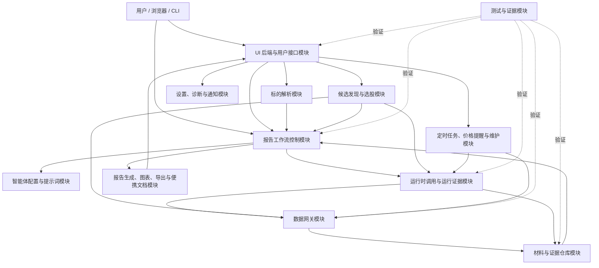
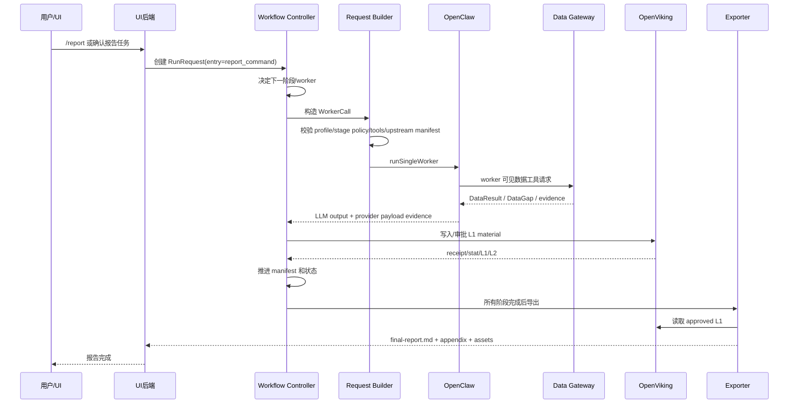
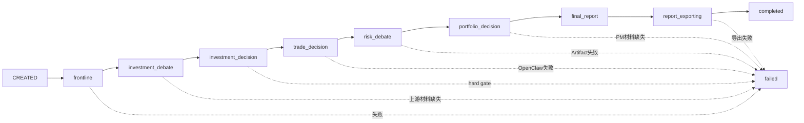
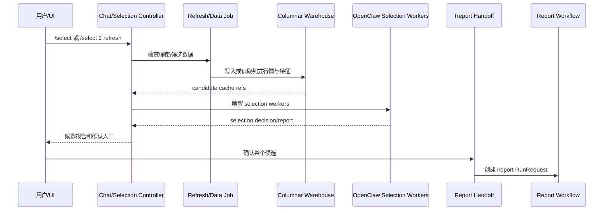
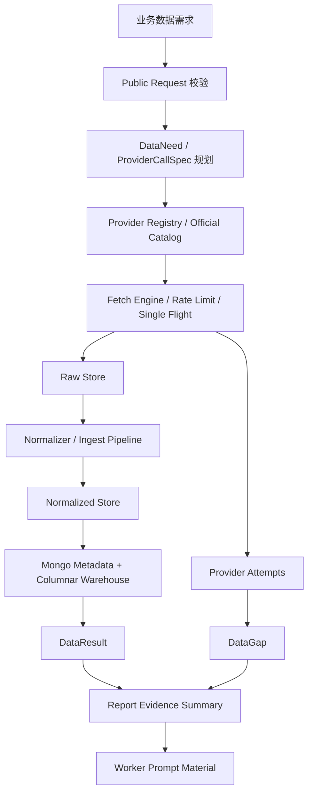
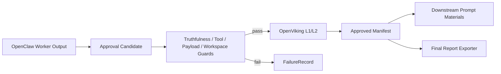
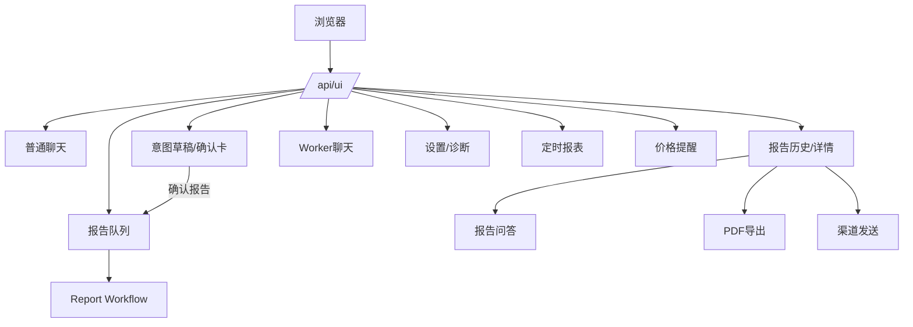
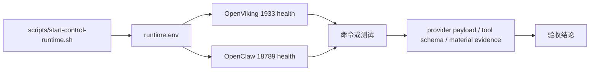

# 项目总体设计

## 1. 设计目标

本设计回答四个问题：

1. 系统有哪些模块。
2. 每个模块谁负责、谁不负责。
3. `/report`、`/select`、UI、数据、证据如何流动。
4. 哪些行为必须通过测试或 live runtime 证明。

## 2. 总体结论

`claw-trade` 的核心架构是控制面架构：

```text
claw-trade controls workflow state.
OpenClaw runs one agent turn.
Agent config owns prompt, skills, stage policy.
OpenViking carries approved materials.
Data gateway turns business data needs into provider evidence.
UI presents user workflows without exposing internals.
```

## 3. 模块划分



## 4. 模块清单

| 编号 | 模块 | 主要代码 | 主要职责 |
| --- | --- | --- | --- |
| M01 | 标的解析 | `src/claw_trade/instruments/` | 解析 ticker、market、company identity |
| M02 | 报告工作流控制 | `src/claw_trade/workflow/` | 固定报告 DAG、状态推进、阶段调度 |
| M03 | 运行时调用与运行证据 | `src/claw_trade/runtime/`、`third_party/openclaw/` | 单 worker turn、provider payload、tool schema evidence |
| M04 | 智能体配置与提示词 | `agents/`、`src/claw_trade/config/` | worker 身份、profile prompt、stage policy、tool policy |
| M05 | 材料与证据仓库 | `src/claw_trade/artifacts/`、相关 guards | approved material、manifest、receipt、L1/L2 |
| M06 | 数据网关 | `src/claw_trade/data_gateway/` | DataNeed、provider plan、fetch、ingest、warehouse、gap |
| M07 | 报告生成、图表、导出与便携文档 | `src/claw_trade/reports/`、`src/claw_trade/ui_backend/pdf*` | 图表、指标、final report、appendix、PDF |
| M08 | 候选发现与选股 | `src/claw_trade/selection/`、`src/claw_trade/data_gateway/selection_api.py`、`src/claw_trade/data_gateway/_selection_batch.py` | `/select`、候选池、selection workers、handoff |
| M09 | UI 后端与用户接口 | `src/claw_trade/web/`、`src/claw_trade/ui_backend/`、`src/claw_trade/ui_contracts/` | `/api/ui`、聊天、报告队列、报告历史、worker chat |
| M10 | 定时任务、价格提醒与维护 | `src/claw_trade/ui_backend/*scheduled*`、`src/claw_trade/ui_backend/*price_alert*`、`src/claw_trade/data_gateway/maintenance/` | cron wake、定时报表、提醒扫描、数据维护、清理 |
| M11 | 设置、诊断与通知 | `src/claw_trade/ui_backend/*settings*`、`src/claw_trade/ui_backend/*diagnostics*`、`src/claw_trade/ui_backend/*channel*` | 配置、健康诊断、渠道发送 |
| M12 | 测试与证据 | `tests/`、`scripts/validation/`、`scripts/start-control-runtime.sh` | 单元、合同、集成、live、Chrome 验收 |

## 5. 总体职责边界

### 5.1 `claw-trade`

负责：

- 工作流状态机。
- 阶段顺序和 worker 调度。
- hard gate。
- artifact approval。
- report export。
- UI API。
- selection。
- 定时任务业务状态。
- 数据请求语义。

不负责：

- 代写 worker 投资观点。
- 让 LLM 决定下一 worker。
- 修改 PM 最终结论。
- 用 mock/fallback 伪装成功。

### 5.2 OpenClaw

负责：

- 单 worker turn runtime。
- session / model turn / tool calls。
- provider final payload。
- visible tool schema。
- first response 和 LLM output evidence。

不负责：

- 完整 TradingAgents DAG。
- claw-trade 业务流程。
- report export。
- provider 数据真实性审批。

### 5.3 OpenViking

负责：

- approved material storage。
- L1/L2 material。
- receipt/stat/read capability。
- 证据链承载。

不负责：

- 决定 workflow。
- 生成投资观点。
- 替代数据层 provider attempt。

## 6. `/report` 总流程



## 7. `/report` 阶段流



## 8. `/select` 总流程



## 9. 数据流



## 10. 材料流



## 11. UI 流程



## 12. Runtime 验证流



## 13. 目录设计

### 13.1 代码目录

```text
src/claw_trade/
  artifacts/       approved material 与 OpenViking
  cli/             CLI 入口
  config/          profile、stage policy、workspace、tool registry
  data_gateway/    数据请求、provider、ingest、warehouse、maintenance
  guards/          truthfulness 与边界 guard
  instruments/     标的解析
  reports/         图表、指标、数据证据、报告导出
  runtime/         OpenClaw 调用、证据读取、本地 runner
  selection/       /select workflow
  ui_backend/      UI 业务服务
  ui_contracts/    用户 DTO 和 API 合同
  web/             FastAPI app 和 routes
  workflow/        报告控制状态机
```

### 13.2 Agent 目录

```text
agents/
  market_analyst/
  fundamental_analyst/
  ...
  portfolio_manager/
  report_polisher/
  selection_*/
  scheduled_report_runner/
  price_alert_scan_worker/
  ui_chat/
```

报告链路 worker 和非报告 agent 的结构不同，不能用一套文件要求硬套所有 `agents/*`。

### 13.3 文档目录

```text
docs/项目文档/
  00-项目总体需求.md
  01-项目总体设计.md
  模块设计/
    NN-模块名-总体设计.md
    NN-模块名-详细设计.md
  模块测试计划/
    NN-模块名-测试计划.md
  90-集成测试计划.md
  91-文档归档说明.md
  92-文档审计报告.md
  归档/原有文档/
```

## 14. 设计红线

- 不新增隐藏 fallback。
- 不让 Python 代替 worker。
- 不把 OpenClaw 变成 claw-trade 业务引擎。
- 不把 Mongo 当 approved artifact 权威。
- 不用测试 mock 代替 runtime proof。
- 不新增表达风格 runtime guard。
- 不让 UI 泄漏内部 payload 当用户接口。

## 15. 当前未知

静态代码和文档不能确认：

- 当前 OpenClaw `dist` 是否与 `src` 一致。
- 本机 `18789` / `1933` 是否可用。
- MongoDB 和 provider 凭证是否可用。
- 真实 Chrome UI 流程是否当前通过。
- 被归档旧文档路径引用的测试是否已迁移。
