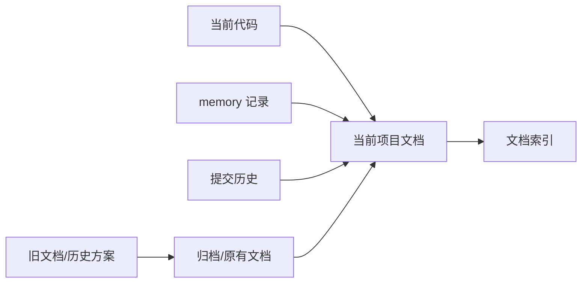

# 文档归档说明

## 1. 归档目标

本轮文档重整的目标是：

- 当前有效项目文档集中放在 `docs/项目文档/`。
- 旧方案、历史任务清单、过期设计和历史讨论集中归档。
- 临时运行证据、一次性调试材料、阶段性计划不再作为当前文档入口。
- 当前设计从代码现状、提交历史、`memory/` 和旧文档共同整理。

## 2. 当前有效文档入口

当前有效入口：

```text
docs/项目文档/00-项目总体需求.md
docs/项目文档/01-项目总体设计.md
docs/项目文档/02-文档索引.md
docs/项目文档/模块设计/
docs/项目文档/模块测试计划/
docs/项目文档/90-集成测试计划.md
docs/项目文档/92-文档审计报告.md
docs/项目文档/93-人工浏览器集成测试用例.md
```

不再以 `docs/` 根目录下散落文件作为设计入口。

## 3. 已归档旧文档

旧文档归档目录：

```text
docs/项目文档/归档/原有文档/
```

该目录当前包含历史设计、任务清单、方案、测试方案、运行说明等原有 Markdown 文档。

归档文档包括但不限于：

- A 股扩展方案和任务清单。
- A 股选股总体设计、详细设计和实施任务清单。
- 港股总体设计和详细设计。
- 加密市场选币、数据源和历史数据设计。
- 数据层总体设计、详细设计和任务清单。
- UI 需求、详细设计和任务清单。
- PDF 渲染方案和任务清单。
- 定时任务接入 OpenClaw 设计和实施计划。
- 设置模块设计和任务清单。
- worker 聊天详细设计和任务清单。
- 运行 runbook、prompt alignment playbook、架构设计、需求设计等历史文档。

这些文档保留历史价值，但当前设计以新文档为准。

## 4. 临时文档处理原则

以下材料不作为当前项目文档入口：

- 一次性 live evidence。
- provider probe 原始输出。
- 临时截图和资产。
- superpowers 临时计划和阶段性任务草稿。
- 运行过程中生成的中间 evidence。
- 过期问题登记和临时 blocker register。

这类材料如果需要保留，应放入专门 evidence 或归档目录，并在验收报告中引用关键路径；不应散落在 `docs/` 根目录影响当前设计阅读。

## 5. 当前文档与归档文档关系



## 6. 使用规则

- 查当前需求：先看 `00-项目总体需求.md`。
- 查当前架构：先看 `01-项目总体设计.md`。
- 查模块设计：看 `模块设计/` 中对应编号。
- 查模块测试：看 `模块测试计划/` 中对应编号。
- 查历史背景：看 `归档/原有文档/`。
- 查跨模块验收：看 `90-集成测试计划.md`。
- 查一致性风险：看 `92-文档审计报告.md`。
- 查人工 Chrome 操作验收步骤：看 `93-人工浏览器集成测试用例.md`。

## 7. 本轮限制

本轮只整理文档，不修改代码。

本轮没有启动 live runtime，没有重新跑 provider，没有做真实浏览器验收。因此新文档中的“已实现”仅表示从代码、历史文档和记忆记录中整理出的当前能力，不等同于本轮运行验收结论。
