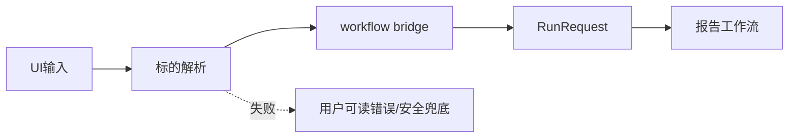

# 标的解析模块总体设计

## 1. 模块目标

标的解析模块负责把用户输入的证券代码、市场提示和任务上下文转换为系统内部可用的标的身份。它是 UI、`/report` 和 `/select` 进入正式流程前的第一道语义校验。

模块位置：

```text
src/claw_trade/instruments/
```

## 2. 设计原则

- 标的身份必须先明确，不能让后续 worker 猜市场。
- 市场 profile 不能静默 fallback。
- 解析失败时返回明确错误或安全兜底，不能伪造公司名。
- 标的解析不负责投资判断，也不负责 provider 数据验证。

## 3. 职责边界

负责：

- 规范 ticker。
- 根据 market hint 解析 profile。
- 为 UI workflow bridge 提供标的身份。
- 帮助报告请求补齐公司名或安全占位。

不负责：

- 判断数据源是否有数据。
- 决定 worker 顺序。
- 生成投资观点。
- 解析 selection 候选评分。

## 4. 依赖关系



## 5. 上游输入

主要输入来自：

- UI 报告任务。
- 意图确认卡片。
- selection handoff。
- CLI 参数。

输入包括：

- 原始代码。
- 市场 hint。
- 用户提供的名称。
- 设置中的默认市场/profile。

## 6. 下游输出

输出应服务于 `RunRequest`：

- 标准 ticker。
- profile / market。
- company name 或安全占位。
- currency / calendar 等后续配置需要的信息。

## 7. 失败语义

失败应分清：

- 代码格式不合法。
- 市场和代码不匹配。
- 公司名无法查到。
- profile 不存在或未批准。

公司名查不到时可以使用“名称未查到”等安全占位，但不能把 ticker 伪装成公司名。

## 8. 模块验收

验收重点：

- A 股、US、HK、CRYPTO 输入都能按 profile 解析。
- market hint 和 ticker 冲突时不静默纠正。
- UI 创建报告时不会把普通聊天文本直接当 ticker。
- selection handoff 再校验市场和标的。

