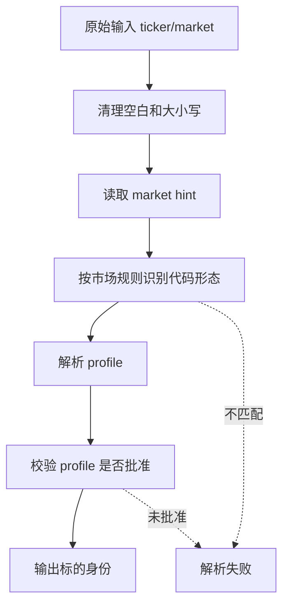

# 标的解析模块详细设计

## 1. 代码位置

```text
src/claw_trade/instruments/
  __init__.py
  resolver.py
```

主要调用方：

```text
src/claw_trade/ui_backend/workflow_bridge.py
src/claw_trade/ui_backend/confirmation_controller.py
src/claw_trade/workflow/report_request_factory.py
```

## 2. 关键对象

### 2.1 标的身份

标的身份至少需要表达：

- 原始输入。
- 标准 ticker。
- 市场 profile。
- 展示名称。
- 货币或市场默认信息。

### 2.2 解析错误

解析错误必须能被 UI 翻译成用户可读错误。

典型错误：

- 未识别市场。
- 代码格式不匹配。
- 目标 market 与 ticker 不一致。
- profile 未批准。

## 3. 解析流程



## 4. UI 报告入口设计

`workflow_bridge` 接收 UI task 后：

1. 读取 `instrumentCode`。
2. 读取 `market`。
3. 尝试解析标的身份。
4. 通过 company name resolver 获取名称。
5. 名称不可用时使用安全占位。
6. 构造 `RunRequest(entry_point=REPORT_COMMAND)`。

这里不能直接把用户输入名称当成事实公司名；也不能把代码复制成公司名后让 worker 误以为已经查到名称。

## 5. Selection handoff 设计

Selection 产生候选后，用户确认时必须重新校验：

- 候选 ticker 是否仍符合市场。
- selection market 是否和 report market 一致。
- CRYPTO 候选是否是加密标的，不写成股票。
- CN_A 候选是否是 A 股标的。

## 6. 与数据层的关系

标的解析只确定“要查谁”。数据层负责“能否查到、从哪里查、查到什么证据”。

因此标的解析不应：

- 查询 provider 原始接口。
- 判断财务数据完整性。
- 给数据缺口做业务解释。

## 7. 与 UI 文案的关系

用户可见文案应说：

- “代码格式不正确”。
- “这个代码和所选市场不匹配”。
- “名称未查到，请确认代码或数据源配置”。

不应说：

- 内部 resolver 类名。
- provider attempt id。
- Mongo collection。

## 8. 已知限制

- 静态文档不能确认当前公司名 resolver 在 live 数据源下可用。
- 不同市场代码规则后续可能需要扩充。
- UI DTO 对 handoff payload 的脱敏仍需后续代码测试覆盖。

