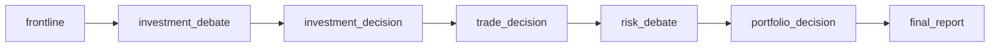
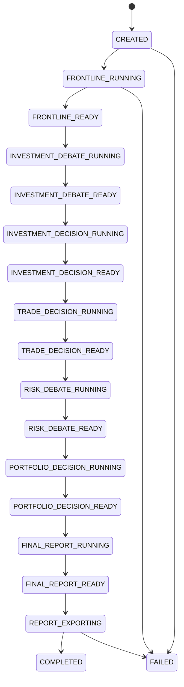

# 报告工作流控制模块总体设计

## 1. 模块目标

报告工作流控制模块是正式 `/report` 链路的状态机和调度中心。它决定下一步叫醒哪个阶段、哪个 worker、是否推进状态、是否阻断、是否导出报告。

模块位置：

```text
src/claw_trade/workflow/
```

## 2. 核心原则

- `claw-trade` 控制工作流，LLM 不决定下一步。
- 每次 dispatch 映射为一次 OpenClaw worker wake。
- 上游 approved material 不完整时不进入下游阶段。
- Python 不写 worker 投资观点。
- PM 最终裁决不可被 Python 或 exporter 改写。

## 3. 阶段设计



## 4. Worker 设计

默认前线：

- `market_analyst`
- `fundamental_analyst`
- `news_analyst`
- `social_analyst`

A 股扩展前线：

- `policy_analyst`
- `hot_money_tracker`
- `lockup_watcher`

下游：

- `bull_researcher`
- `bear_researcher`
- `research_manager`
- `trader`
- `risk_challenger`
- `risk_guardian`
- `risk_moderator`
- `portfolio_manager`
- `report_polisher`

## 5. 状态推进



## 6. 输入输出

输入：

- `RunRequest`
- 当前 `WorkflowState`
- worker results
- approved manifest
- export result

输出：

- 下一步 decision。
- worker batch。
- failure record。
- updated state。
- final report path。

## 7. 失败原则

失败必须记录：

- run id。
- worker id 或 stage。
- category。
- reason。
- evidence paths。
- 是否 early stop。
- 是否需要人工处理。

不能用笼统“unknown failed”替代可追溯原因。

## 8. 验收标准

- 阶段顺序固定。
- CN_A 和非 CN_A worker 覆盖正确。
- 单 worker stop point 正确。
- upstream material 缺失 fail closed。
- collect-first 阶段能收集批量失败。
- export 缺材料不生成完整报告。

