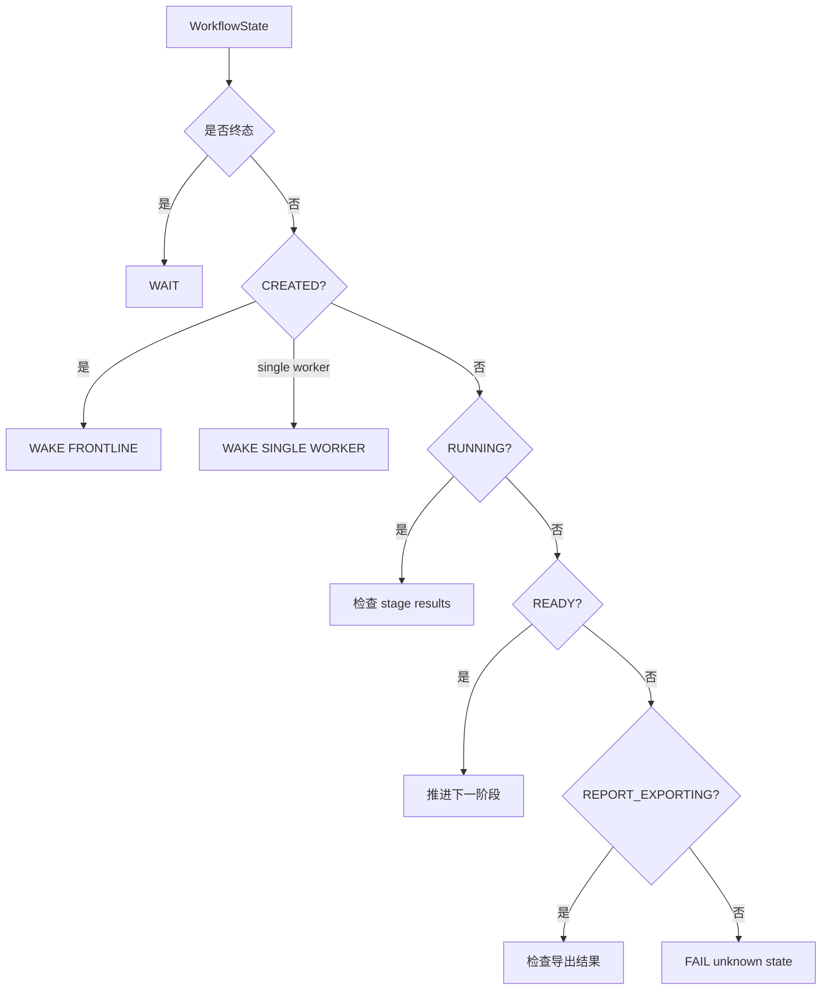

# 报告工作流控制模块详细设计

## 1. 文件结构

```text
src/claw_trade/workflow/
  __init__.py
  models.py
  workers.py
  controller.py
  runner.py
  store.py
  report_request_factory.py
  final_report_plan.py
```

## 2. 关键文件职责

| 文件 | 职责 |
| --- | --- |
| `models.py` | 定义 RunRequest、WorkflowState、Stage、RunStatus、WorkerCall、FailureRecord |
| `workers.py` | 固定 worker specs、stage plans、CN_A 前线扩展 |
| `controller.py` | 纯决策：根据 state/results/manifest/export_result 计算下一步 |
| `runner.py` | 执行：boot、调用 OpenClaw、读证据、跑 guard、审批 material、导出 |
| `store.py` | 落盘 request、state、decision、calls、failures、reports |
| `report_request_factory.py` | 从 UI/CLI 参数构造 RunRequest |
| `final_report_plan.py` | report_polisher 分段计划 |

## 3. 核心数据结构

### 3.1 `RunRequest`

表达一次报告运行的输入：

- ticker。
- company name。
- market/profile。
- currency。
- date range。
- stop point。
- target worker/stage。
- entry point。

`entry_point=REPORT_COMMAND` 是正式报告入口语义。

### 3.2 `WorkflowState`

表达运行当前状态：

- run id。
- run dir。
- request。
- status。
- active stage。
- failure reason。
- last decision path。

### 3.3 `StagePlan`

表达阶段执行计划：

- stage。
- worker ids。
- running status。
- ready status。
- next stage。
- required upstream stage。
- collect-first。

## 4. Controller 决策

`decide_next()` 按状态分流：



Controller 不构造 prompt，不访问 provider，不读 UI。

## 5. Runner 执行

`ControlRunner` 的关键路径：

1. `boot()`：检查 profile、OpenClaw、OpenViking、tool registry。
2. `store.create_run()`：写 request/state。
3. `decide_next()`：获得 decision。
4. `build_worker_call()`：构造 OpenClaw call。
5. `openclaw.run_worker()`：执行 worker。
6. `evidence_reader`：读取 provider payload、tool schema、worker output。
7. guards：provider request、visible tools、tool calls、workspace evidence、OpenViking reads。
8. `approve_worker_material()`：审批 worker 输出。
9. manifest store：写 approved material。
10. exporter：导出 final report。

## 6. 批处理和 collect-first

前线和投资辩论可 collect-first。含义：

- 同一批 worker 中一个失败，不一定立即终止全部。
- 继续收集同批其它结果。
- 批次结束后按失败类别决定是否推进或 fail。

早停例外：

- provider/runtime/root alignment 不可信。
- 数据真实性受污染。
- PM 权威边界被破坏。
- destructive/security 风险。

## 7. Stop point

支持：

- `NONE`：完整报告链路。
- `FIRST_RESPONSE`：首响应后停止，用于 provider prompt 和 tool schema 验证。
- `SINGLE_WORKER_COMPLETE`：单 worker 完成后停止。

stop point 不能绕过上游材料要求。

## 8. 状态存储

`WorkflowStore` 负责在 run dir 中保存：

- `request.json`
- `state.json`
- decisions
- calls
- failures
- reports
- 本地 OpenViking 审计副本

本地审计副本不是 OpenViking approved material 权威。

## 9. 与其它模块接口

| 下游模块 | 接口 |
| --- | --- |
| OpenClaw 调用 | `WorkerCall` / `OpenClawCommand` |
| Artifact/OpenViking | approved manifest、OpenViking client |
| Agent 配置 | worker workspace、stage policy |
| 数据网关 | 通过 worker tool 间接调用 |
| 报告导出 | `FinalReportExporter.export()` |
| UI | workflow bridge / report queue |

## 10. 已知限制

- 静态测试不能证明 OpenClaw runtime `dist` 已更新。
- full chain 成功不等于投资判断质量合格。
- 旧文档路径归档后，相关合同测试路径需要后续迁移。

