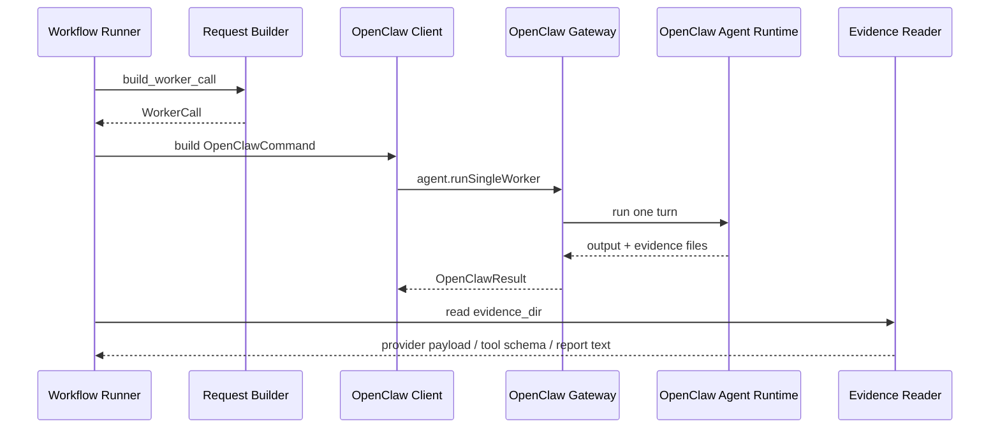

# 运行时调用与运行证据模块总体设计

## 1. 模块目标

运行时调用与运行证据模块负责把 `claw-trade` 的 `WorkerCall` 转成 OpenClaw 单 agent turn，并把真实 provider payload、visible tools、LLM 输出和运行证据带回控制面。

代码范围：

```text
src/claw_trade/runtime/
third_party/openclaw/
scripts/openclaw-gateway-rpc-helper.mjs
```

## 2. 设计原则

- OpenClaw 只执行一个 worker turn。
- `claw-trade` 不直接调用模型。
- provider payload 必须来自真实 runtime 捕获。
- renderer output、logs、静态 prompt 不是 provider payload 证明。
- 修改 OpenClaw `src` 后必须 build、restart、fresh live proof。

## 3. 总流程



## 4. 输入

输入来自 workflow：

- worker id。
- stage。
- profile。
- runtime vars。
- allowed tools。
- upstream material refs。
- OpenViking read capabilities。
- material target。
- evidence dir。
- stop point。

## 5. 输出

输出回 workflow：

- OpenClaw result。
- first response。
- final worker report text。
- provider request messages。
- visible tool schema。
- tool calls。
- request/provider ids。
- failure evidence。

## 6. OpenClaw 边界

OpenClaw source 在 `third_party/openclaw/src/**`。

运行使用 `third_party/openclaw/dist/**`。

允许的 OpenClaw 改动只包括通用 single-agent runtime seam：

- per-turn tool narrowing。
- provider payload capture。
- first-response capture。
- machine-readable run evidence。

禁止把 claw-trade 工作流、DAG、投资逻辑、report export 写进 OpenClaw。

## 7. 运行验证要求

OpenClaw runtime seam 变更后必须：

```text
edit src
-> focused source/unit tests
-> pnpm build
-> restart scripts/start-control-runtime.sh
-> fresh live run
-> inspect provider payload
```

缺任一步，不能声称 live 行为已改变。
