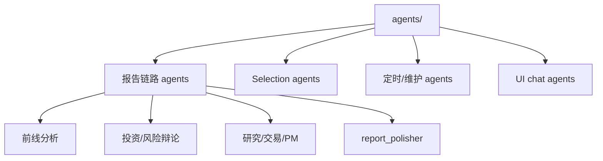

# 智能体配置与提示词模块总体设计

## 1. 模块目标

智能体配置与提示词模块定义每个 OpenClaw agent 的身份、提示词、技能和 stage policy。它保证 worker 以正确身份、正确市场 profile、正确工具集合执行。

代码和配置范围：

```text
agents/
src/claw_trade/config/
```

## 2. 设计原则

- Prompt 是 agent 配置，不是 Python runtime prose。
- Python 只替换 runtime 变量。
- TradingAgents / TradingAgents-CN parity 优先。
- Truthfulness redline 不能变成风格压制。
- HK/CRYPTO profile 缺失时 fail closed。
- stage policy 控制当前 turn 可见工具。

## 3. Agent 分类



## 4. 报告链路 agent

报告链路 agent 需要完整 workspace：

- 身份。
- 用户提示。
- stage policy。
- skills。
- profile prompts。

下游纯推理 worker 可以不暴露数据读取工具，但必须能看到 approved natural-language upstream material。

## 5. Profile 设计

Profile 包括：

- `CN_A`
- `US`
- `HK`
- `CRYPTO`

Profile 的作用：

- 控制 prompt。
- 控制工具策略。
- 控制市场术语。
- 控制材料边界。

## 6. Tool policy

Stage policy 决定 worker 当前 turn 可见工具。

原则：

- 前线 worker 可按需请求数据。
- 下游 TradingAgents-CN/original baseline 纯 LLM reasoning worker 不应暴露 OpenViking read/write tools。
- Python 可以把 approved L1 自然语言正文放进 prompt variables。

## 7. 禁止项

Prompt 和 provider payload 不应包含：

- OpenViking URI/hash/L1/L2 protocol。
- RuntimeTarget。
- ReportSubmission。
- provider attempt audit envelope。
- material_id。
- OpenClaw tool protocol prose。
- Python engineering checklist。

## 8. 验收标准

- 每个报告 worker 的 profile prompt 存在。
- Stage policy 与 worker 阶段一致。
- 可见工具和合同一致。
- prompt 没有 audit/protocol 泄漏。
- HK/CRYPTO 不 fallback。
- debate worker 仍保持辩论声线。
