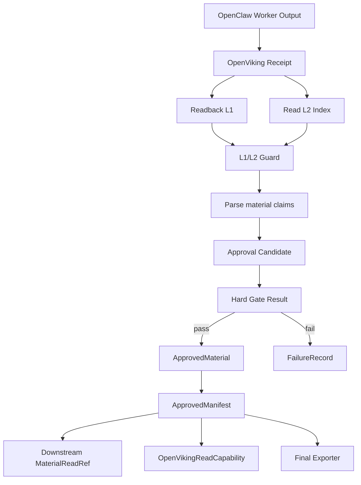

# 材料与证据仓库模块总体设计

## 1. 模块目标

材料与证据仓库模块负责把 worker 输出转成可批准、可追踪、可下游读取、可最终导出的材料链。

模块位置：

```text
src/claw_trade/artifacts/
src/claw_trade/guards/openviking_*.py
src/claw_trade/guards/artifact_flow.py
src/claw_trade/guards/l1_l2.py
src/claw_trade/guards/export_claims.py
```

## 2. 核心结论

OpenViking 是正式 approved material 后端。Manifest 是 `claw-trade` 控制面的 approved material 索引。下游 worker 只能通过 manifest 生成的 read ref/capability 读取上游材料。

本地 run 目录里的审计副本不是正式材料权威。

## 3. 职责边界

负责：

- 生成 material target。
- 校验 OpenViking receipt。
- 读取并校验 L1/L2。
- 解析 material claims。
- 生成 approval candidate。
- 写 approved manifest。
- 为下游 worker 生成 `MaterialReadRef` 和 `OpenVikingReadCapability`。
- 校验 artifact flow。

不负责：

- 生成 worker 投资观点。
- 让未通过 hard gate 的材料进入下游。
- 让 Mongo 或本地 JSON 替代 OpenViking L1。
- 把 runtime guard 扩展成表达风格 guard。

## 4. 总流程



## 5. 材料类型

### 5.1 L1

L1 是自然语言 worker 报告正文。它必须是读者/worker 可理解的报告、辩论、决策或执行计划。

L1 不应是：

- JSON。
- debug envelope。
- provider attempt payload。
- OpenViking protocol。
- claim block。
- compact 摘要替代物。

### 5.2 L2

L2 是结构化证据或辅助材料，例如：

- data need 结果。
- provider attempts。
- chart evidence。
- tool calls。
- material claims。

L2 用于审计和 claim 支撑，不替代 L1 报告。

### 5.3 Material claims

Material claims 是机器可读声明，独立保存，供 export claim mapping 使用。它们不能塞进 L1 正文污染 worker 可见材料。

## 6. Manifest 设计

Manifest 记录每个 approved material：

- run id。
- stage。
- worker id。
- call id。
- L1 URI。
- L1 hash/size。
- L2 index URI。
- hard gate result path。
- material claims。

Manifest 用于：

- 下游 worker 输入选择。
- artifact flow guard。
- final report export。
- 审计和失败定位。

## 7. 下游材料边界

下游 worker 的默认材料应是 approved L1 自然语言正文。Artifact ref 和 read capability 是审计/深读句柄，不是把完整上游报告替换成 URI 的理由。

## 8. Guard 边界

允许 guard 检查：

- receipt 真实性。
- URI 形状。
- L1/L2 可读性。
- claim 支撑。
- tool call 和 visible tools。
- workspace evidence。
- provider request capture。

不允许无审批新增：

- 风格限制。
- 表达强弱限制。
- BUY/HOLD/SELL 词汇限制。
- 报告声线压制。

## 9. 验收标准

- 每个 approved material 都可从 OpenViking 读取 L1。
- 下游材料和 manifest 完全对应。
- hard-gate failed material 不进入 manifest。
- export claims 能回指 approved material claims。
- OpenViking read/write 不能越权访问裸 URI。
