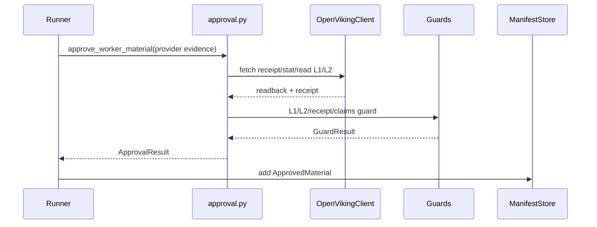

# 材料与证据仓库模块详细设计

## 1. 文件结构

```text
src/claw_trade/artifacts/
  refs.py
  manifest.py
  approval.py
  openviking_client.py
  openviking_backend_http.py
  claims.py

src/claw_trade/guards/
  artifact_flow.py
  openviking_access.py
  openviking_receipt.py
  l1_l2.py
  export_claims.py
```

## 2. 核心对象

### 2.1 `MaterialTarget`

由 `make_material_target()` 生成，绑定：

- run。
- stage。
- worker。
- call。
- target name。
- turn/round/role turn index。

典型 URI：

```text
viking://resources/workflow/{run}/{stage}/{worker}/{call}/report.md
viking://resources/workflow/{run}/{stage}/{worker}/{call}/evidence/
```

### 2.2 `MaterialReceipt`

OpenViking 写入回执，记录：

- URI。
- sha256。
- size。
- run/call/worker/stage。
- verification。

Receipt 必须被 stat/read 复核。

### 2.3 `ApprovedMaterial`

已批准材料，包含：

- material identity。
- L1 receipt 和 hash。
- L2 index。
- claims。
- hard gate result path。

### 2.4 `ApprovedManifest`

控制面 approved material 索引。

它负责：

- 按 worker/stage 查询材料。
- 为下游 worker 选择上游材料。
- 生成 read refs 和 capabilities。
- 阻止重复 worker/call/material。

## 3. Approval 流程



## 4. URI 校验

URI 必须满足：

- scheme 为 `viking://`。
- path 绑定 workflow run/stage/worker/call。
- 不允许 `latest`、`list`、`compact`、`scan`。
- 不允许 `..`、`.`、路径逃逸。
- L2 read 只能在允许 prefix 内。

## 5. Manifest 上游选择

Manifest 根据 stage 选择上游：

- Frontline：无上游。
- Investment debate：frontline + 前序 debate turn。
- Investment decision：frontline + investment debate。
- Trade decision：research manager 等上游决策。
- Risk debate：trade decision + 前序 risk debate。
- Portfolio decision：risk debate、trader、research manager。
- Final report：portfolio decision 和全链 approved materials。

具体选择以 `manifest.py` 当前实现为准。

## 6. Capability 设计

`OpenVikingReadCapability` 是下游 worker 可读范围声明。

它必须绑定：

- allowed L1 URI。
- allowed L2 prefix。
- manifest entry hash。
- run/stage/worker/call。

下游不能绕过 capability 裸读 URI。

## 7. Claims 设计

`control.claims.v1` 用于机器声明：

- claim id。
- kind。
- text。
- value。
- evidence ids。
- required evidence kinds。

Export claims 只能从 material claims 映射，不能从 final report 自由抽取。

## 8. 与 Exporter 的关系

Exporter 必须：

- 从 OpenViking 读取 approved L1。
- 用 manifest 判断完整 worker 覆盖。
- 用 material claims 生成 export claim mapping。
- 写出 worker appendix。

Exporter 不能：

- 从本地 call 目录读正式材料。
- 用缺失材料生成完整报告。
- 新增 unsupported conclusion。

## 9. 已知限制

- 本模块依赖 OpenViking HTTP backend 可用。
- Manifest 是文件持久化并带内存缓存；并发语义以当前 runner 调用约束为准。
- 当前文档没有 live read/write proof。
