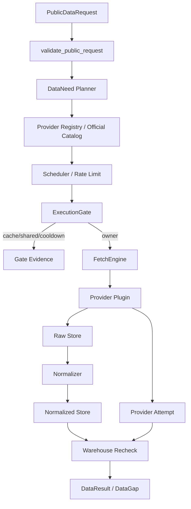

# 数据网关模块总体设计

## 1. 模块目标

数据网关把报告、选股、UI 探测、价格提醒和维护任务的业务数据需求，转换为可审计的数据请求、provider 规划、抓取、入库、仓库复查和结果证据。

模块位置：

```text
src/claw_trade/data_gateway/
src/claw_trade/reports/data_need_bridge.py
```

## 2. 核心原则

- 对外只接受业务级请求。
- Provider 执行细节只属于数据层内部。
- 所有 provider attempt 必须真实记录。
- 空返回、限流、权限缺失、解析失败都必须成为明确 gap。
- 数据层不写投资观点。
- 数据源不可用不等于功能不存在；产品必须显示正确失败或配置动作。

## 3. 总流程



## 4. 对外输入

公开请求表达：

- market。
- symbol 或 universe。
- data type。
- granularity。
- fields 的业务含义。
- date range。
- freshness。
- consumer。

禁止字段：

- provider。
- path/url。
- token/api key/header。
- API id/name。
- HTTP params。
- 内部 warehouse refs。

## 5. 输出

输出 `DataResult`：

- status：ready/partial/missing/error。
- rows。
- dataset refs。
- raw refs。
- attempt refs。
- gaps。
- freshness。

输出 `DataGap`：

- request id。
- reason。
- severity。
- provider ids tried。
- evidence refs。
- human readable。

## 6. Provider 选择

Provider 选择按：

- market。
- data type。
- granularity。
- fields。
- source role。
- official catalog。
- credential policy。
- license policy。
- rate limit。
- fallback/composition group。

不能按 worker 名称或报告章节硬过滤。

## 7. 仓库设计

数据网关使用：

- Mongo：metadata、raw、normalized、provider attempts、dataset manifests。
- Columnar warehouse：selection/历史行情等高体量数据。

Mongo 不是 approved artifact 权威。

## 8. Worker 可见边界

Worker 可见的是 `claw_request_data` 工具和模型可读数据摘要。

Worker 不应看到：

- provider attempt JSON 原文。
- provider token。
- Mongo collection。
- raw URI/hash。
- 内部 rate limit 细节。

## 9. 验收标准

- 非法公开请求被拒绝。
- provider attempts 完整记录。
- 限流和 cooldown 有 evidence。
- 数据结果和 gap 可追溯。
- normalized/columnar 仓库完整性可检。
- 报告数据摘要不误导 worker。

