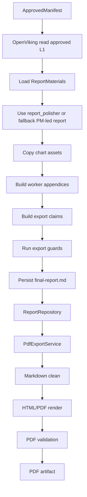

# 报告生成、图表、导出与便携文档模块总体设计

## 1. 模块目标

本模块把 approved materials 组织成读者版 Markdown 报告、worker 附录、图表资产、export claims 和 PDF 文件。

代码范围：

```text
src/claw_trade/reports/
src/claw_trade/ui_backend/pdf*.py
src/claw_trade/ui_backend/report_repository.py
src/claw_trade/ui_backend/chart_evidence.py
```

## 2. 设计原则

- 导出只读取 approved OpenViking L1。
- Exporter 不改写 PM 投资结论。
- `report_polisher` 是读者版最终报告 worker，不是 PM 决策 owner。
- 图表声称存在时必须有真实资产。
- PDF 必须是真 PDF bytes，不允许 Markdown 改后缀。
- PDF 失败不能伪成功。

## 3. 总流程



## 4. 报告导出职责

负责：

- 检查 required workers。
- 从 OpenViking 读取 L1。
- 生成 final report。
- 生成 worker appendix。
- 复制图表资产。
- 生成 export claims。
- 写 guard results。

不负责：

- 编造缺失 worker 材料。
- 改写 PM 结论。
- 生成 unsupported target price。
- 把诊断结构当 hard gate 随意扩展。

## 5. 图表职责

图表模块负责：

- 计算技术指标。
- 生成市场结构图。
- 生成指标面板。
- 记录 warnings。

不负责：

- 发明没有数据支撑的图表。
- 用缺历史数据生成看似完整图。

## 6. PDF 职责

便携文档导出能力负责：

- Markdown 清理。
- HTML 渲染。
- pdfkit 主路径。
- pandoc fallback。
- PDF bytes 校验。
- artifact 写入和复用。

不负责：

- 改写报告结论。
- 把 PDF runtime 缺失写成成功。

## 7. UI 报告仓库

报告仓库保存：

- report id。
- instrument。
- market。
- title。
- Markdown。
- Markdown hash。
- PM final conclusion。
- asset dir。
- PDF artifacts。
- deleted report tombstone。

## 8. 验收标准

- final report 只来自 approved materials。
- worker appendix 完整。
- 图表资产引用可打开。
- export claims 可回指 material claims。
- PDF header、大小、页数、可抽取文本满足校验。
- 报告删除不会破坏运行中或发送中报告。
