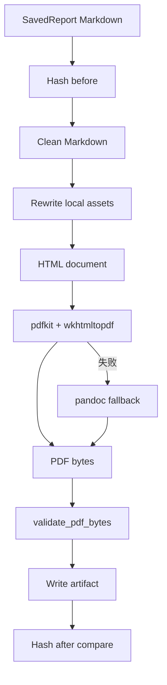

# 报告生成、图表、导出与便携文档模块详细设计

## 1. 文件结构

```text
src/claw_trade/reports/
  exporter.py
  structure.py
  market_indicators.py
  market_charts.py
  data_need_bridge.py
  data_evidence_summary.py

src/claw_trade/ui_backend/
  report_repository.py
  chart_evidence.py
  pdf_export_service.py
  pdf_renderer.py
  pdf_markdown_cleaner.py
  pdf_runtime_capabilities.py
  pdf_validation.py
```

## 2. Exporter 关键对象

- `ReportMaterial`：approved material + L1 text。
- `RenderedReport`：Markdown text + claim links。
- `WorkerAppendix`：worker 原文附录。
- `ReportImageAsset`：图表资产复制计划。
- `ExportResult`：导出结果。

## 3. 导出材料加载

`load_report_materials()`：

1. 从 manifest 获取 run 内所有 approved materials。
2. 检查 required workers。
3. 按 worker 顺序排序。
4. 对每个 material 调 OpenViking 读取 L1。
5. 解码为 UTF-8。
6. 检查 PM material 存在。

缺任一步返回明确失败类别。

## 4. Final report 渲染

`render_final_report()`：

- 优先使用 `report_polisher` L1。
- 如果无 polisher，生成 PM-led 报告结构。
- worker 原文进入 appendix。
- export claims 从 material claims 映射。

## 5. 图表资产

`_collect_report_image_assets()` 查找 market analyst call 下 chart evidence 目录，把图片复制到 `reports/assets/`。

如果报告 Markdown 声称存在关键图表，但资产缺失，应失败或记录明确缺口。

## 6. 结构诊断

`structure.py` 提供：

- final report 结构诊断。
- 缺数据 meta 话术清理。
- report polisher segment 校验。

结构诊断文件是 diagnostic，不是新增 runtime hard gate 的理由。

## 7. 技术指标和图表

`market_indicators.py`：

- 接收 OHLCV frame。
- 计算 MA、MACD、RSI、Bollinger 等指标。
- 返回 `AnalysisBundle`。

`market_charts.py`：

- 使用 matplotlib/mplfinance。
- 输出市场结构图和指标面板图。
- 需要足够历史数据。

## 8. PDF 渲染

PDF 流程：



## 9. PDF 安全边界

本地图片路径重写必须：

- 只允许 report asset dir 内文件。
- 拒绝绝对路径。
- 拒绝 `..`。
- 拒绝远端伪本地。

## 10. Report repository

`ReportRepository`：

- 只保存 succeeded report。
- 保存 Markdown hash。
- 解析本地图片资产。
- 保存 PDF artifact。
- 支持删除和 tombstone。

删除时不能把未完成报告写入历史成功列表。

## 11. 已知限制

- PDF runtime 依赖系统 `wkhtmltopdf`、fontconfig、Noto CJK。
- chart 依赖 `pandas_ta`、matplotlib、mplfinance 和足够数据。
- 本文不证明当前机器能生成真实 PDF 或图表。
