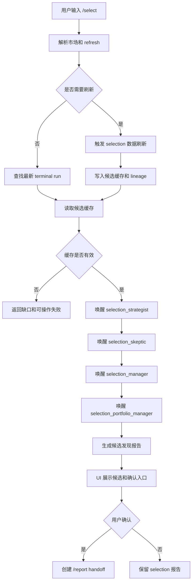

# 候选发现与选股模块总体设计

## 1. 模块目标

候选发现与选股模块负责把用户的 `/select` 命令变成可审计的候选标的报告，并在用户确认后把候选交给正式 `/report` 工作流。

它解决的问题不是“直接给最终投资结论”，而是：

- 从市场数据、特征缓存和策略要求中找出候选标的。
- 让 selection worker 对候选进行策略判断、反方审查、经理筛选和组合层裁决。
- 给用户展示候选理由、风险和确认入口。
- 保证 selection 结果不能绕过正式报告的 12-worker 投研链路。

## 2. 职责边界

本模块负责：

- 解析 `/select` 命令、市场 profile 和 refresh 意图。
- 检查最新可用候选缓存。
- 在需要时触发 selection 数据刷新。
- 唤醒 selection worker。
- 生成候选发现报告。
- 将用户确认的候选转换为 `/report` handoff 请求。

本模块不负责：

- 直接生成正式投资报告。
- 代替组合经理做最终投资裁决。
- 把候选缓存伪装成已验证的正式报告材料。
- 在候选数据缺失时用静态样例或 mock 数据补齐。

## 3. 主要代码位置

```text
src/claw_trade/selection/controller.py
src/claw_trade/selection/dispatch.py
src/claw_trade/selection/engine.py
src/claw_trade/selection/data_need_refresh.py
src/claw_trade/selection/report_handoff.py
src/claw_trade/selection/scheduler.py
src/claw_trade/selection/candidate_cache.py
src/claw_trade/selection/models.py
src/claw_trade/selection/confirmation.py
src/claw_trade/selection/data_job.py
src/claw_trade/selection/refresh.py
src/claw_trade/selection/store.py

src/claw_trade/data_gateway/selection_api.py
src/claw_trade/data_gateway/_selection_batch.py
src/claw_trade/data_gateway/selection_integrity.py
src/claw_trade/data_gateway/warehouse/selection_columnar.py

src/claw_trade/ui_backend/progress_mapper.py
src/claw_trade/ui_backend/scheduler_service.py
```

## 4. 用户入口

| 输入 | 语义 |
| --- | --- |
| `/select` | 默认 A 股候选发现 |
| `/select 1` | A 股候选发现 |
| `/select A` | A 股候选发现 |
| `/select CN_A` | A 股候选发现 |
| `/select A股` | A 股候选发现 |
| `/select 2` | 加密市场候选发现 |
| `/select CRYPTO` | 加密市场候选发现 |
| `/select 加密` | 加密市场候选发现 |
| `/select refresh` | 使用默认市场并刷新候选数据 |
| `/select 2 refresh` | 加密市场刷新后候选发现 |

当前不支持的入口必须明确拒绝，例如 `/select US`、`/select 3`，不能静默回退到 A 股。

## 5. Worker 链路

候选发现使用独立 selection worker：

```text
selection_strategist
  -> selection_skeptic
  -> selection_manager
  -> selection_portfolio_manager
```

阶段含义：

- `selection_strategist`：基于候选池提出策略性候选。
- `selection_skeptic`：挑战候选池和策略逻辑。
- `selection_manager`：综合正反意见筛选候选。
- `selection_portfolio_manager`：形成最终候选建议和用户确认材料。

## 6. 工具可见性

selection worker 的工具暴露必须按阶段收窄：

| worker | 可见工具 |
| --- | --- |
| `selection_strategist` | `claw_get_selection_candidate_cache` |
| `selection_skeptic` | `claw_get_selection_candidate_cache` |
| `selection_manager` | 无模型可见数据工具 |
| `selection_portfolio_manager` | 无模型可见数据工具 |

经理和组合经理阶段应基于已批准的上游文本和候选材料推理，而不是重新读取数据工具。

## 7. 总体流程



## 8. 状态模型

候选发现至少区分：

- `queued`：任务已创建。
- `refreshing`：正在准备或刷新候选数据。
- `running_workers`：正在执行 selection worker。
- `awaiting_confirmation`：候选已生成，等待用户确认。
- `handoff_created`：已创建正式报告任务。
- `failed`：数据、worker 或 handoff 失败。
- `cancelled`：用户取消。

## 9. 数据和证据要求

候选缓存必须能说明：

- 生成时间。
- 市场 profile。
- 参与筛选的数据列。
- 数据来源和 provider 尝试。
- 候选列表、排序依据和摘要指标。
- 缓存 hash 或等价完整性标记。
- selection worker 使用的 provider payload 和工具 schema。

如果候选缓存缺少 lineage 或 readback 失败，selection 不能继续。

## 10. 与正式报告工作流关系

```mermaid
flowchart LR
  Select[/select 候选发现] --> Candidate[候选报告]
  Candidate --> Confirm[用户确认]
  Confirm --> Report[/report 正式报告]
  Report --> DAG[正式投研 DAG]
  DAG --> PM[组合经理最终结论]
```

selection 的结论是“候选建议”，不是最终投资建议。正式报告仍然要经过完整 report workflow。

## 11. 失败策略

- 命令不支持：直接返回不支持原因。
- 候选缓存缺失：提示需要 refresh 或说明数据不可用。
- refresh 失败：返回失败阶段和 provider/data gap。
- worker 失败：保留已完成阶段证据，不创建 handoff。
- handoff 失败：保留 selection 报告，不伪造正式报告任务。
