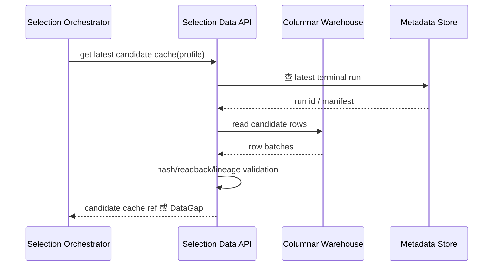
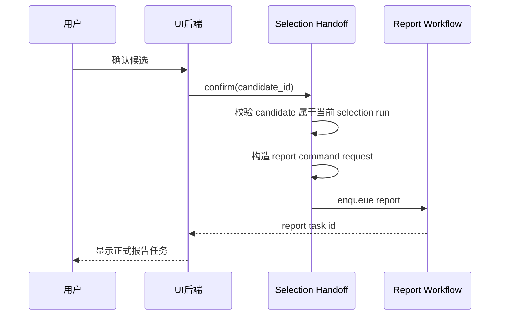

# 候选发现与选股模块详细设计

## 1. 命令解析

命令解析器把用户输入转为结构化请求：

```text
SelectionCommand
  raw_text
  market_profile
  refresh_requested
  user_locale
  source_session_id
```

解析规则：

1. 去掉 `/select` 前缀。
2. 识别市场 token。
3. 识别 `refresh` token。
4. 对未知 token 返回明确错误。
5. 输出 normalized profile。

默认 profile 是 `CN_A`。加密市场必须显式识别为 `CRYPTO`。

## 2. 候选缓存读取

候选缓存读取流程：



必须验证：

- run 已 terminal。
- profile 匹配。
- 候选行非空。
- manifest 中有数据来源和更新时间。
- 缓存读回 hash 与 metadata 一致。

## 3. 刷新流程

refresh 流程负责重新生成候选基础数据：

```text
request refresh
  -> acquire single-flight lock
  -> create data job
  -> fetch market universe
  -> fetch feature data
  -> normalize rows
  -> write columnar warehouse
  -> write metadata and lineage
  -> expose latest terminal run
```

刷新不得绕过 provider 失败。provider 无数据时写入 data gap，不写假候选。

## 4. 候选缓存模型

候选缓存至少包含：

```text
CandidateCache
  cache_id
  market_profile
  generated_at
  source_run_id
  manifest_ref
  row_count
  row_hash
  feature_columns
  candidates[]
```

候选项至少包含：

```text
Candidate
  symbol
  display_name
  market
  score_or_rank
  feature_summary
  data_quality_flags
```

## 5. Selection worker 调度

调度器按固定顺序执行：

```text
1. selection_strategist
2. selection_skeptic
3. selection_manager
4. selection_portfolio_manager
```

每一步：

1. 读取当前 run state。
2. 装配 worker profile。
3. 应用 stage tool policy。
4. 通过 OpenClaw 唤醒真实 worker。
5. 捕获 provider payload。
6. 存储 worker output。
7. 将通过校验的文本提供给下游。

任何一步失败都不能跳过 worker 继续后续组合经理阶段。

## 6. Prompt 材料边界

模型可见内容：

- 候选缓存摘要。
- 已批准的上游 selection worker 输出。
- 当前 market profile 说明。
- 用户请求中的 refresh 或市场语义。

模型不可见内容：

- 未批准的 debug envelope。
- OpenViking URI/hash 协议文本。
- provider attempts 原始 JSON。
- 控制面内部状态字段。

## 7. 用户确认与报告交接

handoff 只在用户确认后发生：



交接请求必须带：

- 目标 symbol。
- 市场 profile。
- 候选来源 selection run id。
- 用户确认时间。
- selection 报告引用。

## 8. UI 进度投影

UI 看到的是业务状态，不应看到内部 provider 字段。进度快照应包含：

- 当前状态。
- 市场。
- 当前阶段。
- 当前 worker。
- 候选摘要。
- 可取消性。
- 失败原因。
- handoff report task id。

## 9. 取消语义

取消 selection：

- 对 queued / refreshing / running 状态生效。
- 已生成候选但未确认时，可取消 UI 展示任务。
- 已 handoff 的正式报告任务需要走报告队列取消，不由 selection 继续控制。

## 10. 并发控制

refresh 需要 single-flight，防止同一 profile 被重复刷新。

并发读候选缓存可以共享 terminal run；并发写必须序列化 metadata 更新。

## 11. 错误分类

| 错误 | 处理 |
| --- | --- |
| 不支持市场 | 返回命令错误，不创建任务 |
| 候选缓存缺失 | 返回需要 refresh 或数据缺口 |
| refresh provider 失败 | 记录 provider gap，任务失败 |
| 缓存 hash 不一致 | 任务失败，不继续 worker |
| worker payload 缺失 | 任务失败，不声称完成 |
| handoff 校验失败 | 保留 selection 结果，不创建报告 |

