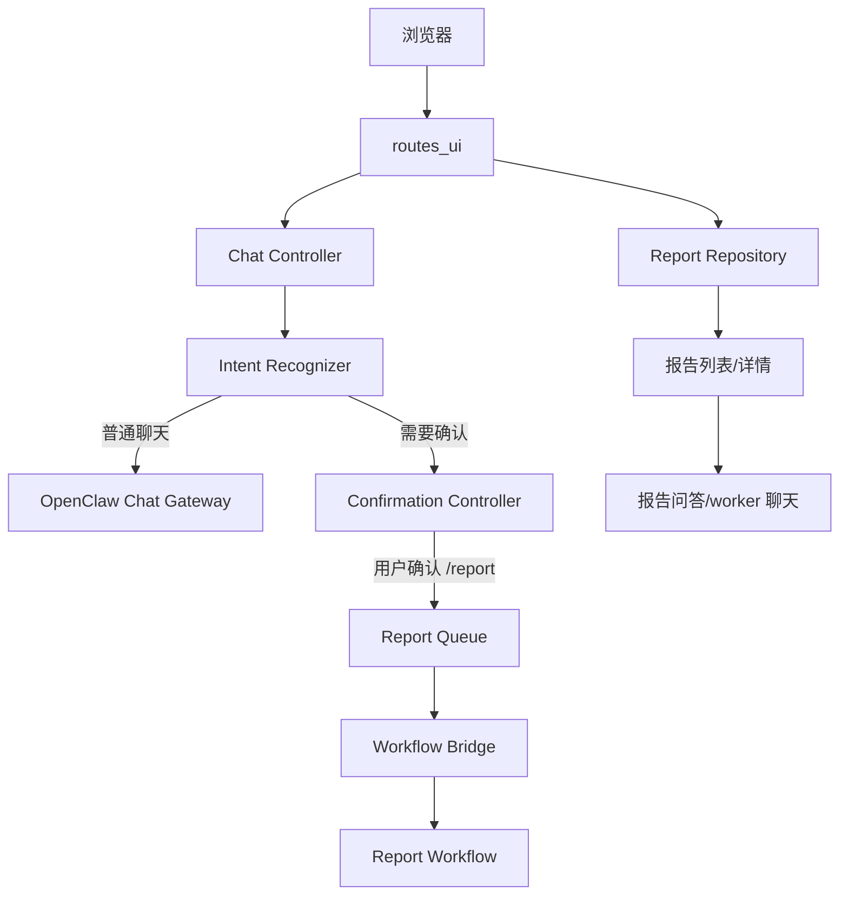

# 用户界面后端与接口模块总体设计

## 1. 模块目标

用户界面后端与接口模块负责把浏览器或前端页面的操作转换为 `claw-trade` 的业务请求，并把报告、选股、设置、定时任务、提醒和历史内容投影成稳定的 UI API。

它的核心要求是：

- 用户通过一个工作台完成聊天、报告、选股、设置和历史查看。
- 普通聊天不自动进入正式报告流程。
- `/report`、`/select`、定时任务和价格提醒必须是显式业务动作。
- UI 只展示用户能理解的状态，不泄漏内部 provider、manifest、hash、debug envelope。

## 2. 主要代码位置

```text
src/claw_trade/web/
  app.py
  routes_ui.py
  state.py
  server.py
  settings.py
  session.py
  openclaw_gateway.py

src/claw_trade/ui_backend/
  chat_controller.py
  confirmation_controller.py
  intent_recognizer.py
  workflow_bridge.py
  report_queue.py
  progress_mapper.py
  report_repository.py
  report_context.py
  report_qa.py
  worker_chat.py
  worker_chat_openclaw.py
  worker_chat_store.py
  report_worker_chat_context.py

src/claw_trade/ui_contracts/
  api_contracts.py
  constants.py
  enums.py
  user_dto.py
```

## 3. 职责边界

本模块负责：

- HTTP API 路由。
- UI 会话状态。
- 普通聊天控制。
- 确认卡片。
- 报告队列投影。
- 历史报告列表和详情。
- 报告问答。
- worker 聊天入口。
- settings、selection、scheduled work 的 API 汇聚。
- 将底层错误翻译成用户可理解的信息。

本模块不负责：

- 真实 worker 的模型调用。
- 工作流阶段决策。
- 数据 provider 选择。
- approved material 审批。
- PDF 渲染核心逻辑。
- 定时任务业务调度逻辑。

## 4. API 分组

```text
/api/ui/send-chat-message
/api/ui/get-chat-session
/api/ui/get-report-queue-snapshot
/api/ui/cancel-report-task
/api/ui/list-saved-reports
/api/ui/get-report-detail
/api/ui/delete-saved-report
/api/ui/delete-saved-reports
/api/ui/internal/scheduled-work/cron-wake
```

此外，设置、渠道、数据源健康、PDF、价格提醒、selection refresh 等路由也挂在 UI 路由层或相邻服务上。

## 5. 总体流程



## 6. 聊天入口设计

普通聊天入口必须区分三类结果：

| 类型 | 行为 |
| --- | --- |
| 普通答复 | 调用聊天 agent 或本地控制器返回文本 |
| 需确认意图 | 生成确认卡片，不立即执行 |
| 明确命令 | `/report`、`/select` 等进入对应业务流程 |

普通聊天不能因为用户提到股票或报告就静默启动正式 report workflow。

## 7. 报告队列投影

报告队列向 UI 暴露：

- task id。
- ticker / market。
- 当前状态。
- 当前阶段。
- 当前 worker。
- 进度摘要。
- 失败原因。
- saved report id。
- 可取消状态。

队列投影不能暴露 raw provider payload、OpenViking URI、内部 manifest。

## 8. 历史报告入口

历史报告接口负责：

- 列出保存的成功报告。
- 返回报告详情。
- 返回 Markdown、图表资产、PM 决策、worker appendix。
- 支持删除单个报告或批量删除。

删除必须走 repository 语义，不能把正在发送、正在导出的报告误删。

## 9. Worker 聊天和报告问答

用户可以对报告追问，也可以选择 worker 聊天。

边界：

- 报告问答使用报告上下文，不修改原报告。
- worker 聊天是交互能力，不等同于正式报告 worker artifact。
- worker 聊天可以使用报告材料，但不能写入正式 approved manifest。

## 10. 应用启动行为

`src/claw_trade/web/app.py` 创建应用时会装配：

- UI 路由。
- 静态资源。
- API 404 JSON 行为。
- SPA fallback。
- 报告清理调度器。
- 价格提醒扫描调度器。
- 在环境开关允许时启动 selection 自动刷新。

未知 `/api/ui/*` 应返回 JSON 404；非 API 路径才进入前端 fallback。

## 11. 错误翻译

底层错误需要转换为用户可操作语言：

- 数据源不可用。
- provider 限流。
- 报告任务失败。
- PDF 生成失败。
- 通知发送失败。
- 权限或配置缺失。

错误翻译不能把失败写成成功，也不能吞掉失败阶段。
