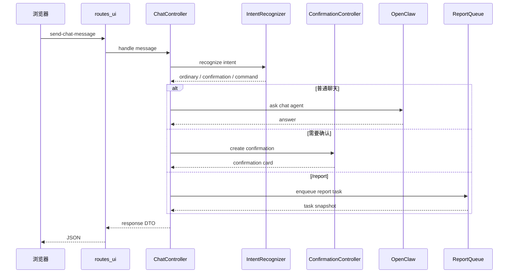

# 用户界面后端与接口模块详细设计

## 1. 路由装配

`src/claw_trade/web/app.py` 负责创建 FastAPI 应用并挂载 UI 路由。核心装配顺序：

1. 创建应用状态对象。
2. 注册 `/api/ui` 路由。
3. 挂载静态资源。
4. 注册 API 404 handler。
5. 注册 SPA fallback。
6. 启动后台调度器。

API fallback 规则：

```text
if path starts with /api/:
  return JSON 404
else:
  return frontend index
```

这样可以避免前端路由吞掉 API 拼写错误。

## 2. 应用状态

`src/claw_trade/web/state.py` 承载 UI 服务需要的共享对象：

- report queue。
- chat session store。
- report repository。
- settings service。
- scheduled work store。
- price alert service。
- channel bridge。
- OpenClaw client/gateway。

状态对象由路由依赖注入使用，避免每个 handler 自己创建业务服务。

## 3. 聊天消息处理

`POST /api/ui/send-chat-message` 的逻辑：



## 4. 确认卡片

确认卡片用于把“识别出来的意图”变成用户显式动作。

要求：

- 卡片包含操作类型、目标标的、市场、说明。
- 用户点击确认后才执行。
- 过期或被取消的确认不能再次执行。
- 一张卡只能消费一次。

## 5. 报告队列接口

`GET /api/ui/get-report-queue-snapshot` 返回当前队列投影。

投影字段应来自 `ReportQueue` 和 `ProgressMapper`：

- `pending`。
- `running`。
- `completed`。
- `failed`。
- 当前阶段和 worker。
- 最近错误。
- saved report id。

`POST /api/ui/cancel-report-task`：

- queued 任务可直接取消。
- running 任务发送取消请求并等待工作流响应。
- completed / failed 任务不可取消。

## 6. 历史报告接口

`GET /api/ui/list-saved-reports`：

- 返回历史报告摘要。
- 支持按时间排序。
- 不返回完整正文。

`GET /api/ui/get-report-detail`：

- 返回完整报告正文。
- 返回图表资产引用。
- 返回 worker appendix。
- 返回 PDF 可用性。

`POST /api/ui/delete-saved-report` 和 `delete-saved-reports`：

- 通过 repository 执行删除。
- 记录 tombstone 或删除结果。
- 对不存在 id 返回明确失败。

## 7. 报告问答

报告问答流程：

```text
load saved report
  -> build report context
  -> send question to report QA service
  -> return answer with context mode
```

它不得：

- 修改保存的报告正文。
- 生成新的正式 worker artifact。
- 改写 PM 结论。

## 8. Worker 聊天

worker 聊天分两种：

| 模式 | 说明 |
| --- | --- |
| 普通 worker 聊天 | 用户选择 worker 进行一般对话 |
| 报告阅读 worker 聊天 | worker 基于某份报告上下文答疑 |

worker 聊天应通过 OpenClaw worker chat runtime，不应在 Python 中直接伪造 worker 答案。

## 9. UI DTO 合同

`ui_contracts` 定义前后端共享枚举和 DTO。它的目标是稳定接口，不让前端依赖后端内部对象。

DTO 规则：

- 只包含 UI 需要字段。
- 错误字段面向用户。
- 不暴露 raw exception。
- 不把 provider payload 直接返回给普通 UI。

## 10. 内部 cron wake 路由

`POST /api/ui/internal/scheduled-work/cron-wake` 是 OpenClaw cron adapter 的内部入口。

要求：

- 只接受内部调度调用。
- 根据 wake kind 分派到 scheduled work runner。
- 返回 wake 处理结果。
- 不作为普通用户入口暴露业务执行能力。

## 11. 并发和一致性

- 同一 chat session 的消息需要按顺序处理。
- 报告队列状态更新需要保持原子性。
- 历史报告读取不应被删除操作破坏。
- PDF 导出中或渠道发送中的报告需要清理保护。

## 12. 失败处理

| 失败点 | UI 行为 |
| --- | --- |
| OpenClaw chat 失败 | 返回聊天失败说明 |
| 意图识别不确定 | 走确认或追问，不自动执行 |
| report enqueue 失败 | 不显示任务已创建 |
| repository 读取失败 | 显示历史报告不可用 |
| PDF 不可用 | 显示导出失败原因 |
| cron wake 失败 | 记录内部失败，不伪造成功 |
