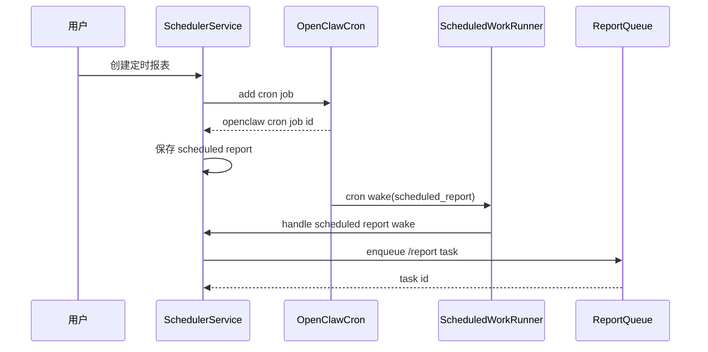
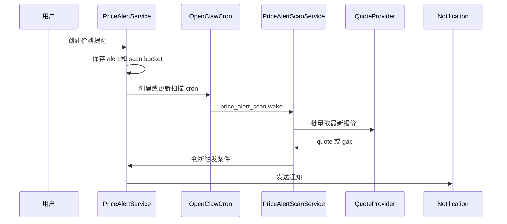

# 定时任务价格提醒与维护模块总体设计

## 1. 模块目标

定时任务、价格提醒与维护模块负责让系统在无人值守时按计划执行报告、价格扫描、selection 数据刷新和数据维护。

核心边界是：

```text
OpenClaw cron 只负责按时叫醒。
claw-trade 负责业务状态、数据判断、报告入队、通知和证据。
```

## 2. 主要代码位置

```text
src/claw_trade/ui_backend/
  scheduler_service.py
  scheduled_work_store.py
  scheduled_work_runner.py
  openclaw_cron_adapter.py
  system_cron_provisioner.py
  price_alert_service.py
  price_alert_scan_service.py
  report_cleanup.py
  report_cleanup_settings.py
  report_notification_service.py

src/claw_trade/data_gateway/
  price_quote_provider.py
  maintenance/jobs.py
  maintenance/scheduled_runner.py
  maintenance/incremental.py
  maintenance/repair.py
  coordination/scheduler.py
```

## 3. 子能力

| 子能力 | 说明 |
| --- | --- |
| 定时报表 | 用户配置周期，cron 到点后创建报告任务 |
| 价格提醒 | 用户配置触发条件，扫描报价后通知 |
| 价格提醒批量扫描 | 按 bucket 扫描一组 active/error alert |
| selection 自动刷新 | 定期准备候选发现数据 |
| 数据维护 | 增量、修复、预热等数据作业 |
| 报告清理 | 按保留策略清理历史报告和运行产物 |
| 报告发送保护 | 发送中的报告避免被清理 |

## 4. 总体架构

```mermaid
flowchart TB
  UI[UI 设置/用户动作] --> Store[Scheduled Work Store]
  UI --> CronAdapter[OpenClaw Cron Adapter]
  CronAdapter --> OC[OpenClaw Cron]
  OC --> Wake[/api/ui/internal/scheduled-work/cron-wake]
  Wake --> Runner[Scheduled Work Runner]
  Runner --> Report[Scheduler Service]
  Runner --> AlertScan[Price Alert Scan Service]
  Runner --> SelectionRefresh[Selection Refresh]
  Runner --> Maintenance[Data Maintenance]
  AlertScan --> Quote[Price Quote Provider]
  AlertScan --> Notify[Notification Service]
  Report --> Queue[Report Queue]
  Cleanup[Report Cleanup Scheduler] --> Repo[Report Repository]
```

## 5. OpenClaw cron 边界

OpenClaw cron 负责：

- 创建 cron job。
- 更新启停状态。
- 删除 job。
- 手动触发 job。
- 到点发送 wake message。

OpenClaw cron 不负责：

- 判断价格是否触发。
- 创建报告任务。
- 改写报告配置。
- 发送业务通知。
- 决定数据维护结果是否成功。

## 6. Wake 类型

`scheduled_work_runner` 按 `kind` 分派：

| kind | 处理器 |
| --- | --- |
| `scheduled_report` | 定时报表唤醒 |
| `price_alert_scan` | 价格提醒 bucket 扫描 |
| `selection_data_refresh` | 候选发现数据刷新 |
| `data_maintenance` | 数据维护作业 |

未知 kind 必须拒绝。

## 7. 定时报表流程



## 8. 价格提醒流程



## 9. 状态和幂等

定时报表应记录：

- `openclaw_cron_job_id`。
- `last_cron_run_id`。
- `last_run_task_id`。
- sync error。
- enabled/paused/deleted 状态。

价格提醒应记录：

- alert id。
- market/ticker。
- condition。
- active/paused/error/deleted。
- scan bucket。
- last quote。
- last notification dedupe key。

同一 `cronRunId` 重复到达时不能重复创建报告或重复通知。

## 10. 报告清理

报告清理负责：

- 按保留天数清理报告运行目录。
- 清理 saved report 文件。
- 避免清理正在发送或正在导出的报告。
- 输出清理摘要。

它不负责判断报告内容是否正确。

## 11. 失败策略

- cron 创建失败：用户操作失败并显示同步错误。
- wake 缺必要字段：拒绝处理。
- duplicate wake：返回幂等结果。
- 报价不可用：alert 进入 error 或记录失败，不触发假通知。
- 通知失败：记录通知失败，不假装已送达。
- 数据维护失败：保留失败 message，不写成功摘要。

