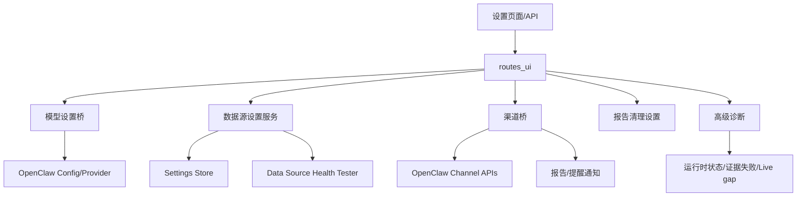

# 设置诊断与通知模块总体设计

## 1. 模块目标

设置、诊断与通知模块负责把用户可配置项、系统运行健康、数据源连接状态、渠道连接状态和报告发送能力集中管理。

它的目标是：

- 用户能配置模型、数据源、通知渠道和报告清理策略。
- 系统能说明 provider、runtime、数据源和证据失败原因。
- 报告和价格提醒能发送到配置渠道。
- 配置失败或渠道失败不能伪装为成功。

## 2. 主要代码位置

```text
src/claw_trade/ui_backend/
  settings_service.py
  llm_settings_bridge.py
  data_source_settings.py
  data_source_health.py
  data_source_runtime_checks.py
  channel_bridge.py
  channel_inbound_bridge.py
  channel_text_inbound.py
  report_notification_service.py
  mongo_settings_store.py

src/claw_trade/web/routes_ui.py

src/claw_trade/ui_contracts/
  api_contracts.py
  scope_guard.py
  user_dto.py
```

## 3. 设置范围

| 设置类别 | 说明 |
| --- | --- |
| 模型设置 | provider/model/key/version 等 UI 可见设置 |
| 工作流设置 | 默认市场、货币、辩论轮数、前线执行模式 |
| 数据源设置 | 已批准数据源实例、健康测试、启用状态 |
| 渠道设置 | 微信 ClawBot 等渠道连接和发送能力 |
| 报告清理设置 | 报告保留天数 |
| 通知偏好 | in-app 或渠道发送 |

## 4. 总体架构



## 5. 数据源设置边界

数据源设置必须只允许项目批准的数据源类型。

不允许：

- 任意未知 HTTP/JSON 数据源。
- 用户输入一个 URL 后系统就当作 provider。
- 保存未通过作用域校验的数据源配置。

允许：

- 对已批准 source type 保存实例配置。
- 测试健康状态。
- 返回用户可理解的健康事件。
- 把真实密钥写入受控本地设置机制，而不是直接暴露到 UI。

## 6. 模型设置边界

模型设置服务负责：

- 加载当前模型配置。
- 保存用户调整。
- 重置为默认值。
- 输出 provider health summary。

它不负责绕过 OpenClaw provider 行为，也不应把真实 secret 明文返回给普通 UI。

## 7. 渠道能力

渠道桥负责：

- 查询渠道状态。
- 保存渠道配置。
- 获取设备界面 URL。
- 发送文本。
- 发送报告文件。
- 解析默认发送目标。
- 处理渠道入站消息。

当前渠道语义围绕 `wechat_clawbot`。

## 8. 通知能力

通知分两类：

| 类型 | 说明 |
| --- | --- |
| 报告完成通知 | 报告完成后发送摘要或完整报告文件 |
| 价格提醒通知 | 价格条件触发后发送提醒 |

通知失败必须返回失败或 fallback 状态，不能显示为渠道成功。

## 9. 高级诊断

高级诊断接口提供：

- provider health summary。
- runtime service status。
- live run gap summary。
- evidence failure reason summary。

诊断用于解释系统状态，不应修改运行时配置。

## 10. UI 合同和安全

`ui_contracts` 定义哪些字段可以给前端。

禁止返回：

- 真实密钥。
- raw provider payload。
- OpenViking 内部 URI/hash。
- 任意数据源 raw payload。
- provider channel id 等内部渠道标识。

## 11. 重置设置

重置设置应同时覆盖：

- 模型设置。
- 数据源设置。
- 渠道设置。
- 报告清理设置。

每一部分应返回独立结果，不能因为其中一个失败就伪造全部成功。

