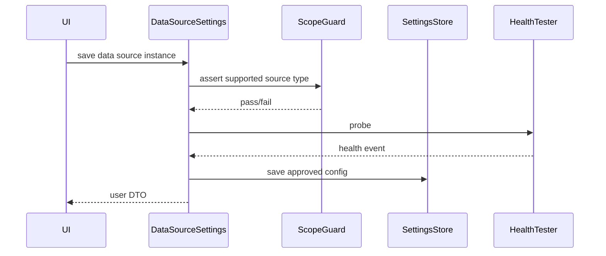

# 设置诊断与通知模块详细设计

## 1. 模型设置桥

`llm_settings_bridge.py` 负责 UI 和 OpenClaw 配置之间的转换。

主要能力：

```text
load_llm_settings(provider?)
save_llm_settings(...)
reset_llm_settings_to_defaults(...)
get_provider_health_summary()
```

返回给 UI 的内容必须隐藏 secret，只展示 provider、model、状态、用户提示和版本信息。

## 2. 数据源设置服务

`data_source_settings.py` 的核心流程：



数据源保存必须经过：

1. source type scope guard。
2. 字段校验。
3. health probe。
4. allowlist writer 或设置存储。
5. 用户 DTO 投影。

## 3. 数据源健康事件

健康事件包含：

- status。
- user message。
- impact。
- source type。
- checked at。

不包含：

- raw credential。
- raw provider response。
- 内部 traceback。

## 4. 设置存储

设置存储可能来自：

- 内存存储。
- 本地 JSON 或 env allowlist writer。
- Mongo settings store。

UI 服务只依赖抽象 store，不应把 Mongo 细节暴露给前端。

## 5. 渠道状态查询

`channel_bridge.py` 查询渠道状态时需要：

1. 检查 OpenClaw channel provider 是否存在。
2. 检查插件是否安装。
3. 检查插件是否启用。
4. 检查渠道配置是否禁用。
5. 检查账号登录和发送能力。
6. 返回用户状态。

用户状态包括：

- connected。
- disconnected。
- pending。
- error。
- can send text。
- can send file。

## 6. 渠道配置保存

保存渠道配置：

```text
save_channel_config_via_openclaw
  -> resolve user channel kind
  -> build provider patch
  -> call OpenClaw config patch
  -> probe latest channel status
  -> return user-facing status
```

如果 OpenClaw patch 失败，返回失败，不更新为已连接。

## 7. 报告文件发送

`report_notification_service.py`：

1. 读取 saved report。
2. 检查渠道状态。
3. 解析默认目标。
4. 生成或读取报告文件。
5. 调用 channel bridge 发送文件。
6. 用 file send tracker 保护发送中的报告。
7. 返回发送结果。

失败点：

- 报告不存在。
- 渠道未连接。
- 无默认目标。
- 文件生成失败。
- 发送接口失败。

## 8. 入站消息

渠道入站消息流程：

```text
channel inbound event
  -> channel_inbound_bridge
  -> channel_text_inbound
  -> chat_controller
  -> confirmation/report/select handling
```

入站消息可以触发普通聊天或命令解析，但仍应遵守确认和 `/report` 显式入口规则。

## 9. 高级诊断接口

诊断接口：

- `get-advanced-diagnostics-provider-health`
- `get-advanced-diagnostics-runtime-service-status`
- `get-advanced-diagnostics-live-run-gap-summary`
- `get-advanced-diagnostics-evidence-failure-reason-summary`

诊断结果是状态摘要，不是自动修复。

## 10. UI scope guard

`src/claw_trade/ui_contracts/scope_guard.py` 阻止 UI 暴露未批准能力，例如任意未知 HTTP/JSON 数据源。

原则：

- 能力边界在 UI 合同层先拦住。
- 服务层再次校验。
- 测试覆盖禁止项。

## 11. DTO 投影

`src/claw_trade/ui_contracts/user_dto.py` 把内部对象投影给 UI。

投影规则：

- 字段命名稳定。
- 状态值枚举化。
- secret 隐藏。
- raw payload 不出 UI。
- 用户消息使用中文。

## 12. 重置流程

`reset-settings-to-defaults`：

1. 重置模型设置。
2. 重置数据源设置。
3. 重置渠道配置。
4. 重置报告清理设置。
5. 汇总各部分结果。

局部失败必须在返回中体现。
