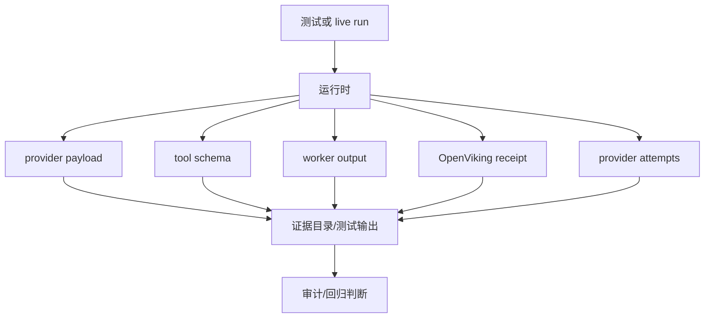

# 测试与证据体系模块总体设计

## 1. 模块目标

测试与证据体系模块负责证明项目行为，而不是只证明代码能运行。

它的核心要求是：

- 单元测试证明局部规则。
- 合同测试证明架构边界。
- 集成测试证明模块协作。
- live runtime 证明真实 OpenClaw/OpenViking/provider 行为。
- UI 验收使用真实 Chrome 模拟用户。
- provider payload 证明真正发给模型的内容。

## 2. 主要位置

```text
tests/
  contracts/
  integration/
  unit/
  e2e/
  settings/

scripts/
  start-control-runtime.sh
  validation/

memory/
  YYYY-MM-DD.md

docs/项目文档/
  模块测试计划/
  90-集成测试计划.md
```

## 3. 测试分层

| 层级 | 目的 | 不能替代 |
| --- | --- | --- |
| 单元测试 | 局部函数和服务规则 | live provider 证明 |
| 合同测试 | 架构边界、工具暴露、guard allowlist | 用户完整流程 |
| 集成测试 | 多模块协作 | 真实浏览器验收 |
| live 测试 | 本机真实 runtime 和 provider payload | 四市场全量验收 |
| E2E UI | 用户路径 | provider 数据真实性 |
| 人工验收 | 最终产品体验 | 自动回归 |

## 4. 证据类型

```text
source evidence
  代码、prompt、agent 配置、测试文件

runtime evidence
  provider payload、tool schema、worker output、OpenViking receipt

data evidence
  provider attempt、raw/normalized rows、data gap、chart asset

user evidence
  UI 截图、浏览器交互、报告导出、发送结果
```

## 5. Runtime preflight

任何 live/fresh/provider run 之前必须先做固定 runtime preflight：

```text
start script: scripts/start-control-runtime.sh
uv environment: claw-trade repo uv
OpenViking: 1933
OpenClaw gateway: 18789
no invest sidecar
config/data/cache: .runtime/dev-services
```

如果 runtime 已健康，复用；如果必须重启，用脚本 command mode。

## 6. 证据流



## 7. Collect-first 原则

对 scoped regression、单市场 live gate、四市场 fresh comparison，默认 collect-first：

- 不因第一个可恢复失败停止整个 batch。
- 继续收集失败市场、阶段、artifact、日志和根因猜测。
- 按根因分组修复。

早停只用于证据污染、真实性风险、架构边界风险、数据损坏或安全风险。

## 8. 不可接受的证明方式

以下不能作为完成证明：

- 只看 renderer output，不看 provider payload。
- 只跑 mock/stub/fake。
- 只跑 source-level 测试就声称 OpenClaw live 行为已改变。
- 用 exporter 结果代替 worker output。
- 用静态 prompt render 代替 provider final prompt。
- 用 headless 非交互替代明确要求的真实 Chrome UI 验收。

## 9. 文档证据要求

文档必须说明：

- 哪些能力是代码中存在的。
- 哪些能力经过自动测试。
- 哪些能力需要 live runtime 验证。
- 哪些能力本轮没有验收。

不能把“代码存在”写成“当前 runtime 已验证”。

